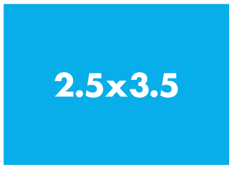

# Reals



Aquest lliçó introdueix el tipus `double`,
el qual permet guardar i manipular nombres reals.

## El tipus `double`: representació i operacions

Fins ara hem estat treballant amb nombres enters,
però en moltes aplicacions es necessiten nombres reals,
com ara $2'5$, $3'1416$, $1'001$ o $-5'125\times10^9$.

En C++, els nombres reals es representen amb un punt en lloc de la coma decimal:

-   `2.5`
-   `3.1416`
-   `-1.001`
-   `1000.0`

Fixeu-vos que `1000.0` (que també es pot escriure `1000.`)
representa el $1000$ com a nombre real, no com a nombre enter
(que s'escriuria `1000`).
També es pot utilitzar el format científic: `-5.125e9` representa $-5'125\times10^9$.

Per emmagatzemar valors reals, les variables s'han de declarar
amb el tipus `double`. Així, mentre que

```c++c++
int i;
```

declara la variable `i` com a enter,

```c++c++
double x;
```

declara la variable `x` com a real.

Les operacions bàsiques que es poden aplicar entre dos reals són:

-   la **suma** (amb l'operador `+`),
-   la **resta** (amb l'operador `-`),
-   el **producte** (amb l'operador `*`),
-   i la **divisió** (amb l'operador `/`).

La divisió entre reals no és la divisió entera.
Per exemple, el resultat de `7.0/2.0` és `3.5`.
A més, els reals no tenen cap operació similar al residu de la divisió entera.

Els reals també es poden comparar amb `==`, `!=`, `<`, `<=`, `>` i `>=`.
Per exemple, el resultat de `3.4 >= 5.8` és `false`.

Addicionalment, quan una operació involucra un enter i un real,
l'enter es tracta, de forma automàtica, com si fos un real.
Així, el resultat de `7/2` és `3`,
però el resultat tant de `7.0/2` com de `7/2.0` és `3.5`.
El mateix passa quan es desa un enter en un real:
`double x = 3;` fa que `x` contingui un `3.0`.

Els reals també es poden llegir amb `cin` i escriure amb `cout`,
de la mateixa forma que els enters.

La referència sobre [els reals](/ip/referencies/doubles.html)
dóna més detalls sobre totes aquestes operacions.
En particular, es posa en relleu que els `double` tenen problemes de precisió.

Com a comentari final, si guardem un real en un enter, els decimals es perden.
Per exemple, si fem

```c++
int n = 42.9;
```

la variable `n` contindrà un `42`.

## Exemple: Solució d'una equació de primer grau

Volem escriure un programa que trobi quin és el valor de $x$
que satisfà una equació de la forma $ax+b=0$, amb $a \ne 0$.
En aquest cas, les entrades són els valors d'$a$ i de $b$,
i la sortida ha de ser el valor adient d'$x$.

Com podeu comprovar ràpidament, la solució és $x=-b/a$.
Per tant, una possible solució és

```c++c++
double a, b;
cin >> a >> b;
double x = -b/a;
cout << x << endl;
```

Evidentment, les dues últimes línies es poden ajuntar en una de sola:

```c++c++
double a, b;
cin >> a >> b;
cout << -b/a << endl;
```

## Exemple: Conversió de temperatures Celsius a Fahrenheit

Recordeu que l'escala Fahrenheit per a les temperatures
[$\small[\mathbb{W}]$](https://ca.wikipedia.org/wiki/Grau_Fahrenheit)
és una alternativa a la que nosaltres usem habitualment (la Celsius).
A l'escala Fahrenheit,
el punt de congelació de l'aigua es troba a 32 graus,
i el punt d'ebullició a 212 graus (a una pressió atmosfèrica normal).
Això situa els punts d’ebullició i de congelació de l'aigua
a exactament 180 graus de diferència.
Per tant, un grau Fahrenheit es correspon a 100/180 graus Celsius.

Utilitzant tota la informació anterior,
el programa següent permet convertir de forma amigable
temperatures de l'escala Celsius a l'escala Fahrenheit:

```c++c++
#include <iostream>
using namespace std;

int main() {
    cout << "Dona'm la temperatura en graus Celsius: ";
    double celsius;
    cin >> celsius;
    cout << "Temperatura en graus Fahrenheit: " << 1.8*celsius + 32 << endl;
}
```

## Escriptura de nombres reals

Si provem el programa anterior amb un `0`, la sortida prodria ser

```c++text
Temperatura en graus Fahrenheit: 32.0000
```

Però també podria ser

```c++text
Temperatura en graus Fahrenheit: 32
```

Fins i tot, podria ser

```c++text
Temperatura en graus Fahrenheit: 3.2e1
```

Per fixar el format en què s'escriuen els nombres reals quan s'usa el `cout`
(en particular, per fer-ho exactament com la solució del Jutge,
i que així el Jutge pugui comprovar fàcilment
la correctesa de la nostra solució comparant les sortides dels dos programes),
la manera més senzilla és incloure aquestes dues línies al principi del `main()`:

```c++
int main() {
    cout.setf(ios::fixed);
    cout.precision(4);
    ...
```

Aquí, hem suposat que sempre volem quatre decimals.
Altrament, només caldria posar el nombre adequat
(que sempre s'explicita en els enunciats dels exercicis del Jutge)
en el seu lloc.

Cal remarcar que aquestes dues instrucions asseguren
que cada vegada que s'escrigui un real
es faci amb exactament quatre (o els que siguin) decimals després del punt,
fents els millors arrodoniments possibles dels decimals descartats.
En cap cas estem indicant amb quants decimals s'han de fer els càlculs,
els quals sempre es realitzen amb la màxima precisió que l'ordinador permeti.

<Autors autors="jpetit roura"/>
