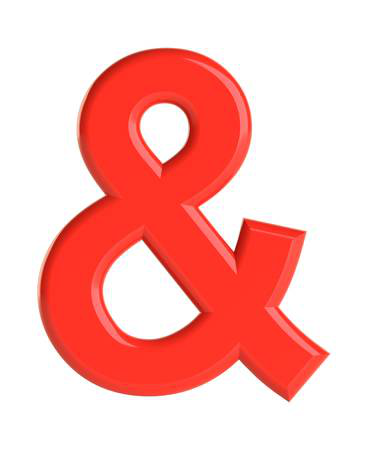

# Accions: Pas de paràmetres per valor i per referència



A la darrera lliçó sobre accions, ens hem limitat a utilitzar
**paràmetres per valor**. En aquesta lliçó presentem els paràmetres
per referència per tal de proveïr a les accions d'un mecanisme per
alterar els valors dels paràmetres reals sobre les quals es criden.

## Pas de paràmetres per valor

Fins ara, sempre que hem utilitzat funcions i acccions hem utilitzat
l'anomenat **pas de paràmetres per valor** (o **per còpia**). Com hem vist, la
semàntica del pas per valor consisteix en copiar el valor del paràmetre real
sobre el paràmetre formal al començar la invocació de l'acció.

Per reforçar aquesta idea, considereu el programa següent:

```c++c++
void incrementar(int x) {
    cout << x << endl;          // (2)
    ++x;
    cout << x << endl;          // (3)
}

int main() {
    int a = 24;
    cout << a << endl;          // (1)
    incrementar(a);
    cout << a << endl;          // (4)
}
```

TODO:

<div id='quiz1'></div>

quiz1 =
type: "MultipleChoice"
text: "Què escriu aquest programa? (Fixeu-vos que la `x` es passa per valor)"
choices: [
text: "24, 24, 25, 24"
correct: true
,
text: "24, 24, 25, 25"
correct: false
,
text: "24, 25, 25, 24"
correct: false
,
text: "24, 25, 25, 25"
correct: false
,
text: "Cap de les demés."
correct: false
]

window.quiz quiz1, "quiz1"

Per entendre què passa, fem una traça de l'execució del programa:

1. El programa comença a la funció `main`, on es desa el valor 24 a la variable
   `a`.

1. Quan es fa la primera escriptura `(1)`, s'escriu doncs 24.

1. A continuació, s'invoca l'acció `incrementar`. El valor del paràmetre real
   és 24, per tant, el paràmetre formal `x` de la funció `incrementar` pren
   per valor 24.

1. Després, es fa la segona escriptura `(2)`. El valor de `x`
   és 24, i per tant, s'escriu un altre 24.

1. A continuació, es fa l'increment de `x`. Per tant, ara `x` passa a valer 25.

1. Després, es fa la tercera escriptura `(3)`. Com que valor de `x`
   és ara 25, s'escriu 25.

1. A continuació, l'acció `incrementar` acaba i es torna al punt de `main()` on
   s'havia deixat i, per tant, es fa la darrera escriptura `(4)` de `a`. Com
   que ningú ha canviat el valor de `a`, s'escriu un altre cop 24.

Així doncs, al invocar `incrementar`, el valor del paràmetre real `a` s'ha
copiat en el paràmetre formal `x`, però a partir d'aquí, aquestes dues
variables són entitats diferents i, per tant, el canvi de l'una no implica cap
canvi en l'altra. Quan es passa un paràmetre real per valor, el seu valor es
copia al paràmetre formal al produir-se la invocació. A partir d'aquest
moment, ja no hi ha més relació entre el paràmetre formal i el real.

## Pas de paràmetres per referència

Si ho penseu bé, la semàntica del pas per valor/per còpia dóna molta
seguretat, perquè vol dir que els subprogrames no tenen dret a canviar el
valor dels paràmetres reals. Tanmateix, algunes vegades volem accions que,
com a efecte, produeixin un canvi en el valors dels paràmetres reals.
En aquests casos, utilitzem **paràmetres per referència**.

El programa següent és quasi idèntic a l'anterior però, ara,
el paràmetre `x` de l'acció `incrementar` és passat per referència:

```c++c++
void incrementar(int& x) {      // 👁 pas per referència
    cout << x << endl;          // (2)
    ++x;
    cout << x << endl;          // (3)
}

int main() {
    int a = 24;
    cout << a << endl;          // (1)
    incrementar(a);
    cout << a << endl;          // (4)
}
```

Per indicar que un paràmetre es passa per referència, en C++ s'escriu el
símbol `&` després del seu tipus. El símbol et (també anomenat _i comercial_ o
_ampersand_ en anglès) es pot aplicar o no indistintament a cada paràmetre
d'una acció. La seva presència indica pas per referència. En oposició, la seva
absència indica pas per valor.

La semàntica del pas per referència és que, al invocar una acció, el paràmetre
formal no és una còpia del paràmetre real, sinó que és el propi paràmetre formal.
En altres paraules, els dos paràmetres són noms alternatius per a la mateixa variable.
Conseqüentment, qualsevol canvi al valor d'un paràmetre formal passat per referència
és un canvi al valor del paràmetre real.

<div id='quiz2'></div>

quiz2 =
type: "MultipleChoice"
text: "Què escriu ara el programa anterior? (Fixeu-vos que la `x` es passa per referència)"
choices: [
text: "24, 24, 25, 24"
correct: false
,
text: "24, 24, 25, 25"
correct: true
,
text: "24, 25, 25, 24"
correct: false
,
text: "24, 25, 25, 25"
correct: false
,
text: "Cap de les demés."
correct: false
]

window.quiz quiz2, "quiz2"

Per entendre què passa, tornem una traça de l'execució del programa:

1. El programa comença a la funció `main`, on es desa el valor 24 a la variable
   `a`.

1. Quan es fa la primera escriptura `(1)`, s'escriu doncs 24.

1. A continuació, s'invoca l'acció `incrementar`. Ara, com que hi ha pas per
   referència, el paràmetre formal `x` queda lligat al paràmetre formal `a`.

1. Després, es fa la segona escriptura `(2)`. El valor de `x` és el valor de `a`,
   perquè `x` i `a` denoten el mateix valor al estar lligades.
   Per tant, s'escriu un altre 24.

1. A continuació, es fa l'increment de `x`. Per tant, ara `x` passa a valer 25.
   A més, com que `x` i `a` denoten la mateixa variable, ara `a` també és 25!

1. Després, es fa la tercera escriptura `(3)`. Com que valor de `x`
   és 25, s'escriu 25, cap problema,

1. A continuació, l'acció `incrementar` acaba i es torna al punt de `main()` on
   s'havia deixat i, per tant, es fa la darrera escriptura `(4)` de `a`. Quin
   és el valor de `a`? Doncs 25, perquè fa dos passos l'hem canviat a través
   de l'increment de `x` amb qui l'havíem lligat. Per tant,
   ara s'escriu un 25.

Així doncs, utilitzant un paràmetre per referència, hem aconseguit que el
valor del paràmetre real hagi quedat incrementat després de cridar a l'acció
`incrementar`. Com a "efecte", `incrementar` no llegeix ni escriu res, sinó que
canvia el valor d'una variable d'una subprograma que no és el seu. Déu n'hi do!

Noteu que si un paràmetre és per referència, el paràmetre real corresponent
ha de ser una variable. Així, la invocació `incrementar(a);` és correcta però
la invocació `incrementar(12*a);` seria incorrecta ja que el valor d'una expressió
no es pot canviar.

Per cert, assegureu-vos d'entendre que, si en els dos programes anteriors
les variables de `main` i de `incrementar` tinguéssin el mateix nom, tot el
procés seria exactament igual.

## Diferència entre pas per referència i pas per valor

L'animació següent (extreta de [mathwarehouse.com](https://www.mathwarehouse.com))
il·lustra la diferència entre pas per referència i pas per valor:

<center>

</center>

Fixeu-vos que les dues tasses de l'esquerra (pas per referència) representen
la mateixa, mentre que la segona tassa de la dreta (pas per valor) és una
còpia de la primera.

## Exemple: intercanvi de dos valors

L'acció següent permet intercanviar el valor de dos enters:

```c++c++
void intercanviar(int& a, int& b) {
    int c = a;
    a = b;
    b = c;
}
```

En aquest cas, l'acció té dos paràmetres formals, anomenats `a` i `b`.
Ambdós es passen per referència: fixeu-vos en els dos símbols et per cadascun
d'ells.

Què escriurà aquest fragment de codi?

```c++c++
int x = 12, y = 33;
cout << x << ' ' << y << endl;
intercanviar(x, y);
cout << x << ' ' << y << endl;
```

<div id='quiz3'></div>

quiz3 = """
La sortida serà

```c++text
12 33
33 12
```

És a dir que els valors de `x` i de `y` s'hauràn intercanviat.

"""

window.reveal quiz3, "quiz3"

En efecte, les tres assignacions del cos de l'acció `intercanviar`
aconsegueixen intercanviar el valors dels paràmetres `a` i `b` mitjantçant
una variable auxiliar `c`. Com que `a` i `b` es passen per referència
i es lliguen a `x` i `y`, després de la invocació de l'acció els valors
de `x` i de `y` han quedat també intercanviats.

<Autors autors="jpetit roura"/>
