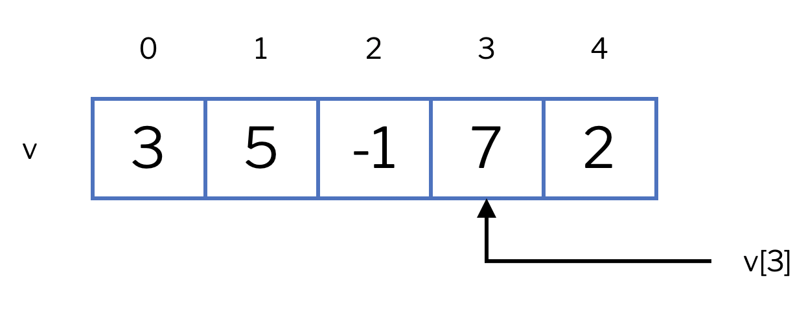
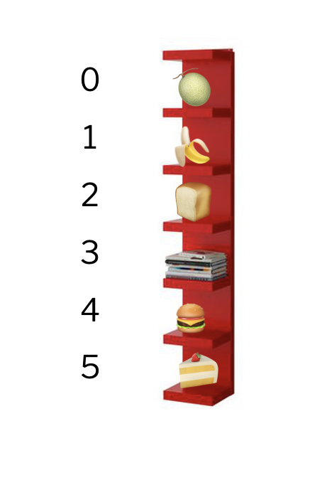

# Vectors


Aquesta lliçó introdueix una de les estructures de dades més habituals i útils
en el món de la programació: els vectors. Els vectors permeten emmagatzemar en
una sola variable una col·leció de moltes dades del mateix tipus i accedir a
qualsevol d'elles directament a través de la seva posició.

## Introducció

Un **vector** és una estructura de dades que conté una col·leció d'elements, tots del
mateix tipus (enters, reals, caràcters, etc.). Els elements en un vector estàn
disposats en diferent posicions tot seguint un cert ordre, i per referir-se a un
d'ells s'utilitza un **índex**, que és un nombre enter que indica la posició de
l'element en el vector, començant per 0.

Així, en un vector d'`n` elements, el primer element tindrà índex 0, el segon
element tindrà índex 1, ... i el darrer element tindrà índex `n - 1`. A la
figura següent podeu veure un vector `v = {3, 5, -1, 7, 2}`, juntament amb
l'índex que identifica cada element. Com que el vector `v` té cinc posicions,
l'últim element té índex 4. L'element a la posició `i` del vector es denota
per `v[i]`. Per exemple, `v[3]` és `7`.

<center>

</center>

Podem imaginar un vector com una prestatgeria amb molts prestatges. Tots seus
els prestatges són idèntics, estàn etiquetats per un número (començant des del
zero), i poden emmagatzemar diferentes dades. Hom es pot referir tant a la
prestatgeria com un tot, o referir-se al contingut d'un dels seus prestatges a
través del seu número de prestatge.
A la figura següent, el darrer prestatge és el sisè, a la posició 5, i conté
un pastís.

<center>

</center>

## Inclusió de la llibreria de vectors

Per treballar amb vectors, cal incloure la llibreria `vector`, igual que habíem
fet amb `#include <iostream>`. Així, sempre que vulguem utilitzar vectors al
nostre programa, la capçalera del nostre programa serà semblant a això:

```c++c++
#include <iostream>
#include <vector>
using namespace std;

...
```

## El tipus vector

Quan es declara una variable com a vector, cal especificar quin tipus de dades
contindrà a les seves posicions. Totes les posicions han de ser del mateix
tipus: es diu que els vectors són estructures de dades **homegènies**.

`vector<T>` descriu un nou tipus que és un vector on cada element és de tipus
`T`. Per exemple,

```c++c++
vector<int> v;
```

declara una variable `v` de tipus vector d'enters. Igualment,

```c++c++
vector<double> temperatures;
```

declara una variable anomenada `temperatures` com a vector de reals.

Els vectors també es poden utilitzar com a paràmetres de subprogrames.
Per exemple, aquesta funció calcularia la temperatura màxima
d'un vector de reals que emmagatzema temperatures:

```c++c++
double temperatura_maxima(vector<double> temperatures)
{ ... }
```

Si dues variables són vectors del mateix tipus, aquestes es poden
copiar l'una en l'altra. Si són vectors d'elements de tipus diferents, no.
Per exemple:

```c++c++
vector<int> v1;
vector<int> v2;
vector<double> v3;
v1 = v2;            // 🆗 v1 i v2 són del mateix tipus
v1 = v3;            // ❌ v1 i v3 no són del mateix tipus
```

## Creació de vectors

Tal com s'han declarat anteriorment, els vectors que hem creat són buits (és a dir, no conten
cap element). En general, ens pot interessar triar la talla inicial del vector
o inclús indicar quins elements contindrà. Segons el que busquem, podem fer servir
una de les quatre maneres següents d'inicialitzar un vector:

-   Per crear un vector buit, no cal especificar res. En veurem la utilitat
    quan veiem com afegir nous elements a un vector.

    ```c++
    vector<double> buit;                              // buit = {}
    ```

```c++`

-   Podem triar el nombre d'elements del vector posant-lo entre parèntesis
    després de la declaració. Per defecte, tots els elements amb que
    s'omplirà el vector seràn el zero del tipus de dada que conté:

    ```c++
    vector<int> zeros(5);                             // zeros = {0, 0, 0, 0, 0}
    ```

````

-   Si volem que el vector contingui un nombre determinat d'elements i que tots aquests
    siguin iguals a un cert element donat, escriurem entre parèntesis
    la talla juntament amb l'element, separats per una coma:

    ```c++
    vector<double> mitjos(3, 0.5);                    // mitjos = {0.5, 0.5, 0.5}
    ```

```c++`

- Si volem especificar tots els elements del vector, ho podem fer
entre claus i separats per comes. Llavors ja no cal indicar el nombre
d'elements:

  ```c++
  vector<char> vocals = {'a', 'e', 'i', 'o', 'u'};  // vocals = {'a', 'e', 'i', 'o', 'u'}
````

A més, també podem inicialitzar un vector tot copiant el seu valor
d'un altre vector del mateix tipus:

```c++c++
vector<char> v1 = {'a', 'e', 'i', 'o', 'u'};    // v1 = {'a', 'e', 'i', 'o', 'u'}
vector<char> v2 = v1;                           // v2 = {'a', 'e', 'i', 'o', 'u'}
```

## Operacions bàsiques

Hi ha diverses operacions bàsiques sobre vectors, com ara accedir a un element
donat el seu índex (o la seva posició, són termes sinònims), recórrer tots els
elements del vector, afegir i treure elements al final del vector, o saber
quants elements té un vector donat (quina és la seva talla). Aquí veurem com.

### Accedir a un element

Recordeu que les posicions d'un vector s'identifiquen per un enter
començant pel 0. Així, en un vector de quatre elements, el primer té
índex 0, el segon 1, el tercer 2 i l'últim 3.
Si volem accedir a un element d'un vector, haurem d'especificar el seu
índex entre claudàtors, de la manera que es mostra aquí:

```c++c++
vector<double> v = {11.5, -13.2, 4.6, 7.8};
cout << v[2] << endl;        // escriu 4.6
if (v[0] > 5) v[3] = 9;      // el vector esdevé {11.5, -13.2, 4.6, 9.0};
```

De la mateixa manera, podem modificar el contingut de certa posició
d'un vector. Ho podeu veure a l'exemple següent, on els
comentaris indiquen el contingut del vector en cada moment:

```c++c++
vector<int> nombres(4,1);         // nombres = {1, 1, 1, 1}
nombres[1] = 4;                   // nombres = {1, 4, 1, 1}
nombres[3] = nombres[1];          // nombres = {1, 4, 1, 4}
nombres[0] = 2 * nombres[2] + 1;  // nombres = {3, 4, 1, 4}
--nombres[0];                     // nombres = {2, 4, 1, 4}
```

Recordeu que si un vector té `n` posicions, els índexs vàlids són enters entre 0
i `n - 1`. Indexar un vector amb un valor menor que 0 o amb un valor superior o
igual a `n` és un error de programació molt greu 💥. En efecte, davant d'aquest
error, per raons d'eficiència, C++ continuarà endavant amb uns resultats
imprevisibles i difícils de detectar. Per tant, sempre que indexeu en un vector,
heu de fer l'exercici mental (🤔) d'assegurar-vos que l'índex que useu no accedeix
fora del vector.

El fragment següent mostra tres accessos il·legals a les posicions d'un vector:

```c++c++
vector<string> noms = {"Mireia", "Marta", "Elvira", "Jana"};
noms[-1] = "Raquel";                // 💥 la posició -1 no existeix
cout << noms[10] << endl;           // 💥 la posició 10 no existeix
if (noms[4] == "Carme") {...};      // 💥 la posició  4 no existeix
```

### Recórrer tots els elements d'un vector

Sovint, es vol recórrer tots els elements del vector, des del primer fins al
darrer, realitzant alguna tasca amb cadascun d'aquests elements. Per exemple,
per escriure cada temperatura d'un vector que conté una llista de temperatures
es podria fer:

```c++c++
vector<double> temperatures = {10, 12.5, 14, 10.1, -3.5};
for (double temperatura : temperatures) {
    cout << temperatura << endl;
}
```

Aquest variant del bucle `for` indica que la variable real `temperatura` anirà
prenent per valor cada element del vector `temperatures` de forma successiva.
Dins del cos del bucle, cada valor és escrit pel canal de sortida.
Noteu que el tipus de la variable que s'usa per iterar sobre cada element del
vector ha de ser del mateix tipus que el dels elements del vector.

Aquest exemple mostra que és habitual, tot i que no és normatiu, que els vectors
tinguin noms en plural, i els elements que els interen, el nom corresponent en
singular.

Aquí podeu veure com calcular la suma dels elements d'un vector fent servir
aquest recorregut:

```c++c++
vector<int> nombres = {3, 5, -2, 4};
int suma = 0;
for (int nombre : nombres) {
    suma = suma + nombre;
}
cout << suma << endl;             // escriu 10
```

Compte: Cal recordar que la variable que s'utilitza per iterar sobre
els elements del vector és una còpia dels seus elements. Per tant,
en el programa següent, el vector no canvia malgrat que es dobli cada nombre:

```c++c++
vector<int> nombres = {3, 5, -2, 4};
for (int nombre : nombres) {        // 👀 còpia
    nombre = nombre * 2;
}
// nombres = {3, 5, -2, 4} 😢
```

Per poder canviar els elements del vector, cal iterar utilitzant una refèrencia,
no una còpia (el comportament és el mateix que el dels paràmetres per valor
o per referència):

```c++c++
vector<int> nombres = {3, 5, -2, 4};
for (int& nombre : nombres) {       // 👀 referència (&)
    nombre = nombre * 2;
}
// nombres = {6, 10, -4, 8} 😃
```

Una alternativa més flexible per recórrer tots els elements d'un vector
és utilitzar bucles com els que havíem
fet servir fins ara per enumerar tots els índexs del vector.
Així, per exemple, podem doblar tots els
elements del vector `nombres` de la manera següent:

```c++c++
vector<int> nombres = {3, 5, -2, 4};
for (int i = 0; i < 4; ++i) {
    nombres[i] = nombres[i] * 2;
}
// nombres = {6, 10, -4, 8} 😃
```

En aquest cas, el bucle itera sobre els valors dels índexos del vector, no
directament sobre els seus selements. Noteu que l'índex `i` ha de recórrer els
valors del 0 fins al nombre d'elements al vector menys 1, d'aquí el `< 4` i no
`<= 4`.

### Afegir i treure elements

Els vectors també disposen d'instruccions per treure l'últim element del vector,
i per afegir-ne un de nou al final. Això es fa, respectivament, amb les
instruccions `pop_back()` i `push_back()`, que es posen darrere de
l'identificador del vector, separats per un punt. A la instrucció `push_back()`
cal donar com a paràmetre l'element que es vol afegir, que ha de
ser del mateix tipus que els elements del vector. L'exemple següent
mostra l'ús d'aquestes operacions:

```c++c++
vector<int> v = {2, 1};     // v = {2, 1}
v.push_back(7);             // v = {2, 1, 7}
v.pop_back();               // v = {2, 1}
v.pop_back();               // v = {2}
v.pop_back();               // v = {}
v.pop_back();               // 💥 el vector és buit
```

Com es veu a la darrera instrucció, es un error de programació treure el darrer
element d'un vector buit (perquè no hi ha res per treure!).

### Consultar la talla del vector

Per últim, una altra operació habitual és `size()`, que
retorna la talla d'un vector. Pot resultar molt útil
sobretot quan hem anat afegint o treient elements al vector, ja que així podem
saber la seva talla en tot moment. Aquí veiem com cridar-la:

```c++c++
vector<int> v = {3, 2, 1};  // {3, 2, 1}
cout << v.size() << endl;   // escriu 3
v.pop_back();               // {3, 2}
cout << v.size() << endl;   // escriu 2
v.push_back(-1);            // {3, 2, -1}
cout << v.size() << endl;   // escriu 3
v.push_back(4);             // {3, 2, -1, 4}
cout << v.size() << endl;   // escriu 4
```

L'única cosa a tenir en compte és que el tipus de dada que retorna l'operació
`.size()` no és exactament un `int`, sinò un tipus especial que s'utilitza a C++
per referir-se a talles d'estructures. Així, si volem fer comparacions o
operacions que involucrin aquest objecte i un de tipus `int`, és possible que
algun compilador es queixi. Per resoldre-ho, convertirem el valor retornat per
`.size()` a tipus `int`, simplement fent servir la conversió de tipus
`int(v.size())` al cridar-lo, o bé l'assignarem abans a una variable
entera: `int n = v.size()`.

## Relació entre `vector` i `string`

A efectes pràctics, el tipus `string` no és més que un vector de caràcters (és a
dir, un `vector<char>`). De fet, quan es van introduir els textos, ja vam dir
que eren d'una successió de caràcters emmagatzemats en una mateixa variable:
això és exactament el que fa un vector!

De fet, totes les instruccions que hem definit pels vectors es poden fer servir
de la mateixa manera als textos (accedir a un element per l'índex, afegir i
treure elements o consultar la talla). No obstant el tipus `string` és més
còmode d'utilitzar en algunes situacions ja que es pot llegir i escriure
directament sense la necessitat de fer servir bucles i té més operacions
especialitzades.

## Vectors com a paràmetres de subprogrames

Com ja hem dit, els vectors es poden fer servir com a paràmetres de funcions
i accions. Igual que qualsevol altre tipus, hi ha dues maneres principals de fer-ho:
per còpia i per referència. Com sabeu, la diferència entre aquests dos mètodes és
el fet de treballar amb una còpia del vector o bé amb el vector mateix que estem
passant al subprograma. Així, si volem crear una acció per doblar els valors d'un
vector i fem:

```c++c++
void dobla_copia(vector<int> v)     // 👀 còpia
{
    for (int& x : v) {              // 👀 referència (&)
        x = 2 * x;
    }
}
```

estem passant a l'acció `dobla_copia` una còpia del vector `v`, de manera que, tot i que
aquesta còpia sí que està passada per referència al bucle `for`, els elements que
estem doblant són els d'aquesta còpia (si al bucle estigués passat també per còpia,
ja seria un desastre enorme, perquè estariem modificant còpies dels elements de la
còpia del vector `v`). La solució és passar el vector `v` per referència a l'acció, de
manera que treballem directament sobre aquest. Així, faríem

```c++c++
void dobla_referencia(vector<int>& v)    // 👀 referència (&)
{
    for (int& x : v) {                   // 👀 referència (&)
        x = 2 * x;
    }
}
```

El resultat d'aplicar cadascuna d'aquestes accions es pot veure a l'exemple següent:

```c++c++
int main() {
    vector<int> nombres = {2, -1, 3};
    dobla_copia(nombres);         // nombres = {2, -1, 3} 😢
    dobla_referencia(nombres);    // nombres = {4, -2, 6} 😃
}
```

En el cas dels vectors, no només és útil el pas per referència quan vulguem modificar
els seus elements. Com que un vector emmagatzema moltes dades, sol ocupar
molta memòria, així que cada cop que passem un vector per còpia estarem creant
un altre vector de la mateixa talla i per tant doblant l'espai de memòria que utilitzem,
i realitzant moltes iteracions per fer aquesta còpia.

Per tant, tot i que no vulguem modificar el vector, sol ser millor passar-lo per
referència per estalviar-nos aquesta còpia inútil. Per assegurar-nos que no volem
alterar el vector, farem servir la notació `const`, i així el compilador es queixarà
si intentem modificar el seu valor. Aquest mètode es coneix com a **pas per referència
constant**, i la seva finalitat és estalviar temps d'execució i espai de memòria.

Així, si per exemple volem una funció que retorni l'element més gran del vector,
les següents dues declaracions són equivalents (i el codi a l'interior serà idèntic),
però amb la diferència que la segona serà més eficient que el primera.

```c++c++
int maxim_lent(vector<int> v) { ... }

int maxim_rapid(const vector<int>& v) { ... }
```

A la propera lliçó veurem com implementar aquesta funció i moltes altres.

<Autors autors="rafah jpetit"/>
