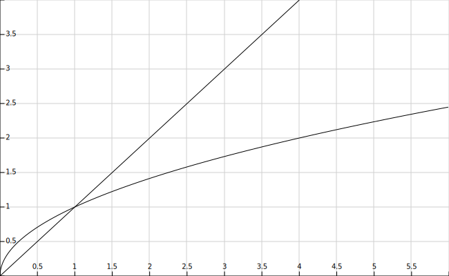

# Aplicació: Primalitat


Aquest lliçó presenta l'algorisme de _factorització per prova de divisions_
per resoldre el problema de la primalitat, és a dir, determinar si un natural
donat és un nombre primer o no.

## Concepte matemàtic de nombre primer

Recordeu que un nombre natural és **primer**, si és més gran que 1 i només
es pot dividir per dos nombres: 1 i ell mateix.

Així, els primers nombres primers
són 2, 3, 5, 7, 11, 13, 17, 19, 23, 29, 31, 37, 41, 43, 47, 53, 59, 61, 67,
71, ...

## Funció pel factorial

Definim una funció en C++ per determinar si un nombre natural donat
és o no primer. La capçalera és següent:

```c++
// Indica si el natural n és primer o no.
bool es_primer(int n);
```

És a dir, el nom de la funció és `es_primer`, aquesta funció té un sol
paràmetre enter anomenat `n`, i aquesta funció retorna un valor booleà, que
indica si `n` és o no primer. A més, hem pres cura d'indicar que és necessari
que el valor de `n` sigui un natural a la precondició, ja que no té sentit
determinar la primalitat d'enters negatius.

Per implementar aquesta funció, podem pensar en provar de dividir `n` per
tots els nombres `i` entre 2 i `n-1`. Si algun d'aquests `i` divideix `n`,
llavors `n` és compost (és a dir, no és primer). Si cap d'aquests `i`
divideix `n`, llavors `n` és primer. Aquesta idea s'anomena el _mètode
per prova de divisions_ i el podríem programar com segueix:

```c++
// Indica si el natural n és primer o no.
bool es_primer(int n) {
    if (n <= 1) return false;           // cas especial
    for (int i = 2; i < n; ++i) {       // per a cada nombre i en 2..n-1:
        if (n % i == 0) {               //      si i divideix n:
            return false;               //          n és compost!
        }
    }
    return true;                        // no s'ha trobat cap divisor de n ⟹ n és primer!
}
```

Fixeu-vos que hem hagut de tractar de forma especial el cas del zero i l'u, altrament
l'algorisme funcionaria malament per aquests dos valors. En canvi, el bucle
funciona bé pel cas del dos, quan no fa cap iteració.

Fixeu-vos també que, de seguida que es troba un divisor, aquesta funció
interromp el bucle al fer el `return false;`. Per tant, no es continua provant
divisors més grans: un cop s'ha trobat que el nombre és compost, no cal
trobar-li més factors, perquè segur que no és primer.

## Una bona millora

Una primera millora que podem aplicar en aquest algorisme
és adonar-nos que, si un nombre $n$ no té cap divisor entre $2$ i $n-1$,
tampoc el tindrà entre $2$ i $n/2$. Per tant, podem fer que la cerca sigui
el doble de ràpida provant, com a molt, $n/2$ divisors.

Però encara ho podem millorar més: si un nombre $n$ no té cap divisor entre
$2$ i $n-1$, tampoc el tindrà entre $2$ i $\sqrt n$. La raó és que si $n$
tingués un divisor $d\ge \sqrt n$, llavors també tindria $n/d$ com a
divisor, però llavors $n/d\le \sqrt n$. Per tant, podem fer que la cerca
sigui molt més ràpida provant, com a molt, $\sqrt n$ divisors.

La gràfica següent compara el creixement de $n$ i el de $\sqrt n$
i ens confirma que això és un gran guany de temps, especialment
per a valors de `n` grans i primers:

<center>

</center>

Per dur a terme aquesta idea, es podria utilitzar la funció `sqrt()` fent un
`#include <cmath>`, però és millor fer-ho així:

```c++
// Indica si el natural n és primer o no.
bool es_primer(int n) {
    if (n <= 1) return false;
    for (int i = 2; i*i <= n; ++i) {
        if (n % i == 0) {
            return false;
        }
    }
    return true;
}
```

de forma que la condició `i <= sqrt(n)` queda elevada al quadrat
com a `i*i <= n` i, d'aquesta manera, ja no cal utilitzar costoses
operacions sobre nombres reals.

## Exercici

Al codi anterior hem escrit la condició `i*i <= n`.
Seria correcte utilitzar `i*i < n`?

::: details Resposta
No: seria incorrecte. Altrament, els quadrats de nombres primers serien
reportats com a primers. Per exemple, el 49.
:::

## Una altra millora possible

Una altra millora possible que es podria aplicar és adonar-se que, si el
nombre no era parell, ja no cal provar més les `i` que són parells. I,
igualment, que si el nombre no és múltiple de tres, ja no cal provar més les
`i` que són múltiples de tres. I, així successivament.

Però: com fer-ho? La solució la veurem més endavant, amb vectors, quan parlem
del Garbell d'Eratòstenes.

<Autors autors="jpetit roura"/>
