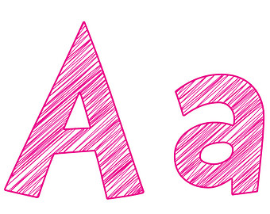

# Funcions sobre caràcters: `cctype`

## Introducció



Sovint és necessari decidir si un caràcter és d'una certa classe o no. Per
exemple, decidir si un caràcter és un dígit o una lletra i, en cas de ser
lletra, si és una majúscula o una minúscula. També pot ser útil convertir
lletres majúscules en minúscules o viceversa.

Malgrat que és relativament senzill d'escriure expressions per aquestes tasques,
sol ser més ràpid i llegible utilitzar les funcions que hi ha definides a la
llibreria `<cctype>`. Així, l'expressió

```c++
(c >= 'a' and c <= 'z') or (c >= 'A' and c <= 'Z')
```

per determinar si el caràcter `c` és una lletra, s'escriuria

```c++
isalpha(c)
```

utilitzant aquesta llibreria. Igualment, la conversió d'una lletra `c` en minúscula
al seu equivalent en majúscula es podria escriure amb l'expressió

```c++
c - 'a' + 'A'
```

però

```c++
toupper(c)
```

és molt més llegible.

## Les funcions de `cctype`

Per utilitzar les funcions sobre caràcters cal
fer un `#include <cctype>` i un `using namespace std;`.

Aquestes funcions permeten indicar si un caràcter pertany a una de les classes
més habituals:

```c++
bool isalnum(char c);   // Indica si c és alfanumèric
bool isalpha(char c);   // Indica si c és alfabètic
bool isblank(char c);   // Indica si c és és un blanc
bool isdigit(char c);   // Indica si c és dígit decimal
bool islower(char c);   // Indica si c és una lletra minúscula
bool isupper(char c);   // Indica si c és una lletra majúscula
```

Aquestes funcions permeten indicar si un caràcter pertany a classes
més exòtiques:

```c++
bool iscntrl(char c);   // Indica si c és un caràcter de control
bool isgraph(char c);   // Indica si c té una representació gràfica
bool isprint(char c);   // Indica si c és imprimible
bool ispunct(char c);   // Indica si c és un símbol de puntuació
bool isspace(char c);   // Indica si c és un espai
bool isxdigit(char c);  // Indica si c és un dígit hexadecimal
```

I aquestes funcions permeten convertir entre majúscules i minúscules:

```c++
char tolower(char c);   // Converteix una lletra c en minúscula
char toupper(char c);   // Converteix una lletra c en majúscula
```

L'especificació completa es pot trobar a
[cppreference](http://en.cppreference.com/w/cpp/header/cctype). Allà veureu
que, per raons històriques, els paràmetres d'aquestes funcions no són `char`s
com s'ha dit, sinó `int`s.

## Exemple: Invertir majúscules i minúscules

Considerem que volem llegir un caràcter. Si és una lletra, quan és minúscula
el volem escriure en majúscula i quan és majúscula el volem escriure en
minúscula. Si no és una lletra cal escriure'l sense canvis.

Solucionar aquest problema amb `<cctype>` és directe:

```c++
#include <iostream>
#include <cctype>
using namespace std;

int main() {
    char c;
    cin >> c;
    if (isalpha(c)) {
        if (isupper(c)) cout << tolower(c) << endl;
        else cout << toupper(c) << endl;
    } else {
        cout << c << endl;
    }
}
```

<Autors autors="jpetit roura"/>
