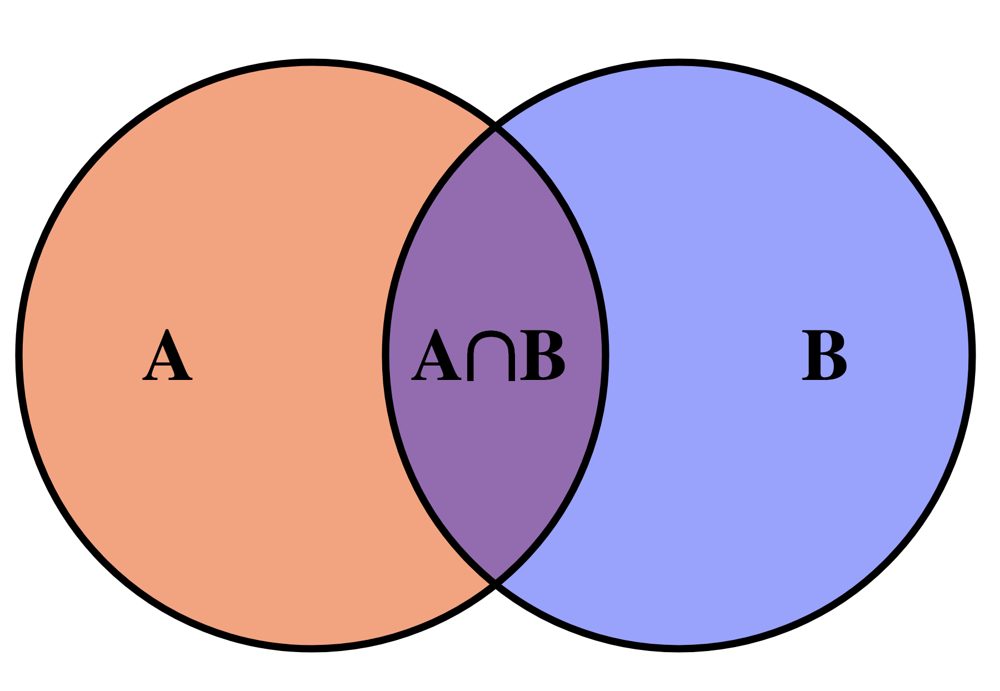

# Conjunts: `set`

## Introducció

Una **conjunt** és un tipus abstracte de dades que permet emmagatzemar una
col·lecció ordenada d'elements sense repeticions amb les operacions principals
següents:

-   inserir un element,
-   esborrar un element,
-   determinar si un element és al conjunt o no.

A més, els elements del conjunt es poden recórrer
en ordre a través d'iteradors (vegeu la lliçó sobre [lists](list.html)) i es poden calcular
unions, interseccions i diferències de conjunts.
I, com sempre, es pot consultar el nombre d'elements
i si el conjunt és buit o no.

## Il·lustració



La idea de l'estructura de dades conjunt és semblant a la de conjunt
matemàtic: Es tracta d'una col·lecció (finita) d'elements sense repeticions.
A més, en C++, els conjunts mantenen els seus elements en ordre,
en part per utilitat i en part per eficiència.

Usualment un conjunt comença buit i se li insereixen i esborren elements.
Alhora i, fonamentalment, es pot consultar si qualsevol element és o no
dins del conjunt, sense modificar el conjunt.
A més, a través
dels iteradors, es poden recórrer en ordre els elements dels conjunts.
I també es poden fer unions, interseccions i diferències de conjunts.

## Aplicacions

El conjunt és una estructura de dades molt útil en informàtica: Per
exemple, un navegador podria disposar d'un conjunt d'URLs
potencialment perilloses i preguntar a l'usuari si realment hi vol entrar quan
prova d'accedir-hi. També, una base de dades pot recuperar conjunts d'elements
i calcular-ne interseccions, unions, diferències... En moltes ocasions,
solucionar un problema consisteix a trobar un subconjunt dels elements d'un
conjunt que tinguin una determinada propietat. Per tant, disposar d'una
estructura de dades que representi conjunts és sempre útil.

## El tipus `set`

La llibreria estàndard de C++ proporciona conjunts d'elements de tipus `T` amb
el tipus `set<T>`. Per usar-les, cal fer un `#include <set>`. De forma
simplificada —ometem intencionadament molts detalls— aquesta és la seva
interfície:

```c++
template <typename T>
class set {
public:
set(); // Crea un conjunt buit
void insert(const T& x); // Hi afegeix x (no passa res si ja hi era)
void erase(const T& x); // Hi elimina x (no passa res si no hi era)
int count(const T& x) const; // Diu si hi ha x
bool empty() const; // Indica si és buit
int size() const; // Retorna el nombre d'elements (cardinalitat)

    iterator begin() const;                 // Retorna un iterador al primer element del conjunt
    iterator end() const;                   // Retorna un iterador passat el darrer element del conjunt
    iterator find(const T& x) const;        // Retorna un iterador a l'element x del conjunt, o end() si no hi és
    iterator lower_bound(const T& x) const; // Retorna un iterador al primer element del conjunt que és ≥ x (o end si no existeix)
    iterator upper_bound(const T& x) const; // Retorna un iterador al primer element del conjunt que és > x (o end si no existeix)

};

```

Les operacions `insert()`, `erase()`, `count()`, `find()`, `lower_bound()` i `upper_bound()`
prenen temps
$\O(\log n)$, on $n$ és el nombre d'elements (és a dir, el `size()`) del conjunt.
Les demés operacions prenen temps constant. Els conjunts, com els altres contenidors
estàndard, es poden copiar i comparar, amb cost $\O(n)$.

Els elements en un conjunt `s` es poden recórrer, del més petit
al més gran, amb un bucle `for`:

```c++
for (T x : s) {
    ... fer quelcom amb x ...
}
```

El recorregut dels $n$ elements d'un conjunt triga temps $\O(n)$.

Més avall expliquem com utilitzar iteradors sobre conjunts
i com calcular interseccions, unions i diferències de conjunts.

Per si teniu curiositat, els conjunts sovint s'implementen internament
amb arbres balancejats (arbres AVL o arbres roig-negre).
L'especificació completa dels conjunts de C++ es pot trobar a
[cppreference](http://en.cppreference.com/w/cpp/container/set).

## Exemple: Llistar totes les paraules d'un text

Considerem que, donat un text, volem obtenir la llista de totes les seves
paraules, ordenada alfabèticament i sense repeticions. Per exemple, donada l'entrada

```c++text
el gegant del pi
ara balla ara balla
el gegant del pi
ara balla pel cami
```

es vol obtenir la sortida

```c++text
ara
balla
cami
del
el
gegant
pel
pi
```

Començant amb un conjunt de paraules buit,
anirem llegint seqüencialment cada paraula del text i
inserint-la al conjunt. D'aquesta forma, totes les paraules del text s'introduirant al
conjunt (i sense repeticions, perquè els conjunts no en tenen). Un cop
llegit tot el text, recorrerem totes les paraules del conjunt, escrivint-ne
cadascuna. Com que els recorreguts dels elements d'un conjunt se fan en ordre, les
paraules apareixeran ordenades alfabèticament (o lexicogràficament, per
ser més precisos).

```c++
#include <iostream>
#include <set>
#include <string>
using namespace std;

int main() {
    set<string> s;
    string w;
    while (cin >> w) s.insert(w);
    for (string w : s) cout << w << endl;
}
```

## Iteradors

Els conjunts es poden recórrer a través d'**iteradors**. Els iteradors de
conjunts són semblants als [iteradors de les llistes](list.html): Un iterador
és una mena de punter d'alt nivell que apunta als elements del conjunt i que
es pot moure a l'element anterior o al següent (sempre que existeixin).

Igual que les llistes, els conjunts ofereixen una operació `begin()` que
retorna un iterador al primer element del conjunt (el més petit)
i una operació `end()` que retorna un iterador _passat_ el darrer
element del conjunt (el més gran).
Aquest iterador a un element fictici
serveix per assenyalar que s'han acabat els elements del conjunt.
Els iteradors `begin()` i `end()` coïncideixen entre si només en els conjunts buits.

Per exemple, podem escriure tots els elements d'un conjunt d'enters en ordre creixent d'aquesta forma:

```c++
set<int> s = {1, 4, 4, 7, 8, 9, 1, 3, 5, 4};

for (auto it = s.begin(); it != s.end(); ++it) cout << ' ' << *it;
cout << endl;

// la sortida és 1 3 4 5 7 8 9
```

Igual que amb les llistes o els vector, la construcció

```c++
for (auto x : s) cout << ' ' << x;
```

itera sobre tots els elements de `x` i és equivalent al `for` anterior.

## Iteradors per a cerca

La operació `find()` retorna un iterador al conjunt: En
el cas que `x` pertanyi al conjunt `s`, `s.find(x)` retorna un iterador `it`
tal que `*it == x`. Si `x` no pertany a `s`, `s.find(x)` retorna
`s.end()`.

Si només es vol saber si un element pertany o no al conjunt, la operació `count()`
és més senzilla d'usar que `find()`. En canvi, amb `find()` podem accedir als
elements veïns a l'element cercat.

Ambdues operacions són particularment eficients, ja que funcionen en temps $\O(\log n)$
en un conjunt d'$n$ elements.

## Exemple: Múltiples en un conjunt

Suposem que volem implementar una funció que,
donats un enter positiu `n` i un conjunt d'enters positius `s`,
indiqui si `s` conté algun múltiple d'`n`:

```c++
bool conte_multiple(int n, const set<int>& s) {
    if (s.empty()) return false;
    int minim = *s.begin();
    if (minim%n == 0) return true;
    minim += n - minim%n;    // primer múltiple de n que potencialment està dins de s
    auto fi = s.end(); --fi;
    int maxim = *fi;
    for (int x = minim; x <= maxim; x += n) {
        if (s.count(x)) return true;
    }
    return false;
}
```

Per començar, descartem el cas on el conjunt és buit. Altrament, accedim a
l'element més petit del conjunt, que anomenem `minim` a través de `*s.begin()`
(fixeu-vos que aquesta operació seria un error en un conjunt buit). Si `minim` ja
és un múltiple de `n`, ja hem trobat la resposta. Altrament,
actualitzem `minim` per a ser el primer múltiple que potencialment està dins de `s`
i definim `maxim` com l'element més gran del conjunt (anant una posició abans de l'`end()`).
Llavors cerquem totes les `x` desde `minim` fins a `maxim` de `n` en `n`
per veure si alguna d'aquestes `x` és o no dins del conjunt.
Fixeu-vos que el `if (s.count(x))` també s'hagués pogut escriure
`if (s.find(x) != s.end())`.

## Exemple: Més proper a un element

Suposem que volem implementar una funció que,
donats un enter `x` i un conjunt d'enters `s` no buit,
retorni l'element més proper a `x` en `s`
(el més petit en cas d'empat).

Per exemple, si `s = {2, 3, 6, 8}`,
per a `x = 3` caldria retornar `3`,
per a `x = 5` caldria retornar `6`,
per a `x = 7` caldria retornar `6`,
i per a `x = 9` caldria retornar `8`.

Per a fer aquesta tasca, és útil començar obtenint `s.lower_bound(x)`, és a
dir, un iterador `it` a l'element més petit de `s` que és més gran o igual
que `x`. A partir d'aquí, un estudi de casos sobre els iteradors veïns a `it`,
anant en compte de no sortir del conjunt.

Aquesta n'és una possible implementació:

```c++
int mes_proper(int x, const set<int>& s) {
    auto it = s.lower_bound(x);
    if (it == s.end()) return *(--it); // quan x > màxim de s, retornem el màxim de s
    int seg = *it;                     // seg és el valor més petit de s que és >= x
    if (it != s.begin() and x - *(--it) <= seg - x) return *it;
    // si existeix algun nombre < x, comparem la seva distància a x amb la de seg
    return seg;
}
```

## Intersecció, unió i diferència de conjunts

Donats dos conjunts, podem obtenir-ne la seva intersecció, unió o diferència.
La forma de fer-ho amb la llibreria estàndard és una mica recargolada:

Suposem que tenim dos conjunts d'enters `s1` i `s2`. Per exemple,

```c++
set<int> s1 = {1, 2, 3, 5};
set<int> s2 = {1, 2, 6};
```

Per deixar la intersecció de `s1` i `s2` en un nou conjunt `s`, cal fer

```c++
set<int> s;
set_intersection(s1.begin(), s1.end(), s2.begin(), s2.end(), inserter(s, s.begin()));
```

És a dir que aquestes dues línies són equivalents a dir que `set<int> s = s1 ∩ s2;`.
El resultat és que `s` representa el conjunt `{1, 2}`.

Igualment, podeu utilitzar `set_union()` i `set_difference()` per la unió (∪)
i la diferència (∖) de conjunts. Per utilitzar les tres funcions cal
fer un `#include <algorithm>`.

## Exemple: funcions i operadors per operacions sobre conjunts

Per tal de fer més clara i explícita la notació de les funcions anteriors,
és útil definir una funció que, donats dos conjunts del mateix tipus,
en retorni la seva intersecció. Això es fa així:

```c++
// Retorna la intersecció de dos conjunts s1 i s2.
template<typename T>
set<T> intersection(const set<T>& s1, const set<T>& s2) {
    set<int> s;
    set_intersection(s1.begin(), s1.end(), s2.begin(), s2.end(), inserter(s, s.begin()));
    return s;
}
```

Fins i tot, en lloc de definir una funció,
podríem fer que l'operador `&` ens servís per a intersecar conjunts:

```c++
// Retorna la intersecció de dos conjunts s1 i s2.
template<typename T>
set<T> operator&(const set<T>& s1, const set<T>& s2) {
    set<int> s;
    set_intersection(s1.begin(), s1.end(), s2.begin(), s2.end(), inserter(s, s.begin()));
    return s;
}
```

Si definim operadors `+` per a la unió i `-` per a la diferència de forma anàloga, llavors
podrem escriure operacions sobre conjunts amb expressions com les del codi següent:

```c++
set<int> A = {1, 3, 5, 8, 12};
set<int> B = {0, 3, 5, 8, 10};
set<int> C = {5};

set<int> R = A&B - C + {2, 3};
```

que descriu `R = ((A ∩ B) ∖ C) ∪ {2, 3}`, de forma que `R` serà `{2, 3, 8}`.
Noteu com aquests operadors incrementen molt la llegibilitat de l'expressió.

## Conjunts sobre tipus propis

En alguns casos voldrem definir funcions per a estructures de dades pròpies.
Per exemple, podem voler tenir un conjunt de dates,
on una data ve donada per aquesta declaració de tipus:

```c++
struct Data {
    int dia, mes, any;
};
```

Per poder declarar un `set<Data>`, ens cal
implementar la comparació de dates, és a dir,
proveïr un operador `<` que, donades dues dates, ens indiqui
si la primera va estrictament abans que la segona.
Això es fa així (de forma semblant a com s'ha fet amb [sort()](sort.html)):

```c++
bool operator<(const Data& x, const Data& y) {
    if (x.any != y.any) return x.any < y.any;
    if (x.mes != y.mes) return x.mes < y.mes;
    return x.dia < y.dia;
}
```

Ara ja podem usar conjunts de dates:

```c++
set<Data> s;
... fer el que sigui amb s ...
```

<Autors autors="jpetit roura"/>
