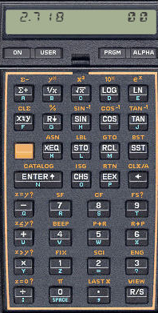

# Piles: `stack`

## Introducció

Una **pila** és un tipus abstracte de dades que permet emmagatzemar
una col·lecció d'elements amb les operacions principals següents:

-   afegir un nou element,
-   consultar si hi ha algun element,
-   consultar l'element afegit més recentment que encara no s'hagi eliminat, i
-   eliminar aquest element.

## Il·lustració


Podem veure una pila com un contenidor on els elements es col·loquen
els uns damunt dels altres, en l'ordre en què arriben. En tot moment,
l'únic element accessible és el de damunt, el qual s'anomena
el **cim** de pila. Aquest es pot consultar i també eliminar.
És un error intentar consultar o eliminar el cim d'un pila buida.

Sovint es diu que les piles són estructures LIFO (_Last In, First Out_),
indicant que el darrer element que entri serà el primer a sortir.

A l'animació interactiva següent, feu clic damunt dels elements per ficar-los
a la pila. Feu clic a la pila per treure l'element del seu cim.
Fixeu-vos que dóna un error si la pila és buida.

TODO:

```c++
<svg id='svg-stack' class='figura' style='width: 100%; height: 400px; margin-bottom: 2em;'>
</svg>

<script type="text/coffeescript" src="stack.coffee"></script>

```

## Aplicacions

Malgrat (o precisament per) la seva simplicitat, les piles són una
estructura de dades fonamental: Internament, els computadors usen piles
per guardar els valors dels paràmetres i els punts de retorn en les
crides a funcions. Els navegadors d'internet utilitzen una pila per
permetre anar enrere en la visita de les pàgines (⬅).
Els editors i fulls de cálcul usen piles per poder desfer (_undo_) operacions (⎌).
També, sovint s'utilitzen piles en el processament de llenguatges formals
(_parsing_) o en l'avaluació d'expressions.
Addicionalment, molts algorismes usen piles per desar informació pendent de tractar.

## El tipus `stack`

La llibreria estàndard de C++ proporciona
piles d'elements de tipus `T` amb el tipus `stack<T>`.
Per usar-les, cal fer un `#include <stack>`.
De forma simplificada, aquesta és la interfície:

```c++
template <typename T>
class stack {
public:
    stack();                    // Crea una pila buida
    void push(const T& x);      // Hi empila x
    T top() const;              // En retorna el cim (sense esborrar-lo)
    void pop();                 // N'esborra el cim
    bool empty() const;         // Indica si és buida
    int size() const;           // En retorna el nombre d'elements
};
```

⚡ Recordeu que els mètodes `top()` i `pop()`
tenen com a precondició que la pila no sigui buida.
Intentar usar-los quan la pila està buida
és un error de programació amb efectes indefinits en execució.

Tots els mètodes presentats prenen cost constant.
A més, les piles de C++, com els altres contenidors estàndard,
es poden copiar i comparar, amb cost proporcional al seu nombre d'elements.

Si teniu curiositat, les piles sovint s'implementen internament
amb vectors o amb nodes enllaçats.
L'especificació completa de les piles de C++ es pot trobar a
[cppreference](http://en.cppreference.com/w/cpp/container/stack).

## Exemple: Revessar una seqüència

Considerem que volem llegir una seqüència d'enters i escriure-la del revés.
Aquesta és una manera senzilla de fer-ho:

1. Primer, es crea una pila d'enters.
2. Després, l'un rera l'altre, s'hi empila cada element de l'entrada.
3. Finalment, mentre la pila no sigui buida, se n'escriu el cim i es desempila.

Donada l'estructura LIFO de la pila,
és evident que els valors que es llegeixin més tard s'escriuran abans,
invertint doncs l'ordre de la seqüència, tal com es vol.
Aquest és el programa complet:

```c++
#include <iostream>
#include <stack>
using namespace std;

int main() {
    stack<int> pila;
    int x;
    while (cin >> x) {
        pila.push(x);
    }
    while (not pila.empty()) {
        cout << pila.top() << endl;
        pila.pop();
    }
}
```

Fixeu-vos que la condició del segon bucle
assegura que no s'accedeix o s'esborra el cim d'una pila buida.

D'altra banda, notem que aquest problema
també es podria resoldre fàcilment amb un vector,
amb les seves operacions típiques:
Senzillament, podríem guardar tots els elements al vector,
i després recorre'l de dreta a esquerra
per escriure els elements en ordre invers.
En casos així, usar una pila deixa més explícit
el seu propòsit.

## Exemple: Expressions en notació polonesa inversa



La **notació polonesa inversa** (o **notació postfixa**)
[$\small[\mathbb{W}]$](https://ca.wikipedia.org/wiki/Notaci%C3%B3_polonesa_inversa)
és una notació matemàtica sense parèntesis
on cada operador (binari, en el nostre cas) segueix als seus dos operands.
Per exemple, l'expressió ~~6 2 -~~ és equivalent a ~~6 - 2~~, i per tant val ~~4~~,
l'expressió ~~6 2 - 5 \*~~ és equivalent a ~~(6 - 2) \* 5~~, i per tant val ~~20~~,
i l'expressió ~~6 2 5 - \*~~ és equivalent a ~~6 \* (2 - 5)~~, i per tant val ~~-18~~.
Les primeres calculadores electròniques utilitzaven aquesta notació per la seva simplicitat
i l'absència de parèntesis.

Per avaluar una fórmula en notació polonesa inversa,
la llegim d'esquerra a dreta,
tot manipulant una pila d'aquesta manera:

-   Quan l'element és un operand, l'empilem.
-   Quan l'element és un operador, extraiem dos elements
    del cim de la pila, els operem i n'empilem el resultat.
-   Quan la seqüència ha acabat, només pot quedar un element a la pila,
    el qual és el resultat final.

El programa següent implementa aquesta idea, suposant que els operands
són dígits, els resultats són enters, i els operadors són els
de suma, resta, producte i divisió
(`'+'`, `'-'`, `'*'` i `'/'`, respectivament).
El codi suposa que l'expressió és sintàcticament
correcta, que no hi ha sobreiximents, i que no es divideix mai per zero.

```c++
#include <iostream>
#include <stack>
#include <cctype>
using namespace std;

int main () {
    stack<int> pila;
    char c;
    while (cin >> c) {
        if (isdigit(c)) pila.push(c - '0');
        else {
            int x = pila.top(); pila.pop();
            int y = pila.top(); pila.pop();

                 if (c == '+') pila.push(y + x);
            else if (c == '-') pila.push(y - x);
            else if (c == '*') pila.push(y * x);
            else               pila.push(y / x); // c == '/'
        }
    }
    cout << pila.top() << endl;
}
```

La condició `isdigit(c)`,
que també s'hauria pogut escriure `c >= '0' and c <= '9'`,
es troba dins de les [funcions sobre caràcters](/stl/cctype.html)
de la llibreria estàndard.

Quan `c` conté un dígit, cal obtenir i empilar l'enter corresponent,
que és `c - '0'`. Per exemple, si `c` fos `'3'` i l'empiléssim directament,
estaríem empilant el codi ASCII del caràcter `'3'`
(el qual, si algú té interès a saber-ho, és `51`).

Quan `c` és un operador,
primer es treuen dos elements `x` i `y` del cim.
Després, s'empila el resultat d'operar-los en funció de l'operador `c`.
Com que `y` es va empilar abans que `x`,
les operacions de resta i divisió, que no són commutatives,
s'han de fer en l'ordre correcte: `y - x` i `y / x`.

<Autors autors="jpetit roura"/>
