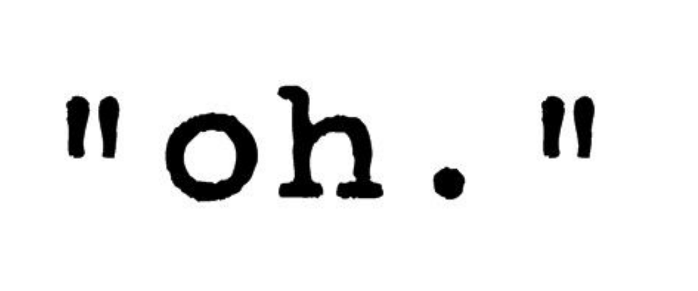

# Textos

Aquesta lliçó dóna alguns detalls sobre els valors que poden prendre les
variables de tipus text (`string`)
i les operacions que se'ls poden aplicar.
De moment només en considerem la concatenació, la mida  i la comparació.
Més endavant en veurem més.

## El tipus `string`

Així com el tipus de dades `char` permet representar caràcters individuals,
el tipus de dades `string` permet representar _textos_,
és a dir, successions de zero o més caràcters.

## Representació

Els valors de les cadenes de caràcters
es representen mitjançant caràcters tancats entre cometes dobles.
Per exemple, `"gat"`, `"L\'Anna menja una poma."` o bé `"#?!"`.
Fixeu-vos que també es pot definir el text buit amb `""`,
i el text amb un sola `'A'`amb `"A"`.
En aquest darrer cas, cal veure que `"A"` és un text amb un sol caràcter,
cosa que és diferent de `'A'`, que és un sol caràcter.

Com que `string` no és un tipus bàsic de C++,
per usar-los en principi cal escriure `#include <string>`
a la secció d'inclusions del programa.
Cal dir que és possible que el programa compili encara que no feu aquest `#include`,
però això dependrà de la configuració de l'ordinador on es compili.

Els caràcters dels textos habitualment es guarden
en posicions de memòria consecutives.
En C, la llargada es determina amb un caràcter finalitzador especial,
mentre que en C++ (el nostre llenguatge) és manté un enter amb aquesta llargada.

## Operacions

Donats dos textos `a` i `b`, la **concatenació** de `a` i `b` s'escriu `a + b`
i consisteix en el text de `a` seguit pel de `b`. Per exemple, `"abc" +
"def"` val `"abcdef"` i `"Joan" + " " + "Maragall"` val `"Joan Maragall"`.
Fixeu-vos que la concatenació de textos és associativa però no commutativa,
malgrat que l'operador sigui el de suma.

Per saber la longitud d'un text `paraula` podem fer servir el mètode
`paraula.size()`. És una notació una mica estranya
(més endavant l'estudiarem en detall),
però senzillament és la forma de conèixer la llargada d'un text.
Per exemple, `"oca".size()` val 3.

Com amb els tipus bàsics, també es poden aplicar els operadors relacionals
per comparar textos. Són els de sempre:

| Operador       | Operació                       |
| -------------- | ------------------------------ |
| `==`           | igualtat                       |
| `!=`           | diferència                     |
| `<`            | més petit                      |
| `>`            | més gran                       |
| `<=`           | més petit o igual              |
| `>=`           | més gran o igual               |

L'ordenació de textos fa servir l'**ordre lexicogràfic**,
el qual generalitza l'**ordre alfabètic** amb els caràcters no alfabètics:
L'ordre relatiu de cada parell de caràcters ve donat pel seu ordre
a la taula de caràcters.

A continuació es donen alguns exemples:

| Expressió         | Resultat                      |
| ------------------| ----------------------------- |
| `"abc" == "abc"`  | `true`                        |
| `"abc" == "ABC"`  | `false`                       |
| `"abc" < "abd"`   | `true`                        |
| `"123" < "89"`    | `true`                        |
| `"XYZ" < "XYZA"`  | `true`                        |
| `"" < "abc"`      | `true`                        |

Els textos només es poden comparar entre ells, mai amb valors d'altres tipus.
Per exemple, ni a `"A" == 'A'` ni a `"3" == 3` els tipus concorden,
per la qual cosa són comparacions sense sentit.

## Tipus semblants

El tipus `char*` (punter a caràcter) també serveix per tractar textos.
Però com que el seu ús és més complicat que el del tipus `string`,
no els explicarem en aquest curs.

<Autors autors="jpetit roura"/>

