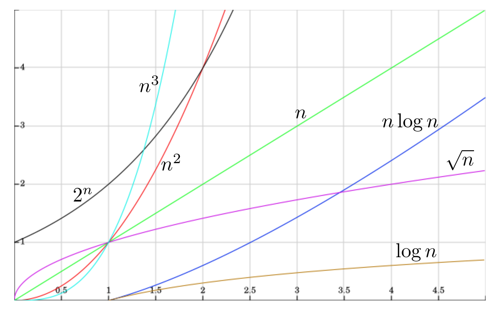
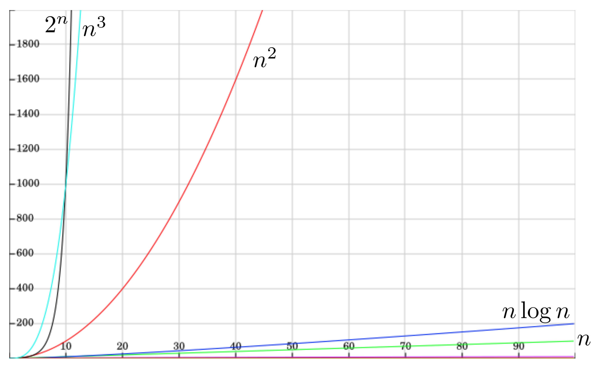

# Notació asimptòtica

La notació assimptòtica és una eina matemàtica que ens permetrà expressar l'eficiència dels algorismes de manera senzilla i clara. Però per un moment, oblidem-nos dels algorismes, i centrem-nos en les matemàtiques. A continuació es presenten les principals notacions asimptòtiques que necessitem i es presenten les seves propietats bàsiques. També s'inclouen exemples d'ús i es donen exemples i intuïcions per entendre-les millor.

## Ordres de magnitud

En matemàtiques se sol treballar amb molt de rigor. No és el mateix $3x^2+1$ que $3.01x^2+22$. Ara bé, en moltes ocasions, la diferència entre aquestes dues funcions és poc rellevant. Al cap i a la fi, si aquestes funcions són aproximacions de mesures experimentals o provenen de simplificacions models teòrics, ja contenen un cert grau d'error. Per tant, perquè preocupar-se dels seus detalls?

Sovint, els detalls específics d'una funció es poden ignorar, ja que només ens interessa l'ordre de magnitud quan aquesta tendeix a l'infinit.

Per exemple, per a $f(n) = 3n^2 + 2n + 23$, podem dir que $f$ creix **quadràticament**  perquè, quan $n$ és molt gran, el terme dominant és $3n^2$ i els altres termes ($2n$ i 23) es tornen insignificants en comparació. De fet, el factor $3$ també es pot ignorar en aquest context, ja que només ens interessa l'ordre de magnitud i no la pendent exacta d'aquest ordre de magnitud. Per tant, podem dir que $f(n)$ és de l'ordre de $n^2$.

Igualment, per a $g(n) = 5n^3 + 0.1n^2 + 1000$, podem dir que $g$ creix **cúbicament** perquè el terme dominant és $5n^3$ i els altres termes es tornen insignificants quan $n$ és molt gran. Així, podem dir que $g(n)$ és de l'ordre de $n^3$.

De la mateixa manera, per a $h(n) = 3\log (n+1) + 1/n$, podem dir que $h$ creix **logarítmicament** perquè el terme dominant és $3\log (n+1)$ i el terme $1/n$ es torna insignificant quan $n$ és molt gran. Igualment, per a valors grans de $n$, $\log (n+1)$ es comporta de manera similar a $\log (n)$. Per tant, podem dir que $h(n)$ és de l'ordre de $\log (n)$.

En informàtica hi ha alguns ordres de magnitud especialment habituals:

| Ordre de magnitud      | Descripció                        |
|-----------------------|----------------------------------|
| $1, 5, 12, 10^6$                  | Constant                        |
| $\approx  \log n$              | Logarítmic                      |
| $\approx  n$                  | Lineal                          |
| $\approx  n\log n$           | Quasilineal                     |
| $\approx  n\sqrt n$                 | -                     |
| $\approx  n^2$                 | Quadràtic                       |
| $\approx  n^3$                 | Cúbic                           |
| $\approx  n^c$                 | Polinòmic                           |
| $\approx  c^n$                | Exponencial                     |

La gràfica següent mostra una comparació visual entre alguns d'aquests ordres de magnitud per a petits valors de $n$:

I la gràfica següent mostra una comparació visual entre alguns d'aquests ordres de magnitud per a valors més grans de $n$:

Mentre que per a valors petits de $n$ les diferències entre els ordres de magnitud poden no ser tan evidents, a mesura que $n$ creix, les diferències es fan molt més pronunciades. Això il·lustra la importància de l'anàlisi asimptòtica en l'estudi de l'eficiència dels algorismes.

## Notació asimptòtica

La notació asimptòtica és una eina matemàtica que permet treballar amb aquests ordres de magnitud de manera formal.

**Definició:** Donada una funció $g: \mathbb{N} \rightarrow \mathbb{N}$, es defineixen les notacions asimptòtiques següents:

- $O(g) = \{ f: \mathbb{N} \rightarrow \mathbb{N} \mid \exists c \in \mathbb{N} \; : \exists n_0 \in \mathbb{N} \; : \forall n \ge n_0 \; : f(n) \le c \cdot g(n) \}$

- $\Omega (g) = \{ f: \mathbb{N} \rightarrow \mathbb{N} \mid \exists c \in \mathbb{N} \; : \exists n_0 \in \mathbb{N} \; : \forall n \ge n_0 \; : f(n) \ge c \cdot g(n) \}$

- $\Theta (g) = \{ f: \mathbb{N} \rightarrow \mathbb{N} \mid \exists c_1, c_2 \in \mathbb{N} \; : \exists n_0 \in \mathbb{N} \; : \forall n \ge n_0 \; : c_1 g(n) \le f(n) \le c_2 g(n) \}$

Així doncs:

- $O(g)$ és el conjunt de les funcions que creixen com a màxim tan ràpidament com $g$ per a valors grans de $n$, ignorant constants multiplicatives i termes de menor ordre.

- $\Omega(g)$ és el conjunt de les funcions que creixen com a mínim tan ràpidament com $g$ per a valors grans de $n$, ignorant constants multiplicatives i termes de menor ordre.

- $\Theta(g)$ és el conjunt de les funcions que creixen exactament com $g$ per a valors grans de $n$, ignorant constants multiplicatives i termes de menor ordre.

Per exemple, si $f(n) = 3n^2 + 100n + 5$, llavors $f(n) \in O(n^2)$.

Per a demostrar-ho, cal trobar constants $c$ i $n_0$ tals que per a tot $n \ge n_0$, es compleixi que $f(n) \le c \cdot n^2$. En aquest cas, podem triar $c = 4$ i $n_0 = 101$. En efecte, per a $n \ge 101$, tenim que $4n^2\ge 3n^2 + 100n + 5$.

De forma semblant, es pot comprovar que $f(n) \in \Omega(n^2)$ i, per tant, $f(n) \in \Theta(n^2)$.

## Exemples i intuïcions

A continuació es dónen uns exemples del l'ús de la notació O gran:

- $3 n^2 + 5 n - 7 \in O(n^3)$
- $n + 15 \in O(n)$
- $O(n^5) \subseteq O(n^6)$
- $n^3 \notin O(n^2)$
- $n^3 \in O(2^n)$

I aquests són uns exemples del l'ús de la notació $\Omega$:

- $2^n \in \Omega(n)$
- $n^2 \in \Omega(n)$
- $n \in \Omega(n)$
- $n \notin \Omega(n^2)$
- $\Omega(n^6) \subseteq \Omega(n^5)$

I ara uns exemples del l'ús de la notació $\Theta$:
- $75 n \in \Theta(n)$
- $1023 n^2 \notin \Theta(n)$
- $n^2 \notin \Theta(n)$
- $2^n \notin \Theta(2^{n^2})$
- $\Theta(n) \ne \Theta(n^2)$

Intuitivament, podem entendre aquestes notacions de la següent manera:

- $f(n) \in O(g(n))$ significa que, per a valors grans de $n$, la funció $f(n)$ creix com a màxim, tan ràpidament com $g(n)$, tot ignorant la seva pendent i què passa per a valors petits de $n$.

- $f(n) \in \Omega(g(n))$ significa que, per a valors grans de $n$, la funció $f(n)$ creix com a mínim, tan ràpidament com $g(n)$, tot ignorant la seva pendent i què passa per a valors petits de $n$.

- $f(n) \in \Theta(g(n))$ significa que, per a valors grans de $n$, la funció $f(n)$ creix igual de ràpidament que $g(n)$, tot ignorant la seva pendent i què passa per a valors petits de $n$.

## Convencions

Malgrat que $O(g)$ és un conjunt de funcions i no una funció en si mateixa, sovint es comet un abús de notació i s'utilitza la notació $f(n) = O(g(n))$ per indicar que $f\in O(g)$. Aquesta és una convenció àmpliament utilitzada en l'anàlisi d'algorismes i facilita la comunicació dels resultats. Per tant, no ens n'estarem d'utilitzar-la. Però sempre cal tenir present que, estrictament parlant, $O(g)$ és un conjunt de funcions i no una funció en si mateixa.

Amb aquest convenció, escriurem expressions com ara
$$3(n− 1)(n + 2) = 3n^2 + 3n− 6 = O(n^2) = O(n^3)$$
que, en realitat, vol dir que
$$3(n− 1)(n + 2) = 3n^2 + 3n− 6 \in O(n^2)\subset O(n^3).$$

Igualment, és habitual estendre la notació a altres dominis diferents de $\mathbb{N}$, com ara $\mathbb{R}^+$, això no comporta cap problema.

## Propietats

Donades dues funcions $f$ i $g$, aquestes propietats relacionen les diferents notacions asimptòtiques:
- $f  = \Omega(g) \Longleftrightarrow g  = O(f)$
- $\Theta(f) = O(f) \cap \Omega(f)$
- $f = \Theta(g) \Longleftrightarrow f = O(g)$ i $f = \Omega(g)$

Donades les funcions $f$, $f_1$, $f_2$, $g$, $g_1$, $g_2$ i $h$, la O gran compleix les propietats següents:

- **Reflexivitat**: $f = O(f)$
- **Transitivitat**: $h = O(g) \wedge g = O(f) \Rightarrow h = O(f)$
- **Caracterització**: $g = O(f) \Longleftrightarrow O(g) \subseteq O(f)$
- **Suma**: $g_1 = O(f_1) \wedge g_2 = O(f_2) \Rightarrow g_1 + g_2 = O(f_1 + f_2) = O(\max(f_1,f_2))$
- **Producte**: $g_1 = O(f_1) \wedge g_2 = O(f_2) \Rightarrow g_1 \cdot g_2 = O(f_1 \cdot f_2)$
- **Invariància multiplicativa**: Per a tota constant $c = \mathbb{R}^+$, $O(f) = O(c \cdot f)$

Per a $\Omega$ es compleixen propietats similars, i en el cas de $\Theta$ es compleixen les següents propietats:

- **Reflexivitat**: $f = \Theta(f)$
- **Transitivitat**: $h = \Theta(g) \wedge g = \Theta(f) \Rightarrow h = \Theta(f)$
- **Simetria**: $g = \Theta(f) \Longleftrightarrow f = \Theta(g) \Longleftrightarrow \Theta(g) = \Theta(f)$
- **Suma**: $g_1 = \Theta(f_1) \wedge g_2 = \Theta(f_2) \Rightarrow g_1 + g_2 = \Theta(f_1 + f_2) = \Theta(\max(f_1,f_2))$
- **Producte**: $g_1 = \Theta(f_1) \wedge g_2 = \Theta(f_2) \Rightarrow g_1 \cdot g_2 = \Theta(f_1 \cdot f_2)$
- **Invariància multiplicativa**: Per a tota constant $c = \mathbb{R}^+$, $\Theta(f) = \Theta(c \cdot f)$

## Més abusos de notació

Seguint amb l'abús de notació esmentat anteriorment, es solen usar directament operacions entre les classes de funcions definides per les notacions asimptòtiques:

Si $\mathcal{F}_1$ i $\mathcal{F}_2$ són classes de funcions (com ara $O(f)$ o $\Omega(f)$):

- $\mathcal{F}_1 + \mathcal{F}_2 = \{ f+g \mid f = \mathcal{F}_1 \wedge g = \mathcal{F}_2 \}$
- $\mathcal{F}_1 \cdot \mathcal{F}_2 = \{ f \cdot g \mid f = \mathcal{F}_1 \wedge g = \mathcal{F}_2 \}$

En aquest context, es compleixen les propietats següents per a dues funcions $f$ i $g$ qualssevol:

- $O(f)+O(g) = O(f+g) = O(\max\{f,g\})$
- $O(f) \cdot O(g) = O(f \cdot g)$
- $\Theta(f)+\Theta(g) = \Theta(f+g) = \Theta(\max\{f,g\})$
- $\Theta(f) \cdot \Theta(g) = \Theta(f \cdot g)$

## Exercicis

Compara asimptòticament les següents parelles de funcions i indica quina creix més ràpidament quan $n$ tendeix a l'infinit:

- $n^{412}$ vs $1.02^n$
- $243 n^2$ vs $n^3$
- $2^n$ vs $3^n$
- $(\log n)^{923}$ vs $n^{0.0001}$
- $n (\ln n)^4$ vs $n^2 \ln n$
- $(log_2 7)^n$ vs $(log_4 7)^n$
- $(\ln n)^{7842}$ vs $1.001^n$
- $n\;2^n$ vs $n^3\; 1.5^n$
- $2^{\sqrt{\log n}}$ vs $n$

<Autors autors="jpetit"/>