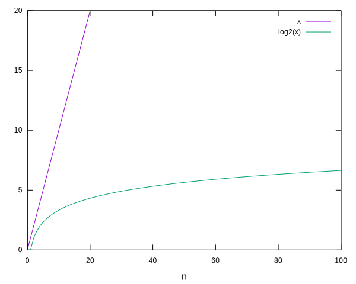

# Cerca lineal i cerca binària


En aquest lliçó es presenta el problema de la cerca i se n'estudien dues solucions: la cerca lineal per a llistes qualssevol, i la cerca binària (també dita cerca dicotòmica) per a llistes ordenades.


## El problema de la cerca

El problema de la cerca, en la seva versió més senzilla, és senzill: Donada una llista d'elements i un valor, es vol saber si aquest valor és dins de la llista o no. Per exemple la llista `[71, 12, 5, 22, 71, 65, 65, 22, 99]` conté el valor `22` però no conté el valor `14`. Per aquesta versió del problema, es podria utilitzar directament l'operador `in`. 

Per fer-ho més interessant, considerarem una versió alternativa, on cal retornar una posició de la llista que contingui el valor donat si hi és (no importa quina si apareix més d'un cop) i cal retornar `None` quan no hi és. Per tant, per la llista anterior i `22` caldria retornar `3` o `7`, però per `14`, caldria retornar `None`.

La funció següent encapsula doncs el problema que volem resoldre:

```python
from typing import TypeVar, Optional

T = TypeVar('T')

def cerca(L: list[T], x: T) -> Optional[int]:
    """
    Si x ∈ L, retorna una posició p tal que L[p] == x. 
    Si x ∉ L, retorna None.
    """
```

Fixeu-vos que la funció és genèrica, pot treballar amb llistes i valors de tipus qualsevol, designats per la variable de tipus `T`. Fixeu-vos també que la funció retorna un tipus `Optional[int]`, és a dir, un enter o `None`. Aquest tipus també es pot escriure com a `int|None` o com a `Union[int, None]`. Ja sabeu que els constructors de tipus `Optional` i `Union` han d'importar-se del mòdul `typing`.


## Cerca lineal

Implementar la funció `cerca` és prou senzill: Per a cada posició `i` de la llista, cal mirar si `L[i]` coincideix amb `x`. Si ho fa, ja es pot retornar `i`. Si cap posició coincideix, cal retornar `None`. L'ordre d'exploració de les posicions és indiferent (sempre que no es repeteixin), però fer-ho d'esquerra a dreta és el més senzill (i, segurament, el més eficient):

```python
def cerca(L: list[T], x: T) -> Optional[int]:
    """
    Si x ∈ L, retorna una posició p tal que L[p] == x. 
    Si x ∉ L, retorna None.
    """

    for i in range(len(L)):
        if L[i] == x:
            return i 
    return None
```

Prou senzill! Aquest és l'algorisme de **cerca lineal**.

Fixeu-vos que el temps requerit per trobar (o no) un element amb una cerca lineal depèn de dues coses:

1. D'on es troba l'element (quan més a l'esquerra és, abans es troba).
2. De la llargada de la llista (quan no hi és, cal explorar totes les posicions per assegurar-s'en).

De fet, el cas pitjor es dóna quan l'element no hi és. Per tant, en el cas pitjor l'algorisme de cerca lineal triga un temps que és essencialment proporcional al nombre d'elements a la llista. Les unitats precises de temps ja dependran de l'arquitectura sobre la qual s'executi la funció (processador, memòria, sistema operatiu, versió del Python, ...) però, a grans trets, el temps per determinar que un element no es troba en una llista es dobla quan la llargada de la llista es dobla.

La manera de caracteritzar aquest cost amb notació asimptòtica és doncs $\O(n)$, on $n$ és la llargada de la llista (`len(L)`).

Aquest algorisme és, essencialment, el millor possible: El seu nombre de comparacions en el cas pitjor és $n$. Si algun algorisme en fés menys, hi hauria alguna posició de la llista que no compararia amb `x` i, per tant, no seria capaç de donar la resposta correcta.


## Cerca binària

Suposem ara que la llista on cal determinar la posició (o absència) d'un element ja no és una llista qualsevol, sinó que és una llista ordenada creixentment. Podem aprofitar aquesta característica per accelerar la funció `cerca`? 

La resposta és que sí, i molt. 

Per a veure-ho, definirem aquesta nova funció `cerca_binaria`, especialitzada per a llistes ordenades:

```python
def cerca_binaria(L: list[T], x: T) -> Optional[int]:
    """
    Si x ∈ L, retorna una posició p tal que L[p] == x. 
    Si x ∉ L, retorna None.

    Precondició: L és una llista ordenada creixentment.
    """
```

L'algorisme que usarem es basa en aprofitar que la llista està ordenada per tal que, només mirant una sola posició, s'en puguin descartar moltes. Per exemple, si busquem el `79` a la llista `[11, 23, 26, 26, 55, 56, 59, 78, 89]`, només comparant `79` amb `55` ja podem saber que `79` no es trobarà a la primera meitat de la llista perquè, com que la llista està ordenada, tots els elements a l'esquerra del `55` han de ser més petits que el `55`, però el `79` és més gran.

En general, buscarem el valor `x` entre dues posicions: la posició `esq` (per esquerra) i la posició dreta `dre` (per dreta). Al principi `esq` i `dre` són `0` i `len(L) - 1`. Al llarg d'un bucle, tindrem que el valor `x` sempre haurà de trobar-se dins de `L[esq..dre]` (ambdues posicions extremes incloses). Si en algun moment `L[esq..dre]` és buida, ja sabrem que `x` no es troba a la llista. Si `L[esq..dre]` no és buida, mirarem el seu element al mig d'`esq` i `dre`, diguem-ne la posició `mig`. Si `L[mig]` és `x`, eureka, ja s'ha trobat! Sinó, quan `L[mig]` sigui més petit que `x`, cal descartar tots els elements a l'esquerra de `mig` (el de `mig` inclòs). Sinó, quan `L[mig]` sigui més gran que `x`, cal descartar tots els elements a la dreta de `mig` (el de `mig` inclòs). 

Això és el que s'anomena algorisme de **cerca binària** (o algorisme de **cerca dicotòmica**) i es pot implementar així:

```python
def cerca_binaria(L: list[T], x: T) -> Optional[int]:
    """
    Si x ∈ L, retorna una posició p tal que L[p] == x. 
    Si x ∉ L, retorna None.

    Precondició: L és una llista ordenada creixentment.
    """

    esq, dre = 0, len(L) - 1
    while esq <= dre:
        mig = (esq + dre) // 2
        if L[mig] < x:
            esq = mig + 1
        elif L[mig] > x:
            dre = mig - 1
        else:  # L[mig] == x
            return mig
    return None
```

És útil tenir també una versió recursiva de la funció anterior. Per fer-ho, cal recórrer a una funció auxiliar que tingui els paràmetres `esq` i `mig`, i engegar-la amb les seves inicialitzacions:

```python
def cerca_binaria(L: list[T], x: T) -> Optional[int]:
    """
    Si x ∈ L, retorna una posició p tal que L[p] == x. 
    Si x ∉ L, retorna None.

    Precondició: L és una llista ordenada creixentment.
    """

    return cerca_binaria_rec(L, x, 0, len(L) - 1)


def cerca_binaria_rec(L: list[T], x: T, esq: int, dre: int) -> Optional[int]:
    """
    Si x és en L[esq..dre], retorna una posició p tal que L[p] == x. 
    Si x no és en L[esq..dre], retorna None.

    Precondició: L és una llista ordenada creixentment i L[esq] ≤ x ≤ L[dre].
    """

    if esq > dre:
        return None
    else:
        mig = (esq + dre) // 2
        if L[mig] < x:
            return cerca_binaria_rec(L, x, mig + 1, dre)
        elif L[mig] > x:
            return cerca_binaria_rec(L, x, esq, mig - 1)
        else:  # L[mig] == x
            return mig
```

Com amb la cerca lineal, la cerca binària triga el màxim quan l'element no hi és. Quantes iteracions (o crides recursives) fa en aquest cas? Per comptar-ho, sigui `n` la llargada de `L`. Al principi, els elements de la llista a considerar van de 0 fins a `n - 1`, per tant n'hi ha `n`. Després de la primera iteració, els elements aniran de `0` a `mig` o de `mig` a `n - 1`, però poc importa per quin cantó es vagi, en quedaran `n` mitjos (els arrodoniments són menyspreables en aquesta explicació). Després de la segona iteració, en quedaran `n` quarts. I així, fins que no en quedi cap. El nombre de vegades que podem fer la divisió entera de `n` entre 2 fins arribar a zero és `log₂n`. Per tant, el cost asimptòtic de buscar un valor en una llista ordenada és $\O(\log n)$, on $n$ és la llargada de la llista.

Per poder comparar la cerca lineal amb la cerca binària, considereu una llista d'un milió d'elements: la cerca lineal faria un milió de passos, mentre que la binària faria `log₂1000000` passos, que són uns vint! La diferència és enorme i es pot observar comparant les corbes de $n$ i de $\log_2 n$:



Evidentment, per fer una cerca binària cal que la llista d'entrada etigui ordenada. A les properes lliçons veurem diferents algorismes per ordenar llistes.


<Autors autors="jpetit"/> 

