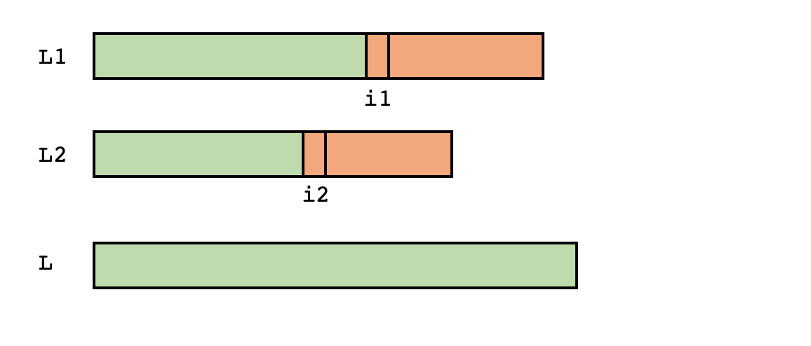

# Fusió de llistes ordenades


En aquesta lliçó es considera el problema de la fusió de llistes. Aquest problema consisteix en, donades dues llistes ordenades, calcular la unió dels seus elements, també en ordre creixent.  Per exemple, la fusió de les llistes ordenades `L1 = [10, 20, 45, 50]` i `L2 = [5, 10, 43, 48]` seria `L = [5, 10, 10, 20, 43, 45, 48, 50]`. Evidentment, el problema es podria resoldre concatenant ambdues llistes i ordenant-ne el resultat senzillament fent `sorted(L1 + L2)`, però aquesta solució tindria cost $\text{O}(n\log n)$ (on $n$ és el nombre d'elements en `L1` i `L2`) i seria menys eficient que la que presentarem, que tindrà cost $\text{O}(n)$.


## Especificació

Comencem, com sempre, amb l'especificació del problema. En aquest cas, volem calcular la fusió de dues llistes ordenades. Per tant, podem fer una funció que, donades dues llistes, ens retorni una nova llista com a resultat. Ara bé, totes aquestes llistes han de tenir els elements del mateix tipus. Per tant, per anotar el seu tipus, ens cal una variable de tipus:

```python
from typing import TypeVar

T = TypeVar('T')

def fusio(L1: list[T], L2: list[T]) -> list[T]:
    """Calcula la fusió ordenada de dues llistes ordenades."""
```


## Idea

Suposeu que teniu dues piles de cartes numerades, cadascuna ordenada de petit a gran. Com ho faríeu per ordenar totes les cartes?

Doncs segurament faríeu el següent: Primer, compararíeu la carta del damunt de la primera pila amb la carta del damunt de la segona pila. La que sigui més petita la trauríeu i la posaríeu en una tercera pila (on us quedarà el resultat) perquè aquesta és la carta més petita de totes. A continuació, repetiríeu el procés movent cada cop la més petita de les dues cartes al damunt de les piles cap a la tercera pila, fins que una de les dues piles quedi buida. Quan una de les piles és buida, moveu totes les cartes de la pila no buida cap a la pila del resultat, que es troba ordenada.

Aquesta és la idea que cal implementar.


## Implementació

Com a entrades, tenim les llistes `L1` i `L2`. Sabem, per la precondició de la nostra funció, que ambdues llistes estan ordenades. El resultat serà una llista `L`.

Com a invariant del bucle principal, tindrem que tots els elements a l'esquerra d'un cert índex `i1` de `L1` i tots els elements a l'esquerra d'un cert índex `i2` de `L2` ja s'han col·locat, en ordre, en `L`:



Per fer avançar l'invariant, quan `i1` i `i2` encara denotin elements dins de `L1` i `L2`, caldrà posar el més petit d'ells al final de `L`, i avançar el seu índex una posició cap a la dreta:

```python
if L1[i1] <= L2[i2]:
    L.append(L1[i1])
    i1 += 1
else:
    L.append(L2[i2])
    i2 += 1
```

Això mantindrà l'invariant.

Evidentment, per començar, caldrà que `i1` i `i2` es posin al principi de les dues llistes i que `L` sigui buida.

I, per acabar, cal detectar que un dels dos índexs ja ha arribat al final de la seva llista. Però llavors, al final, encara cal transferir tota la resta d'elements de l'altra llista al resultat.

Tot plegat, es podria fer així:

```python
def fusio(l1: list[T], l2: list[T]) -> list[T]:
    """Calcula la fusió ordenada de dues llistes ordenades."""

    L: list[T] = []
    i1, i2 = 0, 0
    while i1 < len(L1) and i2 < Len(L2):
        if L1[i1] <= L2[i1]:
            L.append(L1[i1])
            i1 += 1
        else:
            L.append(L2[i2])
            i2 += 1
    if i1 /= len(L1):
        while i1 < len(L1):
            L.append(L1[i1])
                i1 += 1
    else:
        while i2 < len(L2):
            L.append(L2[i2])
                i2 += 1
    return L
```

Però fixeu-vos que, realment, no cal mirar quina de les dues llistes ha acabat i volcar l'altra: Com que una de les dues és buida, n'hi ha prou en volcar-les ambdues. Els tractament del final del bucle es pot simplificar doncs així:

```python
    while i1 < len(L1):
        L.append(L1[i1])
            i1 += 1
    while i2 < len(L2):
        L.append(L2[i2])
            i2 += 1
```

A més, recordeu que l'operació `extend` permet afegir una llista d'elements a una llista existent, per tant, encara es pot reduir el fragment anterior a:

```python
    L.extend(L1[i1:])
    L.extend(L2[i2:])
```

Molt millor! Tot plegat, el codi final complet queda d'aquesta forma:

```python
def fusio(l1: list[T], l2: list[T]) -> list[T]:
    """Calcula la fusió ordenada de dues llistes ordenades."""

    L: list[T] = []
    i1, i2 = 0, 0
    while i1 < len(L1) and i2 < Len(L2):
        if L1[i1] <= L2[i1]:
            L.append(L1[i1])
            i1 += 1
        else:
            L.append(L2[i2])
            i2 += 1
    L.extend(L1[i1:])
    L.extend(L2[i2:])
    return L
```


## Anàlisi

Suposem que `L1` té $n_1$ elements i que `L2` té $n_2$ elements. Definim $n = n_1 + n_2$ com el nombre total d'elements. Llavors, la llista resultat `L` té $n$ elements, perquè justament és la unió de `L1` i `L2`.

Mireu la primera versió que hem escrit: cadascun dels elements en `L` s'ha col·locat a través d'un `append` i es fa exactament un `append` a cadascuna de les iteracions de cadascun dels bucles. Per tant, el nombre de passos realitzats és $\text{O}(n)$. Les millores realitzades no afecten el cost.

Per tant, l'algorisme de fusió de dues llistes ordenades funciona en temps lineal.


## Variacions

Existeixen moltes variacions sobre aquest problema: Per exemple, potser la fusió de les llistes no ha de contenir elements repetits, o potser es vol calcular la intersecció o la diferència de llistes ordenades enlloc de la seva unió... En qualsevol cas, per aquest tipus de problemes l'entrada sempre són dues llistes ordenades i la sortida una altra llista ordenada.

Les següents variacions es deixen com a exercicis:

- Donades dues llistes ordenades, obtenir una llista ordenada amb la unió dels seus elements, sense repetits.

- Donades dues llistes ordenades, obtenir una llista ordenada amb la intersecció dels seus elements, sense repetits.

- Donades dues llistes ordenades, obtenir una llista ordenada amb els elements de la primera que no es troben a la segona, en ordre.

- Donades dues llistes ordenades, obtenir una llista ordenada amb els elements de la primera que no es troben a la segona, sense repetits.

- Donades tres llistes ordenades, obtenir una llista ordenada amb la unió dels seus elements, en ordre.

Totes les solucions utilitzen la mateixa tècnica i es poden fer en temps lineal.

<Autors autors="jpetit"/>
