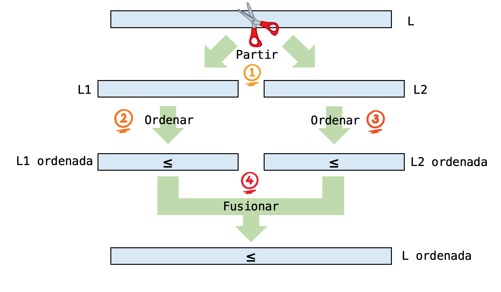
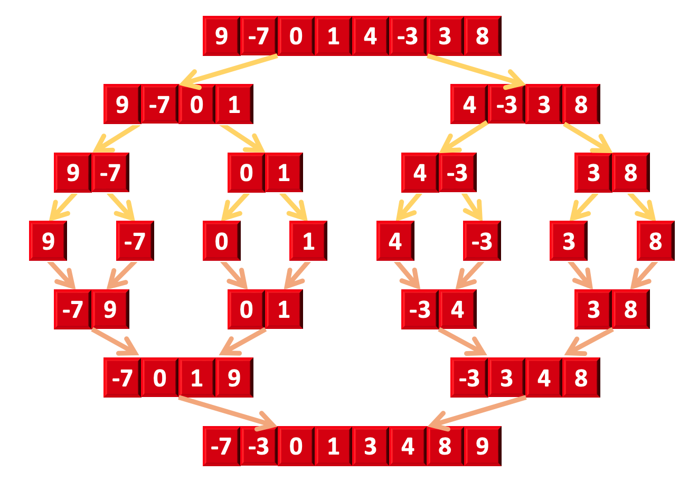
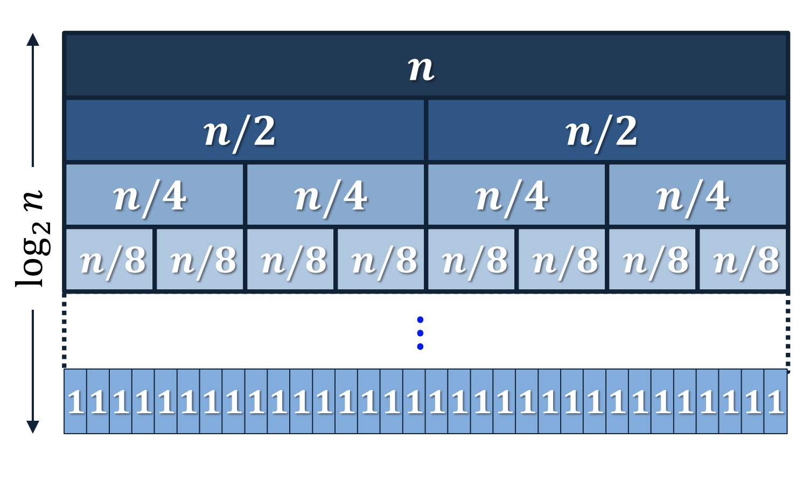
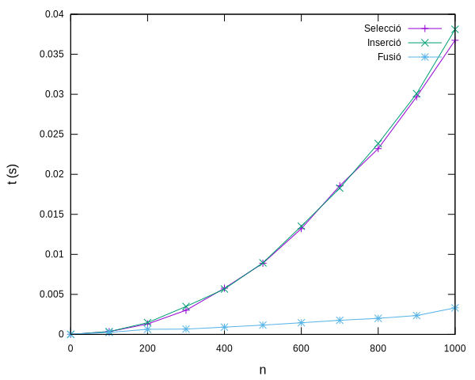
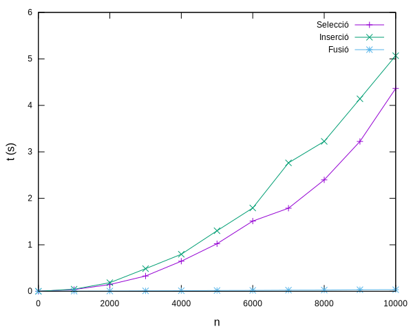

# Ordenació per fusió


En aquesta lliçó es es presenta l'algorisme d'ordenació per fusió, sovint anomenat *merge sort*, en anglès. Aquest algorisme utilitza les tècniques de la recursivitat i la fusió de llistes ordenades per ordenar llistes en temps $\text{O}(n \log n)$, fet que el fa molt més ràpid que els algorismes d'ordenació per selecció i per inserció vistos anteriorment.


## Especificació

Comencem, com de costum, amb l'especificació del problema. La funció que ho farà té la mateixa capçalera que tenien les funcions d'ordenació per selecció i per inserció. Al cap i a la fi, tots tres algorismes resolen el mateix problema, encara que funcionin de forma diferent.

```python
from typing import Any

def ordena(L: list[Any]) -> None:
    """Ordena la llista L en ordre creixent."""
```

La funció `ordena` ordenarà doncs una llista d'elements de qualsevol tipus (però tots del mateix tipus) utilitzant l'algorisme d'ordenació per fusió.


## Idea

Ordenar llistes ben petites és super senzill:

- Què cal fer per ordenar una llista de zero elements? Res!

- Què cal fer per ordenar una llista amb un sol element? Res!

Per tant, pensem una mica més com ordenar llistes amb dos elements o més. Una possible manera d'ordenar una llista llarga `L` és la següent:

1. Primer, partim `L` en dues meitats: la primera meitat és la subllista `L1` i la segona meitat és la subllista `L2`.

2. A continuació, ordenem la subllista `L1`. No us preocupeu encara de com ho fem.

3. A continuació, ordenem la subllista `L2`. No us preocupeu tampoc de com ho fem.

4. Ara, per obtenir la llista `L` original ordenada, només ens cal calcular la fusió ordenades de les dues llistes `L1` i `L2`, que justament acabem d'ordenar.

El diagrama següent mostra esquemàticament aquests passos:



El pas 1 és fàcil de fer. El pas 4 ja sabem com fer-lo: amb l'[algorisme de fusió de llistes ordenades](fusio-llistes-ordenades.html). La pregunta que queda doncs és: com ordenar les dues subllistes? I la resposta, senzillament, és: amb recursivitat! Com que les subllistes sempre són la meitat de grans que la llista original, en algun moment tindran zero o un elements i les podrem ordenar directament (no fent res).

El diagrama següent mostra un exemple d'ordenació d'una llista de vuit elements. Les fletxes grogues il·lustren  els talls, les fletxes marrons il·lustren les fusions.




## Implementació

Per tal d'implementar l'ordenació per fusió, ens cal una funció recursiva que digui quin segment de llista cal ordenar (de manera semblant a com es va fer amb la [cerca binària] (cerca-binaria)) TODO: enllaç. Per això, implementarem aquesta nova funció que ordena els elements de `L` entre la posició esquerra `esq` i la posició dreta `d` (ambdues incloses):

```python
def ordena_per_fusio_rec(L: list[Any], esq: int, dre: int) -> None:
    """Ordena L[esq..dre]."""
```

Per implementar aquesta funció, seguim la idea plantejada anteriorment:

- El cas base es dóna quan el nombre d'elements a ordenar és zero o u. Això és quan `esq >= dre`. En aquest cas no cal fer res.

- El cas recursiu es dóna quan el nombre d'elements a ordenar és dos o més, és a dir, quan `esq < dre`. Llavors cal calcular el punt de tall a mig cavall entre `esq` i `dre`, ordenar recursivament les dues subllistes, i fusionar-les.

Ens queda doncs aquest codi:

```python
def ordena_per_fusio_rec(L: list[Any], esq: int, dre: int) -> None:
    """Ordena L[esq..dre]."""

    if esq < dre:
        mig = (esq + dre) // 2
        ordena_per_fusio_rec(L, esq, mig)
        ordena_per_fusio_rec(L, mig + 1, dre)
        fusiona(L, esq, mig, dre)
```

Aquí, hem relegat la fusió de les dues subllistes a una nova funció anomenada `fusiona`, que és una particularització de la funció de fusió quan es vol fusionar els elements entre `L[esq..mig]` i `L[mig+1..dre]` deixant el resultat novament en `L[esq..dre]`.

```python
def fusiona(L: list[Any], esq: int, mig: int, dre: int) -> None:
    """Ordena L[esq..dre] sabent que L[esq..mig] i L[mig+1..dre] estan ordenats."""

    R = L[0:0]  # com R = [], però així R té el mateix tipus que L
    i, j = esq, mig + 1
    while i <= mig and j <= dre:
        if L[i] <= L[j]:
            R.append(L[i])
            i += 1
        else:
            R.append(L[j])
            j += 1
    R.extend(L[i:mig + 1])
    R.extend(L[j:dre + 1])
    L[esq:dre + 1] = R
```

Fixeu-vos que, com que no es poden fusionar les llistes *in situ*, primer es mouen els elements cap a una llista auxiliar `R` i després, de `R` es tornen a posar al seu lloc en `L`.

Per acabar, la implementació de la funció principal és ben senzilla, només cal posar en marxa la funció recursiva des de la primera posició de la llista fins a la darrera:

```python
def ordena(L: list[Any]) -> None:
    """Ordena la llista L en ordre creixent."""

    ordena_per_fusio_rec(L, 0, len(L) - 1)
```

Per completesa, aquest és el codi complet:

```python
def ordena(L: list[Any]) -> None:
    """Ordena la llista L."""

    ordena_per_fusio_rec(L, 0, len(L) - 1)


def ordena_per_fusio_rec(L: list[Any], esq: int, dre: int) -> None:
    """Ordena L[esq..dre]."""

    if esq < dre:
        mig = (esq + dre) // 2
        ordena_per_fusio_rec(L, esq, mig)
        ordena_per_fusio_rec(L, mig + 1, dre)
        fusiona(L, esq, mig, dre)


def fusiona(L: list[int], esq: int, mig: int, dre: int) -> None:
    """Ordena L[esq..dre] sabent que L[esq..mig] i L[mig+1..dre] estan ordenats."""

    R = L[0:0]  # això és el mateix que R = [] però així mypy no plora
    i, j = esq, mig + 1
    while i <= mig and j <= dre:
        if L[i] <= L[j]:
            R.append(L[i])
            i += 1
        else:
            R.append(L[j])
            j += 1
    R.extend(L[i:mig + 1])
    R.extend(L[j:dre + 1])
    L[esq:dre + 1] = R
```

## Anàlisi

L'anàlisi del temps de l'ordenació per fusió és diferent de les anàlisis que ja hem fet perquè aquest cop tenim un algorisme recursiu. Però no és difícil. Sigui $T(n)$ el temps que triga l'algorisme d'ordenació per fusió per ordenar una llista amb $n$ elements.

Pel cas base, sabem que $T(0) = \O(1)$ i $T(1)=\O(1)$, ja que no cal fer res (però cal esmerçar un cert temps per veure que no cal fer res, per això no són zero). Pel cas recursiu, tenim que per ordenar una llista amb $n$ elements, cal ordenar dues llistes amb $n/2$ elements (els arrodoniments són menyspreables) i fusionar-les. La fusió de dues llistes amb $n$ elements en total ja sabem que triga $\O(n)$ passos. Per tant, obtenim la recurrència

$$
T(n) = 2T(n) + \O(n),
$$

que ja havíem vist que tenia solució $T(n)= \O(n\log n)$.




## Resultats experimentals

Igual que hem fet pels algorismes d'ordenació per selecció i per inserció, podem mesurar quan triga l'algorisme d'ordenació per fusió per ordenar llistes aleatòries d'$n$ elements, per a diferents $n$.

La gràfica següent mostra els temps per a ordenar llistes de fins a 1000 elements amb els tres algorismes:



Es pot comprovar que l'ordenació per fusió ja és molt més ràpida que les ordenacions per inserció i per selecció, que funcionen de forma semblant.

Les diferències, per llistes fins a 10000 elements es fan encara més grans:



El fet que per més dades selecció sigui més ràpid que inserció esdevé irrellevant. En qualsevol cas, aquestes mesures fan palesa la diferència entre algorismes $\O(n^2)$ i algorismes $\O(n\log n)$. La major complexitat de l'ordenació per fusió reporta bons beneficis respecte la senzillesa de les ordenacions per inserció i selecció.


## Inconvenients de l'algorisme d'ordenació per fusió

Malgrat que l'algorisme d'ordenació per fusió és molt més ràpid que els algorismes d'ordenació per selecció i per inserció, aquest presenta encara un defecte: necessita més memòria.

En efecte, cada cop que es fusionen dues subllistes, el resultat es guarda temporalment en una llista auxiliar. D'una banda, això representa una pèrdua de temps però, sobretot, un ús de memòria més gran. Fixeu-vos que quan es fa la darrera fusió, entre les dues meitats de la llista original, calen tants elements auxiliars com elements cal ordenar. Això vol dir que, a la pràctica, la llargada de la llista més llarga que es podrà ordenar serà (essencialment), la que càpiga a la meitat de tota la memòria de l'ordinador, perquè l'altra meitat de la memòria haurà de guardar la llista auxiliar.


## Nota històrica

::: tip John von Neumann


La invenció de l'algorisme d'ordenació per fusió s'atribueix a John von Neumann, l'any 1945. Von Neumann fou un científic, físic i matemàtic estatunidenc, d'origen hongarès, que va fer importants contribucions en matemàtiques, física, economia i informàtica. L'arquitectura de von Neumann és la d'un ordinador programable amb una memòria que guarda tant les dades com les instruccions.
:::


<Autors autors="jpetit"/>
