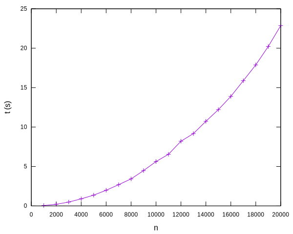
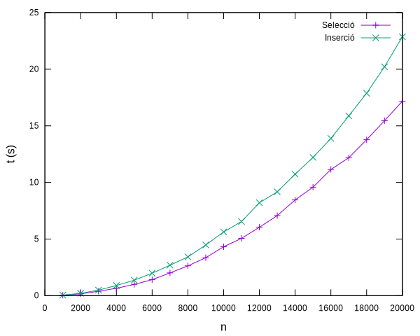
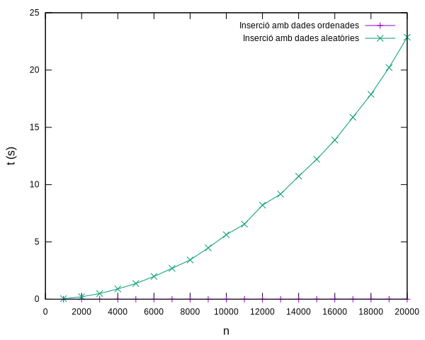
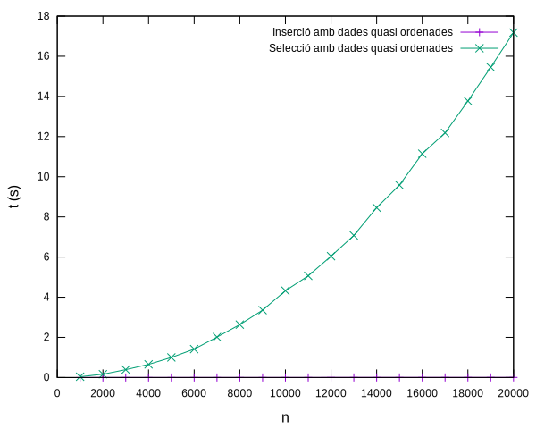

# Ordenació per insersió


En aquesta lliçó es presenta un altre algorisme d'ordenació, anomenat algorisme d'ordenació per inserció. Per aquest algorisme es dóna primer la idea intuïtiva del seu funcionament, després s'implementa, es presenten unes proves per comprovar-ne el seu bon funcionament, es reflexiona sobre l'invariant del programa obtingut i,finalment, s'estudia la seva eficiència, tant des del punt de vista empíric com matemàtic.


## Ordenació per inserció: idea

De nou, com ho podem fer per ordenar els elements d'una llista?

Comencem suposant que tenim una llista `S` ordenada, i que li volem afegir, ordenadament, un nou element `x`. Per exemple, si `S = [10, 20, 30, 40]` i `x = 15`, `S` hauria d'esdevenir `[10, 15, 20, 30, 40]`. Aquesta acció s'anomena una **inserció ordenada** Com la podríem fer?

Doncs, primer, es podria afegir el nou element al final de la llista i, després, "empenye'l" cap a l'esquerra tant com calgui fins deixar-lo al seu lloc. Aquests són els passos aplicats a l'exemple anterior:

`[10, 20, 30, 40]`<br>
➡️ `[10, 20, 30, 40, 15]`<br>
➡️ `[10, 20, 30, 15, 40]`<br>
➡️ `[10, 20, 15, 30, 40]`<br>
➡️ `[10, 15, 20, 30, 40]`<br>
✅

Fixeu-vos que cal deixar d'empènyer `x` quan arriba al principi de la llista o quan l'element que té a la seva dreta ja és menor o igual que ell. Per empenye'l, només cal intercanviar-lo amb el seu veï esquerre.

Per tant, per ordenar una llista qualsevol, l'únic que cal fer és inserir en ordre cadascun dels seus elements en una llista ordenada inicialment buida.

Aquest mètode per ordenar s'anomena **l'algorisme d'ordenació per inserció**, en el sentit que cada cop s'insereix un element ordenadament.


## Implementació

Implementarem l'algorisme d'ordenació per inserció descrit anteriorment en dos passos. En el primer pas, el resultat de l'ordenació serà una nova llista:

```python
T = TypeVar('T')

def ordenacio_per_insercio(L: list[T]) -> list[T]:
    """Retorna una còpia de la llista L en ordre creixent."""

    S: list[T] = []
    for x in L:
        insereix_ordenadament(S, x)
    return S
```

Com hem dit, començant amb una llista ordenada `S` buida, s'insereix ordenadament cada element `x` de la llista `L` amb l'acció `insereix_ordenadament`. Al llarg de tot el bucle `S` està ordenada, per tant, al final conté tots els elements de `L` en ordre.

L'acció `insereix_ordenadament` és la que realitza la feina bruta:

```python
def insereix_ordenadament(S: list[T], x: T) -> None:
    """Insereix ordenadament x en S. Prec: S està ordenada."""

    n = len(S)
    S.append(x)
    i = n
    while i > 0 and S[i - 1] > S[i]:
        S[i - 1], S[i] = S[i], S[i - 1]
        i -= 1
```

Aquí `S` és una llista ordenada. Primer, amb un `.append`, s'afegeix l'element `x` al seu final. Després, aquest element s'empeny cap a l'esquerra, intercanviant-lo amb el seu element a l'esquerra, fins que arribi al principi o trobi un element més petit o igual que ell.

Visca, ja tenim llest un segon algorisme d'ordenació!

Malauradament, aquesta primera versió d'ordenació per selecció usa més memòria de la que cal, ja que cada element de la llista a ordenar queda duplicat a la llista ordenada. Per això, a continuació en fem una segona versió on els elements de la llista es mouen dins de la pròpia llista. Fixeu-vos en el canvi de la capçalera i de l'especificació:

```python
def ordena_per_insercio(L: list[T]) -> None:
    """Ordena la llista L en ordre creixent."""
```

Per implementar-la, organitzarem la llista en `L` en dos segments: per a un valor enter `i`, el segment esquerre `L[:i]` estarà ordenat i el segment dret `L[i:]` contindrà la resta d'elements a ordenar. Aquí, `L[:i]` només està ordenada, però els seus elements no tenen perquè encara estar a la seva posició definitiva (potser perquè, per exemple, el mínim de `L` és a `L[i:]`).

Al principi, `i` valdrà `1`, de forma que el segment esquerre serà una llista amb un sol element. Com que aquest segment només té un element, segur que no està desordenat. Pas a pas, s'inserirà ordenadament l'element `L[i]` a `L[:i]`, fins que `i == n`. En aquest punt, `L[:i]` és tota la llista `L` i ja estarà completament ordenada. Aquesta és la implementació corresponent:

```python
def ordena_per_insercio(L: list[T]) -> None:
    """Ordena la llista L en ordre creixent."""

    n = len(L)
    for i in range(1, n):
        insereix_ordenadament(L, i)
```

Ara, l'acció `insereix_ordenadament(L, i)` ha d'inserir ordenadament l'element a la posició `i` en el segment `L[:i]`, sabent que aquest està ordenat. Es pot implementar així:

```python
def insereix_ordenadament(L: list[T], i: int) -> None:
    """Insereix l'element i de L en L[:i], sabent que L[:i] està ordenat."""

    x = L[i]
    j = i
    while j > 0 and L[j - 1] > x:
        L[j] = L[j - 1]
        j -= 1
    L[j] = x
```

En aquesta ocasió, enlloc de fer molts intercanvis per anar empenyent el valor a inserir cap a l'esquerra, primer n'hem fet una còpia i hem anat movent els elements cap a la dreta, fins a trobar el punt on deixar `x`. Això redueix el nombre total d'assignacions.

Això completa la segona versió de l'algorisme d'ordenació per inserció. Comproveu que funciona correctament per a totes les possibles permutacions d'`n` elements per a `n` prous petits com ho vam fer amb ordenació per selecció.


## Invariants

!!!Falta acabar aquesta secció
amb dibuixets dels invariants i una animació de la dinàmica.


## Anàlisi de l'eficiència

Per tal de tenir una estimació de quan triga l'algorisme d'ordenació per inserció, anem a mesurar quan triga a ordenar llistes d'`n` enters aleatoris per `n` entre 1000 i 20000 igual que ho vam fer amb l'algorisme d'ordenació per selecció.

Les mesures obtingudes al meu ordinador són aquestes:

```text
1000 0.049452549079433084
2000 0.2106501250527799
3000 0.49151636590249836
4000 0.8998861650470644
5000 1.368981130886823
6000 1.9884442759212106
7000 2.6924390220083296
8000 3.426594164920971
9000 4.4814124901313335
10000 5.6270266158971936
11000 6.551390665117651
12000 8.207069989992306
13000 9.175543326186016
14000 10.730993234086782
15000 12.211056501138955
16000 13.888134208973497
17000 15.877819273155183
18000 17.88175543700345
19000 20.214374277042225
20000 22.863428544951603
```

I aquesta és la seva representació gràfica:



Com veieu, el temps per ordenar llistes de nombres aleatoris amb l'algorisme d'ordenació per inserció també sembla ser quadràtic. Ara bé, en comparació amb selecció, sembla anar una mica mès lent: Aquesta gràfica compara les dues corbes:




Ara bé, mireu què passa quan s'usa l'algorisme d'ordenació per inserció per ordenar llistes d'enters que ja es troben ordenades:



Sorprenentment, inserció ordena super ràpidament llistes que ja estan ordenades. D'acord... o té massa mèrit, però si creem llistes que estan, força ordenades, la seva velocitat és molt ràpida, mentre que a selecció això no l'afecta. Vegeu-ho a la gràfica següent on es comparen el temps de selecció i inserció per a llistes quasi ordenades creades permutant a l'atzar 10 parells de posicions de `range(n)`:



Es pot observar que mentre que el temps de l'algorisme d'ordenació per selecció no canvia respecte llistes aleatòries o quasi ordenades, el temps per inserció millora molt amb llistes quasi ordenades.

Per entre millor què està passant, haurem de recórrer a l'anàlisi matemàtica dels algorismes.

En primer lloc, recordeu que el temps $T_S(n)$ per ordenar una llista d'$n$ elements amb l'algorisme d'ordenació per selecció venia donat per

$$
    T_S(n) = \sum_{i=1}^{n-1} \sum_{j=i+1}^n \text{O}(1) = \text{O}(n^2).
$$

Aquest temps és, essencialment, sempre el mateix: no depèn de l'ordenació inicial dels elements de la llista.

Ara, mirem de calcular asimptòticament el temps $T_I(n)$ per ordenar una llista d'$n$ elements amb l'algorisme d'ordenació per inserció. Pel bucle més extern, no hi ha problema, fa $n-1$ iteracions, que, asimptòticament parlant, són el mateix que $n$. Ara bé, quantes iteracions fa el bucle intern de `insereix_ordenadament`? Doncs no ho podem saber del cert. Depenent de com estiguin les dades, l'element que s'insereix s'haurà d'empènyer més o menys cap a l'esquerra.

En aquests casos, convé mirar-se què passa en el cas millor, en el cas pitjor i en el cas mig.

- El cas millor correspon al cas on el nombre de posicions que cal empènyer l'element a la posició `i` és mínim. I això passa justament quan no cal empènyer-lo cap a l'esquerra en absolut, és a dir, quan ja és més gran que tots els de la seva esquerra. I, perquè això passi a cada bucle, vol dir que el nou element a inserir sempre és el més gran de tots els de la seva esquerra, és a dir, quan la llista ja estava ordenada! I, per tant, en aquest cas, el nombre de passos realitzats per l'algorisme en el cas millor és $\text{O}(n)$.

- El cas millor correspon al cas on el nombre de posicions que cal empènyer l'element a la posició `i` és màxim. I això passa justament quan cada cop cal empènyer-lo fins a l'extrem esquerre de la llista, és a dir, quan és més petit que tots els de la seva esquerra. I, perquè això passi a cada bucle, vol dir que el nou element a inserir sempre és el més petit de tots els de la seva esquerra, és a dir, quan la llista estava ordenada del revés! Com que, en aquest cas, cal fer $i$ passos a cada inserció, per $i$ de 2 a $n$, el nombre total de passos realitzats per l'algorisme en el cas pitjor és $\text{O}(\sum_{i=1}^n i) = \text{O}(n^2)$.

- Pel cas mig, cada element a la posició $i$ s'haurà de desplaçar, em mitjana, $i/2$ passos a l'esquerra. Crec que en aquest cas la intuïció és clara i correcta, però caldria treballar una mica més el tema probabilístic per formalitzar-ho. Assumint-ho, el nombre mitjà de passos realitzats per l'algorisme és $\text{O}(\sum_{i=1}^n i/2) = \text{O}(\tfrac12n^2) = \text{O}(n^2)$.

La taula següent mostra el cost de l'algorisme d'ordenació per selecció en els tres casos:

|cas|cost|
|---|---|
|cas pitjor|$\text{O}(n^2)$|
|cas mig|$\text{O}(n^2)$|
|cas millor|$\text{O}(n)$|

L'estudi del cas de les llistes quasi ordenades porta més feina, però es pot veure que, per a una definició adient de llista quasi ordenada, el cost és lineal. Per tant, encara que selecció funcioni més ràpidament en el cas mig que inserció, inserció és el mètode ideal per ordenar llistes quasi ordenades.

En quines situacions apareix la necessitat d'ordenar llistes quasi ordenades? Aquí en teniu una: A les oficines dels bancs, es van pagant i recollint els talons bancaris a mesura que els clients els ingressen. Així doncs, aquesta llista de talons està ordenada per hora d'ingrés. Però de fet, aquesta llista de talons està *quasi ordenada* per hora d'expedició del taló, per la senzilla raó de que, quan algú reb un taló, sol córrer a ingressar-lo al banc abans que l'emissor es quedi sense fons!


<Autors autors="jpetit"/>
