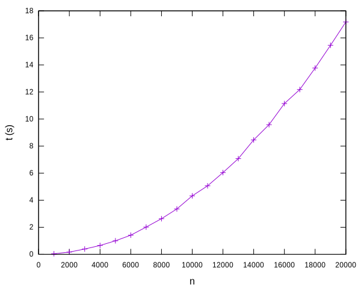

# Ordenació per selecció


En aquesta lliçó es presenta el problema de l'ordenació i un primer algorisme per resoldre'l, anomenat algorisme d'ordenació per selecció. Per aquest algorisme es dóna primer la idea intuïtiva del seu funcionament, després s'implementa, es presenten unes proves per comprovar-ne el seu bon funcionament, es reflexiona sobre l'invariant del programa obtingut i,finalment, s'estudia la seva eficiència, tant des del punt de vista empíric com matemàtic.


## El problema de l'ordenació

Ordenar una llista consisteix a reordenar els seus elements de forma que aquests quedin en ordre creixent. Evidentment, la funció predefinida `sorted` ja realitza aquesta feina, però estudiar diferents algorismes d'ordenació ens aportarà coneixements d'algorísmia que seran útils en moltes altres ocasions.

La capçalera habitual d'una acció per ordenar una llista d'enters podria ser aquesta:

```python
from typing import Any

def ordena(L: list[Any]) -> None:
    """Ordena la llista L en ordre creixent."""
```

Per exemple, si `llista = [40, 53, 40, 10, 22]`, després de cridar `ordena(llista)`, `llista` hauria de valer `[10, 22, 40, 40, 53]`. I si `mots = 'la pela es la pela'.split()`, després de cridar `ordena(mots)`, `mots` hauria de valer `['es', 'la', 'la', 'pela', 'pela']`.


## Ordenació per selecció: idea

Com ho podem fer per ordenar els elements d'una llista?

Una manera de començar és preguntar-se quin hauria de ser el primer element de la llista. I la resposta és evident: el primer element de la llista ha de ser el més petit de tota la llista.

Per tant, si l'element més petit de la llista es troba a la posició `p`, és qüestió d'assignar-lo a la primer posició de la llista (la posició `0`). Però compte... A la primera posició de la llista ja hi ha un element, i no el podem perdre! Què fer amb ell? Doncs posar-lo a la posició `p`. Per tant, el que cal és intercanviar els elements de les posicions `0` i `p`: `L[0], L[p] = L[p], L[0]`.

Un cop fet això, ja tenim l'element més petit de la llista al lloc on toca. Per tant, es tracta de no tocar-lo més!

Com continuar? Doncs ara ens podem preguntar quin hauria de ser el segon element de la llista. I la resposta és fàcil: el segon element més petit de la llista. I trobar-lo no és difícil: Donat que l'element més petit ja és a la posició `0`, el segon element més petit de la llista és el més petit dels de la subllista que comença a la posició `1`.

Així, si l'element més petit de `L[1:]` es troba a la posició `p`, ara cal intercanviar-lo amb el de la posició `1`.

Un cop fet això, ja tenim els dos elements més petits de la llista al lloc on els toca. Per no espatllar-ho, no cal tocar-los més!

I ara, es pot anar estenent aquesta idea, fent que l'element a la posició `i` s'intercanvii amb l'element més petit de la subllista `L[i:]`, per valors de `i` cada cop més grans.

Quan cal acabar el procés? Doncs fixeu-vos que quan els `n - 1` elements de la llista ja estiguin ben col·locats, el valor `n`-èsim també ho haurà d'estar, perquè és el més gran. Per tant, cal iterar el procés descrit per les `i` des de `0` a `n - 2` (incloses).

La taula següent mostra el procés d'ordenació sobre la llista `[4, 3, 7, 8, 2, 5, 1, 9]`:

|`i`|`L`|
|-|---|
|0|`4  3  7  8  2  5  1  9`|
|1|`1  3  7  8  2  5  4  9`|
|2|`1  2  7  8  3  5  4  9`|
|3|`1  2  3  8  7  5  4  9`|
|4|`1  2  3  4  7  5  8  9`|
|5|`1  2  3  4  5  7  8  9`|
|6|`1  2  3  4  5  7  8  9`|
|7|`1  2  3  4  5  7  8  9`|

!!! Buscar un millor exemple i posar una animació

Aquest mètode per ordenar s'anomena **l'algorisme d'ordenació per selecció**, en el sentit que cada cop es selecciona l'element més petit dels que encara no s'han ordenat. També es podria ordenar la taula de dreta a esquerra, buscant cada cop la posició de l'element més gran de la part esquerra de la llista.


## Implementació

Per implementar en Python l'algorisme d'ordenació per selecció descrit anteriorment, començarem amb una funció auxiliar que retorna la posició de l'element més petit d'una llista començant en una posició donada:

```python
def posicio_minim(L: list[Any], i: int) -> int:
    """Retorna la posició de l'element més petit de L[i:] amb 0 ≤ i < len(L)."""

    n = len(L)
    p = i
    for j in range(i + 1, n):
        if L[j] < L[p]:
            p = j
    return p
```

Per a una llista `L` i una posició `i`, aquesta funció retorna una posició `p` que conté l'element més petit de `L[i:]`. En el cas que l'element més petit aparegués més d'un cop, en retorna la posició de la primera ocurrència, però n'hi ha prou en que en retorni una de qualsevol.

El codi és senzill: `p` comença sent `i` i, per totes les posicions `j` de `i + 1` fins al final de la llista, si la posició `j` conté un valor més petit que el de la posició `p`, `p` pren per valor `j`.

Fixeu-vos que `posicio_minim` retorna la posició del mínim, no del valor mínim.

Amb això, ja podem donar forma a l'acció que ordena per selecció:

```python
def ordena_per_seleccio(L: list[Any]) -> None:
    """Ordena la llista L en ordre creixent."""

    n = len(L)
    for i in range(n - 1):
        p = posicio_minim(L, i)
        L[i], L[p] = L[p], L[i]
```

Ara, per cada posició `i` de la llista (des de la primera fins a l'antepenúltima), es busca la posició `p` del mínim de `L` a partir de la posició `i` amb la funció `posicio_minim` i s'intercanvien els elements en `L[i]` i `L[p]`.

Fantàstic!


## Comprovació

Com podem fer per comprovar que la implementació anterior funciona correctament? Una primera prova consistiria en cridar `ordena_per_seleccio` per algunes llistes generades a mà i comprovar que el resultat queda ordenat.

Una manera més sistemàtica consistiria en provar d'ordenar totes les possibles permutacions de les llistes de `0`  a `n - 1`, per a tots els valors de `n` de zero en endavant, mentre sigui factible. El programa següent implementa aquesta idea, per a llistes fins a mida 10:

```python
import itertools

def main():
    for n in range(11):
        llista = range(n)
        for permutacio in itertools.permutations(llista):
            permutacio = list(permutacio)
            ordena_per_seleccio(permutacio)
            assert permutacio == list(range(n))
```

Aquí, utilitzem el mòdul `itertools` que proporciona la funció `permutations` que genera totes les permutacions d'una llista donada. Cada permutació és ordenada amb `ordena_per_seleccio` i es comprova que el resultat sigui el que toca. El programa és més pesat del compte perquè cal anar convertint els `range` i `permutations` a llistes de forma explícita, en fi.

Al meu ordinador, aquesta comprovació triga uns 43 segons i confirma que totes les permutacions de llistes de fins a 10 elements són ordenades correctament (això són més de 4 milions de llistes diferents). Donat que l'algorisme d'ordenació per selecció no funciona directament amb els valors a la llista sinó amb les seves relacions d'ordre a través de comparacions, aquesta prova dóna una gran confiança en la implementació realitzada.


## Invariants

!!!Falta acabar aquesta secció
amb dibuixets dels invariants i una animació de la dinàmica.


## Anàlisi de l'eficiència

Per tal de tenir una estimació de quan triga l'algorisme d'ordenació per selecció, anem a mesurar quan triga a ordenar llistes d'`n` enters aleatoris per `n` entre 1000 i 20000. Aquesta programa ho fa:

```python
import random
import time

def main():
    for n in range(1000, 20001, 1000):
        llista = [random.randint(0, n) for _ in range(n)]
        t1 = time.perf_counter()
        ordena_per_seleccio(llista)
        t2 = time.perf_counter()
        print(n, t2 - t1)
```

Aquí, la comprensió `[random.randint(0, n) for _ in range(n)]` calcula una llista d'`n` enters aleatoris entre `0` i `n - 1` que s'ordena per selecció. Per mesurar quan triga l'ordenació, es pregunta quin és el temps abans (`t1`) i després (`t2`) amb dues crides a `time.perf_counter`, que és una funció que retorna amb força precisió el temps (en segons) transcorregut des d'algun moment arbitrari (potser des que s'ha engegat l'ordinador). D'aquesta forma, la diferència entre `t2` i `t1` proporciona el temps dins d'`ordena_per_seleccio`.

Les mesures obtingudes al meu ordinador són aquestes:

```text
1000 0.041068274062126875
2000 0.16465072496794164
3000 0.3921193410642445
4000 0.6544962290208787
5000 0.9996729209087789
6000 1.4148316180799156
7000 2.014072685968131
8000 2.6352400830946863
9000 3.3545596678741276
10000 4.323136743158102
11000 5.063071436015889
12000 6.041609802050516
13000 7.075020804069936
14000 8.45795211289078
15000 9.584192899987102
16000 11.146021032007411
17000 12.182564155897126
18000 13.772768988041207
19000 15.452756477054209
20000 17.17791852611117
```

I aquesta és la seva representació gràfica:



Fixeu-vos que, essencialment, cada cop que es dobla la mida de la llista, es multiplica per quatre el temps necessari per ordenar-la. Per tant el creixement sembla ser quadràtic i, també, la corba sembla exhibir una paràbola.

Per poder analitzar millor l'algorisme, ens pot anar bé desplegar la funció `posicio_minim` dins d'`ordena_per_seleccio`, cosa que no costa gens:

```python
def ordena_per_seleccio(L: list[Any]) -> None:
    n = len(L)
    for i in range(n - 1):
        p = i
        for j in range(i + 1, n):
            if L[j] < L[p]:
                p = j
        L[i], L[p] = L[p], L[i]
```

Totes les instruccions elementals d'aquest programa tenen un cost independent d'`n`, la mida de la llista. Per tant, el cost asimptòtic de l'acció anterior és el mateix que el d'aquest tros de codi en funció d'`n`:

```python
for i in range(n - 1):
    for j in range(i + 1, n):
        pass
```

Per tant, podem descriure el temps $T(n)$ que triga `ordena_per_seleccio` sobre una llista de llargada $n$ d'aquesta forma:

$$
    T(n) = \sum_{i=1}^{n-1} \sum_{j=i+1}^n \text{O}(1).
$$

Aquesta fórmula reflecteix que la instrucció més aniuada (`pass`) s'ha de comptar tants cops com iteracions fa el bucle de la variable $j$, que s'ha de comptar tants cops com iteracions fa el bucle de variable $i$.

I, per algun lloc (❗️Enllaç), ja havíem vist que aquests sumatoris es poden simplificar a

$$
    T(n) = \text{O}(n^2),
$$

fet que ens confirma que el temps de l'algorisme d'ordenació per selecció creix quadràticament.

El fet que l'algorisme d'ordenació per selecció trigui un temps quadràtic no és per tirar coets... Més endavant veurem algorismes d'ordenació més ràpids, paciència!


<Autors autors="jpetit"/>
