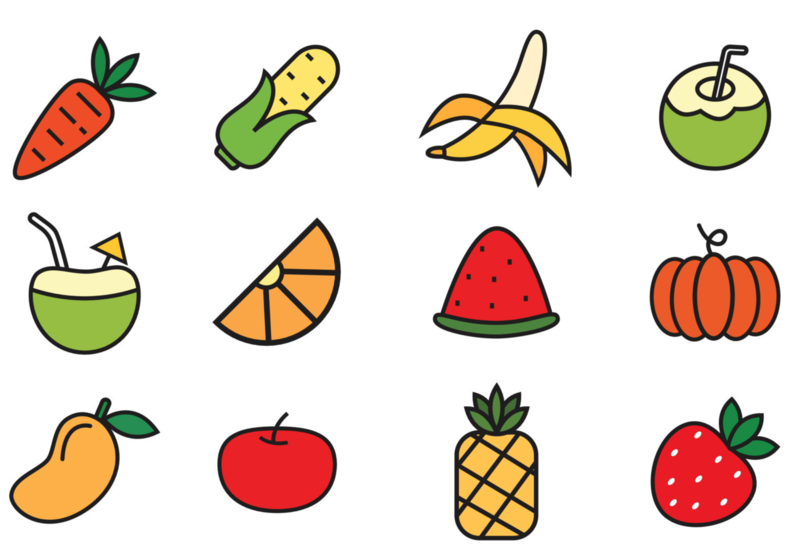
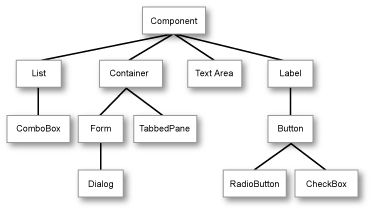

# Herència



Aquesta lliçó...

## Concepte d'herència

Considerem que en el nostre programa tenim una classe per representar animals:

```python
class Animal:

    nom: str
    edat: int

    def __init__(self, nom: str, edat: int):
        self.nom = nom
        self.edat = edat

    def fer_un_soroll(self):
        print('grr')
```

Aquest en seria un senzill exemple d'ús:

```python
gat = Animal('Mixet', 3)
gos = Animal('Blaqui', 3)
gat.fer_un_soroll()            # escriu grr
gos.fer_un_soroll()            # escriu grr
```

Però potser, passat un temps, volem fer més realista el comportament dels gossos i els gats: els gossos lladren fent _bub_, però els gats miolen fent _mèu_. Així que podríem modificar la classe `Animal` d'aquesta forma:

```python
class Animal:

    nom: str
    edat: int
    tipus: str  # gat o gos

    def __init__(self, nom: str, edat: int, tipus: str):
        assert tipus in ['gat', 'gos']
        self.nom = nom
        self.edat = edat
        self.tipus = tipus

    def fer_un_soroll(self):
        if self.tipus == 'gat':
            print('mèu')
        else:
            print('bub')
```

Psè... Però quan calguin més tipus d'animals, haurem de repassar de nou el codi dins de la classe `Animal`. En aquest cas és prou senzill, però amb classes amb molts més mètodes, de seguida es fa pesat i repetitiu i, per tant, és fàcil deixar-se casos. I ningú té ganes de llegir codis amb tants condicionals.

En aquests casos, el mecanisme d'**herència** és la solució. L'herència és un concepte fonamental en la programació orientada a objectes que permet la creació de noves classes basades en classes ja existents.

Amb herència, començaríem definint la classe `Animal` com al principi:

```python
class Animal:

    nom: str
    edat: int

    def __init__(self, nom: str, edat: int):
        self.nom = nom
        self.edat = edat

    def fer_un_soroll(self):
        print('grr')
```

i, a partir d'ella, definiríem una nova classe `Gat` i una nova classe `Gos`:

```python
class Gat(Animal):

    def fer_un_soroll(self):
        print('meu')


class Gos(Animal):

    def fer_un_soroll(self):
        print('bub')
```

La sintàxi `class Gat(Animal)` i `class Gos(Animal)` indica que la classe `Gat` i la classe `Gos` hereten de la classe `Animal`. Això reflecteix el fet que els gats i els gossos són animals. A nivell de Python, això també vol dir que els objectes de la classe `Gat` tenen els mateixos atributs que els de la classe `Animal`, i el mateix pels objectes de la classe `Gos`. Per tant, podem fer quelcom com ara

```python
gat = Gat('Mixet', 3)
print(gat.edat)         # escriu 3
```

perquè cada gat (i cada gos), pel fet de ser animal, té un atribut `edat` i un atribut `nom`.

Ara bé, la definició de les classes ha **redefinit** el mètode `fer_un_soroll`, de manera que cada objecte ara farà el soroll que li correspon segons el seu tipus:

```python
animal = Animal('Campió', 6)
gat = Gat('Mixet', 3)
gos = Gos('Blaqui', 4)
animal.fer_un_soroll()         # grr
gat.fer_un_soroll()            # meu
gos.fer_un_soroll()            # bub
```

Fixeu-vos que, com que un objecte de tipus `Animal` no ha estat particularitzat, aquest continua fent _grr_.

Redefinir els mètodes de les classes que s'hereden no és necessari, però quan es fa, cal respectar la mateixa interfície.

Les classes heretades poden tenir nous mètodes, però aquests són específics als elements d'aquell tipus. Per exemple, els gats poden filar, mentre que els gats no. Per tant, si ara afegim el mètode `filar` a `Gat`:

```python
class Gat(Animal):

    def fer_un_soroll(self):
        print('meu')

    def filar(self):
        print('ron-ron')
```

podrem aplicar aquesta operació als gats, però no als gossos:

```python
gat = Gat('Mixet', 3)
gos = Gos('Blaqui', 4)
gat.filar()            # ron-ron
gos.filar()            # ❌ AttributeError: 'Gos' object has no attribute 'filar'
```

L'herència permet doncs que noves classes (s'anomenen classes **filles** o **derivades**) heretin els atributs i mètodes de les classes existents (anomenades classes **pare**, **mare** o **base**). Això implica que les classes filles poden reutilitzar i estendre el comportament de les classes pare, evitant la duplicació de codi. A més a més, l'herència facilita l'organització jeràrquica del codi, ja que les classes poden ser agrupades en categories més generals (classes pare) i categories més específiques (classes filles). Aquesta estructura jeràrquica millora la comprensibilitat del codi i permet fer canvis en les classes pare que afectaran automàticament totes les classes filles, afavorint la coherència i mantenibilitat del sistema.

## Herència i polimorfisme

Un gran avantatge de l'herència és que les funcions poden tractar objectes sense saber quin és exactament el seu tipus però invocant les funcions que corresponen al seu tipus.

Per a veure'n la utilitat en un exemple concret, tornem a traçar la jeraquia de classes anterior:

```python
class Animal:
    def fer_un_soroll(self):
        print('grr')

class Gat(Animal):
    def fer_un_soroll(self):
        print('meu')

class Gos(Animal):
    def fer_un_soroll(self):
        print('bub')
```

Suposem que tenim una funció que fa fer soroll a un animal un determinat nombre de vegades:

```python
def fer_molts_sorolls(animal: Animal, cops: int) -> None:
    for _ in range(cops):
        animal.fer_un_soroll()
```

En aquest cas, és evident que el codi següent

```python
animal = Animal('Campió', 6)
fer_molts_sorolls(animal, 3)
```

escriurà _grr_, _grr_, _grr_. Però el que no és tant clar és que, en virtud de que els gats i gossos són animals, la funció `fer_molts_sorolls` també es pot aplicar a objectes de tipus `Gat` i `Gos`! I, a més, el mètode `fer_un_soroll` que invoca la funció `fer_molts_sorolls` correspon al de l'objecte que reb:

```python
gat = Gat('Mixet', 3)
gos = Gos('Blaqui', 4)
fer_molts_sorolls(gat, 3)       # mèu, mèu, mèu
fer_molts_sorolls(gos, 3)       # bub, bub, bub
```

Això és genial, perquè malgrat que la funció `fer_molts_sorolls` s'ha escrit per a animals, el seu comportament final depèn del tipus d'animal que se li passa com a paràmetre. Gràcies a l'herència, es poden doncs escriure funcions que manipulen objectes de tipus dels quals encara no se'n saben tots els detalls.

Aquest concepte s'anomena **polimorfisme**. El polimorfisme és doncs la capacitat d'objectes de diferents classes de respondre al mateix mètode o missatge de manera única i coherent, permetent un tractament uniforme malgrat les diferències particulars de cada classe.

Compte: aquest comportament només es pot realitzar per a classes derivades. Si tenim una funció que accepta objectes de tipus `Gat`, aquesta pot pressuposar que els gats (i totes les classes que en derivin) tenen el mètode `filar`, però els objectes de tipus `Gos` no el tenen i, per tant, no es poden passar com a paràmetre. Aquest error es pot comprovar fàcilment amb mypy o PyLance: POSAR IMATGE. Si s'obvia la detecció d'errors de tipus, aquest error es manifestarà en temps d'execució.

El polimorfisme no només funciona amb funcions, sinó també amb mètodes. Per exemple, si tenim una classe `Animal` amb un mètode `fer_un_soroll` i una classe `Gat` que redefineix aquest mètode, podem cridar `fer_molts_sorolls` sobre un objecte de tipus `Gat` i el mètode `fer_un_soroll` que s'executarà serà el de la classe `Gat`:

```python
class Animal:
    def fer_un_soroll(self):
        print('grr')
    def fer_molts_sorolls(self, cops: int) -> None:
        for _ in range(cops):
            self.fer_un_soroll()

class Gat(Animal):
    def fer_un_soroll(self):
        print('meu')

class Gos(Animal):
    def fer_un_soroll(self):
        print('bub')
```

En efecte:

```python
animal = Animal()
animal.fer_molts_sorolls(3)    # grr, grr, grr
gat = Gat()
gat.fer_molts_sorolls(3)       # meu, meu, meu
gos = Gos()
gos.fer_molts_sorolls(3)       # bub, bub, bub
```

De fet, el polimofisme no és una característica dels mètodes o de les funcions, sinó dels objectes.

## Jerarquia de classes

És molt habitual que una classe base doni lloc a més d'una classe base. Per exemple `Gat`, `Gos` i `AnimalDeGranja` poden derivar d'`Animal`. I `Vaca` i `Ovella` poden derivar, al seu torn, d'`AnimalDeGranja`.

Això es sol representar d'aquesta forma:



Quan usem llibreries, és molt habitual trobar-se amb jeraquies de classes molt complexes, com per exemple aquesta per als elements gràfics d'un app:


## Herència múltiple

L'**herència múltiple** és un concepte de la programació orientada a objectes on una classe pot heretar atributs i mètodes de dues o més classes pare. Aquesta característica permet a una nova classe obtenir característiques de diverses fonts, combinant-les en una sola classe filla.

Un exemple en Python podria ser una classe que hereta de dues classes pare diferents:

```python
class Forma:
    ...

class Color:
    ...

class FormaOmplerta(Forma, Color):
    ...

```

En aquest exemple, la classe `FormaOmplerta` hereta tant de la classe `Forma` com de la classe `Color`. Això significa que una forma omplerta creada amb aquesta classe pot accedir als mètodes de les formes i als mètodes dels colors. Igualment, una `FormaOmplerta` es pot passar com a paràmetre real de qualsevol funció que rebi un paràmetre formal de tipus `Forma` i de qualsevol funció que rebi un paràmetre formal de tipus `Color`.

L'herència múltiple és un tema avançat: Els perills de l'herència múltiple inclouen la complexitat i la dificultat de mantenir el codi, ja que múltiples fonts de comportament podrien col·lisionar o causar conflictes. A més a més, pot donar lloc a una dependència excessiva entre les classes, dificultant ls modificacions futures i reduint la flexibilitat del sistema. La jerarquia d'herència múltiple també pot provocar problemes de llegibilitat i comprensió, especialment en projectes grans.

<Autors autors="jpetit"/>
