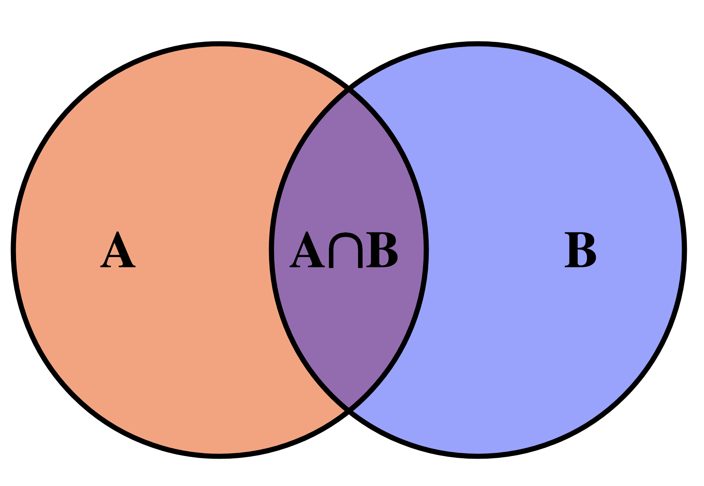

# Conjunts



Aquesta lliçó introdueix un nou tipus de dades: els conjunts. Els conjunts de Python són molt semblants als que s'usen en matemàtiques i per això el seu ús és molt senzill i intuïtiu. Gràcies a l'ús de conjunts, els programes poden ser més expressius i eficients que les seves alternatives amb llistes.

Aquesta lliçó també alguns exemples d'ús de conjunts. El primer exemple consisteix a trobar totes les paraules úniques que hi ha a l'entrada. La comparació de la solució amb conjunts amb la de llistes mostra el gran guany en eficiència. El segon exemple consisteix a trobar quin és l'element que falta en una llista d'elements amb possibles repeticions.

## Introducció

Un conjunt és un tipus de dades que permet emmagatzemar una col·lecció d’elements sense repeticions amb les operacions principals següents:

-   inserir un element,
-   esborrar un element,
-   determinar si un element és al conjunt o no.

A més, els elements del conjunt es poden recórrer (amb un bucle `for`) i es poden calcular unions, interseccions i diferències de conjunts.

La idea del tipus de dades conjunt és semblant a la de conjunt matemàtic: Es tracta d’una col·lecció (finita en aquest cas) d’elements sense repeticions. Com en matemàtiques, l'ordre dels elements en els conjunts en Python no és rellevant.

Usualment un conjunt comença buit i al llarg del programa se li insereixen i esborren elements. Alhora i, fonamentalment, es pot consultar si un valor qualsevol pertany o no al conjunt, sense modificar el conjunt. A més, a través del bucles `for`, es poden recórrer tots els elements d'un conjunt. I també es poden fer unions, interseccions i diferències de conjunts.

## Aplicacions

El conjunt és una estructura de dades molt útil en informàtica: Per exemple, un navegador podria disposar d’un conjunt d’URLs potencialment perilloses i preguntar a l’usuari si realment hi vol entrar quan prova d’accedir-hi. També, una base de dades pot recuperar conjunts d’elements i calcular-ne interseccions, unions, diferències… En moltes ocasions, solucionar un problema consisteix a trobar un subconjunt dels elements d’un conjunt que tinguin una determinada propietat. Per tant, disposar d’una estructura de dades que representi conjunts sempre és útil.

## Literals

La manera més senzilla d’escriure conjunts en Python és enumerant els seus elements entre claus i separant-los per comes. Aquí en teniu alguns exemples:

```python
>>> vocals = {'a', 'e', 'i', 'o', 'u'}
>>> vocals
{'a', 'o', 'i', 'e', 'u'}
>>> nombres = {10, 20, 10, 30, 10, 20, 40, 50}
>>> nombres
{50, 20, 40, 10, 30}
```

Fixeu-vos que els conjunts no emmagatzemen elements repetits i que s'escriuen en un ordre arbitrari.

El conjunt buit, excepcionalment, no s'escriu `{}` sinó `set()` (perquè no es confongui amb el diccionari buit).

## Funcions predefinides

Igual que per les llistes, Python ofereix algunes funcions predefinides sobre conjunts. Per exemple, la funció `len`, aplicada a un conjunt, en retorna el seu nombre d'elements (també dit cardinal):

```python
>>> len({8, 3, 4, 5, 1})
5
>>> len(set())      # set() és el conjunt buit
0
>>> len({66, 66})   # {66, 66} és el mateix que {66}
1
```

Les funcions `min`, `max` i `sum` aplicades sobre un conjunt en retornen el seu mínim, màxim i suma respectivament:

```python
>>> min({8, 6, 3, 4, 6, 1})
1
>>> max({3.14, 2.78, 1.0})
3.14
>>> sum({3.14, 2.78, 1.0})
6.92
```

## Operadors

La unió de dos conjunts es calcula amb l'operador `|`,
la intersecció amb l'operador `&`, i
la diferència amb l'operador `-`:

````python
>>> {1, 2, 3} | {2, 3, 4}
{1, 2, 3, 4}
>>> {1, 2, 3} & {2, 3, 4}
{2, 3}
>>> {1, 2, 3} - {2, 3, 4}
{1}```

Els operadors relacionals amb conjunts també funcionen, on `<=` expressa ⊂:

```python
>>> {1} == {1, 1}
True
>>> {1} <= {1, 2}
True
>>> {1} >= {1, 2}
False
````

Com les llistes, els conjunts tenen un operador `in` que indica si un element es troba o no dins d'un conjunt. I l'operador `not in` retorna el contrari:

```python
>>> "oca" in {"conill", "xai", "oca", "anec"}
True
>>> "gos" not in {"conill", "xai", "oca", "anec"}
True
```

Totes aquestes operacions sobre conjunts estan dissenyades per funcionar eficientment, en particular, molt més ràpidament que en llistes.

## Afegir i treure elements

Els conjunts disposen de mètodes específcs per inserir-hi o esborrar-ne elements: El `.add()` afegeix un element i no té efecte si ja hi era. El `.remove()` treu un element i dóna un error si no hi era. El `.discard()` treu un element però no té efecte si no hi era. El `.pop()` elimina i retorna un element arbitrari d'un conjunt no buit.

```python
>>> c = {10, 20, 30}
>>> c.add(40)
>>> c
{40, 10, 20, 30}
>>> c.add(40)
>>> c
{40, 10, 20, 30}
>>> c.remove(10)
>>> c
{40, 20, 30}
>>> c.remove(66)
KeyError: 66
>>> c.discard(66)
>>> c
{40, 20, 30}
>>> c.pop()
40
>>> c
{20, 30}
```

Afegir i treure elements amb aquestes operacions és també eficient.

## Recórrer tots els elements d'un conjunt

Sovint, es vol recórrer tots els elements d'un cojunt, des del primer fins al darrer, realitzant alguna tasca amb cadascun d'aquests elements. Per exemple, per escriure cada element d'un conjunt es podria fer:

```python
notes = {'do', 're', 'mi', 'fa', 'sol', 'la', 'si', 'do'}
for nota in notes:
    print(nota)
```

Aquí, el bucle `for` indica que la variable `nota` anirà prenent per valor cada element del conjunt `notes` de forma successiva. Dins del cos del bucle, cada valor és escrit. Compte: si bé es té la garantia de que tots els elements es visitaran, l'ordre en què es fa és indefinit. Avui aquest programa ha escrit

```text
la
sol
mi
fa
re
do
si
```

però demà podria escriure les mateixes notes en qualsevols altre ordre.

Modificar un conjunt mentre s'està iterant sobre ell sol ser una mala idea. No ho feu.

## El tipus conjunt

En Python, els conjunts són de tipus `set`, ho podem comprovar així:

```python
>>> nombres = {10, 20, 30, 40, 50}
>>> type(nombres)
<class 'set'>
```

Per tal de comptar amb la seguretat que aporta la comprovació de tipus, d'ara en endavant suposarem que tots els elements d'un conjunt han de ser del mateix tipus: es diu que aquests conjunts són estructures de dades **homegènies**. Això no és cap imposició de Python, però és un bon costum per a novells.

En el sistema de tipus de Python, `set[T]` descriu un nou tipus que és un conjunt on cada element és de tipus `T`. Per exemple, `set[int]` és el tipus d'un conjunt d'enters i `set[str]` és un conjunt de textos.

En la majoria d'ocasions, no cal anotar els conjunts amb el seu tipus, perquè el sistema ja ho determina sol a través dels seus valors. Només en el cas de crear conjunts buits cal indicar el tipus dels elements de les llistes perquè, evidentment, el sistema no ho pot saber:

```python
c1: set[int] = {40, 20, 34, 12, 40}    # no cal anotar el tipus: es dedueix automàticament
c2: set[float] = set()                 # cal anotar el tipus que tindrà el conjunt buit
                                       # perquè no es pot pas deduir
```

Un altre lloc on sempre cal anotar el tipus dels conjunt és quan es defineixen paràmetres:

```python
def retorna_poder(jugador: str, daus: set[int]) -> float:
    ...
```

## Conversions

A vegades és útil convertir llistes en conjunts i viceversa:

```python
>>> set([10, 20, 10])
{10, 20}
>>> set(range(10))
{0, 1, 2, 3, 4, 5, 6, 7, 8, 9}
>>> set('do re mi fa sol la si do'.split())
{'mi', 'do', 'si', 'la', 'fa', 'sol', 're'}
>>> list({10, 20, 30, 40})
[40, 10, 20, 30]
```

## Conjunts per comprensió

Els conjunts també es poden escriure per comprensió de la mateixa manera que les llistes per comprensió. Aquest cop, però, cal usar claus enlloc de claudàtors:

```python
>>> {2**n for n in range(9)}
{32, 1, 2, 64, 4, 128, 256, 8, 16}
>>> {str(i) for i in {2,3,4,5,6} if i % 2 == 0}
{'4', '6', '2'}
>>> n = 20
>>> {(a, b, c) for a in range(1, n + 1) for b in range(a, n + 1) for c in range(b, n + 1) if a**2 + b**2 == c**2}
{(6, 8, 10), (3, 4, 5), (8, 15, 17), (9, 12, 15), (5, 12, 13), (12, 16, 20)}
```

## Els conjunts són objectes

Com les llistes, els conjunts també són objectes i, per tant, es manipulen a través de referències. Aquest codi ho demostra.

```python
>>> c1 = {1, 2, 3}
>>> c1
{1, 2, 3}
>>> c2 = c1
>>> c2
{1, 2, 3}
>>> c1.add(4)
>>> c1
{1, 2, 3, 4}
>>> c2
{1, 2, 3, 4}
```

Es poden copiar conjunts fàcilment amb el mètode `copy`:

```python
>>> c1 = {1, 2, 3}
>>> c2 = c1.copy()
>>> c1.add(4)
>>> c1
{1, 2, 3, 4}
>>> c2
{1, 2, 3}
```

## Resum de les operacions bàsiques

| operació                | significat                                                                                                                                |
| ----------------------- | ----------------------------------------------------------------------------------------------------------------------------------------- |
| `set()`                 | crea un conjunt buit.                                                                                                                     |
| `{x1, x2, ...}`         | crea un conjunt amb elements `x1`, `x2`, ...                                                                                              |
| `set(L)`                | crea un conjunt amb els elements de la llista `L`.                                                                                        |
| `len(s)`                | retorna el cardinal del conjunt `s`.                                                                                                      |
| `s.add(x)`              | afegeix l'element `x` al conjunt `s`.                                                                                                     |
| `s.erase(x)`            | esborra l'element `x` del conjunt `s` (s'enfada si no hi és).                                                                             |
| `s.discard(x)`          | esborra l'element `x` del conjunt `s` (no s'enfada si no hi és).                                                                          |
| `s.pop()`               | elimina i retorna un element arbitrari d'`s` (`s` no pot ser buit).                                                                       |
| `s.copy()`              | retorna una còpia independent d'`s`                                                                                                       |
| `x in s` o `x not in s` | diu si `x` és o no en `s`.                                                                                                                |
| `for x in s...`         | itera sobre tots els elements del conjunt (en un ordre arbitrari). Mentre s'itera sobre un conjunt no es poden afegir/treure-li elements. |
| `a ｜ b`                | retorna l'unió dels conjunts.                                                                                                             |
| `a & b`                 | retorna la intersecció dels conjunts.                                                                                                     |
| `a - b`                 | retorna la diferència dels conjunts.                                                                                                      |
| `a <= b`                | indica si `a` és subconjunt de `b`.                                                                                                       |
| `a < b`                 | indica si `a` és subconjunt estricte de `b`.                                                                                              |
| `set(L)`                | retorna un conjunt amb tots els elements de la llista `L`.                                                                                |
| `list(s)`               | retorna una llista amb els elements d'`s` en ordre arbitrari.                                                                             |

## Exemple: Trobar totes les paraules úniques

Suposem que volem llegir totes les paraules de l'entrada i fer un llistat de totes les paraules úniques que hi apareixen (en minúscules).

Aquest tasca es podria resoldre llegint primer totes les paraules de l'entrada tot anant-les inserint en minúscules en un conjunt inicialment buit. Un cop fet això, caldria escriure totes les paraules del conjunt:

```python
from yogi import tokens

paraules: set[str] = set()
for paraula in tokens(str):
    paraula = paraula.lower()  # transforma paraula a minúscules
    paraules.add(paraula)

for paraula in paraules:
    print(paraula)
```

Per exemple, si executem aquest programa sobre aquesta entrada

```text
I'm saying nothing
But I'm saying nothing with feel
```

el resultat és

```text
saying
with
i'm
but
nothing
feel
```

o qualsevol altra ordenació d'aquestes paraules. Recordeu que l'ordre en què es recorren els elements d'un conjunt no està definit.

Per tal que les paraules ens quedin ordenades, podem utilitzar la funció predefinida `sorted`:

```python
for paraula in sorted(paraules):
    print(paraula)
```

Així, el resultat és

```text
but
i'm
feel
nothing
saying
with
```

tal com cal! 👍

## Comparació amb llistes

El codi anterior també es podria haver escrit utilitzant llistes enlloc de conjunts:

```python
from yogi import tokens

paraules: list[str] = []
for paraula in tokens(str):
    paraula = paraula.lower()
    if paraula not in paraules:
        paraules.append(paraula)

for paraula in sorted(paraules):
    print(paraula)
```

Si executo al meu ordinador aquesta versió amb llistes sobre les 600 pàgines del llibre [Moby Dick](https://www.gutenberg.org/files/2701/old/moby10b.txt) de Herman Melville, la seva execució triga uns dotze segons. En canvi, la versió amb conjunts triga unes 19 centèsimes de segon. Aquesta comparació mostra com els conjunts són molt més eficients respecte les llistes quan cal realitzar-hi moltes operacions de cerca i inserció.

**Nota:** Per qui tingui curiositat de repetir l'experiment, per fer les mesures he executat aquestes comandes:

```text
> wget https://www.gutenberg.org/files/2701/old/moby10b.txt

--2022-10-11 16:19:24--  https://www.gutenberg.org/files/2701/old/moby10b.txt
S'està resolent www.gutenberg.org (www.gutenberg.org)… 152.19.134.47
S'està connectant a www.gutenberg.org (www.gutenberg.org)|152.19.134.47|:443… connectat.
HTTP: s'ha enviat la petició, s'està esperant una resposta… 200 OK
Mida: 1256167 (1,2M) [text/plain]
S'està desant a: «moby10b.txt»

moby10b.txt         100%[===================>]   1,20M  1,34MB/s    in 0,9s

2022-10-11 16:19:26 (1,34 MB/s) - s'ha desat «moby10b.txt» [1256167/1256167]

> time python3 p1.py < moby10b.txt > sortida1.txt

real 0m0,191s
user 0m0,154s
sys  0m0,023s

> time python3 p2.py < moby10b.txt > sortida1.txt

real 0m12,185s
user 0m12,037s
sys  0m0,061s

> cmp sortida1.txt sortida2.txt
```

La comanda `wget` descarrega un fitxer donada la seva URL i la comanda `cmp` compara dos fitxers (per comprovar que realment ambdós programes fan el mateix).

## Exemple: Trobar l'element que falta

Considerem que hem d'escriure una funció que, donada una llista que conté tots els nombres entre 0 i `n - 1` tret d’un, retorni el nombre que falta.

La funció podria tenir aquesta capçalera i especificació:

```python
def quin_falta(L: list[int], n: int) -> int:
    """Retorna l'únic element entre 0 i n - 1 que no es troba en L."""
```

Per exemple, `quin_falta([3, 0, 2, 3, 0, 2], 4)` hauria de retornar `1`.

Una primera solució consistiria en buscar, per a cada `i` entre 0 i `n - 1` si `i` no es troba en `L`:

```python
def quin_falta(L: list[int], n: int) -> int:
    """Retorna l'únic element entre 1 i n que no es troba en L."""

    for i in range(n):
        if i not in L:
            return i
    assert False  # no s'hauria d'arriba en aquest punt del programa
```

Malauradament, el cost d'aquesta funció és $O(n^2)$ o més, ja que l'operador `in` ha de realitzar, en el cas pitjor, $n$ cerques en una llista de, com a mínim, $n-1$ elements.

Una millor manera de fer-ho és usant conjunts: Començant per un conjunt que conté tots els nombres entre 0 i `n - 1`, cada element de la llista es treu del conjunt. L'únic supervivent ha de ser l'element que falta:

```python
def quin_falta(L: list[int], n: int) -> int:
    """Retorna l'únic element entre 1 i n que no es troba en L."""

    s = set(range(n))
    for x in L:
        s.discard(x)
    assert len(s) == 1
    return s.pop()  # retorna l'únic element de s
```

Una altra forma de fer-ho és amb la diferència del conjunt $\\{0..n-1\\}$ i el conjunt dels elements en `L`:

```python
def quin_falta(L: list[int], n: int) -> int:
    """Retorna l'únic element entre 1 i n que no es troba en L."""

    s = set(range(n)) - set(L)
    assert len(s) == 1
    return s.pop()
```

<Autors autors="jpetit"/>
