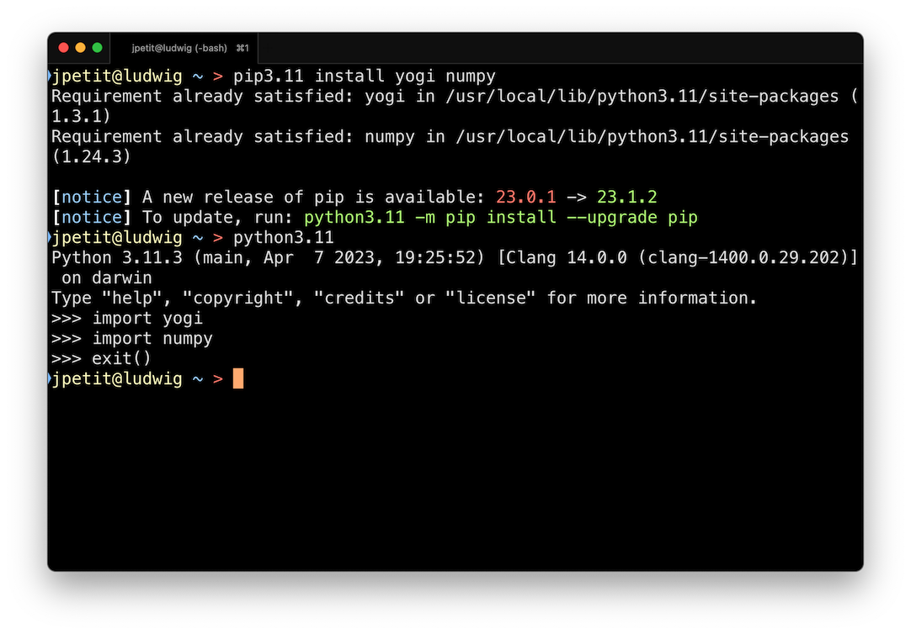

# Intèrpret de Python


Per executar els vostres programes en Python necessiteu un intèrpret de Python. Hi ha diferents versions de l'intèrpret de Python, qualsevol de prou recent serà suficient pels propòsits d'aquest curs. N'hi ha prou que us assegureu d'instal·lar-ne una que sigui igual o superior a la versió 3.11 i hi afegiu alguns paquets utilitzats durant el curs.


## Instal·lació de Python

La instal·lació de Python depèn lleugerament del vostre sistema operatiu:

:::tabs

== Linux

Ja el tindreu instal·lat amb alta probabilitat

== macOS

- Aneu a https://www.python.org/downloads/.
- Piqueu el botó per descarregar-vos la darrera versió de Python.
- Seguiu les instruccions de l'instal·lador.

== Windows

- Obriu la Microsoft Store.
- Busqueu `python3`.
- Instal·leu l'aplicació Python3.

:::

Per aquest curs no us cal instal·lar Python amb altres distribucions com Anaconda o Spyder. De fet, us recomano que no ho feu.


Un cop tingueu instal·lat Python, verifiqueu que funciona bé des de la vostra aplicació de terminal:

TODO: posar enllaç a curs terminal

- Obriu un terminal (vegeu el curs El Terminal (/terminal/index.html) per a més informació).
- Executeu la comanda `python` o `python3` o quelcom com `python3.11`.
- Verifiqueu que la comanda carrega la versió de Python que heu instal·lat.
- Sortiu de l'intèrpret amb la comanda `exit()`.


## Instal·lació de paquets addicionals

Ara convé que afegiu uns paquets addicionals que utilitzarem durant el curs: Es tracta de `yogi` (un paquet per simplificar la lectura de dades), `numpy` (un paquet per treballar amb vectors) i `mypy` (una eina per trobar errors als programes). Per a fer-ho, executeu

```sh
pip install yogi numpy pypy
```

Enlloc de `pip`, potser heu d'utilitzar `pip3` o `pip3.11` (habitualment el patró coïncideix amb el de la comanda `python`).

Verifiqueu que s'han instal·lat bé:



Si al fer els `imports` no es queixa, és que tot ha anat bé.


<Autors autors="jpetit"/>