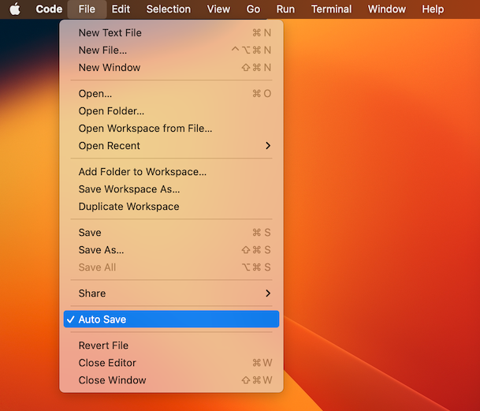
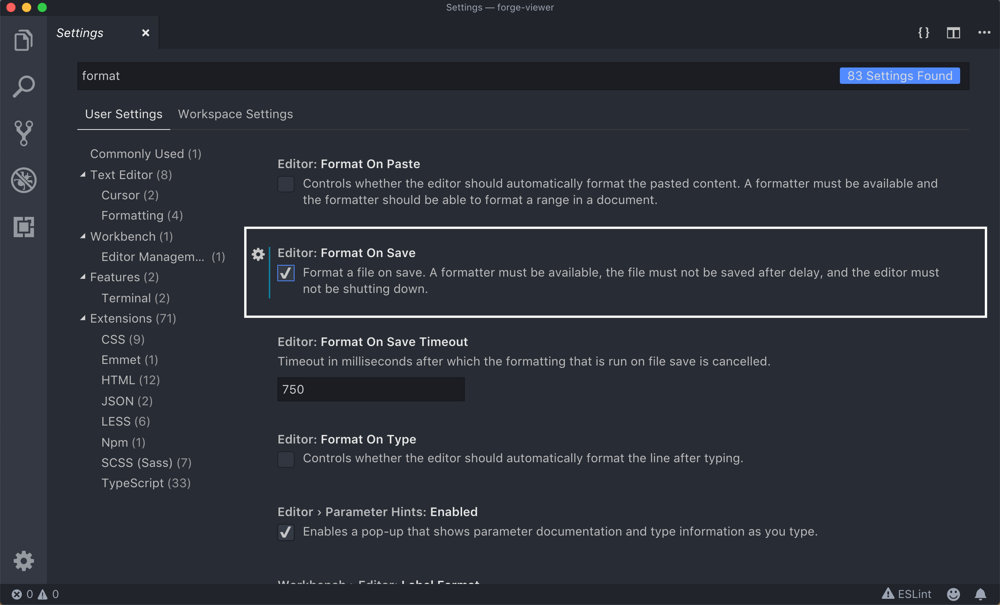

# Editor Visual Studio Code

Un editor de codi és una eina informàtica semblant a un processador de textos, la diferència és que el processador de textos està destinat a escriure documents i dóna funcionalitats per formatar el text, crear índexs, afegir figures, ètc. mentre que un editor de codi dona funcionalitats més pròpies a la programació.

Visual Studio Code és l'editor de codi aconsellat per seguir aquest curs. Aquesta lliçó descriu com instal·lar-lo i com configurar-lo per treballar còmodament amb ell.

## Instal·lació

Podeu baixar-vos i instal·lar-vos Visual Studio Code al vostre ordinador des de https://code.visualstudio.com/download (des de Windows, el podeu trobar a la Microsoft Store). És molt fàcil. Compte: Visual Studio Code i Microsoft Visual Studio són coses diferents. Voleu Visual Studio Code, no Microsoft Visual Studio.

Un cop tingueu instal·lat Visual Studio Code, el podreu invocar des de la línia de comandes amb `code` o `code .` o `code programa.py`. Els usuaris de macOS haureu de dur a terme un pas extra per a usar la comanda `code`: Obriu la *Command Palette* (<kbd>⌘Cmd</kbd>+<kbd>⇧Shift</kbd>+<kbd>P</kbd>), escriviu `shell command` i premeu la tecla <kbd>Enter</kbd>.

## Configuració

- **Desat automàtic:** Per mandra, per seguretat i per no estar fent el ximple mirant perquè un programa no fa el que volíem simplement perquè no l'hem desat, és important activar el desat automàtic. Amb el desat automàtic activat, Visual Studio Code desarà automàticament els nostres fitxers després de cada canvi. Per a activar-lo, tan sols cal fer clic a la opció *Auto Save* del menú *File*:

    

- **Format automàtic:** Igualment, és convenient activar el format automàtic dels programes quan aquests es desen. Per activar-ho, aneu a *Settings*, escriviu `format` a la barra de cerca i activeu l'opció *Format On Save*:

    

- **Eines per a Python:** Instal·leu una extensió de VSCode anomenada *Python extension for Visual Studio Code*. [De fet, el primer cop que creeu un fitxer en Python, Visual Studio Code ja us suggereix que instal·leu aquesta eina.] Es tracta d'una extensió que ofereix diagnòstics que es mostren en temps real a la finestra de l’editor de text, de forma semblant als processadors de textos quan mostren errors sintàctics o ortogràfics.

    

<Autors autors="jpetit"/>