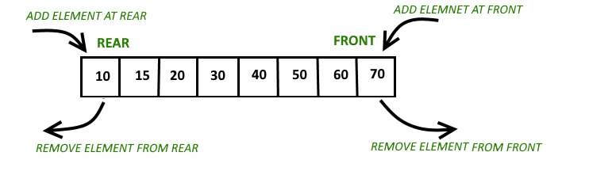

# Cues


Aquesta lliçó introdueix un nou tipus de dades: les cues. Primer es presenta el concepte de cua, després es mostra com utilitzar cues en Python i, finalment, es donen alguns exemples.


## Introducció

Una **cua** és un tipus abstracte de dades que permet emmagatzemar una col·lecció d'elements amb les operacions principals següents:

- afegir un nou element,
- consultar si hi ha algun element,
- consultar l'element afegit fa més temps que encara no s'hagi eliminat, i
- eliminar aquest element.


## Il·lustració

Podem veure una cua com un contenidor on els elements es col·loquen els uns darrera dels altres, en llur ordre d'arribada. En tot moment, l'únic element accessible és el que va arribar abans, el qual s'anomena el **primer** de cua. Aquest es pot consultar i també eliminar. És un error intentar consultar o eliminar el primer element d'una cua buida.

Sovint es diu que les cues són estructures FIFO (_First In, First Out_),indicant que el primer element que entri serà el primer a sortir.

A l'animació interactiva següent, feu clic damunt dels elements per ficar-los a la cua. Feu clic a la cua per treure el seu primer element. Fixeu-vos que dóna un error si la cua és buida.

<MySnap src="./queue.ts" height="440"/>

## Aplicacions

Malgrat (o precisament per) la seva simplicitat, les cues són una estructura de dades fonamental: A la vida real, els clients d'una fleca s'organitzen en una cua per ser despatxats segons l'ordre d'arribada. Un sistema d'atenció telefònica com cal guarda les trucades en una cua per atendre-les quan un operador les pugui atendre. Els sistemes operatius (que són els programes que controlen el maquinari dels ordinadors) guarden en cues la informació dels processos que s'han d'executar. I també dels missatges que s'envien entre si. Les xarxes de computadors utilitzen cues (_buffers_) per gestionar-ne la congestió. I molts algorismes usen cues per desar informació pendent de tractar, respectant l'ordre d'arribada.


## Cues en Python

Utilitzar llistes per implementar cues seria una mala idea: Si els afegits a la cua es fessin per la dreta amb un `append`, els esborrats s'haurien de fer per l'esquerra amb un `pop(0)`. Llavors cada `append` tindria cost constants, però cada `pop(0)` tindria cost lineal amb el nombre d'elements a la cua. Fer-ho inserint per l'esquerra i esborrant per la dreta invertiria els costos, però encara n'hi hauria un de lineal.

Per això, Python ofereix un tipus anomenat `deque` (al mòdul estàndard `collections`) que permet inserir i esborrar pels dos cantons en temps constant.



El codi següent mostra com utilitzar les operacions d'una `deque`:

```python
>>> from collections import deque
>>> d = deque()     # crea una deque buida
>>> d.append(14)    # és el mateix que appendright
>>> d.append(11)
>>> d.append(29)
>>> d
deque([14, 11, 29])
>>> len(d)
3
>>> d.appendleft(31)
>>> d
deque([31, 14, 11, 29])
>>> d[0]
31
>>> d[-1]
29
>>> d.popleft()     # també hi ha un popright
31
>>> d
deque([14, 11, 29])
```

Per tant, per usar una `deque` com a cua, n'hi ha prou en limitar-se a usar `append`, `popleft` i accedir al primer element (índex 0). Així, totes les operacions de les cues tenen cost constant.


## Exemple: Aparellar paraules

Suposem que volem llegir una seqüència de paraules i aparellar cada paraula que començi amb una minúscula amb una paraula que començi amb una majúscula, sempre seguint l'ordre d'entrada: la primera paraula amb minúscula amb la primera amb majúscula, la segona amb minúscula amb la segona amb majúscula, etc. Al final, cal dir quantes paraules han quedat sense aparellar.

Per exemple, per a l'entrada

```text
bleda patata Gat nap mongeta Gos Lloro col
```

cal produir la sortida

```text
bleda Gat
patata Gos
nap Lloro
2
```

La manera més natural de resoldre aquesta tasca és mitjantçant dues cues:

1. Creem una cua `cua_minuscules` per guardar les paraules que comencen amb minúscula en el seu ordre d'aparició, i una cua `cua_majuscules` per guardar les paraules que comencen amb majúscula també en el seu ordre d'aparició.
2. Primer, es llegeix cada paraula i es guarda a la cua corresponent.
3. Després, mentre cap de les cues sigui buida, s'aparellen els seus primers elements tot desencuant-los d'ambdues.
4. Finalment, les paraules que no s'han aparellat són les que queden a les cues.

Donada l'estructura FIFO de les cues, les paraules s'aparellaran en l'ordre d'arribada. I, quan una de les cues s'hagi buidat, el nombre de paraules desaparellades coincideix amb la mida de l'altra cua. Aquest és el programa complet:

```python
from collections import deque
from typing import TypeAlias
import yogi

Queue: TypeAlias = deque

cua_minuscules: Queue[str] = Queue()
cua_majuscules: Queue[str] = Queue()

for paraula in yogi.tokens(str):
    if paraula[0].isupper():
        cua_majuscules.append(paraula)
    else:
        cua_minuscules.append(paraula)

while cua_minuscules and cua_majuscules:
    print(cua_minuscules.popright(), maj.popright())

print(len(cua_minuscules) + len(cua_majuscules))
```

Algunes observacions:

- El mètode `isupper` indica si un text és una majúscula o no.

- Fixeu-vos que la condició del segon bucle assegura que no s'intenta accedir o esborrar el primer element d'una cua buida.

- En sortir del segon bucle, com a mínim una de les cues està buida,
i per tant té mida zero. Com a conseqüència, el nombre de paraules no aparellades és la suma de les mides de les dues cues.


## Exemple: Generació de racionals


L'arbre de Calkin–Wilf és un arbre binari que representa tots els racionals estrictament positius. L'arbre té com arrel el racional 1/1 i, qualsevol node $a/b$ té dos fills $a/(a + b)$  i $(a + b)/b$. Aquests són els primers nivells de l'arbre de Calkin–Wilf:

<MySnap src="./calkin-wilf-tree.ts" height="280"/>

Considerem que volem generar  els `n` primers racionals positius de l'arbre de
Calkin–Wilf (de dalt cap a baix i d'esquerra a dreta). Per exemple, els
10 primers racionals serien 1/1, 1/2, 2/1, 1/3, 3/2, 2/3, 3/1, 1/4, 4/3, 3/5.

Per a fer-ho, definim una estructura `Racional` que
emmagatzema un racional positiu a través de dos naturals no nuls que
representen el seu numerador i el seu denominador (degudament simplificats):

```python
@dataclass
Racional:
    num: int
    den: int
```

Per tal de construir racionals, utilitzarem aquesta funció que ja els
desa simplificats

```python
def crea_racional(num: int, den: int) -> Racional:
    d = math.gcd(num, den)
    return Racional(num//d, den//d)
```

Per escriure els racionals podem ser servir aquesta funció:

```python
def escriure_racional(r: Racional) -> None:
    print(f'{r.num}/{r.den}')
```

Bé, ja tenim l'arsenal preparat, però... com generem els racionals?

La solució és utilitzar una cua de racionals:

- Per començar, ficararem
el racional 1/1 a la cua (1/1 és el racional al node arrel de l'arbre).

- A continuació,
anirem treient el primer racional de la cua, l'escriurem i
encuarem els dos racionals que són fills d'aquell racional a l'arbre.

Caldrà repetir
aquest procés `n` vegades. D'aquesta forma s'aconsegueix realitzar un *recorregut
per nivells* de l'arbre.

La creació de la cua i la inserció del primer element es poden codificar així:

```python
q: Queue[Racional] = Queue()              # Crea una cua buida de racionals
q.append(crea_racional(1, 1))             # i hi fica el 1/1.
```

A continuació, el cos de la iteració principal es pot codificar de la forma següent:

```python
r = q.popleft()                            # Treu i obté el primer de la cua
escriure_racional(r)                       # i l'escriu.

r1 = crea_racional(r.num, r.num + r.den)   # Crea el fill esquerre
q.append(r1)                               # i el fica a la cua.

r2 = crea_racional(r.num + r.den, r.den)   # Crea el fill dret
q.append(r2)                                        # i el fica a la cua.
```


Aquest és doncs el programa complet:

```python

from collections import deque
from dataclasses import dataclass
from typing import TypeAlias
import math
import yogi

Queue: TypeAlias = deque

@dataclass
class Racional:
    num: int
    den: int

def crea_racional(num: int, den: int) -> Racional:
    d = math.gcd(num, den)
    return Racional(num//d, den//d)

def escriure_racional(r: Racional) -> None:
    print(f'{r.num}/{r.den}')

def main() -> None:
    n = yogi.read(int)

    q: Queue[Racional] = Queue()
    q.append(crea_racional(1, 1))

    for _ in range(n):
        r = q.popleft()
        escriure_racional(r)
        r1 = crea_racional(r.num, r.num + r.den)
        q.append(r1)
        r2 = crea_racional(r.num + r.den, r.den)
        q.append(r2)

main()
```

La seva sortida per als 12 primers racionals és aquesta:

```text
1/1  1/2  2/1  1/3  3/2  2/3  3/1  1/4  4/3  3/5  5/2  2/5
```

Si en teniu ganes, podeu provar de reescriure el programa fent servir [Fractions](https://docs.python.org/3/library/fractions.html), el tipus de dades de Python per a racionals.

<Autors autors="jpetit"/>
