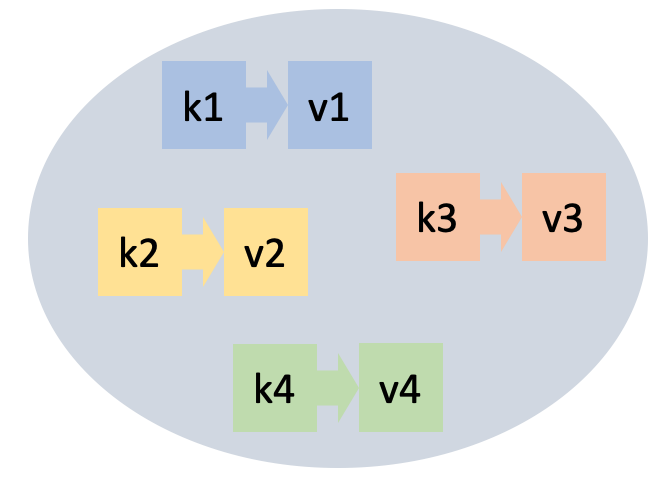
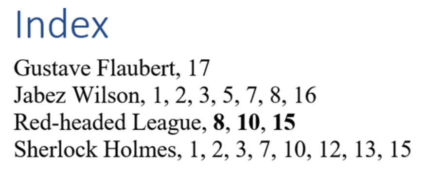

# Diccionaris



Aquesta lliçó introdueix primer un altre tipus de dades: els diccionaris. Podem pensar en els diccionaris com una generalització de les llistes, on es pot indexar per qualsevol valor de (quasi) qualsevol tipus, sense que els índexs hagin de ser enters consecutius.  A continuació, aquesta lliçó presenta dos exemples d'ús de diccionaris: En el primer exemple, es vol comptar quantes vegades apareix cada paraula d'un text. Al segon exemple es mostra com construir i consultar un índex per cercar eficientment els documents que conten una certa paraula.


## Introducció

Un **diccionari** (o **mapa**) és un tipus abstracte de dades que permet emmagatzemar una col·lecció d'elements. Cada element té dues parts:

- una **clau** i
- un **valor**.

Les operacions estan guiades per les claus, les quals han de ser úniques a cada diccionari. Les operacions principals són els següents:

- inserir un element amb clau `k` i un valor `v`
(quan s'insereix un element amb una clau que ja era al diccionari, el
valor anterior es perd i és substituït pel nou),
- esborrar un element juntament amb la seva clau (no passa res si `k` no era al diccionari),
- trobar un element amb clau `k` (o saber que no hi és), i
- consultar el nombre d'elements al diccionari.

Hi ha altres operacions, com les que permeten recórrer tots els elements d'un diccionari o que permeten utilitzar un diccionari com si fos un vector generalitzat.


## Aplicacions

Els diccionaris són un tipus de dades recurrent en moltes aplicacions.

Per exemple, en una aplicació de traducció de textos del català a l'anglès, en algun lloc caldrà emmagatzemar que la traducció de `'casa'` és `'house'`, que la de `'gos'` és `'dog'`, que la de `'gat'` és `'cat'` i així successivament. En aquest cas les paraules en català són les claus i les paraules en anglès són els seus valors associats. En aquesta aplicació serà capital que l'operació de consulta (donada una paraula en català, saber quina és la traducció anglesa) sigui eficient.

Un aplicació de contactes per a mòbils també seria un exemple de diccionari. En aquest cas, les claus serien noms de persones i els valors les seves dades com ara telèfons, adreces físiques i electròniques i data d'aniversari, potser aplegades en una estructura.


## Literals

La manera més senzilla d’escriure diccionaris en Python és enumerant els seus elements entre claus i separant-los per comes. Cada element té dues parts: la clau i el valor, separats per dos punts. Aquí en teniu dos exemples:

```python
>>> catala_angles = {'casa': 'house', 'gos': 'dog', 'gat': 'cat'}
catala_angles
{'casa': 'house', 'gos': 'dog', 'gat': 'cat'}
>>> nombres = {1: 'un', 2: 'dos', 3: 'tres', 4: 'quatre'}
>>> nombres
{1: 'un', 2: 'dos', 3: 'tres', 4: 'quatre'}
```

El diccionari buit, s'escriu `{}` o `dict()`.


## Funcions predefinides

Igual que per les llistes i els conjunts, Python ofereix algunes funcions predefinides sobre diccionaris. Per exemple, la funció `len`, aplicada a un conjunt, en retorna el seu nombre d'elements (és a dir, el nombre de parelles clau-valor):

```python
>>> nombres = {1: 'un', 2: 'dos', 3: 'tres', 4: 'quatre'}
>>> len(nombres)
4
>>> len({})
0
```

Les funcions `min`, `max` i `sum` aplicades sobre un diccionari en retornen, respectivament, el mínim, màxim i suma de les seves claus. No es fan servir gaire.


## Manipulació de diccionaris

Els operadors `in` i `not in` permeten saber si una clau és o no en un diccionari:

```python
>>> nombres = {1: 'un', 2: 'dos', 3: 'tres', 4: 'quatre'}
>>> 3 in nombres
True
>>> 14 in nombres
False
>>> 'dos' in nombres
False
```

Els diccionaris es poden indexar amb `[]` per tal de consultar i modificar els valors associats a claus. 

Una assignació `d[k] = v` permet associar el valor `v` a la clau `k` del diccionari `d`. Si `k` ja era en `d`, l'antic valor associat es perd i és substituït per `v`. Si `k` no era al diccionari, la clau `k` és inserida al diccionari, amb valor `v`:

```python
>>> nombres
{1: 'un', 2: 'dos', 3: 'tres', 4: 'quatre'}
>>> nombres[2] = 'two'
>>> nombres
{1: 'un', 2: 'two', 3: 'tres', 4: 'quatre'}
>>> nombres[1000] = 'mil'
>>> nombres
{1: 'un', 2: 'two', 3: 'tres', 4: 'quatre', 1000: 'mil'}
```

Si una clau `k` existeix en un diccionari `d`, l'expressió `d[k]` en retorna el seu valor associat, però si la clau no hi és, provoca un error:

```python
>>> print(nombres[3])
tres
>>> print(nombres[14])
KeyError: 14
```

En canvi, `d.get(k, x)` retorna `d[k]` si `k` és a `d` i `x` sinó. És útil per oferir valors per defecte o evitar errors:

```python
>>> notes = {'do':'C', 're':'D', 'mi':'E', 'fa':'F', 'sol':'G', 'la':'A', 'si':'B'}
>>> print(notes.get('do', None))
C
>>> print(notes.get('ut', None))
None
>>> print(notes.get('ut', 'no hi és'))
'no hi és'
```

Es pot esborrar una clau `k` d'un diccionari `d` amb `del d[k]`, a condició que `k` pertanyi al diccionari:

```python
>>> nombres
{1: 'un', 2: 'dos', 3: 'tres', 4: 'quatre'}
>>> del nombres[2]
>>> nombres
{1: 'un', 3: 'tres', 4: 'quatre'}
>>> del nombres[9]
KeyError: 9
>>> nombres[2] = 'dos'
```

El mètode `.keys()` aplicat a un diccionari retorna totes les claus que conté. Igualment, el mètode `.values()` retorna totes les claus que conté. A més, el mètode `.items()` retorna totes les tuples de parells claus-valors:

```python
>>> nombres.keys()
dict_keys([1, 2, 3, 4, 5])
>>> nombres.values()
dict_values(['un', 'two', 'tres', 'quatre', 'cinc'])
>>> nombres.items()
dict_items([(1, 'un'), (2, 'two'), (3, 'tres'), (4, 'quatre'), (5, 'cinc')])
```

Si es volen convertir aquests resultats en llistes, se'ls ha d'aplicar una conversió (però en general no cal):

```python
>>> list(nombres.keys())
[1, 2, 3, 4, 5]
```

La implementació interna de Python està dissenyada perquè totes aquestes operacions siguin molt eficients.


## Recórrer tots els elements d'un diccionari

Sovint, es vol recórrer tots els elements d'un diccionari, realitzant alguna tasca amb cadascun d'aquests elements. La manera més habitual de fer-ho és amb un bucle `for` i els mètodes `keys`, `values` o `items`. Per exemple:

```python
>>> nombres = {1: 'un', 2: 'dos', 3: 'tres', 4: 'quatre'}
>>> for k in nombres.keys(): print(k)
1
2
3
4
>>> for v in nombres.values(): print(v)
un
dos
tres
quatre
>>> for k, v in nombres.items(): print(k, v)
1 un
2 dos
3 tres
```

Fixeu-vos com es desempaqueten les tuples en dues variables en el cas de `items`.

L'ordre en què es recorren els elements és l'ordre en el qual s'han inserit els elements (a partir de Python 3.6). Això es deu a la tècnica que utilitza Python internament per emmagatzemar els conjunts eficientment. Per fer programes portables, jo no comptaria massa en aquesta característica. 

Modificar un diccionari mentre s'està iterant sobre ell sol ser una mala idea. No ho feu.


## El tipus diccionari

En Python, els diccionaris són de tipus `dict`, ho podem comprovar així:

```python
>>> nombres = {1: 'un', 2: 'dos', 3: 'tres', 4: 'quatre'}
>>> type(nombres)
<class 'dict'>
```

Per tal de comptar amb la seguretat que aporta la comprovació de tipus, d'ara en endavant suposarem que totes les claus d'un diccionari han de ser del mateix tipus i que tots els valors d'un diccionari han de ser del mateix tipus (possiblement diferent del tipus de les claus): es diu que aquests diccionaris són estructures de dades **homogènies**. Això no és cap imposició de Python, però és un bon costum per a novells.

En el sistema de tipus de Python, `dict[K, V]` descriu un nou tipus que és un diccionari on les claus són de tipus `K` i els valors de tipus `V`. Per exemple, `dict[int, str]` és el tipus d'un diccionari d'enters a textos, `dict[str, str]` és un diccionari de textos a textos, i `dict[str, set[int]]` és un diccionari de textos a conjunts d'enters.

En la majoria d'ocasions, no cal anotar els diccionaris amb el seu tipus, perquè el sistema ja ho determina sol a través dels seus valors. Només en el cas de crear diccionaris buits cal indicar el tipus dels elements de les llistes perquè, evidentment, el sistema no ho pot saber:

```python
d1: dict[int, int] = {1:1, 2:4}       # no cal anotar el tipus: es dedueix automàticament
d2: dict[int, int] = {}               # cal anotar el tipus que tindrà el diccionari buit
                                      # perquè no es pot pas deduir
```

Un altre lloc on sempre cal anotar el tipus dels diccionaris és quan es defineixen paràmetres:

```python
def pacient_amb_febra_mes_alta(dict[str, float]) -> str: 
    ...
```


## Diccionaris per comprensió

Els diccionaris també es poden escriure per comprensió de manera semblant als conjunts per comprensió. Aquest cop, però, cal donar els elements separant la clau del valor amb dos punts:

```python
>>> {n : n * n for n in range(10) if n % 2 == 0}
{0: 0, 2: 4, 4: 16, 6: 36, 8: 64}
>>> nombres = {1: 'un', 2: 'dos', 3: 'tres', 4: 'quatre'}
>>> {k : v.upper() for k, v in nombres.items()}
{1: 'UN', 2: 'DOS', 3: 'TRES', 4: 'QUATRE'}
```


## Els diccionaris són objectes

Com les llistes i els conjunts, els diccionaris també són objectes i, per tant, es manipulen a través de referències. Aquest codi ho demostra.

```python
>>> d1 = {1:1, 2:2}
>>> d1
{1: 1, 2: 2}
>>> d2 = d1
>>> d1[3] = 3
>>> d1
{1: 1, 2: 2, 3: 3}
>>> d2
{1: 1, 2: 2, 3: 3}
```

Es poden copiar diccionaris fàcilment amb el mètode `copy`:

```python
>>> d1 = {1:1, 2:2}
>>> d2 = d1.copy()
>>> d1[3] = 3
>>> d1
{1: 1, 2: 2, 3: 3}
>>> d2
{1: 1, 2: 2}
```

Però atenció, si les claus són objectes, el diccionaris també en guarden una referència:

```python
>>> llista = [1, 2, 3]
>>> dic = {'info': llista}
>>> dic['info']
[1, 2, 3]
>>> llista.append(9)
>>> dic['info']
[1, 2, 3, 9]
```

Si això us fa dubtar, vegeu-ho amb [Python Tutor](https://pythontutor.com/render.html#code=llista%20%3D%20%5B1,%202,%203%5D%0Adic%20%3D%20%7B'info'%3A%20llista%7D%0Allista.append%289%29&cumulative=false&curInstr=0&heapPrimitives=nevernest&mode=display&origin=opt-frontend.js&py=3&rawInputLstJSON=%5B%5D&textReferences=false).


## Resum de les operacions bàsiques

|operació|significat|
|---|----|
|`{}`|crea un diccionari buit.|
|`{k1:v2, k2:v2, ...}`|crea un diccionari amb elements `k1`:`v1`, `k2`:`v2`, ...|
|`len(d)`|retorna el nombre de claus del diccionari `d`. |
|`d[k] = v`| assigna el valor `v` a la clau `k` al diccionari `d`.|
|`d[k]`| consulta el valor de la clau `k` del diccionari `d` (s'enfada si no hi és).|
|`d.get(k, x)`|retorna `d[k]` si `k` és a `d` i `x` sinó.|
|`del d[k]`| esborra la clau `k` i el seu valor del diccionari `d` (no s'enfada si no hi és).|
|`k in d` o `k not in d`| diu si `k` és o no una clau de `d`.|
|`d.keys()`|retorna totes les claus de `d`.|
|`d.values()`|retorna tots els valors de `d`.|
|`d.items()`|retorna tots els parells claus-valors de `d`.|


## Exemple: Comptar totes les paraules d'un text

Considerem que, donat un text, volem obtenir la llista de totes les seves paraules (en minúscules), juntament amb el seu nombre d'aparicions. 

Una bona forma de fer-ho és utilitzant un diccionari. El diccionari tindrà com a claus les paraules del text (en minúscules). I cada paraula tindrà associada com a valor un enter que és el nombre de vegades que aquella paraula ha aparegut en el text. Un diccionari `ocurrencies` com aquest es declara doncs així:

```python
ocurrencies: dict[str, int]
```

Començant per un diccionari buit, anirem llegint seqüencialment cada paraula del text. Per a cada paraula `paraula`, si `paraula` no era encara al diccionari, l'afegirem associant-li el comptador 1 (perquè, al ser nova, només ha aparegut un cop). En canvi, si `paraula` ja era al diccionari, li incrementarem d'una unitat el seu comptador d'ocurrències associat. Un cop llegit tot el text, recorrerem tots els elements del diccionari, escrivint cada clau i comptador. El programa corresponent queda doncs així:

```python
from yogi import tokens

# crear el diccionari comptador d'ocurrències de paraules buit
ocurrencies: dict[str, int] = {}

# llegir cada paraula i afegir-la al diccionari
for paraula in tokens(str):
    paraula = paraula.lower()
    if paraula not in ocurrencies:
        ocurrencies[paraula] = 1
    else:
        ocurrencies[paraula] += 1

# recórrer els elements del diccionari per escriure'ls
for paraula, comptador in ocurrencies.items():
    print(paraula, comptador)
```

Per exemple, si executem aquest programa sobre aquesta entrada

```text
I'm saying nothing
But I'm saying nothing with feel
```

el resultat és 

```text 
i'm 2
saying 2
nothing 2
but 1
with 1
feel 1
```

Recordeu que (des de Python 3.6) l'ordre en què es recorren els elements d'un diccionari és el seu ordre d'inserció. Per tal que les paraules quedin ordenades alfabèticament, es pot utilitzar la funció predefinida `sorted` que les ordena per clau:

```python
for paraula in sorted(ocurrencies.items()):
    print(paraula, ocurrencies[paraula])
```

Així, el resultat és ara:

```text
but 1
feel 1
i'm 2
nothing 2
saying 2
with 1
```

Per tal que les paraules quedin ordenades per ocurrències primer, alfabèticament segon, es poden passar més paràmetres a `sorted` indicant la tupla que determina el criteri per ordenar (ignoreu el `lambda` per ara):

```python
for paraula, comptador in sorted(ocurrencies.items(), key=lambda x: (x[1], x[0])):
    print(comptador, paraula)
```

Així, el resultat és ara:

```text
1 but
1 feel
1 with
2 i'm
2 nothing
2 saying
``` 


## Exemple: Indexació de documents

Suposem que volem indexar diferents documents de text de manera que, donada una paraula, puguem trobar eficientment tots els documents que continguin aquella paraula. Aquesta tasca és semblant a la que realitzen els cercadors d'Internet, o al Finder del vostre ordinador.

Per simplificar, suposem que l'entrada és una seqüència de descripcions de documents. Cada document comença amb el seu identificador, seguit del seu nombre de paraules i seguit de les seves paraules.

Per exemple, si aquests són els nostres documents

```text
mati      8   cada dia al mati canta el gall kiririki
gegant   16   el gegant del pi ara balla ara balla el gegant del pi ara balla pel cami
nina     11   dalt del cotxe hi ha un nina que repica els picarols
balco     8   el gall i la gallina estaven al balco
```

preguntar per `gall` hauria de retornar `mati` i `balco`, no necessàriament en aquest ordre. Preguntar per `cotxe` hauria de retornar `nina` i preguntar `patata` no hauria de retornar res.



Per tal de no haver de llegir tots els documents cada cop que es demana una paraula, construirem un **índex dels documents**: Un índex és una estructura de dades que indica a quin document apareix cada paraula. La idea és semblant als índexs que al final dels llibres diuen a quines pàgines apareix cada terme important; vegeu la figura de la dreta.

En el nostre cas, podem veure que un índex és un diccionari que, donades paraules, retorna conjunts d'identificadors de documents (és a dir, de paraules). Per tant, el nostre índex tindrà aquest tipus: 

```python
Document: TypeAlias = str
Index: TypeAlias = dict[str, set[Document]]
```

La primera fase consisteix en construir l'índex tot llegint els documents:

```python
def construir_index() -> Index:
    index: Index = {}
    for doc in tokens(str):
        n = read(int)
        for _ in range(n):
            par = read(str)
            if par in index:
                index[par].add(doc)
            else:
                index[par] = {doc}
    return index
```

Aquesta funció llegeix l'entrada document per document. Per cada document, deixa a la variable `doc` el seu identificador i a la variable `n` el seu nombre de paraules. Per a cadascuna de les `n` paraules `par`, insereix `doc` a l'entrada `par` de l'índex (mirant si és o no la primera vegada que s'afegeix). Així, a l'índex que s'acaba retornant, hi ha una entrada per a cada possible paraula de tots els documents i cada paraula conté el conjunt d'identificadors de documents que contenen aquella paraula.

Amb l'exemple anterior, l'índex retonat és aquest:

```python
{'al': {'balco', 'mati'},
 'ara': {'gegant'},
 'balco': {'balco'},
 'balla': {'gegant'},
 'cada': {'mati'},
 'cami': {'gegant'},
 'canta': {'mati'},
 'cotxe': {'nina'},
 'dalt': {'nina'},
 'del': {'nina', 'gegant'},
 'dia': {'mati'},
 'el': {'balco', 'mati', 'gegant'},
 'els': {'nina'},
 'estaven': {'balco'},
 'gall': {'balco', 'mati'},
 'gallina': {'balco'},
 'gegant': {'gegant'},
 'ha': {'nina'},
 'hi': {'nina'},
 'i': {'balco'},
 'kiririki': {'mati'},
 'la': {'balco'},
 'mati': {'mati'},
 'nina': {'nina'},
 'pel': {'gegant'},
 'pi': {'gegant'},
 'picarols': {'nina'},
 'que': {'nina'},
 'repica': {'nina'},
 'un': {'nina'}}
 ```

La segona fase consisteix en recuperar tots els identificadors de documents que contenen una paraula donada:

```python
def escriure_documents(index: Index, par: str) -> None:
    if par in index:
        print(f'La paraula {par} apareix en aquests documents:')
        for doc in index[par]:
            print(doc)
    else:
        print(f'La paraula {par} no apareix en cap document.')
```

Primer, es cerca la paraula a l'índex, amb `in`. Si la paraula hi és, només cal recórrer el seu valor en `index[par]`, que és el conjunt d'identificadors de documents que cal escriure.

Per referència, aquest és el programa sencer:

```python
from yogi import read, tokens
from typing import TypeAlias


Document: TypeAlias = str
Index: TypeAlias = dict[str, set[Document]]


def construir_index() -> Index:
    index: Index = {}
    for doc in tokens(str):
        n = read(int)
        for i in range(n):
            par = read(str)
            if par in index:
                index[par].add(doc)
            else:
                index[par] = {doc}
    return index


def escriure_documents(index: Index, par: str) -> None:
    if par in index:
        print(f'La paraula {par} apareix en aquests documents:')
        for doc in index[par]:
            print(doc)
    else:
        print(f'La paraula {par} no apareix en cap document.')
```

Apa! D'aquí a fer un Google només queda un petit pas... 😏


<Autors autors="jpetit"/> 

