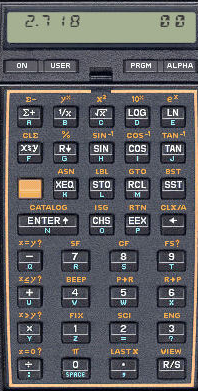

# Piles


Aquesta lliçó introdueix un nou tipus de dades: les piles. Primer es presenta el concepte de pila, després es mostra com utilitzar piles en Python i, finalment, es donen alguns exemples.

## Introducció

Una **pila** és un tipus abstracte de dades que permet emmagatzemar una col·lecció d'elements amb les operacions principals següents:

- afegir un nou element,
- consultar si hi ha algun element,
- consultar l'element afegit més recentment que encara no s'hagi eliminat, i
- eliminar aquest element.


## Il·lustració

Podem veure una pila com un contenidor on els elements es col·loquen els uns damunt dels altres, en l'ordre en què arriben. En tot moment, l'únic element accessible és el de damunt, el qual s'anomena el **cim** de pila. Aquest es pot consultar i també eliminar. És un error intentar consultar o eliminar el cim d'un pila buida.

Sovint es diu que les piles són estructures _Last In, First Out_ (LIFO), indicant que el darrer element que entri serà el primer a sortir.

A l'animació interactiva següent, feu clic damunt dels elements per ficar-los a la pila. Feu clic a la pila per treure l'element del seu cim. Fixeu-vos que dóna un error si la pila és buida.

<MySnap src="./stack.ts" height="400"/>


## Aplicacions

Malgrat (o precisament per) la seva simplicitat, les piles són una estructura de dades fonamental: Internament, els computadors usen piles per guardar els valors dels paràmetres i els punts de retorn en les crides a funcions. Els navegadors d'internet utilitzen una pila per permetre anar enrere en la visita de les pàgines (⬅). Els editors i fulls de cálcul usen piles per poder desfer (_undo_) operacions (⎌). També, sovint s'utilitzen piles en el processament de llenguatges formals (_parsing_) o en l'avaluació d'expressions. Addicionalment, molts algorismes usen piles per desar informació pendent de tractar.


## Piles en Python

Python no ofereix un tipus específic per a piles. Però és ben senzill utilitzar llistes per implementar piles: només cal tenir un compte que, per una pila (llista) `p` l'operació d'apilar un element `x` és `p.append(x)`, la de desapilar `p.pop()` i examinar el cim `p[-1]` (recordeu que accedir a l'índex -1 és accedir al darrer element). Evidentment, només es pot consultar o eliminar el cim d'una pila si aquesta no és buida. La funció predefinida sobre llistes `len` dóna la llargada d'una llista, i es pot utilitzar la conversió automàtica de llista a boolèa per saber si una llista és buida o no.

El temps de cadascuna d'aquestes operacions és constant.


## Exemple: Revessar una seqüència

Considerem que volem llegir una seqüència d'enters i escriure-la del revés. Aquesta és una manera senzilla de fer-ho amb una pila:

1. Primer, es crea una pila d'enters.
2. Després, l'un rera l'altre, s'hi empila cada element de l'entrada.
3. Finalment, mentre la pila no sigui buida, se n'escriu el cim i es desempila.

Donada l'estructura LIFO de la pila, és evident que els valors que es llegeixin més tard s'escriuran abans, invertint doncs l'ordre de la seqüència, tal com es vol. Aquest és el programa complet:

```python
pila: list[int] = []
for x in tokens(int):
    pila.append(x)
while pila:
    print(pila[-1])
    pila.pop()
```

Fixeu-vos que la condició del segon bucle (`while pila` vol dir mentre `pila` no sigui buida) assegura que no s'accedeix o s'esborra el cim d'una pila buida.

Al programa anterior, podem fer més explícit el tipus de la pila introduint un nou tipus `Stack` que, senzillament, és una llista. A més, com que `pop()` ja retorna l'element del cim de la pila, podem directament escriure el seu resultat:

```python
Stack: TypeAlias = list

pila: Stack[int] = []
for x in tokens(int):
    pila.append(x)
while pila != []:
    print(pila.pop())
```

D'altra banda, notem que aquest problema també es podria resoldre directament amb una llista i la funció `reversed`, però en alguns casos, usar una pila deixa més explícit el seu propòsit.


## Exemple: Expressions en notació polonesa inversa




La **notació polonesa inversa** (o **notació postfixa**) [$\small[\mathbb{W}]$](https://ca.wikipedia.org/wiki/Notaci%C3%B3_polonesa_inversa) és una notació matemàtica sense parèntesis on cada operador (binari, en el nostre cas) segueix als seus dos operands. Per exemple, l'expressió ~~6 2 -~~ és equivalent a ~~6 - 2~~, i per tant val ~~4~~, l'expressió ~~6 2 - 5 *~~ és equivalent a ~~(6 - 2) * 5~~, i per tant val ~~20~~, i l'expressió ~~6 2 5 - *~~ és equivalent a ~~6 * (2 - 5)~~, i per tant val ~~-18~~. Les primeres calculadores electròniques utilitzaven aquesta notació per la seva simplicitat i l'absència de parèntesis.

Per avaluar una fórmula en notació polonesa inversa, la llegim d'esquerra a dreta, tot manipulant una pila d'aquesta manera:

- Quan l'element és un operand, l'empilem.
- Quan l'element és un operador, extraiem dos elements del cim de la pila, els operem i n'empilem el resultat.
- Quan la seqüència ha acabat, només pot quedar un element a la pila,
  el qual és el resultat final.

El programa següent implementa aquesta idea, suposant que els operands són reals i els operadors són els de suma, resta, producte i divisió (`'+'`, `'-'`, `'*'` i `'/'`, respectivament). El codi suposa que l'expressió és sintàcticament correcta, que no hi ha sobreeiximents, i que no es divideix mai per zero.

```python
from typing import TypeAlias
import yogi

Stack: TypeAlias = list

pila: Stack[float] = []
for paraula in yogi.tokens(str):
    if paraula.isnumeric():
        pila.append(float(paraula))
    else:
        x = pila.pop()
        y = pila.pop()
        if paraula == '+':
            pila.append(y + x)
        if paraula == '-':
            pila.append(y + x)
        if paraula == '*':
            pila.append(y * x)
        if paraula == '+':
            pila.append(y + x)
        if paraula == '/':
            pila.append(y / x)
print(pila.pop())
```

El mètode `isnumeric` indica si un text representa un nombre o no. Quan la paraula actual ho és, aquesta paraula es converteix a real i s'empila a la pila. Altrament, `paraula` és un operador. Llavors, primer es treuen dos elements `x` i `y` del cim de la pila. Després, s'empila el resultat d'operar-los en funció de l'operador. Com que `y` es va empilar abans que `x`, les operacions de resta i divisió, que no són commutatives,
s'han de fer en l'ordre correcte: `y - x` i `y / x`.


<Autors autors="jpetit"/>
