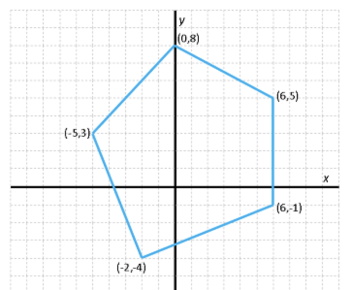

# Aplicació: Polígons simples


Un **polígon simple** és un polígon els costats no adjacents del qual no s'intersequen. En aquesta secció voldríem definir tipus de dades per poder manipular polígons simples i per calcular llur perímetre i àrea. De passada, introduirem un tipus per a punts en el pla i veurem com definir llistes d'estructures.


## Tipus punt

Per començar, veiem que un polígon ve donat per les posicions dels seus punts en el pla. Per tant, necessitem alguna forma de representar punts. Donat que un punt té dues coordenades, podem representar-los amb una estructura amb dos camps de tipus real, un per la coordenada X, i un per la coordenada Y:

```python
@dataclass
class Punt:
    x: float
    y: float
```

Ara es podrien definir funcions útils per tractar punts en el pla, com ara obtenir el seu mòdul o el seu argument, o aplicar-los una translació o un escalat... Penseu com fer-les! Com a exemple, aquí teniu una funció que, donats dos punts, retorna la seva distància:

```python
def distancia(p: Punt, q: Punt) -> float:
    """Retorna la distància euclidiana entre dos punts."""

    return math.sqrt((p.x - q.x) ** 2 + (p.y - q.y) ** 2)
```

## Tipus polígon

A continuació, considerem com representar un polígon. Segurament, l'opció més senzilla és descriure un polígon llistant els seus punts des del primer a l'últim, entenent que hi ha una aresta entre tots els parells de punts consecutius i entre el darrer i el primer. Com que tots els punts d'un polígon han de ser del mateix tipus (`Punt`) però el seu nombre és indeterminat, podem utilitzar una llista per representar-los! Per tant, podem definir un nou tipus per a polígons utilitzant llistes de punts:

```python
Poligon: TypeAlias = list[Punt]
```



Definir llistes d'estructures és molt habitual. En aquest cas, podríem definir un polígon corresponent a la figura de la dreta de la forma següent:

```python
pol = [
    Punt( 6,  5),           # primer punt
    Punt( 0,  8),           # segon  punt
    Punt(-5,  3),           # tercer punt
    Punt(-2, -4),           # quart  punt
    Punt( 6, -1),           # cinquè punt
]
```

Fixeu-vos que la variable `pol` no és altra cosa que una llista que conté cinc punts, i que els hem pogut llistar utilitzant la notació de llistes i d'estructures, escrivint cada punt dins de la llista. També, si mai volguéssim accedir a la coordenada X del segon punt d'aquest polígon, hauríem d'escriure `pol[1].x`: `pol` és una llista, per tant li podem aplicacar l'operador `[]` per indexar-lo; i `pol[1]` és un punt, per tant li podem aplicacar l'operador `.` per seleccionar un dels seus camps (`x` en aquest cas). En canvi, `pol.x[1]` no tindria sentit.


## Perímetre

Ara que podem representar polígons, podem definir una funció per obtenir-ne el seu perímetre. Només cal sumar totes les distàncies entre parells de punts consecutius, sense deixar-se d'afegir la distància del primer al darrer:

```python
def perimetre(poligon: Poligon) -> float:
    """Retorna el perímetre d'un polígon simple."""

    n = len(poligon)  # nombre de punts a poligon
    p = distancia(poligon[-1], poligon[0])
    for i in range(n - 1):
        p += distancia(poligon[i], poligon[i + 1])
    return p
```

Evidentment, aquesta funció només és correcta si el polígon és simple i així ho hem documentat al seu comentari. Observeu com hem passat els punts del polígon a la funció distància. Tot el puzzle lliga!

I, amb llistes de comprensió podem fer el programet encara més maco:

```python
def perimetre(poligon: Poligon) -> float:
    """Retorna el perímetre d'un polígon simple."""

    n = len(poligon)  # nombre de punts a poligon
    return sum([distancia(poligon[i], poligon[i + 1]) for i in range(-1, n - 1)]) 
```


## Àrea

De forma semblant, podem calcular l'àrea d'un polígon simple utilitzant la *fórmula de Gauss* [$\small[\mathbb{W}]$](https://es.wikipedia.org/wiki/F%C3%B3rmula_del_%C3%A1rea_de_Gauss):

```python
def area(poligon: Poligon&) -> float:
    """Retorna l'àrea d'un polígon simple."""

    n = len(poligon)  
    s = poligon[n - 1].x * poligon[0].y - poligon[0].x * poligon[n - 1].y
    for i in range(n - 1):
        s += poligon[i].x * poligon[i + 1].y - poligon[i + 1].x * poligon[i].y
    return s / 2
```

**Exercici:** Useu `sum` i llistes per comprensió per evitar els bucles a les dues funcions anteriors.


<Autors autors="jpetit"/> 

