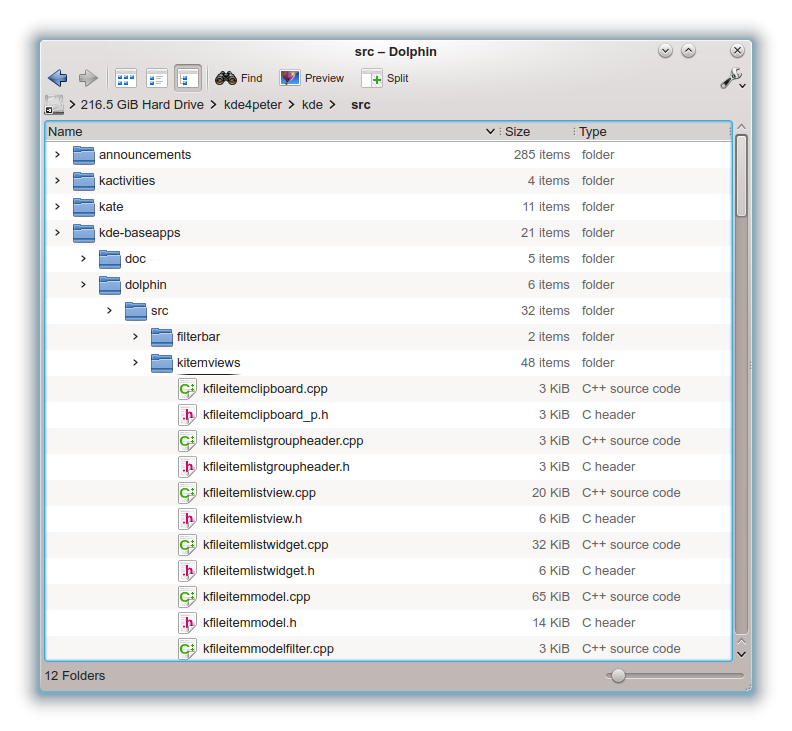

# Fitxers i formats en Python


Aquesta lliçó pretén donar una breu descripció sobre la manera de llegir i
escriure fitxers en Python3. A més, també mostra com utilitzar algunes
llibreries per a tractar determinats tipus de formats com ara CSV, JSON o XML
i com carregar aquests fitxers des de servidors externs.

## Fitxers

En informàtica, un **fitxer** és un recurs que proporciona el sistema operatiu
per poder desar i recuperar dades en un dispositiu d'emmagatzematge. Els fitxers
tipicament es guarden en discos durs o memòries flaix, s'adrecen a través d'un nom
i s'organitzen jeràrquicament en sistemes de fitxers. Actualment, els sistemes
operatius també permeten manipular impressores, connexions de xarxes i altres
dipositius com si fossin fitxers.



Pel què fa al sistema operatiu, el contingut d'un fitxer és, simplement, una
seqüència de dades. La manera en que s'organitzen aquestes dades depèn del seu
ús. Per exemple, sovint parlem de _fitxers de text_ quan el contingut del
fitxer és un text o codi font, o parlem de _fitxers d'imatges_ quan el
contingut del fitxer conté una imatge. En el primer cas, el format és prou
senzill: la majoria dels caràcters són lletres i símbols i alguns pocs són
caràcters de control (com salts de línia, tabuladors...). En el segon cas,
existeixen diferents formats d'imatges, com ara JPG, PNG, GIF, BMP i cadascun
d'ells descriu a la seva manera els colors de la imatge, potser utilitzant
compressió. Sovint, però no sempre, l'extensió del nom del fitxer descriu el
seu format.

Les operacions més bàsiques sobre fitxers són:

-   Crear un nou fitxer
-   Esborrar un fitxer existent
-   Obrir un fitxer existent
-   Llegir dades d'un fitxer obert
-   Escriure dades en un fitxer obert
-   Tancar un fitxer

Per a cada fitxer, a banda del seu contingut, el sistema operatiu també desa
algunes meta-dades:

-   nom i extensió del fitxer,
-   talla del fitxer,
-   data i hora de creació i de darrera modificació,
-   propietari del fitxer,
-   drets d'accés al fitxer, ...

## Fitxers de text en Python

Comencem pel tractament de fitxers de text. És molt habitual organitzar aquests
fitxers per línies.

Per manipular un fitxer en Python cal obrir-lo primer amb la funció `file`, que té dos
paràmetres: el nom del fitxer a obrir i el seu mode d'obertura.
Hi ha diversos modes possibles, però els més bàsics són:

-   `'r'`: Mode de lectura (_read_)
-   `'w'`: Mode d'escriptura (_write_)
-   `'a'`: Mode d'afegiment (_append_)

La funció `open()` retorna un objecte de tipus `file` que caldrà utilitzar
cada cop que es vulgui manipular el fitxer. Quan ja no es vulgui manipular
més el fitxer, caldrà aplicar-li el mètode `close()` per tancar-lo.

### Exemple d'escriptura d'un fitxer

Considereu aquest fragment de codi per
crear un fitxer que es digui `pelis.txt` i contingui
dues línies de text amb dos noms de pel·lícules:

```python
f = open('pelis.txt', 'w')
f.write('Star Wars IV\n')
f.write('Indiana Jones and the Temple of Doom\n')
f.close()
```

1. Primer es crea el fitxer anomenat `pelis.txt` utilitzant el mode d'escriptura (`'w'`).
   Si el fitxer no existia, es crea buit. Si ja existia, es perd el seu contingut
   original i queda buit (compte!). La variable `f` denota aquest fitxer.

2. Després, es poden escriure dades dins del fitxer utilitzant el mètode
   `write()`, tot passant-li el text que s'hi vol escriure. En aquest cas,
   finalitzem cada text amb un salt de línia `\n`.

3. Finalment, es tanca el fitxer `f` amb `f.close()`.

Si ara es mira el contingut del fitxer `pelis.txt`
(amb un editor de textos o utilitzant la comanda `cat pelis.txt`
en Linux/Mac o `type pelis.txt` en Windows) s'obtindrà

```text
Star Wars IV
Indiana Jones and the Temple of Doom
```

### Exemple d'afegiment en un fitxer

Considereu ara aquest fragment de codi que extén el fitxer creat anteriorment
afegint-li un altre nom de pel·lícula:

```python
f = open('pelis.txt', 'a')
f.write('Braveheart\n')
f.close()
```

1. Primer s'obre el fitxer anomenat `pelis.txt` utilitzant el mode d'afegiment (`'a'`).
   En aquest cas,
   si el fitxer no existia, es crea buit. Si ja existia (el nostre cas),
   les següents accions d'escriptura es realitzaran al seu final.

2. Després, s'afageixen dades al fitxer utilitzant el mètode
   `write()`, com abans.

3. Finalment, es tanca el fitxer `f` amb `f.close()`.

Si ara es mira el contingut del fitxer `pelis.txt` s'obtindrà

```text
Star Wars IV
Indiana Jones and the Temple of Doom
Braveheart
```

### Exemple de lectura d'un fitxer

Considereu ara aquest fragment de codi que obre el fitxer creat anteriorment
i en visualitza cada línia:

```python
f = open('pelis.txt', 'r')
for línia in f.readlines():
    print(línia.strip())
f.close()
```

1.  Primer s'obre el fitxer anomenat `pelis.txt` utilitzant el mode de lectura (`'r'`).
    Aquesta instrucció generaria una excepció si el fitxer no existís.

2.  Després, es tracta cada línia del fitxer `f` utilitzant un bucle sobre
    `f.readlines()`. A cada iteració d'aquest bucle s'obté una línia del fitxer.
    Podeu pensar que `f.readlines()` retorna una llista amb totes les línies del fitxer però,
    de fet, per sota hi ha un sistema d'iteradors que fa aquest tractament eficient.

    Les línies que es llegeixen del fitxer inclouen el seu salt de línia al seu final,
    per això hem aplicat el mètode `strip()` abans d'escriure-les (altrament ens sortirien
    dos salts de línia).

3.  Finalment, es tanca el fitxer `f` amb `f.close()`.

### Variacions per la lectura d'un fitxer

El programa anterior també es podria escriure així, prescindint del `readlines()`:

```python
f = open('pelis.txt', 'r')
for línia in f:
    print(línia.strip())
f.close()
```

I encara una altra manera seria així, utilitant el mètode `readline()` que retorna
un text buit quan no queden més línies:

```python
f = open('pelis.txt', 'r')
línia = f.readline()
while línia != '':
    print(línia.strip())
    línia = f.readline()
f.close()
```

Per fi, es pot llegir tot el contingut d'un fitxer d'un sol en un text cop utilitzant
el mètode `read()`:

```python
f = open('pelis.txt', 'r')
print(f.read())
f.close()
```

Aquest tipus de tractament només es pot fer si se sap que la mida del fitxer és
petita, altrament perilla que omplim tota la memòria amb el contingut del fitxer.

### Tancament de fitxers

Ja hem dit que quan no es vulgui manipular més un fitxer obert,
cal tancar-lo amb `close()`. Ara bé, algunes vegades això no es fa, per dues
possibles raons:

-   Al finalitzar el programa, el sistema operatiu tanca automàticament tots els
    fitxers que aquest hagués obert.

-   Quan la variable que denota el fitxer deixa d'existir (per exemple, perquè
    la funció on estava definida s'acaba), el gestor de brossa automàtic de Python
    ja la destrueix netament, tot tancant el fitxer.

Malgrat això, és una bona pràctica tancar els fitxers tant bon punt ja no es
necessiten més.

### Ús del mòdul `easyinput`

TODO: Actualiyzar a yogi

Si heu de treballar amb fitxers de text però no us convé llegir per línies
sinó per elements com ara paraules, enters o reals,
potser la forma més fàcil és utilitzar el mòdul `easyinput` comentat a [Lectura de
dades en Python](/python/lectura.html). La funció `read` de `easyinput` admet com a
paràmetre el fitxer del qual es llegeixen les dades.

Per exemple, aquest programa suma tots els enters del fitxer `dades.txt`:

```python
from easyinput import read

f = open('dades.txt', 'r')
s = 0
x = read(int, file=f)
while x is not None:
    s += x
    x = read(int, file=f)
print(s)
```

Aquest altre exemple realitza la fusió ordenada dels nombres en dos fitxers
ordenats deixant el resultat en un tercer fitxer:

```python
import easyinput

f1 = open('entrada1.txt', 'r')
f2 = open('entrada2.txt', 'r')
f3 = open('sortida.txt', 'w')
x1 = easyinput.read(int, file=f1)
x2 = easyinput.read(int, file=f2)
while x1 is not None and x2 is not None:
    if x1 <= x2:
        print(x1, file=f3)
        x1 = easyinput.read(int, file=f1)
    else:
        print(x2, file=f3)
        x2 = easyinput.read(int, file=f2)
while x1 is not None:
    print(x1, file=f3)
    x1 = easyinput.read(int, file=f1)
while x2 is not None:
    print(x2, file=f3)
    x2 = easyinput.read(int, file=f2)
```

En aquest cas, hem escrit en `f3` utilitzant la funció `print()`, que també
admet un paràmetre `file` per indicar el fitxer on cal escriure.

## Serialització d'objectes

Serialitzar un objecte en memòria vol dir desar-ne el seu contingut en un
fitxer per poder-lo recuperar (des-serialitzar) més tard. Realitzar aquesta
tasca no és trivial, ja que l'objecte pot ser molt complicat i tenir relacions
cícliques. Python dóna suport a la serialització a través del mòdule `pickle`
amb dues funcions: `dump()` per serialitzar i `load()` per des-serialitzar.

Per exemple, el següent fragment de codi mostra com desar algunes dades (sigui
quin sigui el seu tipus) en un fitxer de manera que es puguin recuperar més
endavant:

```python
import pickle

dades = {1:2, 2: [3, 4]}
f = open('exemple.dat', 'wb')
pickle.dump(dades, f)
f.close()
```

I aquest fragment de codi mostra com recuperar-les:

```python
f = open('exemple.dat', 'rb')
dades = pickle.load(f)
f.close()
print(dades)     # per comprovar que és {1:2, 2: [3, 4]}
```

Si intenteu mirar el contigut del fitxer `'exemple.dat'` veureu que és
inintel·ligible pels humans, perquè `pickle` utilitza un format binari propi
per serialitzar les dades de forma eficient. Com que els fitxers ja no són de text,
cal utilitzar també el mode `'b'` per indicar dades binàries al fer l'`open()`.

Compte, els fitxers en Pickle només es poden llegir i escriure amb Python!

## Format JSON

El format JSON és un estàndard basat en text dissenyat per a intercanvi de
dades llegible per humans. Mentre que `pickle` és un mòdul que pot
serialitzar dades qualssevol de Python, JSON només dóna suport a tipus bàsics
(enters, reals, booleans i textos), llistes i diccionaris. Ara bé, el format
JSON és llegible i editable.
El funcionament és idèntic al de `pickle`, però ara cal usar el mòdul `json`.

Per desar:

```python
import json

dades = {1:2, 2: [3, 4]}
f = open('exemple.json', 'w')
json.dump(dades, f)
f.close()
```

Per recuperar:

```python
f = open('exemple.json', 'r')
dades = json.load(f)
f.close()
print(dades)     # per comprovar que és {1:2, 2: [3, 4]}
```

Com a referència, aquest és el contingut del fitxer `exemple.json` creat
anteriorment:

```json
{
    "1": 2,
    "2": [3, 4]
}
```

## Format JSON al núvol

JSON s'utilitza habitualment intercanviar dades entre un servidor i una
aplicació web. Per exemple, a http://wservice.viabicing.cat/v2/stations podeu
trobar la informació en temps real de les estacions de Bicing de la ciutat de
Barcelona. Aquesta adreça conté un fitxer JSON amb la ubicació (coordenades
longitud-latitud) de les estacions de bicing, la seva adreça (carrer i
número), llistat de les estacions més pròximes, estat de l'estació, nombre
d'aparcaments i nombre de bicicletes disponibles, mecàniques i elèctriques.

Aquí en teniu un fragment:

```json
{
    "stations": [
        {
            "id": "1",
            "type": "BIKE",
            "latitude": "41.397952",
            "longitude": "2.180042",
            "streetName": "Gran Via Corts Catalanes",
            "streetNumber": "760",
            "altitude": "21",
            "slots": "14",
            "bikes": "14",
            "nearbyStations": "24, 369, 387, 426",
            "status": "OPN"
        },
        {
            "id": "2",
            "type": "BIKE",
            "latitude": "41.39553",
            "longitude": "2.17706",
            "streetName": "Roger de Flor/ Gran Vía",
            "streetNumber": "126",
            "altitude": "21",
            "slots": "8",
            "bikes": "18",
            "nearbyStations": "360, 368, 387, 414",
            "status": "OPN"
        }
        /* dades omeses */
    ],
    "updateTime": 1530802508
}
```

El programa següent (que després comentem) escriu el nombre de bicis
i de llocs disponibles al Bicing de Barcelona:

```python
import json
import urllib.request

response = urllib.request.urlopen('http://wservice.viabicing.cat/v2/stations')
bicing = json.load(response)
bikes = 0
slots = 0
for station in bicing['stations']:
    bikes += int(station['bikes'])
    slots += int(station['slots'])
print(bikes, slots)
```

En aquest cas, com que les dades no són en un fitxer del propi ordinador, no
usem `open()` sinó `urllib.request.urlopen()` que funciona de forma semblant a
`open()`, però enlloc d'obrir un fitxer local obre una pàgina de web a través
de la seva URL. El valor que retorna `urlopen()` és una reposta `response` que
podem utilitzar, si fa no fa, com un fitxer. En particular, la podem passar a
`json.load()` perquè descodifiqui les dades en JSON i les desi en una variable
de Python anomenada `bicing`.

Després, ja només cal recórrer l'estructura de dades `bicing` per calcular
la suma de bicis aparcades i llocs disponibles. Noteu que, en aquest cas, hem hagut
de convertir a enters els valors numèrics perquè el proveïdor del fitxer els
ha proporcionat com a textos (😱!).

## Format XML

> _XML is crap. Really. There are no excuses. XML is nasty to parse for humans,
> and it's a disaster to parse even for computers. There's just no reason for
> that horrible crap to exist._ —Linux Torvalds, 2014

XML és un metallenguatge d'etiquetes que permet definir la gramàtica de
llenguatges específics. En la seva vessant més senzilla, es pot veure un
document XML com un arbre compost de nodes que poden ser altres elements o
atributs.

Per exemple, [en aquesta pàgina](http://www.gencat.cat/mediamb/qaire/mapes_qualitat_aire_catalunya/qualitatairecatalunya/qualitatairecatalunya.xml)
es pot obtenir un fitxer XML amb
informació sobre la qualitat de l'aire a diferents indrets de Catalunya on es
mostren dades de la mesura de ozó troposfèric (O3), diòxid de nitrogen (NO2) i
partícules en suspensió (PM10).
Aquí en teniu un fragment:

```xml
<ns0:Root xmlns:ns0="http://www.gencat.cat/mediamb/qaire/mapes_qualitat_aire_catalunya/mapesqualitatairecatalunya.html">
  <Valors>
    <cabina>
        <nom_cabina>Lleida</nom_cabina>
        <qualitat_aire>Bona</qualitat_aire>
        <codi_dtes>AB</codi_dtes>
        <zqa>14</zqa>
        <codi_eoi>25120001</codi_eoi>
        <longitud>0,6157</longitud>
        <latitud>41,6158</latitud>
        <hora_o3>17h</hora_o3>
        <qualitat_o3>Bona</qualitat_o3>
        <valor_o3>91 µg/m³</valor_o3>
        <hora_no2>17h</hora_no2>
        <qualitat_no2>Bona</qualitat_no2>
        <valor_no2>10 µg/m³</valor_no2>
        <hora_pm10>17h</hora_pm10>
        <qualitat_pm10>Bona</qualitat_pm10>
        <valor_pm10>13 µg/m³</valor_pm10>
    </cabina>
    <cabina>
        <nom_cabina>Sant Celoni</nom_cabina>
        <qualitat_aire>Regular</qualitat_aire>
        <codi_dtes>AC</codi_dtes>
        <zqa>08</zqa>
        <codi_eoi>08202001</codi_eoi>
        <longitud>2,4957</longitud>
        <latitud>41,689</latitud>
        <hora_o3>17h</hora_o3>
        <qualitat_o3>Regular</qualitat_o3>
        <valor_o3>113 µg/m³</valor_o3>
        <hora_no2>17h</hora_no2>
        <qualitat_no2>Bona</qualitat_no2>
        <valor_no2>12 µg/m³</valor_no2>
        <hora_pm10>17h</hora_pm10>
        <qualitat_pm10>Bona</qualitat_pm10>
        <valor_pm10>25 µg/m³</valor_pm10>
    </cabina>
    <!-- dades omeses -->
  </Valors>
</ns0:Root>
```

El programa següent (que després comentem) escriu les cabines per les quals
els valors de partícules en suspensió no són bons:

```python
import xml.etree.ElementTree
import urllib.request

response = urllib.request.urlopen('http://www.gencat.cat/mediamb/qaire/mapes_qualitat_aire_catalunya/qualitatairecatalunya/qualitatairecatalunya.xml')
tree = xml.etree.ElementTree.parse(response)
root = tree.getroot()

for cabina in root.findall('Valors/cabina'):
    qualitat_pm10 = cabina.find('qualitat_pm10').text
    nom = cabina.find('nom_cabina').text
    valor_pm10 = cabina.find('valor_pm10').text
    if qualitat_pm10 not in [None, '', 'Bona']:
        print(nom, qualitat_pm10, valor_pm10)
```

Com abans, comencem amb un `urlopen()` que obre el fitxer de dades XML a través
de la seva URL. La resposta obtinguda ens permet descodificar (_parsejar_)
el fitxer XML amb `xml.etree.ElementTree.parse` i convertir-lo en un arbre
`tree`, del qual n'agafem la seva arrel `root`.

Després, cal recórrer aquest arbre per trobar els elements que ens interessen.
En aquest cas, recorrem totes les cabines usant
`root.findall('Valors/cabina')` i, per a cadascuna d'elles, n'extreiem els
valors dels camps `qualitat_pm10`, `nom_cabina` i `valor_pm10`, escrivint-los
quan pertoca.

El resultat d'aquest programa és una sortida com ara

```text
Santa Perpètua de Mogoda Regular 37 µg/m³
Barcelona - Eixample Regular 40 µg/m³
Montcada i Reixac Regular 41 µg/m³
```

## Format CSV i DataFrames

CSV és un format d'arxius utilitzat per representar dades en forma de _full de càlcul_ (estil Excel). Literalment CSV vol dir [_Comma-Separated Values_](https://en.wikipedia.org/wiki/Comma-separated_values).

En aquesta lliçó agafarem com a exemple un arxiu CSV obtingut d'[Open Data BCN](http://opendata-ajuntament.barcelona.cat/), un servei de dades obertes ofert per l'Ajuntament de Barcelona. En particular, farem servir un arxiu CSV que conté informació sobre tots els mercats de Barcelona.

L'arxiu original és més gran. Aquí només ensenyarem una part reduïda d'aquest arxiu (algunes columnes s'han eliminat):

```text
    LONGITUD,LATITUD,EQUIPAMENT,DISTRICTE,NOM_DISTRICTE
    2.138554,41.405663,Mercat de Sant Gervasi,5,Sarrià-Sant Gervasi
    2.139198,41.360378,Mercat de La Marina,3,Sants-Montjuïc
    2.189132,41.380431,Mercat de La Barceloneta,1,Ciutat Vella
    2.17782,41.461717,Mercat de Ciutat Meridiana,8,Nou Barris
    2.163459,41.381301,Mercat Encants de Sant Antoni,2,Eixample
    2.143687,41.396682,Mercat de Galvany,5,Sarrià-Sant Gervasi
    2.215137,41.419232,Mercat del Besòs,10,Sant Martí
    ...
```

Per a cada mercat, l'arxiu conté informació sobre les seves coordenades, el seu nom i el districte al que pertany.

Cada línia correspon a una fila del full de càlcul i les columnes estan separades per comes. Altres separadors també són possibles segons la configuració de l'eina que ha de llegir l'arxiu. La primera fila representa les capçaleres del full de càlcul que posteriorment esdevindran atributs.

Si fem servir la libreria **pandas** de python, disposem d'una estructura de dades molt interessant, **DataFrame**, que és una estructura bidimensional semblant a un full de càlcul.

En aquesta lliçó generarem un mapa que situï tots els mercats de Barcelona. Posteriorment ens centrarem en _Ciutat Vella_ i farem un mapa només d'aquest districte.

Per obtenir els mapes farem servir una API d'accés a [OpenStreetMap](https://en.wikipedia.org/wiki/OpenStreetMap), que ens permetrà generar mapes de manera molt senzilla. Aquesta API s'anomena [staticmap](https://github.com/komoot/staticmap/blob/master/README.md). Caldrà instal.lar aquesta llibreria per poder obtenir els mapes.

Comencem important les llibreries:

```python
import pandas as pd
from staticmap import StaticMap, CircleMarker
```

Identifiquem l'arxiu que conté les dades sobre mercats (un nom massa llarg, però necessari) i les capçaleres de les columnes que ens interessen.

```python
url = 'http://opendata-ajuntament.barcelona.cat/data/dataset/706e7507-7f84-480e-940d-23265bf5d853/resource/98b893c2-ac83-4f34-b40a-19a4911a066b/download/MERCATS_MUNICIPALS.csv'
market = 'EQUIPAMENT'
lon = 'LONGITUD'
lat = 'LATITUD'
district = 'NOM_DISTRICTE'
```

I ara una mica de màgia:

```python
df = pd.read_csv(url, usecols=[market, lon, lat, district])
```

Amb això llegim tot l'arxiu de la variable **url** (ull, haurem d'estar connectats a la xarxa!) i només ens quedarem amb la llista de columnes que especifiquem. Les altres seran ignorades. La variable **df** és un DataFrame (el nostre full de càlcul).

Podem veure què hi ha dins. Per això definirem algun paràmetre per imprimir-ho bonic

```python
pd.set_option('display.max_rows', 20)
pd.set_option('display.width', 200)
print(df)
```

i veurem això:

```text
        LONGITUD    LATITUD                          EQUIPAMENT        NOM_DISTRICTE
    0   2.138554  41.405663              Mercat de Sant Gervasi  Sarrià-Sant Gervasi
    1   2.139198  41.360378                 Mercat de La Marina       Sants-Montjuïc
    2   2.189132  41.380431            Mercat de La Barceloneta         Ciutat Vella
    3   2.177820  41.461717          Mercat de Ciutat Meridiana           Nou Barris
    4   2.163459  41.381301       Mercat Encants de Sant Antoni             Eixample
    5   2.143687  41.396682                   Mercat de Galvany  Sarrià-Sant Gervasi
    6   2.215137  41.419232                    Mercat del Besòs           Sant Martí
    7   2.196493  41.419457                Mercat de Provençals           Sant Martí
    8   2.172279  41.382048  Mercat de Sant Josep - La Boqueria         Ciutat Vella
    9   2.191032  41.433957               Mercat de Sant Andreu          Sant Andreu
    ..       ...        ...                                 ...                  ...
    33  2.182549  41.395773               Mercat del Fort Pienc             Eixample
    34  2.177037  41.405718        Mercat de la Sagrada Família             Eixample
    35  2.153756  41.399737              Mercat de la Llibertat               Gràcia
    36  2.155818  41.423740                   Mercat del Carmel       Horta-Guinardó
    37  2.205331  41.418656                Mercat de Sant Martí           Sant Martí
    38  2.142460  41.424062  Mercat de Vall d'Hebron -Teixonera       Horta-Guinardó
    39  2.168974  41.395591              Mercat de La Concepció             Eixample
    40  2.170254  41.438652              Mercat de La Guineueta           Nou Barris
    41  2.178185  41.386394            Mercat de Santa Caterina         Ciutat Vella
    42  2.163244  41.379777               Mercat de Sant Antoni             Eixample
```

Ara volen generar una llista amb tots els noms de districtes, anant amb cura en que els noms no es repeteixin. Cada DataFrame té un atribut per a cada columna amb el nom de la seva capçalera. Així doncs, **df.NOM_DISTRICTE** és una columna del full. A partir d'aquesta columna podem generar una llista amb noms únics fent servir la funció **unique()**.

```python
list_districts = df.NOM_DISTRICTE.unique()
print(list_districts)
['Sarrià-Sant Gervasi' 'Sants-Montjuïc' 'Ciutat Vella' 'Nou Barris'
'Eixample' 'Sant Martí' 'Sant Andreu' 'Horta-Guinardó' 'Gràcia'
'Les Corts']
```

Anem a fer un mapa amb els mercats. Serà una imatge de 400x400 pixels i posarem un cercle vermell a cada lloc on hi hagi un mercat. Haurem de recórrer totes les files del full. Després farem un rendering de la imatge:

```python
m_bcn = StaticMap(600, 600)
for row in df.itertuples():
    marker = CircleMarker((row.LONGITUD, row.LATITUD), 'red', 6)
    m_bcn.add_marker(marker)

image = m_bcn.render()
image.save('markets.png')
```

Quan visualitzem la imatge **markets.png** veurem el següent (més màgia!):


Hmmm, d'on ha sortit aquest mapa?

Però a nosaltres només ens interessen els mercats de Ciutat Vella. Els dibuixem? Primer de tot crearem un altre DataFrame on només hi hagi les files que tinguin el valor 'Ciutat Vella' en el nom del districte. Així de senzill:

```python
df_cv = df.loc[df[district] == 'Ciutat Vella']
print(df_cv)
```

i veurem això:

        LONGITUD    LATITUD                          EQUIPAMENT NOM_DISTRICTE
    2   2.189132  41.380431            Mercat de La Barceloneta  Ciutat Vella
    8   2.172279  41.382048  Mercat de Sant Josep - La Boqueria  Ciutat Vella
    21  2.171956  41.382986    Mercat de les Flors *Les Rambles  Ciutat Vella
    41  2.178185  41.386394            Mercat de Santa Caterina  Ciutat Vella

I ara podem fer el mapa igual que abans. Cap secret:

```python
m_cv = StaticMap(600, 600)
for row in df.itertuples():
    marker = CircleMarker((row.LONGITUD, row.LATITUD), 'red', 10)
    m_cv.add_marker(marker)
image = m_cv.render()
image.save('Markets_CiutatVella.png')
```


Si voleu el programa sencer, us el podeu baixar d'[aquí](/programes/markets.py).

Amb els DataFrames es poden fer moltes coses. Recomanem llegir algun dels tutorials que hi ha a la xarxa, com per exemple [aquest](https://www.tutorialspoint.com/python_pandas/python_pandas_dataframe.htm).

<Autors autors="jpetit jordic"/>
