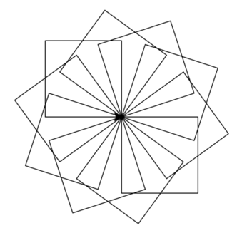

# Accions


Aquesta lliçó introdueix les accions, un nou tipus de subprograma, semblant a les funcions. Enlloc de retornar un valor, una **acció** és un subprograma que produeix uns efectes durant la seva execució. A més, aquesta lliçó mostra com trencar un programa en diferents subprogrames facilita la seva escriptura, lectura, comprensió i manteniment.


## Dibuix de molts quadrats rotats amb accions

En [una lliçó prèvia](/iteracions/poligons.html) hem vist com dibuixar una agradable figura geomètrica amb molts quadrats rotats. La solució que vam escriure era aquesta:

```python
import turtle
import yogi

mida = yogi.read(int)
rotacions = yogi.read(int)
angle = 360 / rotacions

j = 0
while j < rotacions:
    i = 0
    while i < 4:
        turtle.forward(mida)
        turtle.right(90)
        i = i + 1
    turtle.right(angle)
    j = j + 1

turtle.done()
```

I produïa dibuixos com aquest:



Primer, es llegeix la mida dels costats (`mida`) i el nombre de rotacions (`rotacions`) desitjades. Després, es clacula un valor `angle`per no recalcular-lo cada vegada. Llavors, per cada rotació, es dibuixa cada quadrat i es rota la tortuga. Per dibuixar el quadrat s'avanca i gira la tortuga quatre cops. La solució conté dos bucles aniuats, fet que posa en evidència que el programa ja és un xic complicat.

En efecte, els programes escrits d’aquesta forma de seguida es tornen una mica més complexos del que hom voldria. Quan dibuixem formes, els valors d’inici de les variables com ara `i` i `j` són delicats, i haver-los de mantenir tots alhora es fa més i més difícil quan el nombre de línies del programa augmenta. Partir el programa en diferents subprogrames podria ser una manera de simplicar-lo.

Per a fer-ho, decidim que un subprograma s'ocupi de la part corresponent a dibuixar els nostres quadrats rotat. Llavors el programa principal queda molt aprimat:

```python
import yogi
import turtle

mida = yogi.read(float)
rotacions = yogi.read(int)
dibuixar_quadrats_rotats(mida, rotacions)
```

Bàsicament, hem abstret el codi que hauria de dibuixar la figura per la invocació d'un subprograma anomenat `dibuixar_quadrats_rotats` que reb dos paràmetres: la mida dels costats i el nombre de rotacions a dibuixar.

Aquí, `dibuixar_quadrats_rotats(mida, rotacions)` és semblant a la invocació d'una funció, però al contrari de les funcions, aquesta invocació no forma part d'una expressió sinó que és una instrucció. Això és perquè aquesta invocació no recull cap valor, sinó que provoca un determinat efecte. En aquest cas, l'efecte provocat és el dibuix d'una forma geomètrica en una finestra. Per això, parlem d'**acció** i no de **funció**.

Els subprogrames corresponents a accions es defineixen de forma semblant als de les funcions. Però com que les accions no retornen cap resultat,
la seva capçalera indica que el tipus retornat és `None`. Aquesta és la capaçalera i especificació de l'acció `dibuixar_quadrats_rotats`:


```python
def dibuixar_quadrats_rotats(mida: float, rotacions: int) -> None:
    """Acció que dibuixa rotacions quadrats amb costats de mida mida rotant-los en cercle."""
```

El cos de les accions també es defineix de forma molt semblant al de les funcions però no tenen cap `return` ja que no lliuren cap valor com a resultat. Aquesta podria ser l'implementació de l'acció `dibuixar_quadrats_rotats`:

```python
def dibuixar_quadrats_rotats(mida: float, nombre: int) -> None:
    """Acció que dibuixa nombres quadrats amb costats de mida mida rotant-los en cercle."""

    angle = 360 / nombre
    for i in range(nombre):
        dibuixar_quadrat(mida)
        turtle.right(angle)
```

Fixeu-vos que, igual que per les funcions, els noms dels paràmetres formals de les accions no tenen perquè correspondre amb els dels paràmetres reals que s'utilitzen a l'hora d'invocar-les, però poden fer-ho. Fixeu-vos també que aquesta acció `dibuixar_quadrats_rotats` utilitza una altra acció anomenada `dibuixar_quadrat`.


L'acció `dibuixar_quadrat` es podria definir així:

```python
def dibuixar_quadrat(mida: float) -> None:
    """Acció que dibuixa un quadrat amb costats de mida mida començant al punt actual on es troba la tortuga."""

    for i in range(4):
        turtle.forward(mida)
        turtle.right(90)
```

El programa complet seria doncs el següent:

```python
import yogi
import turtle


def dibuixar_quadrat(mida: float) -> None:
    """Acció que dibuixa un quadrat amb costats de mida mida començant al punt actual on es troba la tortuga."""

    for i in range(4):
        turtle.forward(mida)
        turtle.right(90)


def dibuixar_quadrats_rotats(mida: float, nombre: int) -> None:
    """Acció que dibuixa nombres quadrats amb costats de mida mida rotant-los en cercle."""

    angle = 360 / nombre
    for i in range(nombre):
        dibuixar_quadrat(mida)
        turtle.right(angle)


mida = yogi.read(float)
rotacions = yogi.read(int)
dibuixar_quadrats_rotats(mida, rotacions)
```


Gràcies a la introducció de les accions `dibuixar_quadrats_rotats` i `dibuixar_quadrat`, el programa principal ha quedat més senzill i, en el futur, quan volguem dibuixar altres figures més complexes, podrem aprofitar aquests subprogrames, que ja no depenen del programa principal, perquè tota la interacció que hi manté és a través dels seus paràmetres.

Clarament, el codi anterior és més llarg que l'inicial, però gràcies a la descomposició en subprogrames, cadascuna de les parts és també més senzilla. Com que cada part és més senzilla, és més fàcil d'entendre i, per tant, menys probable que contingui errors i, si els conté, seràn més fàcils de detectar i d'arregar, tot facilitant la mantenibilitat del programa. A més, cadascun dels subprogrames que inclou són candidats a ser reusats en futurs projectes, estalviant doncs temps de programació. L'ús de les especificacions que descriuen l'efecte de cada acció incrementa també la llegibilitat del programa. La tria de bons identificadors per a les funcions i les accions també ajuden a autodocumentar els programes.

Estructurar els programes d'aquesta forma (és a dir, partint-los en petites funcions i/o accions tant independents com sigui possible) sempre és una bona pràctica. De fet, a partir d'ara, la convertirem en la nostra principal eina de disseny.


## Diferència funció/acció en Python

En realitat, en Python no existeix diferència entre funcions i accions.
Les accions són senzillament funcions que retornen implícitament un valor
`None` de tipus `None` (en parlarem més endavant).
Aquesta diferència conceptual l'establim nosaltres per tal reflexionar més
adequadament sobre els programes, però veureu que altres fonts poden no
utilitzar-la.


<Autors autors="jpetit"/> 

