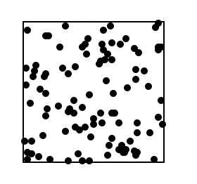

# Ús de funcions


Aquesta lliçó presenta com usar funcions. A través de funcions predefinides o de funcions importades d'altres mòduls, els nostres programes poden dur a terme tasques més o menys complicades sense haver d'escriure tant de codi i, per tant, amb menys possibilitat d'errors.

## Ús de funcions predefinides

Python ofereix un petit repertori de **funcions predefinides**, és a dir, funcions que es poden utilitzar directament. Una funció té un nom i calcula un valor a partir de certs paràmetres. Les funcions es poden **cridar** (o **invocar**) dins de qualsevol expressió, ja que dónen lloc a un valor.

Suposem que volguéssim escriure el màxim de dos nombres desats en les variables `a` i `b`. Ja hem vist anteriorment com fer aquesta tasca utilitzant un condicional, però és molt més pràctic utilitzar la funció predefinida `max`. Per exemple, podríem fer:

```python
m = max(a, b)
```

o

```python
print(max(a, b))
```

El càlcul del màxim d'`a` i de `b` s'ha relegat ara a la funció predefinida `max`, la qual probablement implementa internament el condicional igual que l'haguéssim fet nosaltres. Però gràcies a l'ús de la funció, el propòsit del nostre codi és molt més clar.

`max` és una funció que, donats dos valors, en retorna el més gran. Podem utilitzar la funció `max` en qualsevol lloc on pugui aparèixer una expressió. Si ens calgués escriure el màxim de tres valors `a`, `b` i `c`, podríem usar dues crides a `max` d'aquesta forma:

```python
print(max(a, max(b, c)))
```

Això demostra que el resultar d'un `max` es pot usar com a valor per a un paràmetre d'un altre `max`.

Millor encara, podem aprofitar que `max` pot rebre qualsevol nombre de paràmetres:

```python
print(max(a, b, c))
```

De forma anàloga, la funció predefinida `min` calcula el mínim de diferents valors. A més, la funció predefinida `abs` calcula el valor absolut de nombres:

```python
max(10, 20, 15)     👉 20
min(31, 37, 11)     👉 11
abs(12)             👉 12
abs(-12)            👉 12
abs(-4 * max(1, 3)) 👉 12
```

De forma semblant la funció predefinida `round` arrodoneix un real a l'enter més proper. I, si se li dóna un segon paràmetre, aquest indica que cal retornar l'arrodoniment com a un real amb aquell nombre de dígits decimals:

```python
round(4.1)          👉 4
round(4.9)          👉 5
round(3.1111, 2)    👉 3.11
round(3.1991, 2)    👉 3.20
```

La funció predefinida `len` serveix per calcular les llargades de diferents objectes. Per textos, en retorna el seu nombre de caràcters:

```python
len('Frank Zappa')  👉 11
len('')             👉 0
```

Hi ha moltes més funcions predefinides. Podeu trobar-ne documentació a https://docs.python.org/3/library/functions.html, però crec que les anteriors són les que us poden caldre ara.

## Funcions de conversió entre tipus de dades

En ocasions, els programadors necessiten convertir valors d'un tipus en valors d'un altre tipus. Per això, es fa servir la notació `tipus(valor)`, on el nom del tipus s'utilitza com si fos una funció predefinida. Aquestes funcions s'anomenen **funcions de conversió**. Aquí en teniu alguns exemples:

```python
>>> int(3.1)
3
>>> int(3.9)
3
>>> int('123')
123
>>> float(13)
13.0
>>> float('3.50')
3.5
>>> str(45)
'45'
>>> str(45.5)
'45.5'
>>> bool(666)
True
>>> bool(0)         # 0 és l'únic enter que es converteix a fals
False
>>> bool('res')
True
>>> bool('')        # '' és l'únic text que es converteix a fals
False
```

## Ús de funcions matemàtiques

El mòdul `math` és un mòdul estàndard de Python que s'utilitza per treballar amb càlculs científics complexos. Aquest mòdul de matemàtiques ofereix funcions matemàtiques usuals com ara arrodoniments, operacions trigonomètriques, operacions logarítmiques, ètc.

Aquesta és una llista de les funcions més habituals de `math`:

| Funció    | Descripció                                                  |
| --------- | ----------------------------------------------------------- |
| sin       | sinus                                                       |
| cos       | cosinus                                                     |
| tan       | tangent                                                     |
| asin      | arcsinus                                                    |
| acos      | arccosinus                                                  |
| atan      | arctangent                                                  |
| degrees   | conversió de radians a graus                                |
| radians   | conversió de grans a radians                                |
| sqrt      | arrel quadrada                                              |
| pow       | potència                                                    |
| log       | logarítme                                                   |
| ceil      | arrodoniment cap amunt                                      |
| floor     | arrodoniment cap avall                                      |
| trunc     | arrodoniment cap amunt per negatius, cap avall per positius |
| factorial | factorial                                                   |
| gcd       | màxim comú divisor                                          |

Per exemple, suposem que volem calcular la distància entre dos punts del pla $p = (x_p, y_p)$ i $q = (x_q, y_q)$. Recordem que la seva distància euclídea és $\sqrt{(x_p-x_q)^2 + (y_p-y_q)^2}$. El programa següent ho implementa:

```python
from yogi import read
from math import sqrt, pow

xp = read(float)
yp = read(float)
xq = read(float)
yq = read(float)

distancia = sqrt(pow(xp - xq, 2) + pow(yp - yq, 2))

print(distancia)
```

També hi ha moltes més funcions a la llibreria matemàtica. Podeu trobar-ne la documentació a https://docs.python.org/3/library/math.html. A més, també hi ha una llibreria matemàtica per a nombres complexos, vegeu https://docs.python.org/3/library/cmath.html

A més de funcions, el mòdul de matemàtiques també ofereix constants com ara `math.pi` (pel nombre π) i `math.e` (per la constant d'Euler). És important usar aquestes constants per tenir els valors més exactes possibles i no deixar tot de valors màgics `3.1416` en el codi.

## Ús de funcions aleatòries

El mòdul estàndard `random` proporciona funcions relacionades amb la generació de nombres aleatoris (o, més ben dit, de nombres pseudoaleatoris). Aquestes funcions són un xic diferents de les funcions anteriors, en el sentit que no solen retornar el mateix valor cada cop que es criden amb els mateixos paràmetres.

Per exemple, la funció `randint` retorna un nombre a l'atzar entre dos de donats. Aquestes crides mostren com es pot usar per simular el llençament d'un dau de sis cares:

```python
>>> import random
>>> random.randint(1, 6)  # probablement us sortiran valors diferents!
4
>>> random.randint(1, 6)  # probablement us sortiran valors diferents!
6
>>> random.randint(1, 6)  # probablement us sortiran valors diferents!
1
```

Si voleu obtenir la suma de dos daus, podeu escriure l'expressió `random.randint(1, 6) + random.randint(1, 6)`. Fixeu-vos que en aquest cas, no voleu escriure `2 * random.randint(1, 6)`. Enteneu perquè?

La funció `random` (dins del mòdul `random`) retorna reals a l'atzar uniformement distribuïts entre 0 i 1:

```python
>>> import random
>>> random.random()     # probablement us sortiran valors diferents!
0.21020758023523933
>>> random.random()     # probablement us sortiran valors diferents!
0.5707826663140387
```

I, de forma semblant, la funció `uniform` retorna reals a l'atzar uniformement distribuïts entre els dos paràmetres donats:

```python
>>> import random
>>> random.uniform(0, 1/3)  # probablement us sortiran valors diferents!
0.25364034594325036
>>> random.uniform(0, 1/3)  # probablement us sortiran valors diferents!
0.17085249688605977
```

Com a aplicació, aquest programa visualitza el llençament de 100 punts a l'atzar en un quadrat:

```python
import turtle
import random

punts = 100
mida = 100

# dibuixa el quadrat
for i in range(4):
    turtle.forward(mida)
    turtle.right(90)

# dibuixa els punts
for i in range(punts):
    turtle.penup()
    turtle.goto(random.uniform(0, mida), -random.uniform(0, mida))
    turtle.pendown()
    turtle.dot()

turtle.done()
```

Aquesta ha estat la sortida obtinguda en una execució:



Podeu trobar documentació addicional del mòdul `random` a https://docs.python.org/3/library/random.html.

## Ús de funcions relacionades amb el temps

El mòdul estàndard `time` proporciona funcions relacionades amb el temps. Per exemple, la funció `time` del mòdul `time` (sí, es diuen igual), retorna un real amb el nombre de segons transcorreguts des d'algun moment arbitrari en el passat. És útil per mesurar el temps transcorregut en un fragment de codi calculant la diferència entre els temps després i abans d'aquell fragment:

```python
import time
inici = time.time()
... # fragment codi de codi que volem mesurar
final = time.time()
print('temps transcorregut:', final - inici, 'segons')
```

<Autors autors="jpetit"/>
