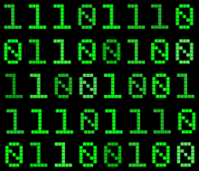

# Generació exhaustiva: Combinacions



Aquesta lliçó presenta algorismes de generació exhaustiva per tal de generar combinacions d'elements d'una determinada llargada. Per a fer-ho, es presenten diferents exemples de complexitat creixent, alhora que es milloren els algorismes. La recursivitat és la tècnica fonamental d'aquest tipus d'algorismes combinatoris.

## Seqüències d'uns i zeros

Considerem que volem fer un programa que escrigui totes les possibles seqüències de llargada $n$ amb zeros i uns (amb els elements separats per comes). Per exemple, per a $n = 3$, caldria escriure

```text
0,0,0
0,0,1
0,1,0
0,1,1
1,0,0
1,0,1
1,1,0
1,1,1
```

Com que hi ha $n$ posicions i, a cada posició hi ha dues possibilitats (un zero o un u), en total hi ha $2^n$ combinacions diferents.

Hi ha diverses maneres per fer programes per escriure totes aquestes combinacions. La que presentem a continuació utilitza recursivitat i és útil per què es pot adaptar en moltes variacions. La solució comença amb l'especificació de l'acció que realitza la tasca demanada:

```python
def generar_combinacions(n: int) -> None:
    """Escriu totes les combinacions d'n zeros i uns, per a n ≥ 0."""
```

Per resoldre el problema recursivament, tindrem una funció `generar_combinacions_rec` que rebrà una llista `L` amb `n` o menys elements, tots posats a zero o a u. El seu propòsit és escriure totes les combinacions d'`n` zeros i uns que comencin amb els elements fixats en `L` i té l'especificació següent:

```python
def generar_combinacions_rec(n: int, L: list[int]) -> None:
    """Escriu totes les combinacions d'n zeros i uns que comencin amb L, per a n ≥ 0 i |L| ≤ n."""
```

Per exemple, `generar_combinacions_rec(6, [1, 0, 0, 1])` hauria d'escriure les quatre combinacions següents:

```text
1,0,0,1,0,0
1,0,0,1,0,1
1,0,0,1,1,0
1,0,0,1,1,1
```

Queda doncs clar que per escriure totes les combinacions d'`n` zeros i uns cal cridar a `generar_combinacions_rec` amb una llista buida com a prefix:

```python
def generar_combinacions(n: int) -> None:
    """Escriu totes les combinacions d'n zeros i uns, per a n ≥ 0."""

    generar_combinacions_rec(n, [])
```

El cas base de la funció `generar_combinacions_rec` és quan el nombre d'elements en `L` coincideixin amb `n`, perquè llavors només hi ha una possible combinació d'`n` zeros i uns que comenci amb `L`, que és la pròpia `L`. Per tant ja podem programar el primer cas de la funció recursiva així:


```python
def generar_combinacions_rec(n: int, L: list[int]) -> None:
    """Escriu totes les combinacions d'n zeros i uns que comencin amb L, per a n ≥ 0 i |L| ≤ n."""

    if len(L) == n:
        escriure(L)
    else:
        ...
```

L'acció `escriure` simplement escriu `L` en el format desitjat, la deixem per més tard. Ara ens fixem en el cas recursiu de l'acció recursiva. Si tenim una llista `L` amb menys d'`n` zeros i uns, com podem fer per escriure totes les combinacions de zeros i uns d'`n` elements que comencin amb `L`? Doncs podem fer aquestes dues coses:

1. Escriure primer totes les combinacions de zeros i uns d'`n` elements que comencin amb `L` seguida d'un zero.

2. I escriure després totes les combinacions de zeros i uns d'`n` elements que comencin amb `L` seguida d'un u.

Altrament dit, si encara no hem arribat als `n` elements, ens hi acostem afegint un element més al prefix. Com que n'hi ha dos de possibles (el zero i l'u), primer hi posem un zero, després un u.

Programat, tot plegat queda així:

```python
def generar_combinacions_rec(n: int, L: list[int]) -> None:
    """Escriu totes les combinacions d'n zeros i uns que comencin amb L, per a n ≥ 0 i |L| ≤ n."""

    if len(L) == n:
        escriure(L)
    else:
        generar_combinacions_rec(n , L + [0])
        generar_combinacions_rec(n , L + [1])
```

Una altra vegada la recursivitat ens permet expressar molta feina amb ben poc codi!

Per acabar, implementem la funció `escriure`:

```python
def escriure(L: list[int]) -> None:
    """Escriu els elements de L en el format prescrit."""

    print(','.join([str(x) for x in L]))
```

El mètode `join` aplicat a un text `s` rep una llista de textos i els ajunta tots separats per `s`. Com que la llista és d'enters i no textos, els convertim a text dins d'una llista per comprensió.

L'arbre següent mostra el valor de la llista `L` a cadascuna de les crides recursives i com dóna lloc a les noves dues crides recursives al llarg de l'execució (que va de dalt a baix):

<pre class="info custom-block" style='line-height: 1.25;'>
[]
├── [0]
│   ├── [0,0]
│   │   ├── [0,0,0]
│   │   └── [0,0,1]
│   └── [0,1]
│       ├── [0,1,0]
│       └── [0,1,1]
└── [1]
    ├── [1,0]
    │   ├── [1,0,0]
    │   └── [1,0,1]
    └── [1,1]
        ├── [1,1,0]
        └── [1,1,1]
</pre>

## Una millora d'eficiència

Malgrat que el programa anterior és perfectament correcte, té un petit defecte que el fa un xic més lent del que cal: Quan tenim una llista `L`i fem `L + [0]` i `L + [1]`, cada afegiment implica tota una còpia de `L`, que és relativament llarga.

Una manera d'evitar aquest sobrecost és fer que `L` sempre sigui de llargada `n`, però que un enter `i` descrigui fins a quina posició té dades rellevants. D'aquesta forma, per posar un zero o un u n una posició `i`, només cal assignar el zero o l'u en `L[i]`.

El programa següent implementa aquesta millora:

```python
def generar_combinacions(n: int) -> None:
    """Escriu totes les combinacions d'n zeros i uns, per a n ≥ 0."""

    generar_combinacions_rec(n, [-1 for _ in range(n)], 0)


def generar_combinacions_rec(n: int, L: list[int], i: int) -> None:
    """Escriu totes les combinacions d'n zeros i uns que comencin amb L[:i], amb |L| = n ≥ i ≥ 0."""

    if i == n:
        escriure(L)
    else:
        L[i] = 0
        generar_combinacions_rec(n, L, i + 1)
        L[i] = 1
        generar_combinacions_rec(n, L, i + 1)
```

`L` és ara sempre de llargada `n`. Els valors escollits per crear-la són irrellevants però asseguren la seva llargada. La funció `generar_combinacions_rec` rep ara un paràmetre addicional `i` que diu quantes posicions de `L` contenen el prefix de les combinacions a escriure.

D'aquesta manera, la feina a fer en cada crida recursiva és de temps constant, i no de temps proporcional a la llargada de `L`, com abans.

Com que la llista ara sempre té `n` posicions, l'arbre de crides és el següent (els puntets marquen les posicions no rellevants de la llista):

<pre class="info custom-block" style='line-height: 1.25;'>
[·,·,·]
├── [0,·,·]
│   ├── [0,0,·]
│   │   ├── [0,0,0]
│   │   └── [0,0,1]
│   └── [0,1,·]
│       ├── [0,1,0]
│       └── [0,1,1]
└── [1,·,·]
    ├── [1,0,·]
    │   ├── [1,0,0]
    │   └── [1,0,1]
    └── [1,1,·]
        ├── [1,1,0]
        └── [1,1,1]
</pre>


## Seqüències d'uns i zeros amb un nombre determinat d'uns

Considerem que ara volem fer un programa que escrigui (en ordre lexicogràfic) totes les possibles seqüències de llargada $n$ amb $n - k$ zeros i $k$ uns (amb els elements separats per comes), amb $n\ge k\ge 0$. Per exemple, per a $n = 5$ i $k = 2$, caldria escriure

```text
0,0,0,1,1
0,0,1,0,1
0,0,1,1,0
0,1,0,0,1
0,1,0,1,0
0,1,1,0,0
1,0,0,0,1
1,0,0,1,0
1,0,1,0,0
1,1,0,0,0
```

Una primera manera de fer-ho és usar el programa anterior però fer que l'acció `escriure` només escrigui les llistes que tenen exactament `k` uns. El programa funcionaria, però faria molta feina inútil perquè si algun prefix ja té més de `k` uns, no cal perdre el temps a generar totes les possibles combinacions de sufixos: totes elles seran descartades per l'acció `escriure`. Igualment, si el nombre d'uns al prefix més el nombre de posicions que queden per omplir al sufix no arriben a `k`, tampoc cal continuar generant. Per exemple, quan $n = 5$ i $k = 2$, el prefix `[1, 1, 1]` ja no condueix a cap combinació admissible. Igualment, quan $n = 5$ i $k = 3$, el prefix `[0, 0, 0]` tampoc condueix a cap combinació admissible.

A continuació es mostra l'arbre de crides en el cas $n = 5$ i $k = 2$. Cada fulla està marcada amb un punt verd ( 🟢) quan és una combinació admissible i amb un punt roig (🔴) quan no ho és. A més, les solucions parcials marcades amb una creu vermella (❌) són les que ja no poden dur a cap combinació admissible. Feu scroll dins de l'arbre, és força llarg.

<pre class="info custom-block" style='line-height: 1.25; max-height: 20em; overflow: auto;'>
[·,·,·,·,·]
├── [0,·,·,·,·]
│   ├── [0,0,·,·,·]
│   │   ├── [0,0,0,·,·]
│   │   │   ├── [0,0,0,0,·] ❌
│   │   │   │   ├── [0,0,0,0,0] 🔴
│   │   │   │   └── [0,0,0,0,1] 🔴
│   │   │   └── [0,0,0,1,·]
│   │   │       ├── [0,0,0,1,0] 🔴
│   │   │       └── [0,0,0,1,1] 🟢
│   │   └── [0,0,1,·,·]
│   │       ├── [0,0,1,0,·]
│   │       │   ├── [0,0,1,0,0] 🔴
│   │       │   └── [0,0,1,0,1] 🟢
│   │       └── [0,0,1,1,·]
│   │           ├── [0,0,1,1,0] 🟢
│   │           └── [0,0,1,1,1] 🔴
│   └── [0,1,·,·,·]
│       ├── [0,1,0,·,·]
│       │   ├── [0,1,0,0,·]
│       │   │   ├── [0,1,0,0,0] 🔴
│       │   │   └── [0,1,0,0,1] 🟢
│       │   └── [0,1,0,1,·]
│       │       ├── [0,1,0,1,0] 🟢
│       │       └── [0,1,0,1,1] 🔴
│       └── [0,1,1,·,·]
│           ├── [0,1,1,0,·]
│           │   ├── [0,1,1,0,0] 🟢
│           │   └── [0,1,1,0,1] 🔴
│           └── [0,1,1,1,·] ❌
│               ├── [0,1,1,1,0] 🔴
│               └── [0,1,1,1,1] 🔴
└── [1,·,·,·,·]
    ├── [1,0,·,·,·]
    │   ├── [1,0,0,·,·]
    │   │   ├── [1,0,0,0,·]
    │   │   │   ├── [1,0,0,0,0] 🔴
    │   │   │   └── [1,0,0,0,1] 🟢
    │   │   └── [1,0,0,1,·]
    │   │       ├── [1,0,0,1,0] 🟢
    │   │       └── [1,0,0,1,1] 🔴
    │   └── [1,0,1,·,·]
    │       ├── [1,0,1,0,·]
    │       │   ├── [1,0,1,0,0] 🟢
    │       │   └── [1,0,1,0,1] 🔴
    │       └── [1,0,1,1,·] ❌
    │           ├── [1,0,1,1,0] 🔴
    │           └── [1,0,1,1,1] 🔴
    └── [1,1,·,·,·]
        ├── [1,1,0,·,·]
        │   ├── [1,1,0,0,·]
        │   │   ├── [1,1,0,0,0] 🟢
        │   │   └── [1,1,0,0,1] 🔴
        │   └── [1,1,0,1,·] ❌
        │       ├── [1,1,0,1,0] 🔴
        │       └── [1,1,0,1,1] 🔴
        └── [1,1,1,·,·] ❌
            ├── [1,1,1,0,·] ❌
            │   ├── [1,1,1,0,0] 🔴
            │   └── [1,1,1,0,1] 🔴
            └── [1,1,1,1,·] ❌
                ├── [1,1,1,1,0] 🔴
                └── [1,1,1,1,1] 🔴
</pre>

Com es pot observar, hi ha força combinacions parcials que no porten enlloc i que convé podar.

Per això, adaptarem el programa anterior fent que cada crida recursiva continuï només si té possibilitats de generar alguna combinació admissible. Per aconseguir-ho, l'acció `generar_combinacions_rec` ara rebrà un paràmetre addicional `n1` que indicarà el nombre d'uns que encara queden per posar.

```python
def generar_combinacions(n: int, k: int) -> None:
    """Escriu totes les combinacions d'n-k zeros i k uns, per a n ≥ k ≥ 0."""

    generar_combinacions_rec(n, [0 for _ in range(n)], 0, k)


def generar_combinacions_rec(n: int, L: list[int], i: int, n1: int) -> None:
    """
    Escriu totes les combinacions amb n zeros i uns, que comencin amb L[:i],
    amb |L| = n ≥ i ≥ 0, i on n1 és el nombre d'uns que cal posar en L[i:].
    """

    if n1 >= 0 and n1 <= n - i:
        if i == n:
            escriure(L)
        else:
            L[i] = 0
            generar_combinacions_rec(n, L, i + 1, n1)
            L[i] = 1
            generar_combinacions_rec(n, L, i + 1, n1 - 1)
```

El primer condicional és el que s'encarrega de podar l'arbre: quan el nombre d'uns a posar és negatiu o quan és més gran que el nombre d'elements pendents de fixar, no cal continuar. Fixeu-vos que, lògicament, quan s'afegeix un zero, es demanen el mateix nombre d'uns, però quan s'afegeix un u, es demana un u de menys.

L'arbre de crides resultant és molt més curt. El cas $n = 5$ i $k = 2$ ara té 50 crides, mentre que abans en feia 63 (la diferència es fa molt més evident per a valor més grans de $n$).

<pre class="info custom-block" style='line-height: 1.25; max-height: 20em; overflow: auto;'>
[·,·,·,·,·]
├── [0,·,·,·,·]
│   ├── [0,0,·,·,·]
│   │   ├── [0,0,0,·,·]
│   │   │   ├── [0,0,0,0,·] ❌
│   │   │   └── [0,0,0,1,·]
│   │   │       ├── [0,0,0,1,0] 🔴
│   │   │       └── [0,0,0,1,1] 🟢
│   │   └── [0,0,1,·,·]
│   │       ├── [0,0,1,0,·]
│   │       │   ├── [0,0,1,0,0] 🔴
│   │       │   └── [0,0,1,0,1] 🟢
│   │       └── [0,0,1,1,·]
│   │           ├── [0,0,1,1,0] 🟢
│   │           └── [0,0,1,1,1] 🔴
│   └── [0,1,·,·,·]
│       ├── [0,1,0,·,·]
│       │   ├── [0,1,0,0,·]
│       │   │   ├── [0,1,0,0,0] 🔴
│       │   │   └── [0,1,0,0,1] 🟢
│       │   └── [0,1,0,1,·]
│       │       ├── [0,1,0,1,0] 🟢
│       │       └── [0,1,0,1,1] 🔴
│       └── [0,1,1,·,·]
│           ├── [0,1,1,0,·]
│           │   ├── [0,1,1,0,0] 🟢
│           │   └── [0,1,1,0,1] 🔴
│           └── [0,1,1,1,·] ❌
└── [1,·,·,·,·]
    ├── [1,0,·,·,·]
    │   ├── [1,0,0,·,·]
    │   │   ├── [1,0,0,0,·]
    │   │   │   ├── [1,0,0,0,0] 🔴
    │   │   │   └── [1,0,0,0,1] 🟢
    │   │   └── [1,0,0,1,·]
    │   │       ├── [1,0,0,1,0] 🟢
    │   │       └── [1,0,0,1,1] 🔴
    │   └── [1,0,1,·,·]
    │       ├── [1,0,1,0,·]
    │       │   ├── [1,0,1,0,0] 🟢
    │       │   └── [1,0,1,0,1] 🔴
    │       └── [1,0,1,1,·] ❌
    └── [1,1,·,·,·]
        ├── [1,1,0,·,·]
        │   ├── [1,1,0,0,·]
        │   │   ├── [1,1,0,0,0] 🟢
        │   │   └── [1,1,0,0,1] 🔴
        │   └── [1,1,0,1,·] ❌
        └── [1,1,1,·,·] ❌
</pre>

En general, és important podar les combinacions parcials que mai prosperaran tant aviat com sigui possible, perquè això retallaran el seu sub-arbre, que creix exponencialment.

## Generar combinacions de mots

Suposem ara que tenim una llista de mots i volem generar totes les seqüències de llargada $n$ formades amb aquests mots. Per exemple, si els mots són `['anna', 'berta', 'carla']`, les combinacions possibles de llargada 2 són aquestes:

```text
anna anna
anna berta
anna carla
berta anna
berta berta
berta carla
carla anna
carla berta
carla carla
```

Per aconseguir-ho, fem servir la mateixa tècnica que a l'exemple de generar totes les seqüències de zeros i uns, amb la diferència que ara, els elements no són zero i u, sinó els elements de la llista de mots. N'hi ha prou amb iterar sobre ells per anar-los afegint com a següent element de la llista. Aquesta podria ser-ne la implementació:

```python
def generar_combinacions(n: int, mots: list[str]) -> None:
    """Escriu totes les combinacions d'n elements triats en mots, per n ≥ 0."""

    generar_combinacions_rec(n, mots, ['' for _ in range(n)], 0)


def generar_combinacions_rec(n: int, mots: list[str], L: list[str], i: int) -> None:
    """Escriu totes les combinacions d'n elements triats en mots, que comencin amb L[:i], amb |L| = n ≥ i ≥ 0."""

    if i == n:
        print(' '.join(L))
    else:
        for mot in mots:
            L[i] = mot
            generar_combinacions_rec(n, mots, L, i + 1)
```

El resultat anterior es podria doncs obtenir amb `generar_combinacions(2, 'anna berta carla'.split())` com a crida inicial.


## Generar combinacions de mots sense mots repetits consecutius

Suposem ara que tenim una llista de mots i volem generar totes les seqüències de llargada $n$ formades amb aquests mots sense que cap parell de mots consecutius siguin repetits.

Per fer-ho només cal procedir com abans, però comprovant que mai s'afegeix un mot repetit al final de la llista:

```python
def generar_combinacions(n: int, mots: list[str]) -> None:
    """
    Escriu totes les combinacions d'n elements triats en mots,
    sense dos mots consecutius repetits, amb n ≥ 0.
    """

    generar_combinacions_rec(n, mots, ['' for _ in range(n)], 0)


def generar_combinacions_rec(n: int, mots: list[str], L: list[str], i: int) -> None:
    """
    Escriu totes les combinacions d'n elements triats en mots, sense dos mots
    consecutius repetits, i que comencin amb L[:i], amb |L| = n ≥ i ≥ 0.
    """

    if i == n:
        print(' '.join(L))
    else:
        for mot in mots:
            if i == 0 or mot != L[i - 1]:
                L[i] = mot
                generar_combinacions_rec(n, mots, L, i + 1)
```

Fixeu-vos que no es pot canviar l'ordre dels operands a `i == 0 or mot != L[i - 1]`: Aquí aprofitem que si la primera part és certa, Python ja no avalua la segona, cosa que produiria un error. Aquesta condició és equivalent a dir que `mot` es pot afegir si és el primer element de la seqüència o, sinó, si és diferent del darrer.

Què caldria fer si, enlloc de voler escriure totes aquestes combinacions només calgués comptar-les? Una possible manera d'adaptar-ho és fer que les accions, enlloc d'escriure, es converteixin en funcions que retornen el recompte dels elements generats:

```python
def comptar_combinacions(n: int, mots: list[str]) -> int:
    """
    Retorna el nombre de combinacions d'n elements triats en mots,
    sense dos mots consecutius repetits, amb n ≥ 0.
    """

    return comptar_combinacions_rec(n, mots, ['' for _ in range(n)], 0)


def comptar_combinacions_rec(n: int, mots: list[str], L: list[str], i: int) -> int:
    """
    Retorna el nombre de combinacions d'n elements triats en mots, sense dos mots
    consecutius repetits, i que comencin amb L[:i], amb |L| = n ≥ i ≥ 0.
    """

    if i == n:
        return 1
    else:
        c = 0
        for mot in mots:
            if i == 0 or mot != L[i - 1]:
                L[i] = mot
                c += comptar_combinacions_rec(n, mots, L, i + 1)
        return c
```

En el cas base, es retorna una unitat, perquè només hi ha una seqüència amb aquell prefix. En el cas recursiu, se sumen totes les combinacions per a cada prefix generat.

<Autors autors="jpetit"/>
