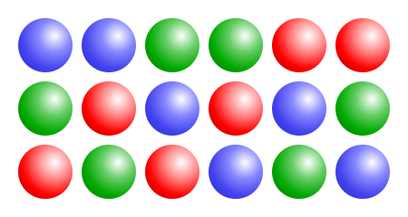

# Generació exhaustiva: Permutacions



Aquesta lliçó presenta algorismes de generació exhaustiva per tal de generar permutacions de determinats conjunts. Per a fer-ho, es presenten diferents exemples de complexitat creixent, alhora que es milloren els algorismes. La recursivitat és la tècnica fonamental d'aquest tipus d'algorismes combinatoris.


## Permutacions

Comencem amb un programa que escrigui (en ordre lexicogràfic) totes les permutacions de $\\{1,...,n\\}$ per a una $n\ge0$ donada. Per exemple, per a $n = 3$, caldria escriure

```text
1,2,3
1,3,2
2,1,3
2,3,1
3,1,2
3,2,1
```

En total, hi ha doncs $n!$ permutacions diferents.

L'acció `generar_permutacions` s'encarrega de la tasca principal:

```python
def generar_permutacions(n: int) -> None:
    """Escriu totes les permutacions de {1..n}, per a n ≥ 0."""
```

De nou, la tècnica per a resoldre el problema és la recursivitat i consistirà en tenir una acció auxiliar que escriu totes les possibles permutacions per a un prefix `L` donat:

```python
def generar_permutacions_rec(n: int, L: list[int]) -> None:
    """Escriu totes les permutacions de {1..n} que comencin amb L, per a n ≥ |L| ≥ 0."""
```

Per exemple, `generar_permutacions_rec(4, [3, 2])` hauria d'escriure aquestes dues permutacions:

```text
3,2,1,4
3,2,4,1
```

És clar que l'acció principal ha d'engegar l'acció recursiva amb un prefix buit:

```python
def generar_permutacions(n: int) -> None:
    """Escriu totes les permutacions de {1..n}, per a n ≥ 0."""

    generar_permutacions_rec(n, [])
```

La implementació de l'acció recursiva podria ser aquesta:

```python
def generar_permutacions_rec(n: int, L: list[int]) -> None:
    """Escriu totes les permutacions de {1..n} que comencin amb L, per a n ≥ |L| ≥ 0."""

    if len(L) == n:
        escriure(n)
    else:
        for x in range(1, n+1):
            if x not L:
                generar_permutacions_rec(n , L + [x])
```

El cas base es dóna quan `L` ja és de llargada `n`, i llavors només cal escriure `L` en el format prescrit. El cas recursiu, quan `len(L) < n`, consisteix en afegir un element `x` al final de `L`. Aquest `x` pot ser qualsevol element en entre 1 i `n` que encara no s'hagi posat en `L` (perquè, en una permutació, no poden haver-hi repetits).


## Una millora d'eficiència

Malgrat que el programa anterior és perfectament correcte, aquesta solució té dues fonts d'ineficiència:

1. D'una banda, com al primer exemple de generació de combinacions, cal fer una còpia de la llista abans de realitzar cada crida recursiva.

2. D'altra banda, també cal fer una cerca d'un element a la llista per no afegir repeticions.

El primer defecte es pot arreglar com abans: fixant la llargada de la llista al moment de crear-la i especificant amb un paràmetre addicional `i` quines són les seves posicions fixades.

El segon defecte es pot arreglar amb un vector de booleans que indiqui, per a cada valor entre 1 i `n`, si ja s'ha usat o no.

Amb aquests elements, la nova capçalera de la funció recursiva seria la següent:

```python
def generar_permutacions_rec(n: int, L: list[int], i: int, usats: list[bool]) -> None:
    """
    Escriu totes les permutacions de {1..n} que comencin amb L[:i],
    amb n ≥ i ≥ 0, |L| = n, |usats| = n+1 i amb usats[x] = (x ∈ L[:i]) per a tot x∈{1..n}.
    """
```

Per tant, `n` denota el nombre d'elements a permutar, `L` és una llista amb `n` posicions, de les quals `i` ja han estat fixades i `usats` és un vector de `n + 1` booleans. El que es troba a la posició 0 no és rellevant, però la resta de booleans a la posició `x` indiquen si `x` és o no un element en les primeres `i` posicions d'`L`. És preferible malgastar aquesta posició de memòria que embolicar el codi per aprofitar-la.

Ara l'acció principal ha d'engegar l'acció recursiva amb un prefix buit però una llista amb `n` elements i amb tots els booleans a fals de la forma següent:

```python
def generar_permutacions(n: int) -> None:
    """Escriu totes les permutacions de {1..n}, per a n ≥ 0."""

    L = [0 for _ in range(n)]  # els valors no són importants, la llargada sí
    usats = [False for _ in range(n + 1)]  # la posició 0 no s'utilitza
    generar_permutacions_rec(0, L, 0, usats)
```

I la funció recursiva es pot implementar així:

```python
def generar_permutacions_rec(n: int, L: list[int], i: int, usats: list[bool]) -> None:
    """
    Escriu totes les permutacions de {1..n} que comencin amb L[:i],
    amb n ≥ i ≥ 0, |L| = n, |usats| = n+1 i amb usats[x] = (x ∈ L[:i]) per a tot x∈{1..n}.
    """

    if i == n:
        escriure(L)
    else:
        for x in range(1, n + 1):
            if not usats[x]:
                L[i] = x
                usats[x] = True
                generar_permutacions_rec(n, L, i + 1, usats)
                usats[x] = False
```

En el cas recursiu, ara ja només es crida recursivament pels valors `x` que no hagin estat prèviament usats. Però, és clar, abans de cridar recursivament, cal marcar `x` com a usat, d'aquí l'assignació `usats[x] = True`. I, també, després de cridar recursivament, cal desmarcar `x` com a usat, d'aquí l'assignació `usats[x] = False`. És fàcil deixar-se de desmarcar l'ús de `x`, però fixeu-vos que és imprescindible de fer perquè, sinó, a les properes crides recursives de les iteracions restants aquell element no estaria disponible.

L'arbre de crides i el valor actual de `L` en el cas $n=3$ és el següent:

<pre class="info custom-block" style='line-height: 1.25;'>
[·,·,·]
├── [1,·,·]
│   ├── [1,2,·]
│   │   └── [1,2,3]
│   └── [1,3,·]
│       └── [1,3,2]
├── [2,·,·]
│   ├── [2,1,·]
│   │   └── [2,1,3]
│   └── [2,3,·]
│       └── [2,3,1]
└── [3,·,·]
    ├── [3,1,·]
    │   └── [3,1,2]
    └── [3,2,·]
        └── [3,2,1]
</pre>


<Autors autors="jpetit"/>
