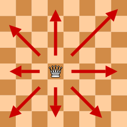
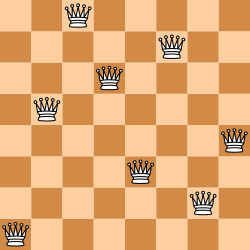

# Aplicació: Les *n* reines


Com aplicació de les tècniques de generació exhaustiva, aquesta lliçó mostra com resoldre el famós trencaclosques de les vuit reines. 


## El problema

Recordeu que al joc dels escacs les reines amenacen en horitzontal, vertical i diagonal:



Podeu col·locar vuit reines en un tauler d'escacs sense que cap reina amenaci cap altra? 

Aquí en teniu una possible solució (i, en total, n'hi ha 92):



A continuació, anem a fer un programa per resoldre una versió generalitzada del trencaclosques: donat un valor `n`, volem escriure totes les maneres de col·locar `n` reines en un tauler d'`n⨉n` escacs. Per exemple, aquestes serien les dues úniques possibles col·locacions de 4 reines en un tauler 4⨉4:

```text
· ♕ · · 
· · · ♕ 
♕ · · · 
· · ♕ · 

· · ♕ · 
♕ · · · 
· · · ♕ 
· ♕ · · 
```

Cal doncs posar `n` reines en un tauler `n⨉n` de forma que cap parell de reines es trobin:

- a la mateixa fila,
- a la mateixa columna,
- a la mateixa diagonal ascendent, ni
- a la mateixa diagonal descendent.


## Espai de cerca

Per fer el programa, realitzarem una cerca exhaustiva en l'espai de possibles configuracions. Cada configuració consisteix en la col·locació de reines en posicions del tauler. 

Per a un tauler 8⨉8, aquest espai de cerca és enorme:

- Si considerem posar o no posar una reina a cada casella, hi ha
$2^{64}$ configuracions possibles a explorar. Però moltes són inútils: cal col·locar exactament 8 reines.

- Si considerem triar 8 posicions diferents, hi ha
$\binom{64}{8} = 4.426.165.368$ configuracions possibles a explorar. Però moltes també són inútils: no pot haver-hi mai més d'una reina per fila.

- Si considerem triar 8 posicions en files diferents, hi ha
$8^8 = 16.777.216$ configuracions possibles a explorar. Però moltes també són inútils: no pot haver-hi mai més d'una reina per fila *i* per columna.

- Si considerem triar 8 posicions en files i columnes diferents, hi ha
$8! = 40.320$ configuracions possibles a explorar. 

Però, descartant solucions on ja hi hagi amenaces, ho podem fer encara millor! Es tracta de fer que la cerca sigui exhaustiva, però sense perdre el temps en configuracions que no portin enlloc.


## Representació

Una manera concisa de representar una solució és donar la columna de cada reina en cada fila. Per exemple, la solució 

```text
· · ♕ · · · · ·
· · · · · · ♕ · 
· · · ♕ · · · · 
· ♕ · · · · · ·
· · · · · · · ♕
· · · · ♕ · · · 
· · · · · · ♕ · 
♕ · · · · · · · 
```

es pot representar amb la llista `[7, 3, 0, 2, 5, 1, 6, 4]` (comencem a comptar des de zero). 

Una solució parcial correspon a la col·locació d'un subconjunt de reines en les primeres columnes. Podem representar solucions parcial restringint els valors de la llista a unes quantes posicions inicials. Així, les primeres `5` posicions de la llista `[7, 3, 0, 2, 1, 2, 3, 4]` representen la solució parcial

```text
· · ♕ · · · · ·
· · · · ♕ · · · 
· · · ♕ · · · · 
· ♕ · · · · · ·
· · · · · · · ·
· · · · · · · · 
· · · · · · · · 
♕ · · · · · · · 
```

i les darreres 3 posicions són irrellevants. 

Representarem les solucions parcials amb el tipus `SolParcial`:

```python
SolParcial: TypeAlias = list[int]
```

Les solucions parcials sense amenaces entre parells de reines s'anomenen solucions legals. Una solució és una solució parcial amb les `n` reines col·locades.


## Algorisme

L'algorisme procedirà a buscar solucions parcials legals, tot intentant omplir el tauler progressivament, per files de dalt a baix. Per cada fila, es provarà de mirar si es pot col·locar legalment una reina a cadascuna de les seves `n` posicions (files), una rere l'altra. En cas afirmatiu, aquella reina es col·locarà en aquella columna i fila i es provarà d'estendre la solució parcial. Si en algun moment es troba una solució parcial amb totes les `n` reines col·locades, s'escriu la solució. Altrament, es tira enrere traient la darrera reina col·locada i provant una altra posició per a ella. Si no li queden més columnes, anirà enrere, fent el mateix per la fila anterior.

Comencem amb la funció principal cridant a la funció recursiva amb una solució parcial amb zero reines col·locades:

```python
def genera_reines(n: int) -> None:
    """Escriu totes les maneres de col·locar n reines en un tauler n⨉n."""

    s: SolParcial = [-1 for _ in range(n)]  # els valors són irrellevants, la llargada no.
    genera_reines_rec(n, s, 0)
```

La funció recursiva rep el valor d'`n` i la solució parcial, que és una llista `s` d'`n` posicions on només les `i` primeres tenen un valor rellevant. El seu propòsit és escriure totes les solucions que estenen la solució parcial donada:

```python
def genera_reines_rec(n: int, s: SolParcial, i: int) -> None:
    """
    Escriu totes les maneres de col·locar n reines en un tauler n⨉n
    de forma que les i primeres reines es col·loquen a les primeres i
    posicions de s. Aquestes primeres i posicions són una solució parcial legal.
    """

    if i == n:
        escriure_reines(s)
    else:
        for j in range(n):
            if legal(s, i, j):
                s[i] = j
                genera_reines_rec(n, s, i+1)
```

El seu funcionament és com segueix:

- El cas base és quan el nombre `i` de reines a la solució parcial correspon al nombre de reines total `n`. En aquest cas, cal escriure la solució parcial, ja que és una solució final legal. 

- Altrament, la variable `j` recorre cadascuna de les `n` columnes de la fila `i`. Per a cada `j`, es mira si és legal col·locar la reina de la fila `i` a la columna `j` tenint en compte la solució parcial `s` usant la funció `legal`. En cas afirmatiu, es col·loca la reina en aquella posició i es continua recursivament amb una reina més inclosa la solució parcial. 

La funció `legal` comprova si es pot col·locar una reina a la fila `i` i a la columna `j` per a la solució parcial `s` fins a la posició `i`. La reina a la fila `i` i columna `j` amenaça a una reina a la fila `k` si comparteixen:

- una columna (quan `j = s[k]`), o 
- una diagonal descendent ↘ (quan `j - i == s[k] - k`), o
- una diagonal ascendent ↗ (quan `j + i == s[k] + k`).

Aquesta és la implementació corresponent:

```python
def legal(s: SolParcial, i: int, j: int) -> bool:
    """Indica si és legal col·locar una reina a la fila i i columna j per a a solució parcial s."""

    for k in range(i):
        if j == s[k] or j - i == s[k] - k or j + i == s[k] + k:
            return False
    return True
```

La funció `escriure_reines` és purament cosmètica:

```python
def escriure_reines(s: SolParcial) -> None:
    """Escriu en format tauler la solució emmagatzemada en s."""

    for p in s:
        print('· ' * p, '♕ ', '· ' * (len(s) - p - 1), sep='')
    print()
```

Aquest és el programa complet:

```python
from typing import TypeAlias
from yogi import read


SolParcial: TypeAlias = list[int]


def escriure_reines(s: SolParcial) -> None:
    """Escriu en format tauler la solució emmagatzemada en s."""

    for p in s:
        print('· ' * p, '♕ ', '· ' * (len(s) - p - 1), sep='')
    print()


def legal(s: SolParcial, i: int, j: int) -> bool:
    """Indica si és legal col·locar una reina a la fila i i columna j per a a solució parcial s."""

    for k in range(i):
        if j == s[k] or j - i == s[k] - k or j + i == s[k] + k:
            return False
    return True


def genera_reines_rec(n: int, s: SolParcial, i: int) -> None:
    """
    Escriu totes les maneres de col·locar n reines en un tauler n⨉n
    de forma que les i primeres reines es col·loquen a les primeres i
    posicions de s. Aquestes primeres i posicions són una solució parcial legal.
    """

    if i == n:
        escriure_reines(s)
    else:
        for j in range(n):
            if legal(s, i, j):
                s[i] = j
                genera_reines_rec(n, s, i+1)


def genera_reines(n: int) -> None:
    """Escriu totes les maneres de col·locar n reines en un tauler n⨉n."""

    s: SolParcial = [-1 for _ in range(n)]  # els valors són irrellevants, la llargada no.
    genera_reines_rec(n, s, 0)


if name == '__main__':
    genera_reines(read(int))    
```


## Exercicis

- Modifiqueu el programa anterior per tal que només trobi una solució.

- Modifiqueu el programa anterior per tal que compti el nombre de solucions.

- Modifiqueu el programa anterior per tal que compti quantes solucions parcials es visiten.


## Ús de marcatges

🚧 Falta fer


<Autors autors="jpetit"/> 

