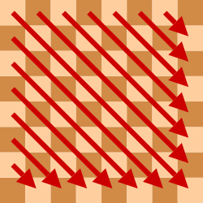
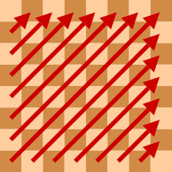

# Aplicació: Les _n_ reines


Com aplicació de les tècniques de generació exhaustiva, aquesta lliçó mostra com resoldre el famós trencaclosques de les $n$ reines.

## El problema

Recordeu que al joc dels escacs les reines amenacen en horitzontal, vertical i diagonal:


Podeu col·locar vuit reines en un tauler d'escacs sense que cap reina amenaci cap altra?

Aquí en teniu una possible solució (i, en total, n'hi ha 92):


A continuació, anem a fer un programa per resoldre una versió generalitzada del trencaclosques: donat un valor `n`, volem escriure totes les maneres de col·locar `n` reines en un tauler d'`n⨉n` escacs. Per exemple, aquestes serien les 2 úniques possibles col·locacions de 4 reines en un tauler 4⨉4:

```text
· ♕ · ·
· · ♕ ·
♕ · · ·
· · · ♕

· · ♕ ·
♕ · · ·
· ♕ · ·
· · · ♕
```

Cal doncs posar `n` reines en un tauler `n⨉n` de forma que cap parell de reines es trobin:

-   a la mateixa fila,
-   a la mateixa columna,
-   a la mateixa diagonal ascendent, ni
-   a la mateixa diagonal descendent.

## Espai de cerca

Per fer el programa, realitzarem una cerca exhaustiva en l'espai de possibles configuracions. Cada configuració consisteix en la col·locació de reines en posicions del tauler.

Per a un tauler 8⨉8, aquest espai de cerca és enorme:

-   Si considerem posar o no posar una reina a cada casella, hi ha
    $2^{64}$ configuracions possibles a explorar. Però moltes són inútils: cal col·locar exactament 8 reines.

-   Si considerem triar 8 posicions diferents, hi ha
    $\binom{64}{8} = 4.426.165.368$ configuracions possibles a explorar. Però moltes també són inútils: no pot haver-hi mai més d'una reina per fila.

-   Si considerem triar 8 posicions en files diferents, hi ha
    $8^8 = 16.777.216$ configuracions possibles a explorar. Però moltes també són inútils: no pot haver-hi mai més d'una reina per fila _i_ per columna.

-   Si considerem triar 8 posicions en files i columnes diferents, hi ha
    $8! = 40.320$ configuracions possibles a explorar.

Però, descartant solucions on ja hi hagi amenaces, ho podem fer encara millor! Es tracta de fer que la cerca sigui exhaustiva, però sense perdre el temps en configuracions que no portin enlloc.

## Representació

Una manera concisa de representar una solució és donar la fila de cada reina per cada columna. Per exemple, la solució

```text
· · ♕ · · · · ·
· · · · · · ♕ ·
· · · ♕ · · · ·
· ♕ · · · · · ·
· · · · · · · ♕
· · · · ♕ · · ·
· · · · · · ♕ ·
♕ · · · · · · ·
```

es pot representar amb la llista `[7, 3, 0, 2, 5, 1, 6, 4]` (comencem a comptar des de zero).

Una solució parcial correspon a la col·locació d'un subconjunt de reines en les primeres columnes. Podem representar solucions parcial restringint els valors de la llista a unes quantes posicions inicials. Així, les primeres `5` posicions de la llista `[7, 3, 0, 2, 1, ·, ·, ·]` representen la solució parcial

```text
· · ♕ · · · · ·
· · · · ♕ · · ·
· · · ♕ · · · ·
· ♕ · · · · · ·
· · · · · · · ·
· · · · · · · ·
· · · · · · · ·
♕ · · · · · · ·
```

on les darreres 3 posicions són irrellevants i per això s'han marcat amb un puntet.

Representarem les solucions parcials amb el tipus `SolParcial`:

```python
SolParcial: TypeAlias = list[int]
```

Les solucions parcials sense amenaces entre parells de reines s'anomenen solucions _legals_. Una solució parcial legal amb les `n` reines col·locades és una solució _final_.

## Algorisme

L'algorisme procedirà a buscar solucions parcials legals, cada cop més grans, tot intentant omplir el tauler progressivament, per columnes d'esquerra a dreta. Per cada columna, es provarà de mirar si es pot col·locar legalment una reina a cadascuna de les seves `n` posicions (files), una rere l'altra. En cas afirmatiu, aquella reina es col·locarà en aquella columna i fila i es provarà d'estendre aquella solució parcial. Si en algun moment es troba una solució parcial amb totes les `n` reines col·locades, es té una solució final que cal escriure. Altrament, es tira enrere traient la darrera reina col·locada i provant una altra posició per a ella. Si no li queden més files, s'anirà enrere, fent el mateix per la columna anterior.

Comencem amb la funció principal cridant a la funció recursiva amb una solució parcial amb zero reines col·locades:

```python
def generar_reines(n: int) -> None:
    """Escriu totes les maneres de col·locar n reines en un tauler n⨉n."""

    s: SolParcial = [-1 for _ in range(n)]  # els valors són irrellevants, la llargada no.
    generar_reines_rec(n, s, 0)
```

La funció recursiva rep la mida `n` del tauler i la solució parcial, que és una llista `s` d'`n` posicions on només les `j` primeres tenen un valor rellevant. El seu propòsit és escriure totes les solucions que estenen la solució parcial donada:

```python
def generar_reines_rec(n: int, s: SolParcial, j: int) -> None:
    """
    Escriu totes les maneres de col·locar n reines en un tauler n⨉n
    de forma que les j primeres reines es col·loquen a les primeres j
    posicions de s. Aquestes primeres j posicions són una solució parcial legal.
    """

    if j == n:
        escriure_reines(s)
    else:
        for i in range(n):
            if legal(s, i, j):
                s[j] = i
                generar_reines_rec(n, s, j + 1)
```

El seu funcionament és com segueix:

-   El cas base és quan el nombre `j` de reines a la solució parcial correspon al nombre de reines total `n`. En aquest cas, cal escriure la solució parcial, ja que és una solució final.

-   Altrament, la variable `i` recorre cadascuna de les `n` files de la columna `j`. Per a cada `i`, es mira si és legal col·locar la reina de la columna `j` a la columna `i` tenint en compte la solució parcial `s` usant la funció `legal`. En cas afirmatiu, es col·loca la reina en aquella posició i es continua recursivament amb una reina més inclosa la solució parcial.

La funció `legal` comprova si es pot col·locar una reina a la fila `i` i a la columna `j` per a la solució parcial `s` fins a la columna `j`. La reina a la fila `i` i columna `j` amenaça a una reina a la fila `k` si comparteixen:

-   una columna (quan `i = s[k]`), o
-   una diagonal descendent ↘ o una diagonal ascendent ↗ (quan `|s[k] - i| = |k - j|`). Comproveu-ho!

Aquesta és la implementació corresponent:

```python
def legal(s: SolParcial, i: int, j: int) -> bool:
    """Indica si és legal col·locar una reina a la fila i i columna j per a a solució parcial s."""

    for k in range(j):
        if s[k] == i or abs(s[k] - i) == abs(k - j):
            return False
    return True
```

La funció `escriure_reines` és purament cosmètica:

```python
def escriure_reines(s: SolParcial) -> None:
    """Escriu en format tauler la solució emmagatzemada en s."""

    for p in s:
        print('· ' * p, '♕ ', '· ' * (len(s) - p - 1), sep='')
    print()
```

Aquest és el programa complet:

```python
from typing import TypeAlias
from yogi import read


SolParcial: TypeAlias = list[int]


def escriure_reines(s: SolParcial) -> None:
    """Escriu en format tauler la solució emmagatzemada en s."""

    for p in s:
        print('· ' * p, '♕ ', '· ' * (len(s) - p - 1), sep='')
    print()


def legal(s: SolParcial, i: int, j: int) -> bool:
    """Indica si és legal col·locar una reina a la fila i i columna j per a a solució parcial s."""

    for k in range(j):
        if s[k] == i or abs(s[k] - i) == abs(k - j):
            return False
    return True


def generar_reines_rec(n: int, s: SolParcial, j: int) -> None:
    """
    Escriu totes les maneres de col·locar n reines en un tauler n⨉n
    de forma que les j primeres reines es col·loquen a les primeres j
    posicions de s. Aquestes primeres j posicions són una solució parcial legal.
    """

    if j == n:
        escriure_reines(s)
    else:
        for i in range(n):
            if legal(s, i, j):
                s[j] = i
                generar_reines_rec(n, s, j + 1)


def generar_reines(n: int) -> None:
    """Escriu totes les maneres de col·locar n reines en un tauler n⨉n."""

    s: SolParcial = [-1 for _ in range(n)]  # els valors són irrellevants, la llargada no.
    generar_reines_rec(n, s, 0)


if __name__ == '__main__':
    generar_reines(read(int))
```

## Exercicis

-   Modifiqueu el programa anterior per tal que només trobi una solució.

-   Modifiqueu el programa anterior per tal que compti el nombre de solucions totals.

-   Modifiqueu el programa anterior per tal que compti quantes solucions parcials es visiten.

## Ús de marcatges

Com ha passat altres vegades en problemes de combinacions i permutacions, podem accelerar el programa si ens adonem que la funció `legal` fa un una cerca que podem eliminar utlitzant marcatges. En efecte, el propòsit de la funció `legal` és comprovar si la reina a la fila `i` i columna `j` amenaça a alguna de les reines ja col·locades a les columnes anteriors.

Necessitem saber si ja hi ha una reina a la mateixa fila, a la mateixa diagonal descendent o a la mateixa diagonal ascendent:

-   Per saber si ja hi ha una reina a la fila `i`, podem fer servir una llista de booleans `files` que ens indiqui si ja hi ha una reina a la fila `i`. Al principi, totes les files estan lliures. Quan col·loquem una reina a la fila `i`, marquem la fila `i` com ocupada. Quan treiem una reina de la fila `i`, la marquem com lliure.

-   Per saber si ja hi ha una reina a la diagonal descendent ↘, podem fer servir una llista de booleans `descendents` que ens indiqui si ja hi ha una reina a la diagonal descendent que passa per la fila `i` i columna `j`. El nombre de diagonals descendents és `2n - 1` i la diagonal descendent que passa per la fila `i` i columna `j` té índex `j - i + n - 1`.

     

-   Igualment, per saber si ja hi ha una reina a la diagonal ascendent ↗, podem fer servir una llista de booleans `ascendents` que ens indiqui si ja hi ha una reina a la diagonal ascendent que passa per la fila `i` i columna `j`. El nombre de diagonals ascendents és `2n - 1` i la diagonal ascendent que passa per la fila `i` i columna `j` té índex `j + i`.

    

El programa modificat amb aquests marcatges és el següent:

```python
from typing import TypeAlias
from yogi import read


SolParcial: TypeAlias = list[int]
Marques: TypeAlias = list[bool]


def escriure_reines(s: SolParcial) -> None:
    """Escriu en format tauler la solució emmagatzemada en s."""

    for p in s:
        print("· " * p, "♕ ", "· " * (len(s) - p - 1), sep="")
    print()


def generar_reines_rec(
    n: int, s: SolParcial, j: int, files: Marques, descendents: Marques, ascendents: Marques
) -> None:
    """
    Escriu totes les maneres de col·locar n reines en un tauler n⨉n
    de forma que les j primeres reines es col·loquen a les primeres j
    posicions de s. Aquestes primeres j posicions són una solució parcial legal
    i les marques indiquen les posicions ocupades.
    """

    if j == n:
        escriure_reines(s)
    else:
        for i in range(n):
            if not files[i] and not descendents[j - i + n - 1] and not ascendents[j + i]:
                s[j] = i
                files[i] = descendents[j - i + n - 1] = ascendents[j + i] = True
                generar_reines_rec(n, s, j + 1, files, descendents, ascendents)
                files[i] = descendents[j - i + n - 1] = ascendents[j + i] = False


def generar_reines(n: int) -> None:
    """Escriu totes les maneres de col·locar n reines en un tauler n⨉n."""

    s: SolParcial = [-1 for _ in range(n)]  # els valors són irrellevants, la llargada no.
    files = [False for _ in range(n)]  # marques de les files ocupades
    descendents = [False for _ in range(2 * n - 1)]  # marques de les diagonals descendents ocupades
    ascendents = [False for _ in range(2 * n - 1)]  # marques de les diagonals ascendents ocupades
    generar_reines_rec(n, s, 0, files, descendents, ascendents)


if __name__ == "__main__":
    generar_reines(read(int))
```

Ara s'ha definit un tipus `Marques` per tipar les llistes de booleans que s'usen com a marcatges. L'acció `generar_reines` declara tres d'aquestes marques, per a files, diagonals descendents i diagonals ascendents, inicialitzant-les totes a `False`. La legalitat de col·locar una reina a la fila `i` i columna `j` es comprova amb les marques corresponents, que s'actualitzen quan es col·loca o es treu una reina d'aquella posició.

Així, cada consulta de legalitat es pot fer en temps constant enlloc de temps lineal. Per tant, el temps d'execució del programa es redueix considerablement.

<Autors autors="jpetit"/>
