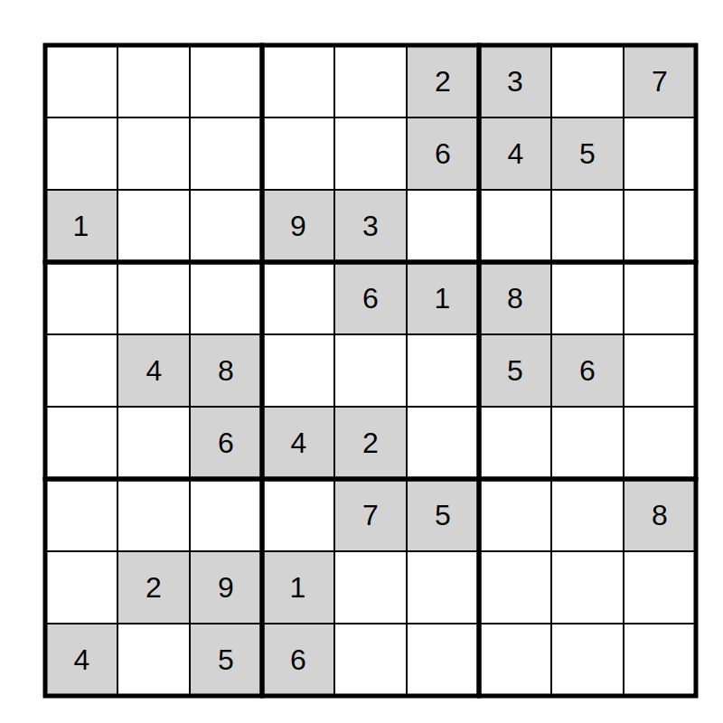

# Aplicació: Resolució de Sudokus


Com aplicació de les tècniques de generació exhaustiva, aquesta lliçó mostra com resoldre el famós trencaclosque del sudoku.

Per això, escriurem un programa que llegeixi un sudoku amb forats i el resolgui.

## El problema

El sudoku (del japonès 数独) és un trencaclosques per exercitar la lògica. El trencaclosques es juga en una graella de 9×9 files i columnes subdividida en 9 subgraelles de 3×3 anomenades regions. En algunes de les caselles de la graella es donen uns números inicials entre 1 i 9, i l'objectiu és col·locar un número de l'1 al 9 en cada casella buida de manera que mai coincideixin dos números iguals en cap fila, cap columna, i cap regió. Cada sudoku hauria de tenir una única solució.

Per exemple, el sudoku de l'esquerra té com a solució el sudoku de la dreta:




A continuació, anem a fer un programa per resoldre sudokus. El programa no serà gens intel·ligent, simplement resoldrà el problema a base de força bruta utilitzant generació exhaustiva.

## Entrada i sortida

Comencem decidint quin serà el format de l'entrada i la sortida. L'entrada simplement serà una matriu 9×9 que descriu la graella del problema, marcant amb punts les caselles buides. La sortida serà també una matriu 9×9, aquest cop, sense forats. Per exemple, aquesta seria la graella amb forats que descriu el sudoku anterior:

```text
. . . . . 2 3 . 7
. . . . . 6 4 5 .
1 . . 9 3 . . . .
. . . . 6 1 8 . .
. 4 8 . . . 5 6 .
. . 6 4 2 . . . .
. . . . 7 5 . . 8
. 2 9 1 . . . . .
4 . 5 6 . . . . .
```

i aquesta la seva solució:

```text
9 6 4 8 5 2 3 1 7
3 8 2 7 1 6 4 5 9
1 5 7 9 3 4 2 8 6
7 9 3 5 6 1 8 2 4
2 4 8 3 9 7 5 6 1
5 1 6 4 2 8 7 9 3
6 3 1 2 7 5 9 4 8
8 2 9 1 4 3 6 7 5
4 7 5 6 8 9 1 3 2
```

## Programa principal

Comencem pel programa principal. Podria ser quelcom tant simple com això:

```python
def main() -> None:
    """Programa principal per resoldre un sudoku."""

    s: Sudoku = llegir()
    if resol(s):
        escriure(s)
    else:
        print('Sense solució')
```

Aquí, `s` és una variable de tipus `Sudoku` que representa un sudoku i que s'inicialitza al valor resultant de llegir l'entrada amb la funció `llegir`. La funció `resol` és la que s'encarrega de solucionar el sudoku `s` i indica si ho ha fet o no (en principi, tots els sudokus haurien de tenir una solució, però mai s'és prou prudent). En cas afirmatiu, `s` passa a contenir la solució del problema i s'escriu. Altrament, s'escriu un missatge informant que no hi ha solució.

## Representació

Per representar un sudoku és clar que ens cal representar una graella 9⨉9. Podem establir que les posicions buides es marquen amb un zero, i que les posicions que contenen un valor, es marquen amb aquell valor, que es troba entre u i nou. Així doncs, ens cal una matrius de 9⨉9 enters.

Ara bé, per poder accelerar uns càlculs futurs, augmentarem aquesta graella amb uns marcatges. Concretament, per a cada fila, per a cada columna i per a cada regió, tindrem una llista de booleans que ens indicarà si un valor `v` es troba o no en aquella fila, columna o regió. Com que aquest valor es troba entre 1 i 9 però les llistes de Python comencem en zero, la llista contindrà 10 posicions, i no usarem mai la primera (índex 0). Això malgasta una mica de memòria (molt poca!), però fa el programa més clar.

Per exemple, si en algun moment la graella és

```text
9 . . . . 2 3 . 7
3 . 2 . . 6 4 5 .
1 5 7 9 3 . . . .
. . . . 6 1 8 . .
. 4 8 . . . 5 6 .
. . 6 4 2 . . . .
. . . . 7 5 . . 8
. 2 9 1 . . . . .
4 . 5 6 . . 1 3 2
```

llavors, la llista corresponent als valors usats a la primera fila seria `[·, False, True, True, False, False, False, True, False]`: El valor a la posició 0 és irrellevant, el valor `False` a la posició 1 és `False`, perquè el valor 1 no és a la primera fila, i el valor a la posició 2 és `True`, perquè el valor 2 sí que és a la primera fila, ètc.

Igualment, la llista corresponent als valors usats a la darrera columna seria `[·, False, True, False, False, False, True, True, False]`. I la llista corresponent als valors usats a la regió central seria `[·, True, True, False, True, False, True, False, False]`.

Per desar tota aquesta informació usarem l'estructura `Sudoku`:

```python
@dataclass
class Sudoku:
    graella: list[list[int]]
    files: Usats
    columnes: Usats
    regions: Usats
```

on el tipus `Usats` correspon a una llista de 9 llistes de 10 booleans que emmagatzemen els marcatges explicats:

```python
Usats: TypeAlias = list[list[bool]]
```

## Funcions de lectura i escriptura i funcions de suport

Ara que hem definit el tipus `Sudoku`, anem a implementar les operacions per llegir i escriure valors d'aquest tipus.

L'operació d'escriptura no té misteri: només cal escriure els elements de la graella amb el format necessari:

```python
def escriure(s: Sudoku) -> None:
    """Escriu el sudoku s amb el format establert."""

    for i in range(9):
        print(*s.graella[i])
```

Recordeu que quan es fa un `print(*L)` per a una llista `L`, Python escriu tots els elements de la llista separats per un espai.

L'operació de lectura la farem utilitzant dues funcions auxiliars:

```python
def llegir() -> Sudoku:
    """Llegeix un sudoku i el retorna."""

    s = buit()
    for i in range(9):
        for j in range(9):
            v = read(str)
            if v != ".":
                marcar_casella(s, i, j, int(v))
    return s
```

Fixeu-vos que els valors cal llegir-los com a textos (`read(str)`) perquè el punt significa forat.

La funció `buit` simplement retorna un sudoku buit: a la seva graella hi ha totes les caselles buides, i els marcatges així ho reflecteixen. Recordeu que usem 0 com a indicació de manca de valor en una casella:

```python
def buit() -> Sudoku:
    """Retorn un sudoku buit."""

    graella = [[0 for _ in range(9)] for _ in range(9)]
    files = [[False for _ in range(10)] for _ in range(9)]
    columnes = [[False for _ in range(10)] for _ in range(9)]
    caixes = [[False for _ in range(10)] for _ in range(9)]
    return Sudoku(graella, files, columnes, caixes)
```

L'acció `marcar_casella` serveix per col·locar un valor en una casella d'un sudoku. No és tant fàcil com col·locar directament el valor a la posició corresponent a la graella, perquè també cal reflectir-ho als marcatges. A més, aquesta acció ens serà útil més tard.

```python
def marcar_casella(s: Sudoku, i: int, j: int, v: int):
    """Marca la casella i,j del sudoku s amb el valor v."""

    s.graella[i][j] = v
    s.files[i][v] = True
    s.columnes[j][v] = True
    s.caixes[regio(i, j)][v] = True
```

Igualment, ens serà útil disposar de l'acció `desmarcar_casella` que desfà el que fa `marcar_casella`:

```python
def desmarcar_casella(s: Sudoku, i: int, j: int, v: int):
    """Desmarca la casella i,j del sudoku s."""

    s.graella[i][j] = 0
    s.files[i][v] = False
    s.columnes[j][v] = False
    s.caixes[regio(i, j)][v] = False
```

La funció `regio` que ara ens ha aparegut és la que calcula a quina regió es troba una casella donada. Hi ha nou regions i si les enumerem de dalt a baix i d'esquerra a dreta, aquesta funció en retorna l'índex:

```python
def regio(i: int, j: int) -> int:
    """Retorna l'índex de la regió on pertany la casella i,j."""

    return 3*(i//3) + j//3
```

A més, ens serà útil tenir la funció `seguent` que, donada una posició `i,j`, retorna la següent posició a la graella. Si `j` és 8, vol dir que ja hem arribat al final de la fila i cal passar a la següent fila. En cas contrari, només cal passar a la següent columna:

```python
def seguent(i: int, j: int) -> Tuple[int, int]:
    """Retorna la següent posició a la graella."""

    if j == 8:
        return i + 1, 0
    return i, j + 1
```

Assegureu-vos d'haver entès tota aquesta part abans de continuar!

## Resolució recursiva

L'algorisme per resoldre el sudoku funcionarà amb força bruta i és semblant al del problema de les `n` reines. Concretament, l'algorisme procedirà recursivament intentant omplir successivament les caselles de la graella fins que trobi la solució o trobi que no pot continuar. Concretament, aquí anirem resolent el sudoku per files, i per columnes dins de cada fila.

La funció `resol` que hem cridat al programa principal és la que s'encarrega de posar la resolució recursiva en marxa, començant a resoldre el sudoku per la primera casella superior esquerra amb coordenades 0,0:

```python
def resol(s: Sudoku) -> bool:
    """
    Resol el sudoku s i indica si s'ha trobat o no solució.
    En el cas afirmatiu, s conté la solució.
    """

    return resol_rec(s, 0, 0)
```

Qui fa doncs el gruix de la feina és `resol_rec`. Aquesta és la seva especificació:

```python
def resol_rec(s: Sudoku, i: int, j: int) -> bool:
    """
    Resol el sudoku s recursivament sabent que és legal fins a la posició i,j
    (no inclosa). Indica si s'ha trobat o no solució.
    En el cas afirmatiu, s conté la solució.
    """
```

Com que `resol_rec` és una funció recursiva, n'hem de veure quin és el seu cas base i el seu cas recursiu:

-   Quan tot el sudoku `s` és ple (sense forats), vol dir que ja sha trobat la solució. Aquest cas el podem identificar quan l'índex de la fila sigui més gran que el nombre de files reals (és a dir, quan `i` sigui 9). Llavors, només cal retornar `True` per indicar que, en efecte, el sudoku ja està resolt.

-   Altrament, si la casella `i,j` ja té un valor, no cal fer res més que cridar recursivament `resol_rec` amb la següent casella. Però si la casella està buida, cal provar a posar-hi tots els valors possibles (de l'1 al 9) que siguin legals (mirant i actualitzant els marcatges) i cridar recursivament `resol_rec` amb la següent casella. Si en algun moment es troba una solució, cal retornar `True`. Si no es troba cap solució, cal retornar `False`.

```python
def resol_rec(s: Sudoku, i: int, j: int) -> bool:
    """
    Resol el sudoku s recursivament sabent que és legal fins a la posició i,j
    (no inclosa). Indica si s'ha trobat o no solució.
    En el cas afirmatiu, s conté la solució.
    """

    if i == 9:
        return True

    si, sj = seguent(i, j)

    if s.graella[i][j] != 0:
        return resol_rec(s, si, sj)
    else:
        for v in range(1, 10):
            if legal(s, i, j, v):
                marcar_casella(s, i, j, v)
                if resol_rec(s, si, sj):
                    return True
                desmarcar_casella(s, i, j, v)
        return False
```

La funció `legal` indica si és legal posar un valor `v` a la casella `i,j` de la graella `s`. Això es pot fer simplement mirant els marcatges corresponents:

```python
def legal(s: Sudoku, i: int, j: int, v: int) -> bool:
    """Indica si és legal posar el valor v a la casella i,j de s."""

    return not s.files[i][v] and not s.columnes[j][v] and not s.caixes[regio(i, j)][v]
```

## Programa complet

Per completesa, aquí teniu el programa sencèr:

```python
"""Resolució de Sudokus"""

from dataclasses import dataclass
from typing import TypeAlias
from yogi import read

Usats: TypeAlias = list[list[bool]]

@dataclass
class Sudoku:
    graella: list[list[int]]
    files: Usats
    columnes: Usats
    caixes: Usats

def buit() -> Sudoku:
    """Retorn un sudoku buit."""

    graella = [[0 for _ in range(9)] for _ in range(9)]
    files = [[False for _ in range(10)] for _ in range(9)]
    columnes = [[False for _ in range(10)] for _ in range(9)]
    caixes = [[False for _ in range(10)] for _ in range(9)]
    return Sudoku(graella, files, columnes, caixes)

def escriure(s: Sudoku) -> None:
    """Escriu el sudoku s en el format establert."""

    for i in range(9):
        print(*s.graella[i])

def llegir() -> Sudoku:
    """Llegeix un sudoku i el retorna."""

    s = buit()
    for i in range(9):
        for j in range(9):
            v = read(str)
            if v != ".":
                marcar_casella(s, i, j, int(v))
    return s

def marcar_casella(s: Sudoku, i: int, j: int, v: int):
    """Marca la casella i,j del sudoku s amb el valor v."""

    s.graella[i][j] = v
    s.files[i][v] = True
    s.columnes[j][v] = True
    s.caixes[regio(i, j)][v] = True

def desmarcar_casella(s: Sudoku, i: int, j: int, v: int):
    """Desmarca la casella i,j del sudoku s."""

    s.graella[i][j] = 0
    s.files[i][v] = False
    s.columnes[j][v] = False
    s.caixes[regio(i, j)][v] = False

def regio(i: int, j: int) -> int:
    """Retorna l'índex de la regió on pertany la casella i,j."""

    return 3 * (i // 3) + j // 3

def seguent(i: int, j: int) -> tuple[int, int]:
    """Retorna la següent casella de la casel·la i,j."""

    if j == 8:
        return i + 1, 0
    return i, j + 1

def legal(s: Sudoku, i: int, j: int, v: int) -> bool:
    """Indica si és legal posar el valor v a la casella i,j de s."""

    return not s.files[i][v] and not s.columnes[j][v] and not s.caixes[regio(i, j)][v]

def resol_rec(s: Sudoku, i: int, j: int) -> bool:
    """
    Resol el sudoku s recursivament sabent que és legal fins a la posició i,j
    (no inclosa). Indica si s'ha trobat o no solució.
    """

    if i == 9:
        return True

    si, sj = seguent(i, j)

    if s.graella[i][j] != 0:
        return resol_rec(s, si, sj)
    else:
        for v in range(1, 10):
            if legal(s, i, j, v):
                marcar_casella(s, i, j, v)
                if resol_rec(s, si, sj):
                    return True
                desmarcar_casella(s, i, j, v)
        return False

def resol(s: Sudoku) -> bool:
    """
    Resol el sudoku s i indica si s'ha trobat o no solució.
    """
    return resol_rec(s, 0, 0)

def main() -> None:
    """Programa principal."""

    s: Sudoku = llegir()
    if resol(s):
        escriure(s)
    else:
        print("Sense solució")

if __name__ == "__main__":
    main()
```

## Jocs de proves

Per provar el programa, podeu utilitzar els següents jocs de proves:

-   Joc de proves 1: [entrada](./1.inp.txt) / [sortida](./1.out.txt)
-   Joc de proves 2: [entrada](./2.inp.txt) / [sortida](./2.out.txt)
-   Joc de proves 3: [entrada](./3.inp.txt) / [sortida](./3.out.txt)
-   Joc de proves 4: [entrada](./4.inp.txt) / [sortida](./4.out.txt)

<Autors autors="jpetit"/>
```
