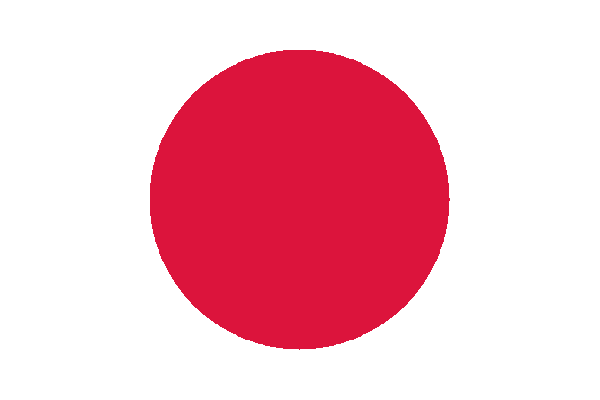
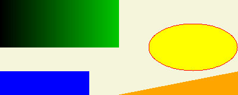

# Gràfics simples en Python amb PIL

Aquest document explica amb dos exemples les instruccions bàsiques que
permeten resoldre els problemes del curs "Graphic Problems" de
[Jutge.org](https://jutge.org). Les solucions a aquests problemes s'han de
codificar usant el llenguatge de programació Python3 amb la llibreria PIL.

## Instal·lació 💻

Per poder seguir aquest tutorial haureu d'instal·lar primer la llibreria
gràfica Pillow (una branca de PIL):

```bash
pip3 install pillow
```

Segons el vostre sistema, potser haureu d'utilitzar `pip` enlloc de `pip3`.

## Primer exemple: Bandera del Japó 🇯🇵

Comencem presentant una solució possible del problema
[P95451](https://jutge.org/problems/P95451) (Bandera del
Japó).
Recordem que la sortida ha de ser,
amb les mides indicades a l'enunciat,
senzillament un cercle de color vermell intens sobre un fons blanc:



Aquest és el codi:

```python
from PIL import Image, ImageDraw

img = Image.new('RGB', (600, 400), 'White')
dib = ImageDraw.Draw(img)

dib.ellipse([150, 50, 449, 349], 'Crimson')

img.save('output.png')
```

A continuació expliquem els seus elements:

-   La primera línia s'ha d'incloure sempre, i indica els dos únics mòduls de
    `PIL` que ens caldrà usar: `Image` i `ImageDraw`.

-   La primera instrucció crea un objecte anomenat `img` que
    conté una imatge (un mapa de punts). Té tres paràmetres:

    1. El primer indica el mode de la imatge. Nosaltres usarem sempre `'RGB'`.

    2. El segon indica les dimensions de la imatge, les quals podrien dependre de
       les dades d'entrada. En aquest programa, la imatge té sempre `600` punts
       d'amplada i `400` punts d'alçada. El punt de la cantonada superior esquerra
       és el $(0, 0)$, i el punt de la cantonada inferior dreta és el $(599, 399)$.

    3. El tercer paràmetre, que és opcional, dóna un color inicial a tots els punts de
       la imatge, en aquest cas el `'White'`.

    Amb PIL es poden usar, directament amb el seu nom,
    molts dels colors que es poden trobar en aquesta
    [llista de colors](https://en.wikipedia.org/wiki/Web_colors).
    També es poden fer servir triplets d'enters entre $0$ i $255$,
    que en defineixen les intensitats de vermell, verd i blau, respectivament.
    Per exemple, el $(0, 0, 0)$ es correspon al negre (`'Black'`),
    el $(255, 255, 255)$ al blanc (`'White'`),
    el $(255, 0, 0)$ al vermell (`'Red'`), etc.
    Però el color `'Green'`, per exemple, no és pas $(0, 255, 0)$,
    com algú podria pensar.
    Per això, quan l'enunciat d'algun problema mencioni algun nom de color,
    simplement useu el nom donat.

-   La segona instrucció crea un objecte anomenat `dib` que permet dibuixar
    sobre la imatge `img`. Sempre s'ha de posar tal qual.

-   A continuació ve la primera (i única) instrucció de dibuix pròpiament dita
    d'aquest programa.
    Usant el mètode `ellipse`,
    dibuixem una el·lipse de diàmetre horitzontal
    $449 - 150 + 1 = 300$ i diàmetre vertical $349 - 50 + 1 = 300$,
    deixant $150$ punts de
    marge a esquerra i dreta, i $50$ punts de marge per sobre i per sota.
    De fet, com que aquí
    els dos diàmetres són iguals, l'el·lipse és un cercle. L'últim
    paràmetre indica amb quin color s'ha d'omplir el cercle,
    en aquest cas el `'Crimson'`, com indica l'enunciat del problema.

-   L'última instrucció sempre ha de ser exactament la d'aquest programa.
    El que fa és guardar la imatge en format PNG en un fitxer
    anomenat `output.png`.
    Aquest nom `output.png` és obligatori per als problemes del Jutge.

    D'altra banda, si voleu veure la imatge actual en un o més moments del programa,
    directament per pantalla i sense haver de desar-la en cap fitxer, useu la instrucció
    `img.show()` .

Com a conclusió, si executeu aquest programa i visualitzeu el fitxer
`output.png`, veureu una magnífica bandera dels pais del sol naixent!

## Segon exemple: Un mostruari de figures 🖼️

Aquí considerem el problema
[P85894](https://jutge.org/problems/P85894) (Problema de mostra).
Si l'entrada és

```text
Blue
40
```

la sortida ha de ser



Aquesta n'és una solució possible:

```python
from PIL import Image, ImageDraw

def rect(x1, y1, x2, y2, col):
    dib.polygon([(x1, y1), (x2, y1), (x2, y2), (x1, y2)], col)

col = input()
n = int(input())
img = Image.new('RGB', (400, 4*n), 'Beige')
dib = ImageDraw.Draw(img)

rect(0, 3*n, 149, 4*n - 1, col)

dib.ellipse([250, n, 399, 3*n - 1], 'Yellow', 'Red')

dib.polygon([(399, 4*n - 1), (200, 4*n - 1), (399, 3*n)], 'Orange')

for x in range (0, 200):
    for y in range(0, 2*n):
        dib.point((x, y), (0, x, 0))

img.save('output.png')
```

A continuació comentem les novetats que mostra aquest programa:

-   El procediment `rect()` ens serà útil, en aquest problema i altres,
    per dibuixar rectangles de color `col`, amb les $x$
    entre `x1` i `x2`, i les $y$ entre `y1` i `y2`, els extrems inclosos.
    Usa el mètode polygon, el qual permet dibuixar altres polígons, com ara triangles.

-   La primera instrucció llegeix una línia cridant a `input()`, i la guarda a la
    variable `col`, la qual contindrà el nom del color que s'ha d'usar posteriorment.

-   La segona instrucció llegeix una línia, n'obté l'enter que conté cridant a
    `int()`, i el desa a la variable `n`. També es podria utilitzar el mòdul `yogi`.

-   Fixeu-vos que, ara, les dimensions de la imatge `img` són sempre `400` punts d'amplada,
    però són `4*n` punts d'alçada.
    És a dir, aquí l'alçada depèn de l'entrada del programa.
    A la majoria de problemes del Jutge,
    les dues mides de la imatge depenen de les dades d'entrada.

-   Respecte a les instruccions per pintar pròpiament dites,
    primer dibuixem un rectangle de color `col`,
    d'amplada $149 - 0 + 1 = 150$,
    d'alçada $(4n - 1) - 3n + 1 = n$,
    i amb l'extrem superior esquerra a $(0, 3n)$.

-   Després, dibuixem una el·lipse de diàmetre horitzontal
    $399 - 250 + 1 = 150$,
    diàmetre vertical $(3n - 1) - n + 1 = 2n$,
    enganxada al marge dret (els punts més a la dreta tenen $x = 399$),
    i amb $n$ punts tant per sobre com per sota,
    és a dir, centrada verticalment.
    Com que cridem el mètode `ellipse` amb dos colors,
    el primer (`'Yellow'`) s'usa per omplir-la,
    i el segon (`'Red'`) per perfilar-la.

-   Després, dibuixem un triangle amb punts
    $(399, 4n - 1)$, $(200, 4n - 1)$ i $(399, 3n)$, de color `'Orange'`.
    L'ordre en què es donen els tres punts no és important.

-   Segueix un bucle `for` dins d'un altre bucle `for`,
    on per a tot parell (`x`, `y`) amb `x` entre `0` i `199`
    i `y` entre `0` i `2n` $-$ `1`,
    es pinta aquell punt amb el color `(0, x, 0)`, tal i com indica l'enunciat.
    Com que el segon paràmetre del triplet es correspon al color primari verd,
    i tant el vermell com el blau són `0`,
    l'efecte és una transició del negre fins a un verd relativament intens
    ($199$ sobre un màxim de $255$).

    Lògicament, aquests dos bucles es podrien haver fet d'altres maneres:
    per exemple, el `for` per a les `x` podria estar
    dins del `for` per a les `y`.
    O es podrien pintar els punts en altres ordres diferents,
    més o menys artificials.

Com a comentari final,
com que els quatre dibuixos d'aquest problema no se superposen, l'ordre
en què es fan és irrellevant. Per exemple, podríem dibuixar primer els
punts verds, després l'el·lipse, després el triangle i al final el rectangle,
i el resultat seria el mateix.

<Autors autors="roura"/>
