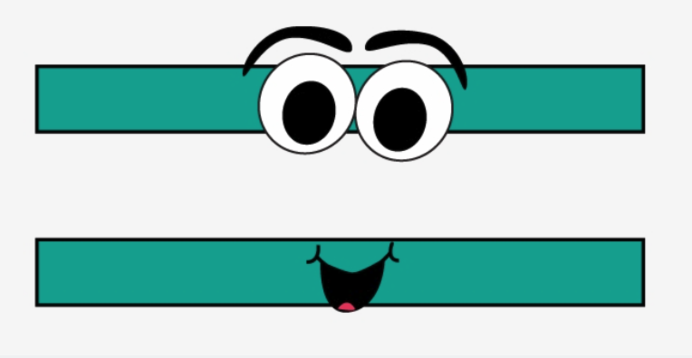

# Variables, assignacions i expressions



Aquesta lliçó explora amb més detall els conceptes d'assignacions, de variables i expressions. Per això, primer es dóna més informació sobre el seu funcionament i es veuen alguns exemples del seu ús, incloent l'increment d'una variable i l'intercanvi de dues variables.

## Variables i assignacions

Quan es programa és essencial desar dades en variables. La forma de desar una dada en particular en una variable és a través de la instrucció d'assignació. En Python, la instrucció d'assignació s'escriu amb l'operador `=`. L'efecte d'executar la instrucció

```python
variable = dada
```

és desar la informació `dada` en la variable `variable`. Aquesta instrucció es llegeix "_variable pren per valor dada_". Per exemple,

```python
jugador10 = 'Messi'
```

desa el text `'Messi'` dins de la variable `jugador10`. Igualment,

```python
mida_de_la_samarreta = 52
```

fa que la variable `mida_de_la_samarreta` prengui `52` per valor.

Una variable es correspon a una posició a la memòria de l'ordinador que emmagatzema una dada. Podeu pensar en una variable com un calaixet amb una etiqueta. L'etiqueta del calaix es correspon al nom de la variable i el contingut del calaixet es correspon a la dada que emmagatzema. Els calaixos tenen noms per tal de poder-los identificar i trobar dins de l'extensa memòria de l'ordinador.

:::tip Consell
Quan veieu una assignació com `v = e`, no llegiu

"<i>v és igual a e</i>"

sinó

"<i>v pren per valor e</i>".
:::

## Identificadors de variables

En Python, els noms de les variables han de ser **identificadors**. Essencialment, un identificador ha de començar per una lletra, i pot anar seguit de zero o més lletres, dígits o subratllats (hi ha identificadors que poden començar amb subratllat, però tenen un significat especial). Les lletres en minúscules i en majúscules són considerades diferents. Per tant, `x`, `y`, `Delta`, `jugador10` i `mida_de_la_samarreta` són identificadors vàlids i, per tant, són noms admissibles de variables. En canvi, `3tombs`, `mida-dels-pantalons` i `💖` no ho són.

És recomanable que els noms de les variables (i, en general, de tots els identificadors) sigui informatiu i reflecteixi el seu propòsit. Per exemple, el nom `mida_de_la_samarreta` és molt més descriptiu que no pas `m`. Però també és útil usar variables amb noms curts com `i` i `x` si aquestes designen entitats abstractes i només són usades en unes poques línies de codi.

## Les variables són variables 😀

Al contrari del que passa en matemàtiques, en informàtica, els valors emmagatzemats a les variables poden canviar al llarg del temps, és a dir, al llarg de l'execució del programa. Justament per això es diuen _variables_. El programa següent ho posa de manifest:

<PyWeb
:code="`x = 10
print(x)
x = 20
print(x)
`"
:height="200"
/>

Executeu-lo per veure que primer escriu `10` i després escriu `20`.

Per entendre què passa, anem a fer una **traça** del programa, és a dir, anem a seguir-lo línia per línia:

1. Primer, a la línia 1, la variable `x` pren per valor `10`. Per tant, a partir d'aquest moment, i fins que no es canviï, el valor de `x` és `10`.

2. A continuació, a la línia 2, s'escriu `x`. Com que `x` val `10`, s'escriu un `10`.

3. Ara, a la línia 3, la variable `x` pren per valor `20`. La variable valia `10`, però amb aquesta nova assignació el valor `10` es perd i es substitueix per `20`. Per tant, a partir d'aquest moment, i fins que no es canviï, el valor de `x` és `20`. Compte: Al fer una assignació, el valor antic de la variable es perd. Un cop perdut, ja no es pot recuperar!

4. A continuació, a la línia 4, es torna a escriure `x`. Com que ara `x` val `20`, s'escriu un `20`.

És gràcies als canvis dels valors de les variables que podrem fer programes interessants en Python, però la naturalesa canviant de les variables també ens farà trencar el cap més d'un cop...

Per tal de poder veure traces de programes en Python al vostre navegador de forma interactiva, en algunes lliçons ens valdrem de [Python Tutor](https://pythontutor.com/visualize.html#mode=edit). Aquí teniu el programa anterior visualitzat amb Python Tutor:

<iframe width="800" height="500" frameborder="0" src="https://pythontutor.com/iframe-embed.html#code=x%20%3D%2010%0Aprint%28x%29%0Ax%20%3D%2020%0Aprint%28x%29&codeDivHeight=400&codeDivWidth=350&cumulative=false&curInstr=0&heapPrimitives=nevernest&origin=opt-frontend.js&py=3&rawInputLstJSON=%5B%5D&textReferences=false"> </iframe>

Si aneu clicant el botó <kbd>Next></kbd> veureu com el programa s'executa, instrucció rera instrucció. La fletxa roja assenyala la següent instrucció a realitzar, la fletxa verda assenyala la darrera instrucció realitzada. Alhora que el programa avança, a baix a la dreta teniu una representació de l'estat actual de la memòria: el _global frame_ mostra les variables definides i el seu valor actual. Al requadre superior de la dreta es pot veure la sortida del programa.

Feu una traça del programa per entendre com la variable `x` apareix a la memòria i com van canviant els valors que emmagatzema.

D'acord? Proveu de predir què escriurà el programa següent i comproveu si ho heu encertat executant-lo pas a pas i vetllant pels valors de les variables en cada moment.

<iframe width="800" height="500" frameborder="0" src="https://pythontutor.com/iframe-embed.html#code=x%20%3D%202%0Ay%20%3D%203%0Az%20%3D%20x%20%2B%20y%0Aprint%28x,%20y,%20z%29&codeDivHeight=400&codeDivWidth=350&cumulative=false&curInstr=0&heapPrimitives=nevernest&origin=opt-frontend.js&py=3&rawInputLstJSON=%5B%5D&textReferences=false"> </iframe>

## Inicialització de variables

Les variables no es creen a la memòria fins que no reben un primer valor. Diem que una variable **s'inicialitza** quan rep aquest primer valor. Per exemple, al programa següent

```python
x = 3
y = 9
x = 12
```

la primera línia inicialitza `x`, la segona inicialitza `y` però la tercera ja no inicialitza `x` perquè `x` ja estava inicialitzada.

És important assegurar-se que una variable estigui inicialitzada abans de consultar-ne el seu valor, perquè sinó, obtindrem un error d'execució. Per exemple, si provem d'executar el programa següent

```python
print(x)      # 💣 variable no inicialitzada!
x = 52
```

obtindrem l'error ~~NameError: name 'x' is not defined on line 1~~ perquè la variable `x` encara no havia estat assignada quan s'ha intentat escriure. Segurament el programador d'aquest fragment havia d'haver intercanviat l'ordre de les línies.

Quan un programa comet un error d'execució (com ara consultar el valor d'una variable inicialitzada) diem que **el programa peta**. Després de mostrar l'error, Python **aborta** el programa, aturant la seva execució. Evidentment, no és desitjable que els programes petin, però proveu de fer petar el programa anterior aquí sota (de debò, no passa res!):

<PyWeb
:code="`print('Hola')
print(x)
x = 20
print('Adéu')
`"
:height="200"
/>

A la línia 1, el programa escriu "Hola" però a la línia 2 peta i mai arriba a escriure "Adéu".

## Una assignació important: l'increment

A continuació anem a veure un tipus d'assignació molt important. Cal entendre bé què passa perquè aquest tipus d'instrucció és capital.

Suposeu que en determinat moment, una variable `i` val 12. Què passa quan executem la instrucció següent?

```python
i = i + 1
```

🤔 Mmmm... Tot d'un plegat, això no sembla tenir cap sentit! Com pot ser que un número sigui igual a ell mateix més un??? Tota la canalla de sisè de primària sap que això no és possible!

Sí, sí... però el que hem escrit, no és una equació matemàtica que diu que la part esquerra és el mateix que la part dreta. El que hem escrit és una assignació en Python. El símbol `=` no vol dir _igualtat_, sinó que vol dir _assignació_. Concretament vol dir que, primer, es calcula què val la part dreta. Un cop fet, es desa aquest resultat a la variable de l'esquerra. Fent-ho, el valor anterior es perd.

Per tant, si la `i` val 12, quan s'executa `i = i + 1`, primer es calcula `i + 1`, que val 13 perquè `i` val 12. Un cop fet el càlcul de la part dreta, aquest 13 es desa en `i`, fent que el 12 que hi havia es perdi. Per tant, després d'`i = i + 1`, `i` val 13.

D'acord? Ho podeu comprovar fent la traça pas a pas aquí sota:

<iframe width="800" height="500" frameborder="0" src="https://pythontutor.com/iframe-embed.html#code=i%20%3D%2012%0Aprint%28i%29%0Ai%20%3D%20i%20%2B%201%0Aprint%28i%29&codeDivHeight=400&codeDivWidth=350&cumulative=false&curInstr=0&heapPrimitives=nevernest&origin=opt-frontend.js&py=3&rawInputLstJSON=%5B%5D&textReferences=false"> </iframe>

La instrucció `i = i + 1` fa doncs que el valor de `i` s'incrementi d'una unitat! Primer tenia un cert valor, després té aquell valor més un.

## Exercicis

-   Suposeu que `s` val 42. Quan val `s` després de fer `s = s + 1`?

-   Suposeu que `x` val 14. Quan val `x` després de fer `x = x * 2`?

-   Suposeu que `n` val 23. Quan val `n` després de fer `n = n // 2`? Recordeu que `//` vol dir divisió entera.

-   Quin és el valor de les variables al final del programa següent?

    ```python
    a = 12
    b = 15
    c = a * (b - 5)
    a = a + 1
    b = b - a
    ```

:::details Solucions

-   `s` val 43.
-   `x` val 28.
-   `n` val 11.
-   `a` val 13, `b` val 2 i `c` val 168.

:::

## Un error freqüent a evitar

Al llarg de la meva docència m'he trobat amb estudiants que, en aquest punt, cometen un error freqüent que no els deixa progressar fins que no és diagnosticat. Per tant, aturem-nos una mica a parlar-ne.

Considereu aquest programa:

```python
a = 6
b = a * 2
a = a + 1
```

Per tot el que hem explicat, el valor final d'`a` és 7, i el de `b` és 12.

En canvi, hi ha certes persones que pensen que el valor final de `b` ha de ser 14, ja que `a` val 7 i `b` és el doble d'`a`. No! NO! **NO!** Les instruccions s'executen seqüencialment, sobre els valors actuals de les variables, i no tenen efectes holístics ni retroactius.

La gent que cau en aquest error sol ser gent molt intel·ligent amb un perfecte raonament lògic, però que esperen més de l'ordinador que el que aquesta màquina ximple els ofereix. Les instruccions s'executen una darrera de l'altra, les assignacions només canvien el valor de la part esquerra en funció dels valor actuals de les variables a la part dreta.

## Intercanvi de dues variables

Considerem ara un petit problema: Tenim dues variables, diguem-ne `a` i `b` que emmagatzemen, cadascuna, un valor. Com podem fer perquè els valors d'`a` i de `b` s'intercanviïn? Per exemple, si `a` val 12 i `b` val 14, volem realitzar algunes instruccions que condueixen a que `a` valgui 14 i `b` valgui 12. En general, si `a` val un cert valor _A_ i `b` val un cert valor _B_, com fer que `a` valgui _B_ i `b` valgui _A_?

Penseu-ho una mica abans de continuar. 🧠

Segurament, la primera aproximació és dir alguna com la següent: _Com que `a` ha de valer `b`, faré que `a` prengui `b` per valor. I com que `b` ha de valer `a`, faré que `b` prengui `a` per valor._ Això condueix en aquest fragment:

```python
a = b
b = a
```

però, de seguida es veu la pifia, oi? Amb la primera assignació, aconseguim que, en efecte `a` passi a valer `b`. Ja tenim mitja feina feta. Però ara, `a` i `b` són iguals, per tant, perquè fer que `b` prengui per valor `a`? Catxis! I pitjor encara: el valor original d'`a` s'ha perdut! 💩.

Evidentment, per simetria, girar l'ordre de les instruccions tampoc resol l'error: Quan transferim una variable en una altra, perdem el valor de la variable assignada.

La solució consisteix en fer una còpia del valor abans que es perdi. Així, podem copiar, per exemple, el valor inicial d'`a` en una variable `c`, copiar `b` sobre `a` i, ara donar a `b` el valor d'inicial d'`a`, que ja no és en `a` però que hem tingut l'astúcia de copiar primer en `c`:

```python
c = a
a = b
b = c
```

Aquesta és doncs la tècnica de la variable auxiliar per intercanviar el valor de dues variables. Fixeu-vos que el programa és anàleg als passos que feu a la vida real quan heu d'intercanviar de lloc dos objectes pesats: primer moveu e primer en algun lloc temporal, després poseu el segon al lloc del primer i, finalment, moveu el primer (que era a al lloc temporal) al lloc del segon.

:::info Exercici
Escriviu un fragment de codi que roti el valor de tres variables: Si al principi `a` val _A_, `b` val _B_ i `c` val _C_, com fer que al final `a` valgui _C_, `b` valgui _A_ i `c` valgui _B_?
:::

## Expressions

Una **expressió** és una combinació de valors, variables, parèntesis, operands i operadors que representa un valor (més endavant veurem molts més elements en expressions). Python s'encarrega d'**avaluar** les expressions, és a dir, de calcular el seu valor corresponent. Com ja hem vist, quan una variable intervé en una expressió, Python substitueix la variable pel seu valor (o dóna un error si no té cap valor).

Per exemple,

```python
0.5 * g * (t**2)
```

és una expressió que correspon a $\tfrac12 gt^2$ i representa la posició d'un cos en caiguda lliure en funció del temps. En el cas que `g = 9.8` i `t = 2`, l'avaluació de `0.5 * g * (t**2)` dóna lloc al real `19.6`. Per tant, l'assignació

```python
h = 0.5 * g * (t**2)
```

fa que `h` prengui per valor `19.6`. De la mateix manera, la instrucció d'escriptura

```python
print('La posició és', 0.5 * g * (t**2))
```

escriuria ~~La posició és 19.6~~. La instrucció `print` avalua cadascun dels seus paràmetres abans d'escriure'ls.

Es pot escriure una expressió en qualsevol lloc on Python esperi un valor. Ara bé, recordeu que en una assignació, la part esquerra ha de ser una variable. En Python no té sentit escriure alguna cosa com

```python
i + 1 = 5        ❌
```

perquè la part esquerra és una expressió que no representa cap calaixet de la memòria (de nou, recordeu que, en Python, l'igual representa assignacions, no equacions).

## Exercicis

Suposant que `a = 3`, `b = 2` i `c = 4`, avalueu les expressions següents:

-   `b - a`
-   `a + 2`
-   `(a + 2) * b`
-   `((a + 2 * b) // c) ** 2`
-   `(3*a + 2*b) % c`
-   `a**b * -c`

En Python, com en matemàtiques, l'exponenciació té més prioritat que el producte, la divisió i el residu, que tenen més prioritat que la suma i la resta. Els càlculs es porten a terme d'esquerra a dreta, respectant els parèntesis.

<Autors autors="jpetit"/>
