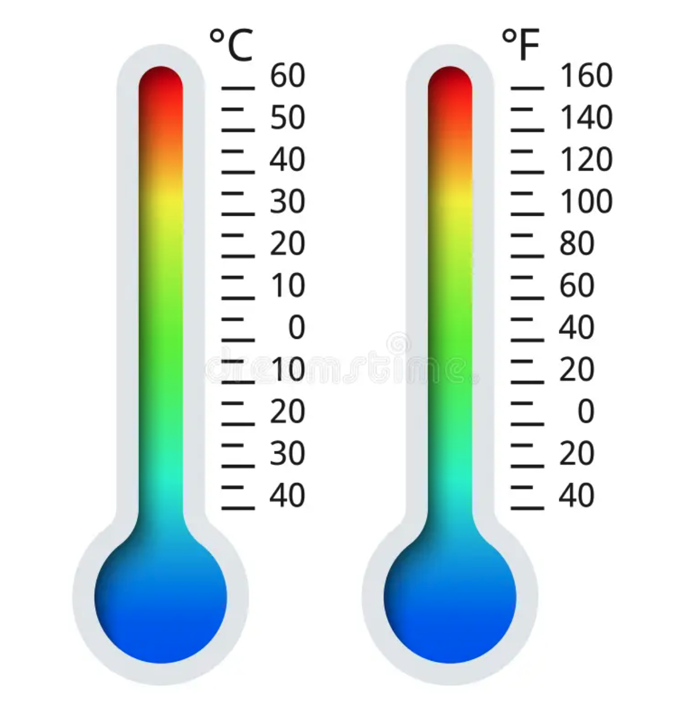

# Aplicació: Conversió de graus Celcius a Fahrenheit




Aquesta lliçó mostra com escriure un programa que llegeixi una temperatura en graus Celsius i en calculi la conversió a graus Fahrenheit.

<div style='clear: both;'/>


## Enunciat del problema

Recordeu que les temperatures es poden expressar en graus Celsius (°C) o en graus Fahrenheit (°F). La relació entre ambdues unitats de mesura és la següent:

```
°F = °C⋅1,8 + 32
```

Es vol un programa que llegeixi una temperatura en graus Celsius i en calculi la conversió a graus Fahrenheit.


:::info Iep!
Penseu com resoldre el problema abans de continuar llegint!
:::


## Solució

El primer pas per resoldre qualsevol problema és identificar quines són les seves entrades, quines són les seves sortides i quina relació tenen entre elles. En aquest cas:

- De l'enunciat del problema, queda clar que hi ha una entrada `c` que representa una temperatura en graus Celsius.

- Igualment, queda clar que la sortida és una temperatura en graus Fahrenheit, que es podrà desar en una variable real anomenada `f`.

La relació entre l'entrada `c` i la sortida `f` és `f = c⋅1,8 + 32`.

La solució ha de fer doncs tres tasques, l'una rera l'altra:

1. Llegir el valor de `c`. Aquest valor ha de ser un nombre real (amb decimals).

2. Calcular el valor de `f` a partir del de `c`. Per a fer-ho, cal usar la fórmula de conversió.

3. Escriure el valor de `f`.

En Python, això es pot fer codificar així:

```python
c = float(input())        # Lectura de l'entrada
f = c * 1.8 + 32          # Càlcul de f a partir de c
print(f)                  # Escriptura de la sortida
```

La primera línia assigna a la variable `c` el valor llegit de l'entrada. La segona línia assigna a `f` el valor pertinent a partir del de `c` tot avaluant l'expressió `c * 1.8 + 32 `. La tercera línia escriu el valor de `f`.

Aquí podeu provar el programa:

<PyWeb
:code="`c = float(input())
f = c * 1.8 + 32
print(f)
`"
:height="250"
/>

Si es vol fer el programa més explícit per a l'usuari, es pot afegir un missatge abans de llegir la temperatura en graus Celsius i un altre abans d'escriure la temperatura en graus Fahrenheit:

```python
c = float(input('Escriu la temperatura en graus Celsius:'))
f = c * 1.8 + 32
print('La temperatura en graus Fahrenheit és:', f)
```

Fixeu-vos que en aquesta aplicació hem hagut de convertir el text llegit amb `input` a un nombre real amb `float` perquè la temperatura pot ser un nombre amb decimals. Si haguéssim fet servir `int` en lloc de `float`, el programa hauria donat un error si l'usuari hagués escrit un nombre amb decimals.


<Autors autors="jpetit"/>
