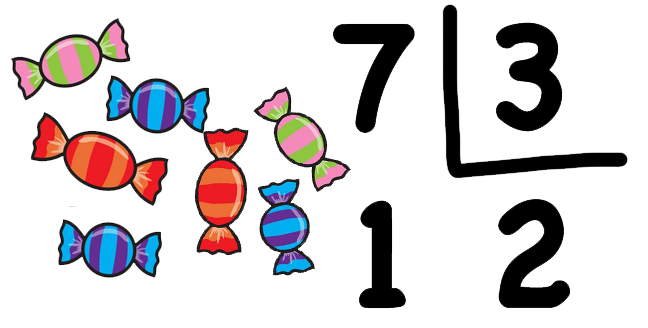

# Aplicació: Descomposició horària


Aquesta lliçó mostra com solucionar el problema de descompondre un determinat nombre de segons en hores, minuts i segons. Això permet aprofundir en l'ús de les instruccions que ja s'han presentat i veure com funciona la divisió amb valors enters.


## Enunciat del problema

Considereu el problema següent: Donada una quantitat (positiva) de segons `n`, es vol saber quantes hores, minuts i segons representa. Per exemple, si `n` val 3661, cal dir que en 3661 segons hi ha una hora, un minut i un segon. També, si `n`
val 76234, cal dir que en 76234 segons hi ha 21 hores, 10 minuts i 34 segons (no feu el mandra: comproveu-ho!).


## Solució

Com sempre, el primer pas per resoldre qualsevol problema és identificar quines són les seves entrades, quines són les seves sortides i quina relació tenen entre elles. En aquest cas:

- De l'enunciat del problema, queda clar que hi ha una entrada `n` que representa un determinat nombre de segons.

- Igualment, queda clar que les sortides són tres nombres naturals `h`, `m` i `s` que representen, respectivament, el nombre d'hores, minuts i segons continguts a `n`. Els podrem desar en tres variables enteres anomenades `h`, `m` i `s`.

- La relació entre l'entrada `n` i les sortides `h`, `m` i `s` és `3600h + 60m + s = n`, amb `0 ≤ m < 60` i `0 ≤ s < 60`.


La solució ha de llegir el valor d'`n`, calcular els valors d'`h`, `m` i `s` a partir del d'`n` (encara no hem pensat com), i escriure el valor de `h`, `m` i `s`. Això es pot començar així:

```python
# Descomposició horària.

n = int(input())        # Lectura de l'entrada
...                     # Càlcul de h, m, s a partir de n. 🚧 Falta fer !!!
print(h, m, s)          # Escriptura de les sortides
```

Evidentment, encara ens falta fer la part del càlcul, però la resta de parts ja són al seu lloc: La instrucció `n = int(input())` indica que cal llegir un enter que l'assignació desa a la variable `n` i la instrucció  `print` escriurà els valors corresponents a `h`, `m` i `s` separats per un espai.




Abans de continuar, cal que introduim (o _repassem_, perquè ja el coneixeu) el concepte de **divisió entera**: Reculeu alguns anys, quan vau aprendre a dividir:

— _Si la Carla té set caramels i els ha de dividir entre tres amics, quants caramels donarà a cada amic?_

— _Donarà dos caramels a cada amic, i li'n sobrarà un!_

Això és una divisió entera! Oi que de petita la Carla mai hauria donat 2.333333 caramels als seus amics? Que dolç... 🍭

Justament, el resultat de dividir un enter per un altre enter en Python amb l'operador `//` és la divisió entera. Per tant, el resultat de `7 // 3` és `2`. A més, l'operador `%` dóna el residu de la divisió entera! Per exemple, el resultat de `7 % 3` és `1`.

Tornem a la descomposició horària: Com ens ho hem de fer per calcular `h`, `m` i `s` a partir d'`n`?

Tenint en compte que una hora són 3600 segons, és clar que el nombre d'hores `h` en `n` és el resultat de `n // 3600`. Per tant, el càlcul d'`h` a partir d'`n` es pot fer amb aquesta assignació:

```python
h = n // 3600
```

Un cop sabem quantes hores hi ha en `n`, quants segons ens resten? Doncs `n % 3600` (o bé `n - 3600 * h`, que seria el mateix però més llarg d'escriure). I, en aquesta quantitat, quants minuts hi ha? Doncs el resultat de dividir-la per 60! Per tant,

```python
m = (n % 3600) // 60
```

I quants segons ens resten encara? Doncs el residu d'aquesta divisió entera! Per tant,

```python
s = (n % 3600) % 60
```

I, amb això, ja tenim els càlculs de `h`, `m` i `s` complets:

```python
h = n // 3600
m = (n % 3600) // 60
s = (n % 3600) % 60
```

En aquest punt, fixeu-vos que, com que 3600 és múltiple de 60, llavors `(n % 3600) % 60` és, de fet, igual a `n % 60`. La solució completa és doncs aquesta:

```python
# Descomposició horària.

n = int(input())       # Lectura de l'entrada
h = n // 3600          # Càlcul del nombre d'hores
m = (n % 3600) // 60   # Càlcul del nombre de minuts
s = n % 60             # Càlcul del nombre de segons
print(h, m, s)         # Escriptura de les sortides
```

I aquí la podeu provar còmodament dins del vostre navegador:


<PyWeb
:code="`# Descomposició horària.\n
n = int(input())       # Lectura de l'entrada
h = n // 3600          # Càlcul del nombre d'hores
m = (n % 3600) // 60   # Càlcul del nombre de minuts
s = n % 60             # Càlcul del nombre de segons
print(h, m, s)         # Escriptura de les sortides
`"
/>


## Correctesa

En aquest punt, és pertinent preguntar-nos com podem assegurar que aquesta solució és realment correcta. Ho és per aquestes raons:

1. Tal com cal, `s` es troba entre 0 i 59. Això és conseqüència del fet que `s` és el residu d'una divisió entera entre 60.

2. Tal com cal, `m` es troba entre 0 i 59. Això és conseqüència del fet que, com que `n % 3600` es troba entre 0 i 3599, llavors `(n % 3600) // 60` no pot ser més gran que 59.

3. Tal com cal, `n == 3600 * h + 60 * m + s`. En efecte, la igualtat `n = 3600 * (n // 3600) + 60 * ((n % 3600) // 60) + n % 60` és certa, tal com us animem a comprovar.


## Solució alternativa

Sovint, un mateix problema es pot resoldre d'altres (bones) maneres. Per exemple, la manera explicada anteriorment es pot codificar de forma encara més compacta, sense necessitat de cap variable que no sigui `n`:

```python
# Descomposició horària, versió reduïda.

n = int(input())
print(n // 3600, (n % 3600) // 60, n % 60)
```

El programa resultant és més curt, però segurament menys explícit.


<Autors autors="jpetit roura"/>
