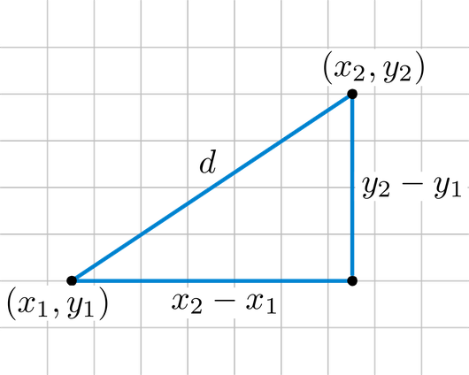

# Aplicació: Càlcul de la distància euclidiana entre dos punts


Aquesta lliçó mostra com escriure un programa que calculi la distància euclidiana entre dos punts donats.

<div style='clear: both;'/>


## Enunciat del problema

Es vol un programa que, donats dos punts, calculi la seva distància euclidiana. Recordeu que la distància euclidiana $d$ entre dos punts $(x_1, y_1)$ i $(x_2, y_2)$ es pot calcular amb la fórmula:

$$
    d = \sqrt{(x_2 - x_1)^2 + (y_2 - y_1)^2}.
$$

Aquí en teniu la interpretació geomètrica:



:::info Iep!
Penseu com resoldre el problema abans de continuar llegint!
:::


## Solució

El primer pas per resoldre qualsevol problema és identificar quines són les seves entrades, quines són les seves sortides i quina relació tenen entre elles. En aquest cas:

- De l'enunciat del problema, queda clar que hi ha dues entrades: els dos punts. Ara bé, com es representen aquests punts? Doncs, amb les seves coordenades. Per tant, les entrades són quatre nombres reals `x1`, `y1`, `x2` i `y2`.

- Igualment, queda clar que la sortida és un nombre real `d` que representa la distància euclidiana entre els dos punts.

La relació entre les entrades `x1`, `y1`, `x2`, `y2` i la sortida `d` és la fórmula de la distància euclidiana.

La solució ha de fer doncs tres tasques, l'una rera l'altra:

1. Llegir les coordenades  `x1`, `y1`, `x2`, `y2` dels dos punts. Aquestes coordenades han de ser nombres reals (amb decimals).

2. Calcular el valor de `d` a partir de `x1`, `y1`, `x2`, `y2`. Per a fer-ho, cal usar la fórmula de la distància euclidiana.

3. Escriure el valor de `d`.


En Python, això es pot fer codificar així:

```python
x1 = float(input())
y1 = float(input())
x2 = float(input())
y2 = float(input())
d = ((x2 - x1)**2 + (y2 - y1)**2) ** 0.5
print(d)
```

Aquest cop, les quatre primeres línies assignen a les variables `x1`, `y1`, `x2` i `y2` els valors llegits de l'entrada. La cinquena línia assigna a `d` el valor pertinent a partir de `x1`, `y1`, `x2` i `y2` tot avaluant l'expressió `((x2 - x1)**2 + (y2 - y1)**2) ** 0.5`. La sisena línia escriu el valor de `d`.

Recordeu que, en Python, l'operador `**` és l'operador d'exponenciació. Per tant, `x**2` és la mateixa cosa que $x^2$ i `x**0.5` és la mateixa cosa que $\sqrt{x}$.

<Autors autors="jpetit"/>
