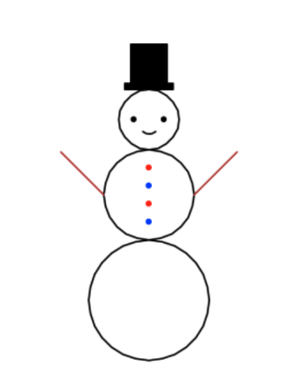
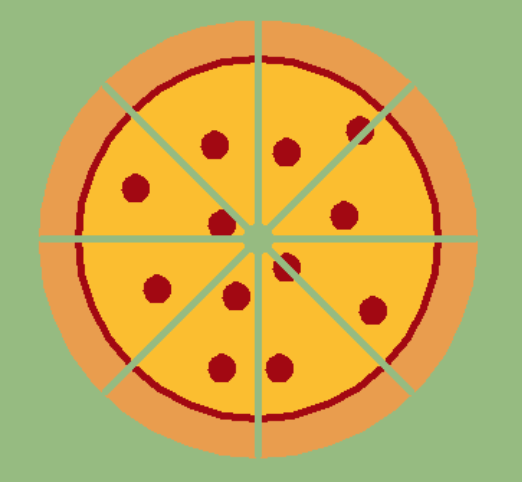
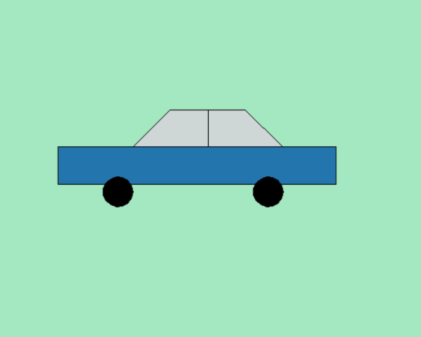

# Programes que dibuixen


Aquesta lliçó presenta un nou programa en Python que dibuixa un rectangle, amb l'amplada i l'alçada desitjada per l'usuari. Per a fer-ho, s'utilitza la tortuga de Python. Com a exercici, es demana de fer un programa que dibuixi un triangle.

## Programa per dibuixar rectangles

Aquest programa permet dibuixar un rectangle:

```python
# Dibuixa un rectangle

import turtle

amplada = int(input('Amplada? '))
alcada = int(input('Alçada? '))

turtle.forward(amplada)
turtle.left(90)
turtle.forward(alcada)
turtle.left(90)
turtle.forward(amplada)
turtle.left(90)
turtle.forward(alcada)
turtle.left(90)
```

Aquest programa és més llarg que els anteriors... Piqueu el botó ▶ per executar-lo! Per exemple, doneu una amplada de 100 i una alçada de 50. Si no veieu res a la dreta, arrossegueu la nança cap amunt.

<PyWeb
:code="`# Dibuixa un rectangle\n
import turtle\n
amplada = int(input('Amplada? '))
alcada = int(input('Alçada? '))\n
turtle.forward(amplada)
turtle.left(90)
turtle.forward(alcada)
turtle.left(90)
turtle.forward(amplada)
turtle.left(90)
turtle.forward(alcada)
turtle.left(90)
`
"
:height="600"
/>

## La tortuga de Python

El traçat del rectangle anterior s'ha fet utilitzant **gràfics de tortuga**. La tortuga és un animaló virtual que es passeja per la vostra pantalla amb un llapis enganxat a la seva cua i que obeeix a les instruccions de moviment que se li donen per tal de dibuixar mentre es desplaça endavant i endarrera o gira a dreta i a esquerra.

Al principi, la tortuga es troba al centre de l'àrea de dibuix mirant cap a la dreta. Si li diem d'avançar 100 unitats, la tortuga es desplaça 100 unitats cap a la dreta, marcant el seu rastre amb seu el llapis. Si li diem ara de girar 90 graus a l'esquerra i avançar 50 unitats més, la tortuga extendrà el seu traç tot pintant un angle.

A l'àrea de dibuix, el triangle representa la posició de la tortuga i la seva direcció. Els vells temps de Logo on la tortuga era un simpàtic gràfic de 8 bits ja han caigut en el trist oblit del passat...

Per utilitzar la tortuga, haurem d'utilitzar un mòdul estàndard de Python anomenat `turtle`. En Python, un mòdul conté operacions que algú ja ha escrit per tal que nosaltres les puguem aprofitar. Python ofereix molts mòduls estàndards que enriqueixen les possibilitats del llenguatge: A més, es poden instal·lar molts més mòduls per a gràfics, per a comunicació a la xarxa, per música, per matemàtiques, intel·ligènca artificial...

Per utilitzar les funcionalitats d'un mòdul, primer cal importar-lo. Importar un mòdul simplement vol dir que es vol usar aquell mòdul. Per això, el programa comença amb la instrucció `import turtle`, que és la que importa el mòdul de la tortuga. A continuació, es poden utilitzar les operacions del mòdul, prefixant-les amb el nom del mòdul i un punt. Així `turtle.forward(amplada)` invoca l'acció `forward` del mòdul `turtle` que serveix per moure la tortuga endavant `amplada` unitats . De forma semblant, `turtle.left(90)` invoca la operació de girar la tortuga 90 graus cap a l'esquerra.

Combinant adequadament aquestes operacions aconseguim dibuixar el rectangle desitjat. Repasseu el programa per entendre'l completament. Fixeu-vos que el darrer gir és innecessari, però assegura que la tortuga es quedi al punt original amb l'orientació original.

## Exercici

Ara us toca a vosaltres! Utilitzant com a plantilla el programa anterior, feu un programa que llegeixi una llargada i dibuixi un triangle isòsceles d'aquella mida, amb la base cap a baix, com un Delta (△).

<PyWeb
:code="`# Modifiqueu per dibuixar un triangle\n
import turtle\n
amplada = int(input('Amplada? '))
alcada = int(input('Alçada? '))\n
turtle.forward(amplada)
turtle.left(90)
turtle.forward(alcada)
turtle.left(90)
turtle.forward(amplada)
turtle.left(90)
turtle.forward(alcada)
turtle.left(90)
`
"
:sol="`# Dibuixa un triangle\n
import turtle\n
mida = int(input('Mida? '))\n
turtle.forward(mida)
turtle.left(120)
turtle.forward(mida)
turtle.left(120)
turtle.forward(mida)
turtle.left(120)
`
"
:height="600"
/>

No tingueu por de fer proves i experimentar. Ni d'equivocar-vos. Amb aquests programets que escriviu aquí no podeu fer cap mal a l'ordinador.

## Més instruccions de tortuga

La tortuga es pot moure amb aquestes instruccions:

-   `turtle.forward(d)`: avança la tortuga `d` unitats.
-   `turtle.backward(d)`: recula la tortuga `d` unitats.
-   `turtle.left(a)`: gira la tortuga amb un angle de `a` graus cap a l'esquerra.
-   `turtle.right(a)`: gira la tortuga amb un angle de `a` graus cap a la dreta.
-   `turtle.circle(r)`: mou la tortuga en cercle amb un radi de `r` unitats.
-   `turtle.home(a)`: mou la tortuga a la seva posició inicial al centre de l'àrea de dibuix.

La tortuga disposa també d'operacions per canviar el seu llapis. Aquestes comandes permeten aixecar o baixar el llapis, de forma que la tortuga es mogui sense deixar rastre:

-   `turtle.penup()`: aixeca el llapis (no pinta al desplaçar-se).
-   `turtle.pendown()`: baixa el llapis (sí pinta al desplaçar-se).

També es pot canviar el gruix i el color del llapis:

-   `turtle.pensize(s)`: tria un gruix de llapis de `s` unitats (al principi val 1, proveu un valor de 5 per traç gruixut).
-   `turtle.color(c)`: tria el color `c` pel llapis.

Els colors es poden donar de moltes maneres, la més fàcil és donar un valor de text com ara `'black'`, `'red`, `'blue'`, ...

La tortuga ofereix moltes més operacions! Podeu accedir a tota la documentació de la llibreria `turtle` a https://docs.python.org/3/library/turtle.html.

## Més exercicis

Proveu de fer programes en Python que dibuixin algunes escenes com aquestes:




<div style="clear: left;"/>

Sigueu creatius!

<PyWeb :height="600"/>

La propera lliçó us ensenyarà algunes qüestions fonamentals de Python, com ara l'ús de les variables i les assignacions amb més detall.

<Autors autors="jpetit"/>
