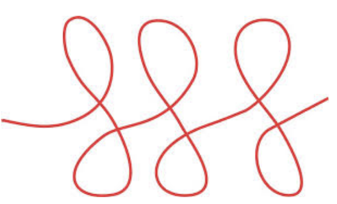

# Iteracions amb `for`



Aquest lliçó presenta la instrucció iterativa `for in range`,
que podem considerar una mena de cas particular,
força útil, de la instrucció iterativa `while`.

## Escriure molts nombres

Tornem a considerar un programa que llegeixi un nombre `n`,
i que escrigui tots els nombres entre 1 i `n`, un per línia.
Recordem que aquesta n'és una possible solució:

```python
n = read(int)
i = 1
while i <= n:
    print(i)
    i = i + 1
```

Si considerem aquest codi a partir de la tercera línia,
hi trobem un esquema molt freqüent a l'hora de construir bucles:
fer que una variable (anomenada _variable de control_) comenci en un valor determinit,
i avanci fins a un valor determinat amb un cert increment a cada iteració.
En aquest cas, la variable de control és `i`, comença des de `1`,
acaba en `n` incrementant-se en `1` a cada volta.

La instrucció iterative `for in range` permet escriure més concisament aquest esquema.
Aquesta és la seva versió més completa:

```python
for ⟨variable⟩ in range(⟨inici⟩, ⟨final⟩, ⟨pas⟩):
    ⟨instruccions⟩
```

que és equivalent a:

```python
⟨variable⟩ = ⟨inici⟩
while ⟨variable⟩ < ⟨final⟩:
    ⟨instruccions⟩
    ⟨variable⟩ = ⟨variable⟩ + ⟨pas⟩
```

(Si el `⟨pas⟩` és negatiu, el bucle s'atura quan `⟨variable⟩` és més gran o igual que `⟨final⟩`).

Per tant, el bucle del programa anterior es podria escriure així:

```python
for i in range(1, n + 1, 1):
    print(i)
```

Fixeu-vos que el `⟨final⟩` _no_ és part del bucle.

De fet, el `⟨pas⟩` del `range` és optatiu, per defecte val 1.
Per tant, el bucle del programa anterior es podria simplificar un xic així:

```python
for i in range(1, n + 1):
    print(i)
```

A més, l'`⟨inici⟩` del `range` també optatiu, per defecte val 0:
Per tant, el bucle del programa anterior també es podria escriure així:

```python
for i in range(n):
    print(i + 1)
```

En aquest cas les `i` van de 0 a `n` - 1, per això el `print()` els suma una unitat.

## Exemples

Per tal que quedi ben clar, la taula següent mostra quins són els valors que prendria successivament la variable del bucle `for` per a alguns ranges diferents:

| range             | valors            |
| ----------------- | ----------------- |
| `range(8)`        | `0 1 2 3 4 5 6 7` |
| `range(0)`        | ``                |
| `range(1)`        | `0`               |
| `range(-5)`       | ``                |
| `range(1, 5)`     | `1 2 3 4 5`       |
| `range(0, 8, 2)`  | `0 2 4 6`         |
| `range(0, 7, 2)`  | `0 2 4 6`         |
| `range(6, 0, -1)` | `6 5 4 3 2 1`     |

El programa que calcula el factorial d'un natural es pot escriure així amb un bucle `for`:

```python
from yogi import read

n = read(int)
f = 1
for i in range(2, n + 1):
    f = f * i
print(f)
```

El programa que pinta un `n`-àgon regular seria així:

```python
import turtle
import yogi

mida = yogi.read(int)
costats = yogi.read(int)
angle = 360 / costats

for i in range(costats):
    turtle.forward(mida)
    turtle.right(angle)

turtle.done()
```

Evidentment, els bucles `for` també es poden aniuar. Aquets programa dibuixa un quadrat rotat diverses vegades:

```python
import turtle
import yogi

mida = yogi.read(int)
rotacions = yogi.read(int)
angle = 360 / rotacions

for i in range(rotacions):
    for j in range(4):
        turtle.forward(mida)
        turtle.right(90)
    turtle.right(angle)

turtle.done()
```

Com heu pogut veure,
encara que inicialment pugui semblar més difícil d'entendre,
aquests codis són més compactes i ràpids d'escriure
i fàcils de llegir.
La raó és que tots els elements de control del bucle es troben en
un sol lloc.
Per tant, us aconsellem acostumar-vos als bucles `for in range`
i a usar-los quan els vostres algorrimes segueixin l'esquema tan freqüent mencionat anteriorment.
Feu servir els bucles `while` només
per a iteracions amb esquemes més originals.
D'altra banda, el bucle `for` de Python encara pot fer més coses, les veurem més endavant.

<Autors autors="jpetit"/>
