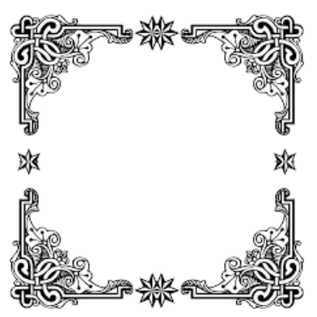

# Aplicació: Alguns dibuixos

❗️❗️❗️ Falta comprovar que aquests programes estiguin bé. Els he traduit a sac de C++ i no els he provat.




Aquesta lliçó mostra possibles solucions
per a un parell d'exercicis del Jutge:

- [P29973](https://jutge.org/problems/P29973) (Triangle)
- [P72484](https://jutge.org/problems/P72484) (Rombe)

Ambdues solucions fan servir de manera natural la instrucció `for in range`. A més, també es presenta com Python permet repetir textos.


## Exercici P29973 (Triangle)

L'enunciat és senzill:
Donat un nombre `n`, cal escriure un "triangle" de mida `n` amb asteriscs.
Per exemple, si l'entrada és 4,
cal escriure
```text
*
**
***
****
```

Com ho podem resoldre?
L'observació fonamental és que el nombre d'asteriscs per línia creix d'un en un,
des de 1 fins a `n`.
Això suggereix usar un `for` amb una variable, diguem-ne `i`,
que contingui en tot moment el nombre d'asteriscs que cal escriure.
Així, una primera aproximació a la solució és:

```python
n = read(int)
for i in range(1, n + 1):
    # codi per escriure i asteriscs en una línia
```

Fixeu-vos que al `range` donem el valor `n + 1` perquè volem que arribi fins a `n`.

Ara només ens cal pensar què posar a la part que falta.
Per començar, quin seria un possible codi per escriure `7` asteriscs en una línia?
Aquest:

```python
for j in range(7):
    print('*', end='')
print()
```

Però, com que no hem d'escriure 7 asteriscs, sinó `i`,
el que hem de fer és senzillament reemplaçar el 7 per una `i`:

```python
for j in range(i):
    print('*', end='')
print()
```

Ajuntant-ho tot, obtenim la solució:

```python
n = read(int)
for i in range(1, n + 1):
    for j in range(i):
        print('*', end='')
    print()
```

Observem que hem d'usar noms de variables de control diferents, `i` i `j`, per als dos `for`,
perquè un es troba dins de l'altre.

Finalment, i per comparació, així seria el codi
si uséssim `while` en lloc de `for`:


```python
n = read(int)
i = 1
while i <= n:
    j = 0
    while j < n:
        print('*', end='')
        j = j + 1
    print()
    i = i + 1
```

Més complicat, oi?


## Exercici P72484 (Rombe)

L'enunciat és similar a l'anterior:
Donat un nombre `n`, cal escriure un "rombe" de mida `n` amb asteriscs.
Per exemple, si l'entrada és 4,
cal escriure

```text
   *
  ***
 *****
*******
 *****
  ***
   *
```

A dalt, encara que no es vegin,
totes les línies (excepte la d'enmig) tenen espais a l'esquerra dels asteriscs.
Aquí els visualitzem explícitament fent servir el símbol ␣ per remarcar els espais:

```text
␣␣␣*
␣␣***
␣*****
*******
␣*****
␣␣***
␣␣␣*
```


Però el nombre d'espais depèn de la línia.
Així doncs, per començar,
fem una taula per veure quants espais i quants asteriscs calen en funció d'`i`.
De moment, conformem-nos amb les `n` primeres files:

`i` | espais | asteriscs
--- | :---: | :---:
1 | 3 | 1
2 | 2 | 3
3 | 1 | 5
4 | 0 | 7

Les fórmules semblen clares: calen `n - i` espais
i `2*i - 1` asteriscs.
Així, aquesta és la part interessant del codi que escriu les `n` primeres línies
(ignorem el `main()` i la lectura d'`n`):

```python
for i in range(1, n + 1):
    for j in range(n - i):
        print(' ', end='')
    for j in range(2 * i - 1):
        print('*', end='')
    print()
```

Com que la figura és (quasi) simètrica respecte a l'eix horitzontal,
una manera senzilla de dibuixar tot el rombe consisteix a copiar el `for` tal qual,
però fer que el segon `for` s'executi des del final fins al principi
tot posant un pas negatiu:

```python
for i in range(1, n + 1):
    for j in range(n - i):
        print(' ', end='')
    for j in range(2 * i - 1):
        print('*', end='')
    print()
for i in range(n, 0, -1):
    for j in range(n - i):
        print(' ', end='')
    for j in range(2 * i - 1):
        print('*', end='')
    print()
```

Provem aquest programa amb un 4.
Veurem que el codi *quasi* funciona:
```text
   *
  ***
 *****
*******
*******
 *****
  ***
   *
```
Veiem que sobra una línia del mig del rombe.
Per arreglar-ho, podem simplement fer que el segon bucle comenci en ` n - 1`
enlloc d'`n`:

```python
for i in range(1, n + 1):
    for j in range(n - i):
        print(' ', end='')
    for j in range(2 * i - 1):
        print('*', end='')
    print()
for i in range(n - 1, 0, -1):
    for j in range(n - i):
        print(' ', end='')
    for j in range(2 * i - 1):
        print('*', end='')
    print()
```

## Bonus! Repeticions de textos

El codi anterior ja és correcte, però es podria fer més senzill?

Doncs resulta que Python ja ens dóna una forma de repetir un text sense usar bucles:
Si multipliquem un text per un nombre $k$, el resultat és el text repetit $k$ cops.
Per exemple,

```text
'x' * 3         👉 'xxx'
3 * 'x'         👉 'xxx'
2 * 'pa'        👉 'papa'
'rau' * 2       👉 'raurau'
```

Aprofitant-ho, el programa ens pot quedar així:

```python
from yogi import read

n = read(int)

for i in range(1, n + 1):
    print(' ' * n, '*' * (2*i-1))
for i in range(n - 1, 0, -1):
    print(' ' * (n-i), '*' * (2 * i - 1))
```

No només el codi és més curt, també és més ràpid degut al funcionament intern de Python.
Aquest truc pot ser útil en alguns exercicis del Jutge 😉. Proveu d'utilitzar-lo amb el
problema anterior de dibuixar triangles!


<Autors autors="jpetit roura"/>
