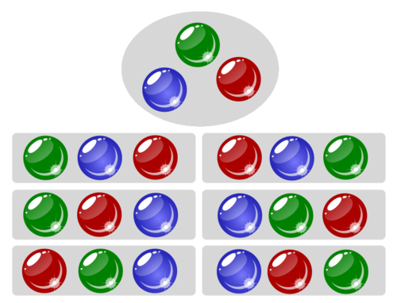

# Aplicació: Factorial


En aquesta lliçó es mostren algorismes per calcular els nombres factorials utilitzant construccions iteratives.


## Concepte matemàtic del factorial

Donats $n$ objectes, de quantes maneres es poden posar un rera l'altre?

Per exemple, si tenim tres bales, una verda, una blava i una vermella,
hi ha sis maneres de posar-les en fila:



En general, hi ha $n!$ maneres de posar $n$ objectes
l'un rera l'altre. Aquí, $n!$ denota el factorial de $n$, definit com

$$n!=n(n-1)(n-2)\cdots 1.$$

La raó és aquesta: D'entre els $n$ objectes, hi ha $n$ possibilitats de
triar-ne un com a primer. Un cop triat aquest primer objecte, en queden
$n-1$, i tenim $n-1$ possibilitats de triar-ne un segon, ... I així
fins a l'últim, on només tenim una possibilitat.

Per definició, $0!=1$. Aquest valor és adequat, ja que hi ha exactament
una seqüència amb zero objectes: la seqüència buida.

La taula següent mostra els primers valors dels factorials:

|$n$   |$n!$ |
|------|----:|
| 0    | 1   |
| 1    | 1   |
| 2    | 2   |
| 3    | 6   |
| 4    | 24  |
| 5    | 120 |


## Programa per calcular el factorial d'un nombre

Considereu que es vol un programa per calcular el factorial `f` d'un nombre natural `n`. Podríem començar així:

```python
from yogi import read

n = read(int)
... # calculs per obtenir f = n!
print(f)
```

Per mirar d'obtenir que `f` sigui el factorial de `n` podem utilitzar la definició del factorial: `f = 1 * 2 * 3 * ··· * n`. Això ens diu que `f` ha de ser el producte dels nombres entre 1 i `n`. I ja havíem vist com escriure un bucle per generar tots aquests nombres! El podríem posar com a plantilla per completar el programa:

```python
from yogi import read

n = read(int)
i = 1
while i <= n:
    ...
    i = i + 1
print(f)
```

Però encara no hem parlat de `f`... A veure, per començar, sabem que quan `n` sigui 0, `f` ha de ser 1. I, en el bucle anterior, quan `n` és 0,  no s'entrarà dins del cos del bucle. Per tant, cal que fora del cos del bucle la variable `f` es posi a 1. Així:

```python
from yogi import read

n = read(int)
f = 1
i = 1
while i <= n:
    ...
    i = i + 1
print(f)
```

Per continuar, fixem-nos que volem que, al final del bucle, `f` valgui `f = 1 * 2 * 3 * ··· * n`. Com que el bucle acabarà amb `i = n + 1`, podríem intentar que a cada iteració, es mantigués el fet que `f = 1 * 2 * ··· * i`. Això es pot aconseguir fent que a cada iteració, el valor de `f` es multipliqui pel de `i`. Per tant, a cada iteració cal fer l'assignació `f = f * i`. El programa queda doncs així:


```python
from yogi import read

n = read(int)
f = 1
i = 1
while i <= n:
    f = f * i
    i = i + 1
print(f)
```

CAL UN DIBUIX O UNA TRAÇA.

Podeu provar el programa i comprovar que dóna els valors correctes. Fixeu-vos que els nombres factorials creixen molt de pressa. Per exemple, 200! és
788657867364790503552363213932185062295135977687173263294742533244359449963403342920304284011984623904177212138919638830257642790242637105061926624952829931113462857270763317237396988943922445621451664240254033291864131227428294853277524242407573903240321257405579568660226031904170324062351700858796178922222789623703897374720000000000000000000000000000000000000000000000000. Per sort, Python no té problemes amb nombres molt grans (els pot anar manipulant mentre tingui prou memòria). Amb molts altres llenguatges de programació això no és el cas i les operacions poden donar errors de sobreiximent.


## Una millora menor

Si heu pensat en el programa anterior, potser us heu adonat que se li pot aplicar una millora: El primer producte amb és innecessari. Com que `f = 1 * 2 * 3 * ··· * n` és   `f = 2 * 3 * ··· * n`, el bucle no cal que comenci en 1, pot començar en 2:

```python
from yogi import read

n = read(int)
f = 1
i = 2
while i <= n:
    f = f * i
    i = i + 1
print(f)
```

D'aquesta manera el programa fa una iteració menys (perquè s'estalvia un producte de un per un). No és una gran millora per ella mateixa (reduir una iteració és menyspreable quan n'hi ha moltes), però adonar-se d'aquests fets en els programes és important.

<Autors autors="jpetit"/>
