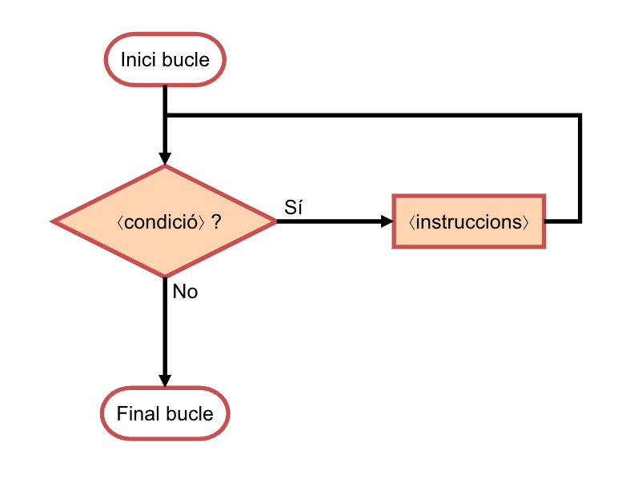

# Iteracions


Aquest lliçó presenta la instrucció iterativa (`while` en Python). En informàtica, de
repetir instruccions en diem _iterar_ o _fer bucles_. La iteració permet simplificar i
potenciar els algorismes afirmant que es repetiran certs passos fins que no es
digui el contrari. Aprendre a dissenyar bucles és extremadament important per
escriure programes. Comencem amb uns exemples senzills, a les aplicacions anirem veient progressivament usos més complexos.

## Escriure els nombres d'1 a `n`

Considereu un programa que llegeixi un nombre `n`, i que escrigui tots els nombres entre 1 i `n`, un per línia. Per exemple, si llegim un 4, el programa ha d'escriure

```text
1
2
3
4
```

Amb les eines que hem vist fins ara, no és possible fer aquest programa. Per exemple, quantes línies de codi tindria? 100? Llavors, si la `n` fos 1000, com podríem fer que el programa escrivís 1000 línies? Clarament, ens cal un nou tipus d'instrucció.

En particular, ens cal poder dir a l'ordinador que vagi fent operacions mentre es compleixi una certa condició, és a dir, ens cal una **instrucció iterativa**, que en la forma més bàsica s'escriu així en Python:

```python
while ⟨condició⟩:
    ⟨instruccions⟩
...
```

Per executar un `while`, l'ordinador primer comprova la `⟨condició⟩`.
Si no es compleix, passa a executar el que hi hagi després del `while`.
Si es compleix, s'executen les `⟨instruccions⟩` indentades dins del cos del `while`.
Després, torna a comprovar la condició.
Si no es compleix, passa a executar el que hi hagi després del `while`.
Si es compleix, s'executen les `⟨instruccions⟩` indentades dins del seu cos.
I així repetidament, _mentre_ (`while`, en angles) la `⟨condició⟩`
es compleixi.

El diagrama de flux següent mostra el funcionament del bucle `while`:



Aquest programa resol el problema proposat usant un `while`:

```python
n = read(int)
i = 1
while i <= n:
    print(i)
    i = i + 1
```

Com funciona?
Primer llegim la `n` (suposem que val 3).
La tercera línia
declara una variable `i` amb valor inicial 1.
Després, es comprova la condició del `while`.
Com que aquesta es compleix, perquè `1 <= 3`,
s'executa el cos del `while`,
el qual consisteix a escriure la `i` actual (que és 1) en una línia,
i a incrementar a continuació la `i` d'1 a 2.
Ara es torna a comprovar la condició,
i com que es compleix, perquè `2 <= 3`, s'escriu un 2 i la `i` passa a valer 3.
Ara es torna a comprovar la condició,
que encara es compleix, perquè `3 <= 3`, s'escriu un 3 i la `i` passa a valer 4.
Ara la condició ja no es compleix,
perquè no és cert que `4 <= 3`,
per la qual cosa el `while` acaba.
I com que a continuació no hi ha més codi, el programa també acaba,
després d'haver escrit els nombres entre 1 i 3.

Com que el programa anterior itera mentre la `i` no sigui `n`, hom podria tenir la temptació d'escriure la condició del `while` així:

```python
n = read(int)
i = 1
while i != n:     # 💥
    print(i)
    i = i + 1
```

Malauradament, això no és gaire segur. En efecte, per a valors positius o zero d'`n`, el programa funciona perfectament, però què passa per valors negatius d'`n`? El programa es posarà a escriure 1, 2, 3, 4, ... i no pararà mai, escribint nombres i nombres cada cop més grans. És clar: com que la `i` sempre és positiva i se li suma una unitat a cada iteració, mai arribarà a ser igual a `n` que és negativa. Quan un bucle no pot acabar mai, diem que **es penja**. Sempre que escribim bucles hem de considerar que no es puguin penjar ja que això no és gens desitjable.

Quan un programa es penja, podeu aturar-lo picant les tecles <kbd>control</kbd> i <kbd>c</kbd> a la vegada. Proveu-ho: pengeu el programa anterior i interrompeu la seva execució amb <kbd>control</kbd><kbd>c</kbd>. Una de les coses boniques de la programació és que no costa gens de provar coses!

## Escriure els nombres senars d'1 a `n`

Considereu ara que només volem escriure els nombres senars d'1 fins a `n`, Per exemple, si llegim un 7, el programa ha d'escriure

```text
1
3
5
7
```

i si llegim un 10, el programa ha d'escriure

```text
1
3
5
7
9
```

El programa es pot fer com anteriorment, però sumant dues unitats a cada iteració enlloc d'una:

```python
n = read(int)
i = 1
while i <= n:
    print(i)
    i = i + 2
```

Fixeu-vos que el programa funciona bé tant si `n` és parell com si és senar. Què passaria si la condició fós `i == n` enlloc de `i <= n`? Amb quins valors d'`n` es penjaria?

## Escriure els nombres d'`n` a 1

Considereu que ara volem escriure els nombres d'`n` a 1 de gran a petit. Per exemple, si llegim un 4, el programa ha d'escriure

```text
4
3
2
1
```

En aquest cas, caldrà que el valor inicial de la variable `i` siguin `n`, que s'iteri mentre sigui estrictament positiva i que es decrementi a cada iteració:

```python
n = read(int)
i = n
while i > 0:    # també podria ser i >= 1
    print(i)
    i = i - 1
```

No és tant difícil, oi?

De fet, el programa es podria fer més senzill encara prescindint directament de la variable `i` i utilitzant `n` al seu lloc:

```python
n = read(int)
while n > 0:
    print(n)
    n = n - 1
```

Ara bé, d'aquesta forma, el valor original d'`n` ha quedat perdut, fet que pot ser detrimental en moltes ocasions.

## Raonament al voltant dels bucles

Tornem a considerar el programa que escriu els números d'1 a `n` per a una `n` donada i afegim-li una instrucció al final:

```python
n = read(int)
i = 1
while i <= n:
    print(i)
    i = i + 1
print('adéu')
```

Intenteu contestar aquestes preguntes (suposant que `n >= 0`):

1. Quantes vegades s'executa la instrucció `i = 1'?

1. Quantes vegades s'executa la instrucció `print(adéu)'?

1. Quants nombres s'escriuen?

1. Quantes iteracions fa el bucle?

1. Quin és el valor d'`i` al final del bucle?

1. Quantes vegades s'avalua la condició del bucle?

Mirem-ho:

1. És clar que la instrucció `i = 1' només s'executa un cop, abans de començar el bucle.

1. Igualment, és clar que la instrucció `print('adéu')` només s'executa un cop, quan acaba el bucle.

1. El nombre de números escrits és `n`, ja que el programa escriu tots els nombre d'1 a `n`. (Si `n` fos negativa, no escriuria cap nombre.)

1. El bucle ha de fer `n` iteracions, ja que a cada iteració escriu un únic nombre i al final se n'escriuen `n`.

1. El valor de `i` al final del bucle ha de ser `n + 1`: quan el bucle escriu el darrer nombre (`n`), encara li suma una unitat a `i` que passa a valer `n + 1`. És justament quan `i` val `n + 1` que la condició del bucle deixa de ser certa i, per tant, el bucle acaba. Podeu comprovar aquest fet afegint un `print(i)` al final del programa.

1. El nombre de vegades que s'avalua la condició del bucle és també `n + 1` (no `n`). En efecte, la comprovació de si `i <= n` serà certa durant les `n` primeres iteracions, però després de la darrera iteració, quan `i` val `n + 1` s'avaluarà com a falsa. És per això que el bucle acabarà. Per tant, la condició sempre s'avalua un cop més que iteracions es realitzen en un bucle.

Aquest tipus de preguntes i raonament al voltant del bucle és útil per comprendre com funcionen els bucles en general i us serà igualment útil per raonar sobre els vostres bucles i entendre perquè funcionen o no. També, aquest tipus de comptatges és necessari per poder establir l'eficiència dels algorismes.

<Autors autors="jpetit roura"/>
