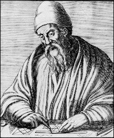

# Aplicació: Màxim comú divisor


En aquest lliçó es mostren diverses solucions per calcular el màxim
comú divisor de dos nombres. Totes elles usen iteracions i requereixen
l'ús de condicions una mica més elaborades que les utilitzades fins ara.


## Definició

Donats dos nombres naturals $x$ i $y$, el seu màxim comú divisor $\text{mcd}(x, y)$,
com el nom indica, és el nombre més gran que divideix exactament tant a $x$ com a $y$.
Per exemple, si $x$ val $78$ i $y$ val $66$,
els divisors comuns són $1$, $2$, $3$ i $6$.
Per tant, el seu màxim comú divisor és $6$.

Com a cas especial, i per definició,
el màxim comú divisor de $x$ i $0$ és $x$,
per a qualsevol $x$.
En particular, el màxim comú divisor de $0$ i $0$ és $0$.

Una aplicació del màxim comú divisor és la reducció de fraccions: Per exemple,
com que el màxim comú divisor de $78$ i $66$ és $6$, tenim

$$
    \frac{78}{66}=\frac{13·6}{11·6}=\frac{13}{11}.
$$


## Primera solució

Com fer un programa que trobi el màxim comú divisor
de dos nombres `x` $ > 0$ i `y` $ > 0$ qualssevol?
Fixem-nos que aquest nombre no pot ser més gran que `x`.
Per tant, un possible mètode consisteix a provar si `x` divideix també a `y`;
si és així, ja tenim el resultat: és `x`.
Altrament, provem si `x` $- 1$ divideix tant a `x` com a `y`;
si és així, `x` $ - 1$ és el resultat.
Altrament, provem si `x` $- 2$ divideix tant a `x` com a `y`;
si és així, `x` $ - 2$ és el resultat.
Etcètera:

```python
x = read(int)
y = read(int)
d = x
while not (x % d == 0 and y % d == 0):
    d = d - 1
print(d)
```

Estudiem aquest programa amb deteniment.
La línia

```python
    d = x
```

Copia el valor de `x` a una variable `d`,
la qual al final de l'execució acabarà contenint el màxim comú divisor de `x` i `y`.
Després, repetidament, comprovarem si el valor actual de `d`
és un divisor de `x` i també un divisor de `y`.
Si no és el cas, restarem $1$ al valor de `d`, i tornarem a provar.
Així doncs, quina condició ha de complir la `d` que busquem?
Aquesta:

```python
    x % d == 0 and y % d == 0
```

L'operador `%` retorna el residu (allò que sobra) de la divisió entera.
Per exemple, `42%10` val $2$, perquè si dividim $42$ entre $10$,
el quocient és $4$ i en sobren $2$.
Com a conseqüència, la condició `x%d == 0` ens diu que si dividim `x` entre `d`,
no sobra res.
En altres paraules, ens diu que la divisió és exacta i que, per tant,
`d` divideix a `x`.

Però ens cal comprovar que `d` divideix a `x` _i_ (`and`, en anglès)
també que `d` divideix a `y`.
L'operador `and` es compleix només quan les dues condicions es compleixen.
Per exemple, la condició

```python
    a % 2 == 0 and a >= 100
```

indica si una variable `a` conté un nombre parell que sigui almenys $100$.

Continuem. Quan ha de parar el `while`?
Quan la condició sobre `d` es compleixi.
A la inversa, el `while` ha de continuar _mentre_ la condició d'aturada
_no_ es compleixi.
Per aquest motiu, en el `while` usem la condició negada:

```python
while not (x % d == 0 and y % d == 0): ...
```

L'operador `not` només es compleix
quan la condició sobre la que s'aplica no es compleix.
Per exemple,

```python
    (not a >= b)
```

i

```python
    (a < b)
```

són equivalents (tot i que la segona és més concisa i, per tant, millor).

Lògicament, la línia

```
    d = d - 1
```

decrementa en $1$ el valor de `d`,
de forma simetrica a com `i = i + 1;` incrementa el valor de `i` en $1$.

Finalment, ara ja podem entendre com funciona tot el programa.
Suposem que es llegeix un $78$ per a `x` i un $66$ per a `y`.
Si en simulem l'execució, la `d` comencarà valent $78$, després $77$, ...,
fins arribar al $6$, el primer nombre que divideix tant a $78$ com a $66$.
En aquest moment deixarà de complir-se la condició del `while`,
s'escriurà un $6$, i el programa acabarà.

Aquest programa funciona correctament,
perquè el bucle s'atura quan troba la primera `d` (és a dir, la `d` més gran)
que compleix la condició demanada.
I sempre en trobarà alguna,
perquè en un cas límit arribarà a `d` $= 1$,
la qual compleix la condició d'aturada
per a qualsevol combinació de `x` i `y`.

Finalment, fixem-nos que aquest codi no funcionaria si `x` pogués valer $0$.
La variable `d` valdria inicialment $0$,
i l'operació `%` amb segon paràmetre $0$
faria que el programa s'aturés amb un codi d'error,
perquè no té sentit preguntar quin és el residu d'una divisió entre $0$.


## Una simplificació

La condició del `while`

```python
    not (x % d == 0 and y % d == 0)
```

es pot simplificar:
Siguin `c1` i `c2` dues condicions lògiques.
Una llei fonamental de la lògica, deguda al matemàtic De Morgan
[$\small[\mathbb{W}]$](https://ca.wikipedia.org/wiki/Augustus_De_Morgan),
diu que `not (c1 and c2)` és equivalent a `(not c1) or (not c2)`,
on l'operador `or` es compleix
quan es compleix almenys una de les seves dues condicions.
En el nostre cas, tenim que `c1` és `x % d == 0` i `c2` és `y % d == 0`,
i per tant tenim que `not c1` és `x % d != 0` i `not c2` és `y % d != 0`.

Tot plegat, el codi queda així:

```python
x = read(int)
y = read(int)
d = x
while x % d != 0 or y % d != 0:
    d = d - 1
print(d)
```


## Segona solució: L'algorisme d'Euclides

### Algorisme



A continuació veurem com calcular el màxim comú dividor de dos
nombre utilitzant l'**algorisme d'Euclides**,
descobert pels grecs clàssics
i descrit per Euclides
[$\small[\mathbb{W}]$](https://ca.wikipedia.org/wiki/Euclides),
en el llibre _Elements_ cap a l'any 300 aC.
Molts historiadors el consideren
el primer algorisme de ple dret.
Tot i que Euclides va formular l'algorisme geomètricament,
aquí l'interpretarem de forma numèrica.
Essencialment, l'algorisme diu:

> Resteu al més gran dels dos nombres el més petit, fins que siguin iguals; aquesta és la solució.

Provem aquest algorisme per calcular el màxim comú divisor de $78$ i $66$.
Utilitzarem una taula amb dues columnes.
A la primera fila col·locarem els dos nombres.
A continuació, i repetidament,
mirarem quin dels dos és el més gran i,
a la fila inferior, li restarem el més petit,
que deixarem tal qual.
Quan arribem a una fila amb els dos nombres iguals,
aquest nombre serà la solució:

```text
     78  66
    ---------
     12  66
     12  54
     12  42
     12  30
     12  18
     12   6
      6   6
    ---------
        6
```

### Correctesa

La correctesa de l'algorisme d'Euclides es basa en dues propietats.
La primera, trivial, diu que $\text{mcd}(x, x) = x$.
La següent és més interessant:

**Propietat.**
Si $x$ i $y$ són enters estrictament positius tals que $x > y$,
llavors $\text{mcd}(x,y) = \text{mcd}(x-y, y)$.

**Demostració.**
Qualsevol enter que divideixi $x$ i $y$ també ha de dividir $x-y$.
Per tant, $\text{mcd}(x,y)\le\text{mcd}(x-y, y)$. D'altra banda,
qualsevol enter que divideixi $x-y$ i $y$ també ha de dividir $x$ i $y$.
Per tant, $\text{mcd}(x-y,y)\le\text{mcd}(x, y)$.


### Implementació

Aquesta és una implementació de l'algorisme d'Euclides en Python:

```python
# llegir entrades
x = read(int)
y = read(int)
# fins que siguin iguals (⟺ mentre siguin diferents)
while x != y:
    # restar el més petit dels dos nombres al més gran
    if x < y:
        y = y - x
    else:
        x = x - y
# escriure el resultat
print(x)
```

Després de llegir les entrades `x` i `y`, tenim un bucle que s'atura quan `x == y`.
A dins del bucle, on els nombres no poden ser iguals,
restem el nombre més petit del més gran,
fent la comparació `x < y` per saber quin és quin.
Després del bucle, quan els dos nombres són iguals,
n'escribim un d'ells (`x`, per exemple).

Cal dir que aquest programa tampoc funciona quan un dels nombres és $0$ i l'altre no,
perquè les variables no es modifiquen i el bucle dóna voltes sense parar.
Quan passa això, els informàtics diem que "el programa es penja".


### Comparació

Respecte a la primera solució,
la principal virtud de l'algorisme d'Euclides és que en general fa menys iteracions,
perquè a cada pas avança més.
Per exemple, per a $78$ i $66$,
la primera solució fa $72$ iteracions, des de $78$ fins a $6$,
mentre  que l'algorisme d'Euclides només en fa vuit
(una per fila de la taula anterior).

Malgrat això, l'algorisme d'Euclides encara pot ser lent per a algunes entrades.
Per exemple, quin és el màxim comú divisor de $123456789$ i $1$?
Calculeu-lo a mà amb l'algorisme d'Euclides.
O millor que no.
Llegiu la propera secció...


## Tercera solució: L'algorisme d'Euclides amb mòduls

Considerem aquesta part de la taula d'execució de l'algorisme d'Euclides:
```text
     12  66
     12  54
     12  42
     12  30
     12  18
     12   6
```
Quantes vegades restem $12$ de $66$?
Tantes com el resultat de dividir (sense decimals) $66$ entre $12$, és a dir, $5$.
Més interessant encara:
I quin resultat final obtenim?
És a dir, què hi ha a l'última fila de la segona columna?
Doncs el residu de la divisió entera de $66$ entre $12$,
en aquest cas $6$.
Això vol dir que podem passar del parell $12$ $66$ a $12$ $6$ en un sol pas,
en lloc de cinc,
si usem el residu en lloc de la resta.
Aquest fet inspira una nova versió de l'algorisme, més eficient:

```python
# llegir entrades
x = read(int)
y = read(int)
# fins que siguin iguals (⟺ mentre siguin diferents)
while x != y:
    # usem % per estalviar passos
    if x < y:
        y = y % x
    else:
        x = x % y
# escriure el resultat
print(x)
```


☠️ Compte amb aquest programa!
Provem-lo amb $78$ i $66$, a veure què passa:

```text
     78  66
    ---------
     12  66
     12   6
      0   6
    error, %0
```

Aquest és un fenomen molt habitual:
Intentant millorar un programa per fer-lo més eficient, l'hem espatllat.
En efecte, el nou programa  arriba (ràpidament) a una situació
on una de les variables és $0$,
intenta fer l'operació `%` amb $0$,
i s'atura amb un error.
El programa és incorrecte.

Així doncs, ens hem de conformar amb el programa lent però correcte?
No: el que hem de fer és arreglar el programa ràpid.
Aquesta és una possible solució:


```python
x = read(int)
y = read(int)
while y != 0:
    r = x % y
    x = y
    y = r
print(x)
```

Provem-lo amb $78$ i $66$:
```text
     78  66
    ---------
     66  12
     12   6
      6   0
    ---------
        6
```

Per compendre com funciona, primer suposem que `x` és el més gran dels dos nombres.
Perquè això segueixi sent cert a cada pas del programa,
usem una variable auxiliar `r` que guardi l'actual residu `x%y`.
Fixem-nos que $0 \le $ `r` $ < $ `y`.
Després, posem l'antiga `y` a la nova `x`,
i posem el residu `r` com a nova `y`.
Quan arribem a una situació on `y` és $0$,
ja podem parar: el resultat és la `x` actual.

I què passa si la `x` inicial és més petita que `y`?
Res greu. Comprovem-ho amb $66$ i $78$:
```text
     66  78
    ---------
     78  66
     66  12
     12   6
      6   0
    ---------
        6
```

El programa només fa una iteració més,
en la qual posa els dos nombres en ordre.
La resta de l'execució és idèntica a quan els nombres venen donats en "l'ordre bo".

I si algun dels dos nombres és inicialment $0$ (o tots dos)?
Recordem que els programes anteriors fallaven en aquesta situació.
Doncs bé, aquest programa funciona perfectament, fins i tot en aquest cas.
Podeu comprovar-ho fàcilment vosaltres mateixos.

Acabem aquesta lliçó amb alguns comentaris sobre l'eficiència d'aquest últim programa.
Es pot demostrar que el nombre d'iteracions del bucle
està afitat per cinc vegades el nombre de dígits del mínim entre `x` i `y`.
Per exemple, si el nombre més petit dels dos és $6789$,
no es faran mai més de $20$ iteracions,
independentment de l'altre nombre.
A més, aquesta és una mesura pessimista: en general, el programa fa encara menys passos.
Com a mostra, amb l'exemple $123456789$ i $1$ mencionat anteriorment,
per al qual l'algorisme amb restes faria $123456788$ passos,
ara el bucle només s'executa una vegada!


<Autors autors="jpetit roura"/>
