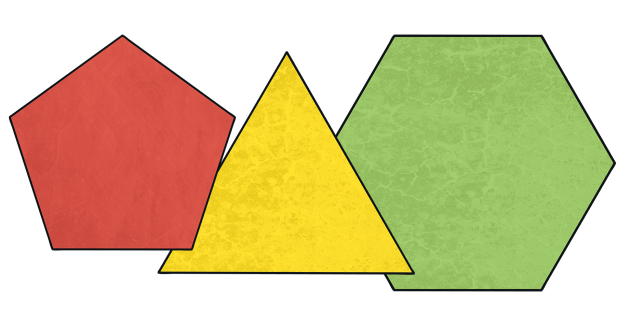
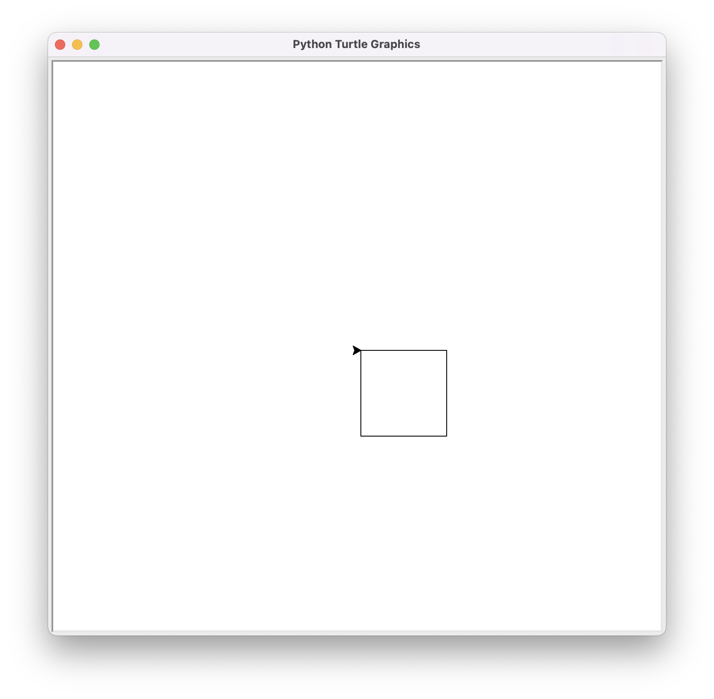
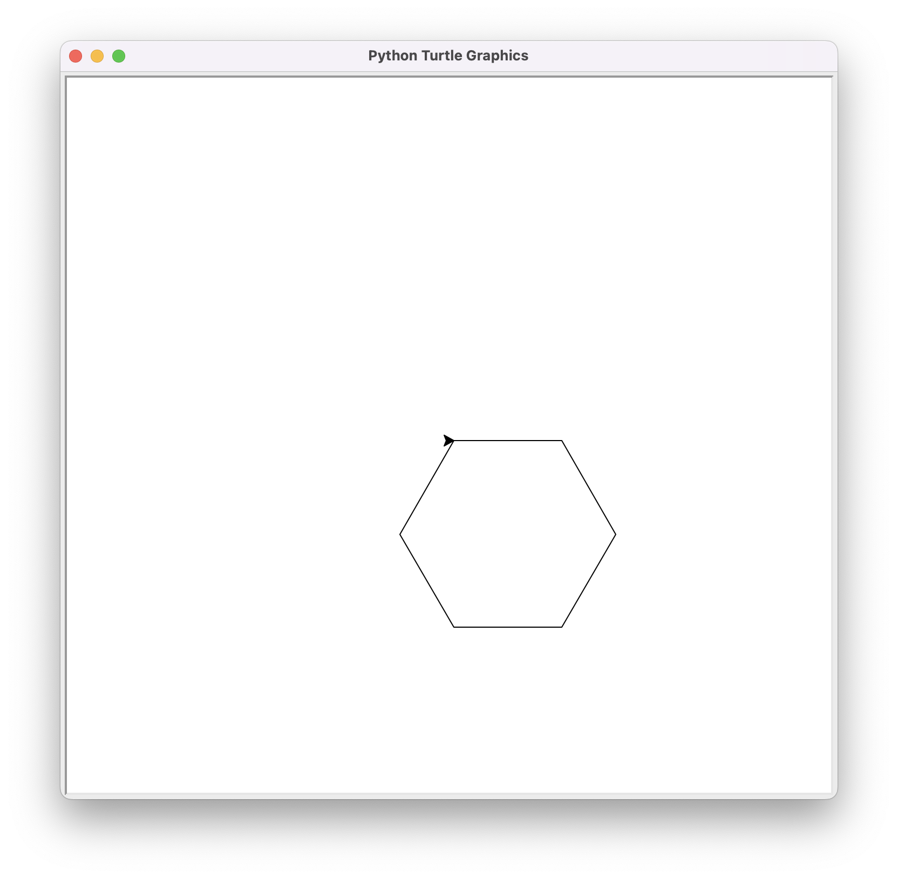
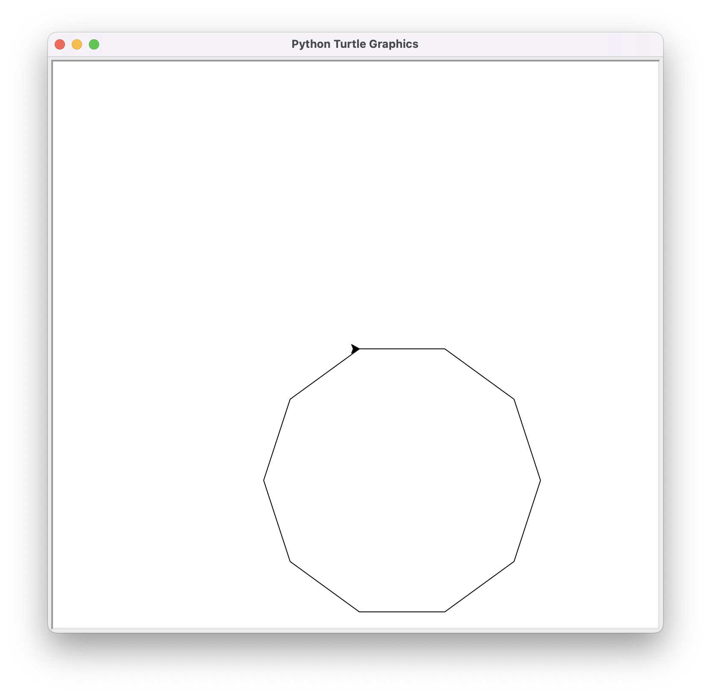
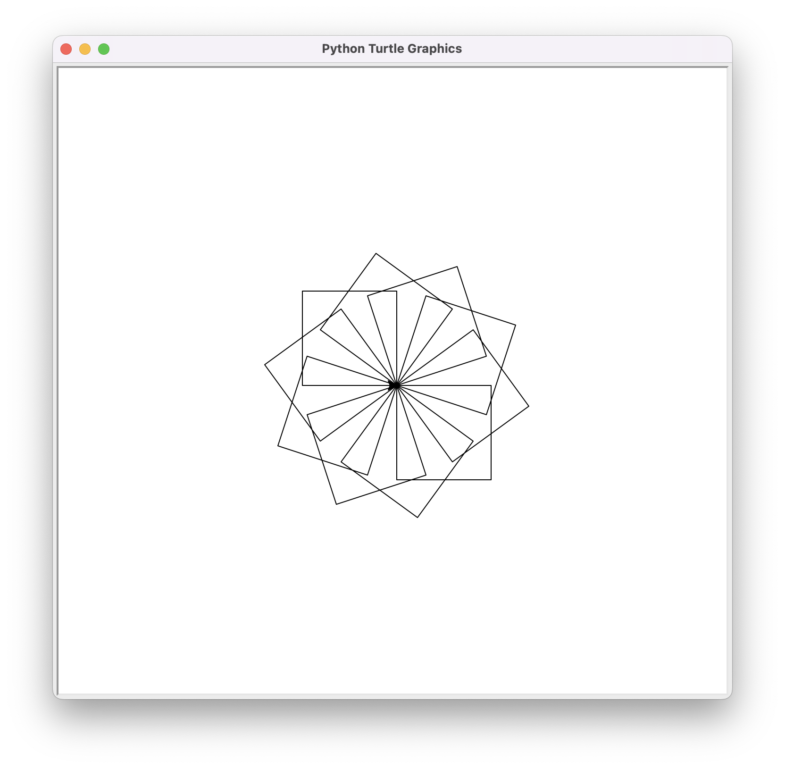

# Aplicació: Dibuix de polígons regulars



En aquest lliçó es presenta com dibuixar  polígons regulars amb la tortuga de Python tot usant bucles. Primer es mostra el cas senzill del quadrat, després es generalitza a polígons regulars. Finalment, es mostra com utilitzar un bucle dins d'un bucle per pintar molts quadrats rotats.


## Dibuix d'un quadrat

Ja havíem vist que aquest programa dibuixa un quadrat:

```python
import turtle

mida = 100 

turtle.forward(mida)
turtle.right(90)
turtle.forward(mida)
turtle.right(90)
turtle.forward(mida)
turtle.right(90)
turtle.forward(mida)
turtle.right(90)

turtle.done()
```

Ara que coneixem els bucles, podem escriure'l més breument repetint quatre cops l'avanç i la rotació de la tortuga amb una instrucció iterativa `while`:

```python
import turtle

mida = 100 

i = 0
while i < 4:
    turtle.forward(mida)
    turtle.right(90)
    i = i + 1

turtle.done()
```


El bucle fa 4 iteracions, una per cada `i` en 0, 1, 2 i 3. També es podria haver fet que la `i` comencés a 1 i s'incrementés fins que `i <= 4`, però per raons que s'aniràn veient, en Python és més habitual començar a comptar des de zero.

Heu aquí el resultat:




## Dibuix d'un polígon regular

Recordeu que un **polígon** és una figura plana formada per un nombre finit de segments lineals seqüencials. Cadascun d'aquests segments és un costat. Un polígon amb tots els angles i costats iguals s'anomena **polígon regular**. 

Si ara volem pintar un polígon regular amb un determinat nombre de costats `costats`, només cal que canviem el 4 del quadrat anterior pel valor de `costats` i que rotem la tortuga de `360 / costats` graus cada cop. Per exemple, el programa següent pinta un hexàgon:

```python
import turtle

mida = 100 
costats = 6

i = 0
while i < costats:
    turtle.forward(mida)
    turtle.right(360 / costats)
    i = i + 1

turtle.done()
```

Aquest és el resultat:



Feu un sol canvi al programa anterior per pintar un decàgon regular com aquest:



Evidentment, podríem fer un programa on la mida i el nombre de costats del polígon regular siguin donats per l'usuari. A més, per no recalcular l'angle de rotació de la tortuga a cada iteració, podríem crear una variable que el recordés:


```python
import turtle
import yogi

mida = yogi.read(int)
costats = yogi.read(int)
angle = 360 / costats

i = 0
while i < costats:
    turtle.forward(mida)
    turtle.right(angle)
    i = i + 1

turtle.done()
```

> 📝 Modifiqueu el programa anterior per tal que el polígon quedi centrat a la finestra.


## Dibuix de molts quadrats rotats

Ja sabem que aquest bucle dibuixa un quadrat:

```python
# inici pintar quadrat
i = 0
while i < 4:
    turtle.forward(mida)
    turtle.right(90)
    i = i + 1
# final pintar quadrat
```

El seu inici i final s'ha anotat amb comentaris perquè quedi ben clar què fa i quan comença i acaba aquesta part del programa.

Llavors, si repetim aquesta part `rotacions` vegades, rotant cada cop la tortuga `360 / rotacions` graus, hauríem de pintar `rotacions` quadrats. Aquest seria el nou codi:

```python
j = 0
while j < rotacions:
    # aquí cal posar el codi per pintar un quadrat
    turtle.right(360 / rotacions)
    j = j + 1
```

I ara li afegim el codi que realment pinta el quadrat:


```python
j = 0
while j < rotacions:

    # inici pintar quadrat
    i = 0
    while i < 4:
        turtle.forward(mida)
        turtle.right(90)
        i = i + 1
    # final pintar quadrat

    turtle.right(360 / rotacions)
    j = j + 1
```

Fixeu-vos doncs que podem aniuar instruccions iteratives, de forma semblant a l'aniuament de les instruccions condicionals. En aquest cas, el bucle extern està governat per la variable `j` i el bucle intern per la variable `i`.

El resultat, amb un valor de `rotacions` de 10 és aquest:



El programa complet podria ser així:


```python
import turtle
import yogi

mida = yogi.read(int)
rotacions = yogi.read(int)
angle = 360 / rotacions

j = 0
while j < rotacions:
    i = 0
    while i < 4:
        turtle.forward(mida)
        turtle.right(90)
        i = i + 1
    turtle.right(angle)
    j = j + 1

turtle.done()
```

<Autors autors="jpetit"/> 

