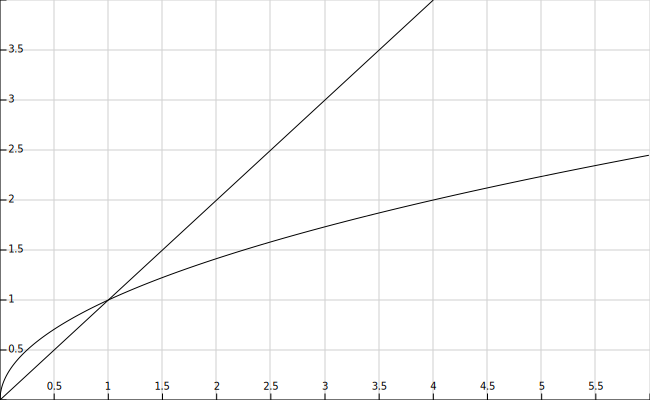

# Aplicació: Divisors d'un nombre i primalitat


En aquest lliçó es mostren diverses solucions relacionades amb la cerca dels divisors d'un nombre natural. Primer es presenta una solució fàcil per trobar tots els divisors d'un nombre. Com que resulta massa lenta, es mostra una segona versió més eficient que aprofita una senzilla propietat matemàtica. Finalment, s'aprofiten les idees utilitzades per fer un programa que determina si un nombre és primer o no.


## Escriure tots els divisors d'`n`

Considereu un programa que llegeixi un nombre natural `n` i que escrigui tots els seus divisors. Per exemple, per `n` = 30, caldria escriure 1, 2, 3, 5, 6, 10, 15, 30 i per `n` = 17, caldria escriure 1 i 17.

Donat que un natural `n` només pot tenir divisors entre 1 i `n` mateix, una possible solució per resoldre aquest problema és recórrer tots els naturals `d` entre 1 i `n` i, per a caadscun, mirar si `d` divideix `n`. En cas afirmatiu, cal escriure `d`.

Per codificar aquesta idea en Python, recordeu que aquest problema escriu *tots* els nombres entre 1 i `n`:

```python
from yogi import read

n = read(int)
d = 1
while d <= n:
    print(d)
    d = d + 1
```

Com que només volem escriure els `d` que divideixen `n`, podem fer que el `print(d)` es trobi condicionat en aquest fet:

```python
from yogi import read

n = read(int)
d = 1
while d <= n:
    if n % d == 0:
        print(d)
    d = d + 1
```

Fixeu-vos que la condició `n % d == 0` és equivalent a "`d` divideix `n`" perquè `%` és l'operador que calcula el rest de la divisió entera i `d` divideix `n` quan el rest de la divisió entera d'`n` entre `d` és zero. Per tant, el programa ara només imprimeix els divisors d'`n`. Bé!

Si proveu el programa anterior (sempre ho heu de fer!) comprovareu que funciona correctament.

Però doneu-li 1000000007 com a entrada... El programa de seguida escriu `1` però sembla que després no fa res! Tingueu paciència. El problema és que 1000000007 és un nombre gran i és un nombre primer: Com que els seus divisors només són 1 i 1000000007, va provant de dividir 1000000007 per tots els nombres entre 1 i 1000000006 sense èxit un darrera l'altre. Al meu ordinador, això triga uns dos minuts i mig. Els ordinadors són molt ràpids, però mai prou. Podríem trobar una manera més ràpida per trobar tots els divisors d'un nombre donat?


## Un algorisme més eficient

Una primera millora que podem afegir l'algorisme anterior és adonar-nos que, si un nombre $n$ no té cap divisor entre $2$ i $n-1$, tampoc el tindrà entre $2$ i $n/2$. Per tant, podem fer que el bucle sigui el doble de ràpida provant, com a molt, $1 + n/2$ divisors: el 2 i tots els nombres senars fins a $n$. Així, ens hauria de trigar la meitat.

Però encara ho podem millorar més: Fixeu-vos que cada cop que trobem que $d$ és un divisor d'$n$, també trobem que $n/d$ és un divisor de $n$. Per exemple, si sabem que 5 divideix 30, llavors també sabem que $30/5 = 6$ també divideix 30. Per tant, trobem dos divisors pel preu d'un! 🆓! A més, fixeu-vos que si $d$ és un divisor de $n$ amb $d\le\sqrt n$, llavors el divisor $n/d$ és més gran o igual que $\sqrt n$. Per tant, no cal que busquem tots els divisors de $n$ entre 1 i $n$, només cal que ho fem entre 1 i $\sqrt n$ i afegim el seu complementari (que estarà entre $\sqrt n$ i $n$).

Aquesta idea la podríem començar a codificar així en Python:

```python
from yogi import read

n = read(int)
d = 1
while d <= √n:                  ❌
    if n % d == 0:
        print(d)
        print(n // d)
    d = d + 1
```

Al programa anterior, quan es determina que `d` és un divisor d'`n`, no només s'escriu `d` com abans, sinó que ara també s'escriu la divisió entera d'`n` entre `d` (dos per un). A més, el bucle ara s'hauria d'aturar a l'arrel d'`n` enlloc d'`n`, cosa que hem escrit com `d <= √n`. Malauradament, Python no disposa de l'operació d'arrel quadrada `√`.

Però arreglar això és prou senzill: com que `d` sempre és positiva, la condició `d ≤ √n` és equivalent a `d² ≤ n` (elevem cada banda de l'innequació al quadrat). I això es pot escriure legalment en Python així:

```python
from yogi import read

n = read(int)
d = 1
while d * d <= n:                  ✅
    if n % d == 0:
        print(d)
        print(n // d)
    d = d + 1
```

El programa ja comença a rutllar! Si li donem 30 com a entrada ens escriu
1,
30,
2,
15,
3,
10,
5,
i 6.
Els divisors no es troben en ordre però hi són tots, tal com cal.

Malauradament, encara n'hi massa. Si li donem 25 com a entrada ens escriu
1,
25,
5 i
5.
El 5 s'escriu dos cops 🙁. La raó és que 25 és un **quadrat perfecte**, és a dir, el quadrat d'un nombre natural. La seva arrel és doncs un divisor (fet que el programa detecta correctament) i el seu complementari és ell mateix. Hi ha moltes maneres d'arreglar-ho; aquesta n'és una:


```python
from yogi import *

n = read(int)
d = 1
while d * d < n:
    if n % d == 0:
        print(d)
        print(n // d)
    d = d + 1
if d * d == n:
    print(d)
```

El bucle acaba ara sense arribar a l'arrel i, després del bucle, s'escriu l'arrel (un sol cop) si el nombre era un quadrat perfecte.

Visca! Ja funciona. Però de què ens ha servit aquesta feina? Proveu el nou programa amb 1000000007. A mi em dóna el resultat instantàniament. La raó és que el temps de la versió antiga creixia proporcionalment a `n`, mentre que el temps de la versió nova creix proporcionalment a `√n`. Ambues funcions tendeixen a infinit, però `n` molt més ràpid que `√n`, tal com mostra la figura següent:



Amb valors petits d'`n` ja es veu la diferència, amb valors grans és enorme! Què preferiu: fer unes 1000000007 passes o fer-ne √1000000007 ≈ 31500?

Aquí hem vist com aprofitar els nostres coneixements en el domini de les matemàtiques ens permet accelerar un programa. No oblideu el truc dels dos divisors pel preu d'un, en alguna altra ocasió el necessitareu.


## Primalitat

Recordeu que un nombre natural és **un nombre primer** quan admet exactament dos divisors: 1 i ell mateix. Els nombres primers menors que 100 són 2, 3, 5, 7, 11, 13, 17, 19, 23, 29, 31, 37, 41, 43, 47, 53, 59, 61, 67, 71, 73, 79, 83, 89 i 97. El zero i l'u no són primers: el zero no es pot dividir per ell mateix, i l'u, malgrat que es pot dividir per 1 i per ell mateix, aquests dos divisors són el mateix, per tant no són exactament dos.

Com podríem escriure un programa per determinar si un nombre natural donat és primer o no?

Fixeu-vos que acabem de fer un programa que, donat un nombre `n`, ens escriu tots els seus divisors. Si només escriu 1 i `n` (és a dir, si només troba dos divisors), vol dir que és primer. Per tant, podríem adaptar el programa anterior per comptar en una variable `c` el nombre de divisors entre 2 i `√n` (enlloc d'escriure'ls) i, al final, mirar si aquest comptador és zero o no per saber si `n` és primer o no.

Podem començar doncs així:

```python
from yogi import *

n = read(int)
c = 0
d = 2
while d * d <= n:
    if n % d == 0:
        c = c + 1
    d = d + 1
if c == 0:
    print(n, 'és primer')
else:
    print(n, 'no és primer')
```

Quasi... El programa anterior té dos defectes:

1. El primer és un problema de correctesa: El programa diu erròniament que 0 i 1 són primers. Us n'havieu adonat? Per la resta de naturals, els programa funciona correctament. Però els 0 i l'1 són casos especials i caldrà tractar-los de forma especial.

2. El segon problema és d'eficiència: Quan el programa determina que el nombre és compost, la variable `c` passa de 0 a 1, cosa que està bé. Però amb això, ja se sap que el nombre no és primer! En canvi, el programa continua buscant-li més divisors, cosa innecessària que enlenteix la solució.

Una possible manera de corregir aquests defectes és amb aquesta nova versió:

```python
from yogi import *

n = read(int)
if n <= 1:
    print(n, 'no és primer')
else:
    c = 0
    d = 2
    while d * d <= n and c == 0:
        if n % d == 0:
            c = 1
        d = d + 1
    if c == 0:
        print(n, 'és primer')
    else:
        print(n, 'no és primer')
```

Ara, els casos del 0 i l'1 es tracten explícitament. A més, el bucle deixa d'iterar de seguida que trobi que `c` ja no és zero fegint la condició `and c == 0`.

Per tant, la variable `c` ara ja no descriu el nombre de divisors trobats, sinó que val 0 quan encara no se n'ha trobat cap i 1 quan se n'ha trobat algun. Més endavant veurem que els booleans ens poden ajudar a descriure aquestes possibilitats d'una forma més neta.

<Autors autors="jpetit"/>
