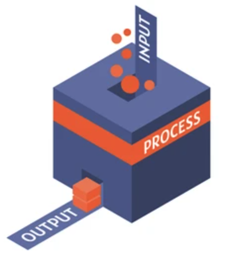

# Lectura i escriptura: conceptes

Els computadors no només realitzen càlculs, sinó que també necessiten interactuar amb els usuaris per obtenir les dades d'entrada i lliurar les dades de sortida. Aquesta interacció és coneguda com a entrada-sortida en informàtica i és un aspecte complex degut a la diversitat de dispositius existents.

## Entrada-sortida bàsica

L'entrada i sortida en els computadors és un procés fonamental per a la interacció entre l'usuari i la màquina. L'entrada fa referència a la recepció de dades o senyals des de fonts externes, com ara teclats, ratolins, escàners o altres dispositius perifèrics. Aquestes dades són processades i utilitzades pel sistema informàtic per realitzar tasques específiques. Per altra banda, la sortida implica la transmissió d'informació des del sistema informàtic cap a l'usuari o altres dispositius de sortida, com ara pantalles, impressores o altaveus. Aquesta informació pot prendre diverses formes, com text, imatges, so o comandaments per controlar altres dispositius. El procés d'entrada-sortida és gestionat per components de maquinari i programari que permeten la transferència eficient i fiable de dades entre els dispositius perifèrics i el sistema central. Això permet que els computadors puguin interactuar amb l'entorn extern i facilita la comunicació i l'ús de les seves funcionalitats per part dels usuaris.

Els canals d'entrada i de sortida estàndard d'un sistema operatiu són interfícies de comunicació per a la interacció entre l'usuari i el sistema. El **canal d'entrada estàndard**, conegut com a _stdin_, permet la introducció de dades per part de l'usuari (per exemple, a través del teclat) o per part d'un altre programa o un altre dispositiu (com, per exemple, un fitxer). D'altra banda, el **canal de sortida estàndard**, anomenat _stdout_, és utilitzat per mostrar els resultats, missatges o dades generades pel programa a l'usuari o a un altre procés. Aquests canals estàndard proporcionen una forma estandaritzada de comunicació entre els programes i el sistema operatiu facilitant la interacció i el flux de dades.

Gràcies en aquests canals implementat pel sistema operatiu, la lectura a través de _stdin_ i l'escriptura a través de _stdout_ es pot fer sense conèixer els detalls dels perifèrics als quals estan connectats.

<Autors autors="jpetit"/>
