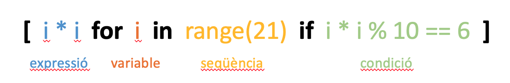
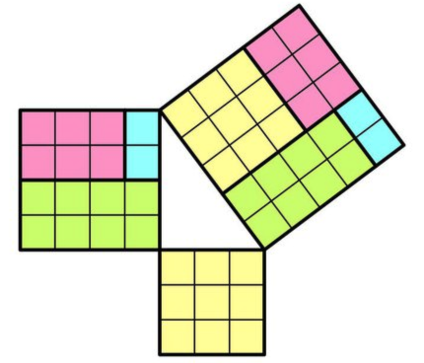

# Llistes per comprensió


En aquesta lliçó es presenten les llistes per comprensió, una manera de descriure de forma molt expressiva el contingut de les llistes amb una sintaxi semblant a la que estem acostumats per descriure conjunts en matemàtiques. Gràcies a les llistes per comprensió els algorismes tindran menys nivells d'indentació i resultaran més llegibles.


## Notació per comprensió

Fins ara hem descrit les llistes a través de la **notació per extensió**, és a dir, a base de donar una llista amb tots els membres del conjunt:

```python
>>> l1 = []
>>> l2 = [10, 30, -12]
>>> l3 = ['gat', 'gos', 'tortuga']
```

La notació per extensió és útil per a llistes amb uns pocs elements, però quan hi ha molts elements o el seu nombre és desconegut, ja no es pot utilitzar i cal escriure fragments de codi amb bucles i `append`s per tal de crear-les. Per exemple, aquest fragment crea la llista `quadrats` amb tots els nombres `i²` per les `i` de 0 a `n - 1`:

```python
quadrats: list[int] = []
for i in range(n):
    quadrats.append(i * i)
```

La **notació per comprensió** permet crear llistes a través d'una expressió en funció d'una variable, per a un domini de valors d'aquella variable. Per exemple, la llista `quadrats` es podria escriure així amb notació per comprensió:

```python
quadrats = [i * i for i in range(n)]
```

Segur que trobeu aquesta definició molt més senzilla que les tres línies anteriors i, a més, segur que reconeixeu aquesta notació com un calc de la que s'utilitza em matemàtiques per descriure conjunts:

$$
Q = \\{i^2 \ |\  i\in\\{1,...n\\}\\}
$$

A més, la notació per comprensió també permet afegir una condició pels elements inclosos a la llista. Per exemple, la llista de tots els quadrats entre 0 i 20 que acaben en un 6 es podria descriure així:


```python
>>> [i * i for i in range(21) if i * i % 10 == 6]
[16, 36, 196, 256]
```

Per tant, la notació per comprensió de llistes té quatre parts: 

- una expressió que determina els valors de la llista,
- una variable,
- una seqüència,
- i una condició (opcional).

Aquest n'és l'esquema:



Per sota, Python converteix una llista per comprensió en un bucle, un condicional i un `append`: La llista per comprensió 

```python
llista = [i * i for i in range(21) if i * i % 10 == 6]
```

és doncs equivalent a 

```python
llista = []
for i in range(21):
    if i * i % 10 == 6:
        llista.append(i * i)
```

però segurament la gestió de la memòria amb comprensions és més eficient.


Les comprensions poden tenir més d'un `for`, que s'executen aniuats. Per exemple, podríem calcular totes les sumes possibles dels valors de dos daus de sis cares en ordre creixent així:

```python
>>> sorted([dau1 + dau2 for dau1 in range(1, 7) for dau2 in range(1, 7)])
[2, 3, 3, 4, 4, 4, 5, 5, 5, 5, 6, 6, 6, 6, 6, 7, 7, 7, 7, 7, 7, 8, 8, 8, 8, 8, 9, 9, 9, 9, 10, 10, 10, 11, 11, 12]
```

Ocasionalment, també voldrem crear llistes de tuples:

```python
>>> [(a, b) for a in range(3) for b in 'gat']
[(0, 'g'), (0, 'a'), (0, 't'), (1, 'g'), (1, 'a'), (1, 't'), (2, 'g'), (2, 'a'), (2, 't')]
```

Sovint les llistes per comprensió es comporten molt bé amb les funcions predefinides com `max`, `min` i `sum`. Per exemple,
la funció que havíem fet pel producte escalar es pot escriure més concisament així:

```python
def producte_escalar(x: list[float], y: list: [float]) -> float:
    """Retorna el producte escalar de dos vectors de la mateixa mida."""

    return sum([x[i] * y[i] for i in range(len(x))])
```



Un darrer exemple: En matemàtiques, una **terna pitagòrica** és formada per tres nombres naturals $a$, $b$ i $c$ tals que $a^2+b^2=c^2$. Per tant, les ternes pitagòriques es corresponen a triangles rectangles amb els tres costats de mides naturals. 

Una llista per comprensió per les ternes pitagòriques es podria escriure doncs així:

```python
>>> n = 25  # llargada màxima
>>> [   (a, b, c)
...     for a in range(1, n + 1)
...     for b in range(a, n + 1)
...     for c in range(b, n + 1)
...     if a**2 + b**2 == c**2
... ]
[(3, 4, 5), (5, 12, 13), (6, 8, 10), (7, 24, 25), (8, 15, 17), (9, 12, 15), (12, 16, 20), (15, 20, 25)]
```

Hi ha mètodes més eficients per generar ternes pitagòriques, però aquest exemple posa de manifest les capacitats de les llistes per comprensió.

<Autors autors="jpetit"/> 


