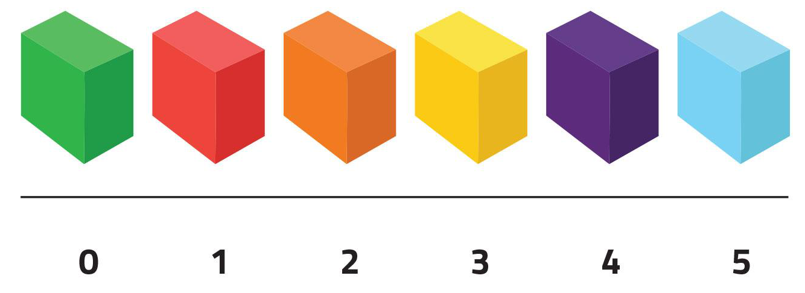
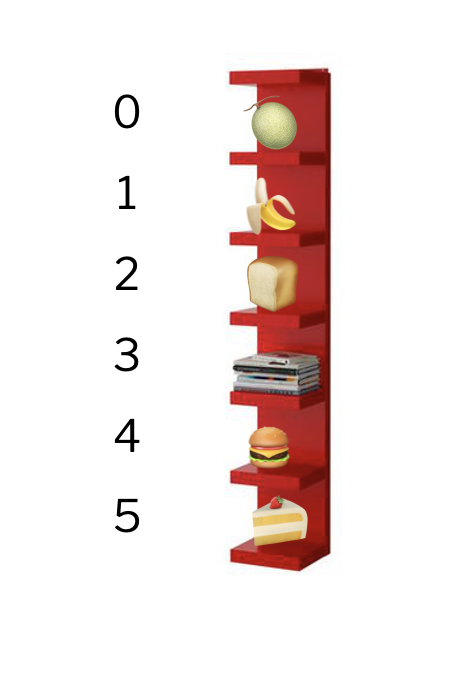

# Llistes




Aquesta lliçó introdueix una de les estructures de dades més habituals i útils en el món de la programació: les llistes. Les llistes permeten emmagatzemar en una sola variable una col·lecció de moltes dades del mateix tipus i accedir a qualsevol d'elles directament a través de la seva posició.


## Introducció

Una **llista** és una estructura de dades que conté una col·lecció d'elements, tots del mateix tipus (enters, reals, texts, etc.). Els elements en una llista estan disposats en diferent posicions, i per referir-se a un d'ells s'utilitza un **índex**, que és un nombre enter que indica la posició de l'element en la llista, començant per 0.

Així, en una llista d'`n` elements, el primer element tindrà índex 0, el segon element tindrà índex 1, ... i el darrer element tindrà índex `n - 1`. A la figura següent podeu veure una llista `v = [3, 5, -1, 7, 2]`,  juntament amb l'índex que identifica cada element. Com  que la llista `v` té cinc posicions, l'últim element té índex 4. L'element a la posició `i` de la llista es denota per `v[i]`. Per exemple, `v[3]` és `7`.

<center>

</center>

Podem imaginar una llista com una prestatgeria amb molts prestatges. Tots els seus prestatges són idèntics, estan etiquetats per un número (començant des del zero), i poden emmagatzemar diferents dades. Hom es pot referir tant a la prestatgeria com un tot, o referir-se al contingut d'un dels seus prestatges a través del seu número de prestatge. A la figura següent, el darrer prestatge és el sisè, a la posició 5, i conté un pastís.

<center>

</center>

La manera més senzilla d'escriure les llistes és enumerant els seus elements entre claudàtors i separant-los per parèntesis. Aquí en teniu alguns exemples:

```python
>>> l1 = [1, 2, 3]
>>> l1
[1, 2, 3]
>>> l2 = [-3.4, 5.8, 2.0, 12.11]
>>> l2
[-3.4, 5.8, 2.0, 12.11]
>>> l3 = [False, False, True]
>>> l3
[False, False, True]
```

Les llistes i les tuples tenen semblances, però són força diferents. Més avall en concretem les diferències.

Hi ha força operacions que es poden aplicar sobre les llistes, a continuació en veiem les més usuals.


## Funcions predefinides

Python ofereix algunes funcions predefinides sobre llistes. Per exemple, la funció `len`, aplicada a una llista, en retorna el seu nombre d'elements (també dit llargada, o mida):

```python
>>> len([6, 3, 4, 6, 1])
5
>>> len([])     # [] és la llista buida (sense cap element)
0
>>> len([66])   # [66] és la llista que només conté l'element 66
1
```

Les funcions `min` i `max` aplicades sobre una única llista no buida en retornen el seu mínim i màxim respectivament:

```python
>>> min([6, 3, 4, 6, 1])
1
>>> max([3.14, 2.78, 0.0])
3.14
```

La funció `sum` retorna la suma dels elements en una llista:

```python
>>> sum([3.14, 2.78, 0.0])
5.92
```

La funció `sorted` retorna la llista amb els elements ordenats de petit a gran:

```python
>>> sorted([3.14, 2.78, 0.0])
[0.0, 2.78, 3.14]
```

La funció `reversed` retorna la llista del revés. Però per motius tècnics que ara no cal explicar, cal aplicar-li encara una conversió a `list` per obtenir-los com a llista:

```python
>>> reversed([3.14, 2.78, 0.0])
<list_reverseiterator object at 0x10d95e830>
>>> list(reversed([3.14, 2.78, 0.0]))
[0.0, 2.78, 3.14]
```


## Operadors

La concatenació de dues llistes s'obté amb l'operador `+`:

```python
>>> [1, 2, 3] + [4, 5, 6]
[1, 2, 3, 4, 5, 6]
>>> [1, 2, 3] + [4, 5, 6]+[]
[1, 2, 3, 4, 5, 6]
```

El producte d'una llista per un enter (i d'un enter per una llista) retorna aquella llista repetida tants cops com el número indicat:

```python
>>> 4 * [1, 2, 3]
[1, 2, 3, 1, 2, 3, 1, 2, 3, 1, 2, 3]
>>> [1, 2, 3] * 4
[1, 2, 3, 1, 2, 3, 1, 2, 3, 1, 2, 3]
```

Aquestes operacions recorden les dels textos perquè els textos i les llistes de caràcters són prou semblants. Però també hi ha diferències de les quals en parlarem més avall.

Els operadors relacionals amb llistes també funcionen:

```python
>>> [1, 1] == [1, 1]
True
>>> [1, 1] == [1, 1, 2]
False
>>> [1, 1] != [1, 1, 2]
True
>>> [10, 20, 30] < [10, 40, 4]
True
```

A més, les llistes tenen un operador `in` que indica si un element es troba o no dins d'una llista. I l'operador `not in` retorna el contrari:

```python
>>> "oca" in ["conill", "xai", "oca", "anec"]
True
>>> "gos" not in ["conill", "xai", "oca", "anec"]
True
```


## Operacions d'accés als elements

Recordeu que les posicions d'una llista s'identifiquen per un enter començant pel 0. Així, en una llista de quatre elements, el primer té índex 0, el segon 1, el tercer 2 i l'últim 3. Si volem accedir a un element d'una llista, haurem d'especificar el seu índex entre claudàtors, de la manera que es mostra aquí:

```python
v = [11.5, -13.2, 4.6, 7.8]
print(v[2])         # escriu 4.6
if v[0] > 5:
    v[3] = 9.0
# la llista esdevé [11.5, -13.2, 4.6, 9.0]
```

De la mateixa manera, podem modificar el contingut de certa posició d'una llista. Ho podeu veure a l'exemple següent, on els comentaris indiquen el contingut de la llista en cada moment:

```python
llista = [1, 1, 1, 1]              # llista = [1, 1, 1, 1]
llista[1] = 4                      # llista = [1, 4, 1, 1]
llista[3] = llista[1]              # llista = [1, 4, 1, 4]
llista[0] = 2 * llista[2] + 1      # llista = [3, 4, 1, 4]
llista[0] -= 1                     # llista = [2, 4, 1, 4]
```

Recordeu que si una llista té `n` posicions, els índexs vàlids són entre 0 i `n - 1`. Indexar una llista amb un valor amb un valor superior o igual a `n` és un error de programació i Python trencarà l'execució del programa.  Per tant, sempre que indexeu en una llista, heu de fer l'exercici mental (🤔) d'assegurar-vos que l'índex que useu no accedeix fora de la llista. En canvi, Python presenta la peculiaritat de que els índexs poden ser negatius: l'índex `-1` representa el darrer element de la llista, `-2` el penúltim, ètc.

El fragment següent mostra tres accessos il·legals a les posicions d'una llista:

```python
noms = ["Mireia", "Marta", "Elvira", "Jana"]
noms[10] = "Jordi"              # 💥 la posició 10 no existeix
if noms[4] == "Carme": ...      # 💥 la posició  4 no existeix
noms[-5] = "Raquel"             # 💥 la posició -5 no existeix
```

Les llistes de Python exhibeixen una propietat anomenada **accés directe**: Donada una llista `L` i un índex `i`, l'accés a `L[i]` es fa en un temps independent de la llargada de la llista `L` i del valor d'`i`.


## Subllistes

Amb les *slices* es creen noves llistes. Les posicions d'inici, final i pas funcionen igual que al `range`:

```python
>>> xs = [30, 50, 10, 50, 60, 20, 50, 70]
>>> xs[2:6]
[10, 50, 60, 20]
>>> xs[:6]
[30, 50, 10, 50, 60, 20]
>>> xs[:2]
[30, 50]
>>> xs[:]
[30, 50, 10, 50, 60, 20, 50, 70]
>>> xs[1:8:2]
[50, 50, 20, 70]
```

També es poden usar per modificar (i extendre) segments de llistes existents:

```python
>>> L = [1, 2, 3, 4, 5, 6, 7, 8, 9]
>>> L[2:5] = [33, 44, 55]
>>> L
[1, 2, 33, 44, 55, 6, 7, 8, 9]
```

```python
>>> L = [1, 2, 3, 4, 5, 6, 7, 8, 9]
>>> L[8:] = [33, 66, 99]
>>> L
[1, 2, 3, 4, 5, 6, 7, 8, 33, 66, 99]
```


## Afegir i treure elements

Les llistes també disposen d'instruccions per treure elements de la llista i per afegir-ne de nous:

```python
>>> xs = [10, 20, 30]
>>> xs.append(40)
>>> xs
[10, 20, 30, 40]
>>> xs.append(50)
>>> xs
[10, 20, 30, 40, 50]
>>> ys = [60, 70, 80]
>>> xs.extend(ys)
>>> xs
[10, 20, 30, 40, 50, 60, 70, 80]
>>> del(xs[3])  # lent!
>>> xs
[10, 20, 30, 50, 60, 70, 80]
>>> xs.pop()    # ràpid
80
>>> xs
[10, 20, 30, 50, 60, 70]
>>> xs.clear()
>>> xs
[]
```

Afegir i treure elements pel final és eficient, fer-ho pel mig de la llista no ho és.

Fixeu-vos que algunes operacions es duen a terme sobre una llista amb una notació consistint en un punt i un nom. Sembla una crida a una funció però és un **mètode**. Molt més endavant es clarificarà aquest concepte.


## Recórrer tots els elements d'una llista

Sovint, es vol recórrer tots els elements de la llista, des del primer fins al darrer, realitzant alguna tasca amb cadascun  d'aquests elements. Per exemple, per escriure cada temperatura d'una llista que conté una llista de temperatures es podria fer:

```python
temperatures = [1.0, 12.5, 14.0, 10.1, -3.5]
for temperatura in temperatures:
    print(temperatura)
```

Aquí, el bucle `for` indica que la variable `temperatura` anirà prenent per valor cada element de la llista `temperatures` de forma successiva, de la posició 0 en endavant. Dins del cos del bucle, cada valor és escrit.

Us sona? És clar: el `range` no és altra cosa que una funció predefinida que retorna una llista (tècnicament, no exactament, però tant li fa).

Aquest exemple mostra que és habitual, tot i que no és normatiu, que les llistes tinguin noms en plural, i els elements que les integren, el nom corresponent en singular.

Aquí podeu veure com calcular el producte dels elements d'una llista fent servir aquest recorregut:

```python
nombres = [3, 5, -2, 4]
prod = 1
for nombre in nombres:
    prod = prod * nombre
print(prod)                      # escriu -120
```

Compte: Cal recordar que la variable que s'utilitza per iterar sobre els elements de la llista és una còpia dels seus elements. Per tant, en el programa següent, la llista no canvia malgrat que es dobli cada nombre:

```python
nombres = [3, 5, -2, 4]
for nombre in nombres:          #  👀 còpia
    nombre = nombre * 2
# nombres = [3, 5, -2, 4] 😢
```

Per poder canviar els elements de la llista, cal iterar sobre els índexs de la llista enlloc de sobre els elements de la llista: Així, per doblar tots els elements de la llista `nombres` podem fer::

```python
nombres = [3, 5, -2, 4]
for index in range(len(nombres)):
    nombres[i] = nombres[i] * 2
# nombres = [6, 10, -4, 8] 😃
```


## El tipus llista

En Python, les llistes són de tipus `list`, ho podem comprovar així:

```python
>>> type([3, 5, 1, 1, 2])
<class 'list'>
```

Per tal de comptar amb la seguretat que aporta la comprovació de tipus, d'ara en endavant suposarem que totes les posicions d'una llista han de ser del mateix tipus: es diu que aquestes llistes són estructures de dades **homegènies**. Això no és cap imposició de Python, però és un bon costum per a novells.

En el sistema de tipus de Python, `list[T]` descriu un nou tipus que és una llista on cada element és de tipus `T`. Per exemple, `list[int]` és el tipus d'una llista d'enters i `list[str]` és una llista de textos.

En la majoria d'ocasions, no cal anotar les variables de llistes amb el seu tipus, perquè el sistema ja ho determina sol a través dels seus valors. Només en el cas de crear llistes buides cal indicar el tipus dels elements de les llistes perquè, evidentment, el sistema no ho pot saber:

```python
l1: list[int] = [40, 20, 34, 12, 40]    # no cal anotar el tipus: es dedueix automàticament
l2: list[float] = []                    # cal anotar el tipus que tindrà aquella llista buida
                                        # perquè no es pot pas deduir
```

Les llistes també es poden utilitzar com a paràmetres de subprogrames. Llavors, cal anotar el seu tipus, igual que feiem amb la resta de paràmetres. Per exemple, aquesta funció calcularia la temperatura màxima d'una llista de reals que emmagatzema temperatures:

```python
def temperatura_maxima(temperatures: list[float]) -> float:
    ...
```


## Relació entre llistes i textos

A efectes pràctics, el tipus `str` és força semblant a una llista de caràcters: quasi totes les operacions són les mateixes:

```python
>>> s = 'Blaumut'
>>> len(s)
7
>>> s + s
'BlaumutBlaumut'
>>> s * 2
'BlaumutBlaumut'
>>> s[0]
'B'
>>> s[4:]
'mut'
>>> s[:4]
'Blau'
>>> s[::-1]
'tumualB'
>>> 'a' in s
True
```

Ara bé, hi ha una diferència important: als texts de Python no se'ls poden modificar els seus caràcters: es diu que són immutables:

```python
>>> s = 'Blaumut'
>>> s[0] = 'C'
TypeError: 'str' object does not support item assignment
```

A més, els texts ofereixen moltes operacions específiques:

```python
>>> s = 'Blaumut'
>>> s.upper()       # retorna s en majúscules
'BLAUMUT'
>>> s.lower()       # retorna s en minúscules
'blaumut'
>>> s.isnumeric()   # indica si s és numèric
False
```

A més, `split` és una operació particularment útil dels textos: Aplicada sobre un text, retorna una llista amb cadascuna de les seves paraules, utilitzant blancs com a separadors:

```python
>>> 'és quan dormo que hi veig clar'.split()
['és', 'quan', 'dormo', 'que', 'hi', 'veig', 'clar']
>>> '      és   quan    dormo que hi veig   clar      '.split()
['és', 'quan', 'dormo', 'que', 'hi', 'veig', 'clar']
```

Addicionalment, també es pot passar com a paràmetre el text que servirà de separador:

```python
>>> '01/10/2017'.split('/')
['01', '10', '2017']
```


## Relació entre llistes i tuples

Les tuples també s'assemblen a les llistes, però també hi ha diferències fonamentals:

- Els camps de les tuples són immutables, però els elements de les llistes son mutables.

- Els camps de les tuples poden (i solen) ser de tipus diferents. Tots els elements d'una llista `list[T]` són del mateix tipus `T`.

Dit això, els elements de les llistes també es poden desempaquetar com els de les tuples:

```python
>>> [a, b] = [1, 2]
>>> a
1
>>> b
2
```

## Resum de les operacions bàsiques

|operació|significat|
|---|----|
|`[]`|crea una llista buida.|
|`[x1,x2,...]`|crea una llista amb elements `x1`, `x2`,...|
|`L1 + L2`|retorna la concatenació de la llista `L1` i la llista `L2`.|
|`L * n`|retorna la llista `L` repetida `n` cops.|
|`len(L)`|retorna el nombre d'elements de la llista `L`. |
|`sum(L)`|retorna la suma de tots els valors de la llista `L`.|
|`max(L)`|retorna el màxim de tots els valors de la llista `L`.|
|`min(L)`|retorna el mínim de tots els valors de la llista `L`.|
|`L[i]`| accedeix al valor de la posició `i` de llista `L`.|
|`L[i:j:p]`| retorna la subllista de `L` entre les posicions `i` i `j` amb pas `p`.|
|`x in L` o `x not in L`| diu si `x` és o no un element de la llista `L`.|
|`reversed(L)`|retorna la llista `L` del revés.|
|`sorted(L)`|retorna la llista `L` ordenada.|
|`L.clear()`|esborra tots els elements de la llista `L`.|
|`L.append(x)`|afegeix l'element `x` al final de la llista `L`.|
|`L1.extend(L2)`|afegeix la llista `L2` al final de la llista `L1`.|
|`L.pop()`|elimina i retorna el darrer element de la llista `L1`.|

<Autors autors="jpetit"/>
