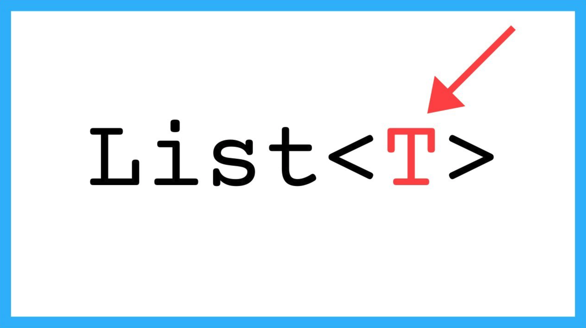

# Tipus genèrics



En aquesta lliçó es mostra com fer que les funcions i les accions tinguin uns tipus més flexibles per tal de no haver de duplicar codi. Per a fer-ho, s'introdueix l'ús de d'`Any` i de `TypeVar` del mòdul `typing` aplicats a un parell d'exemples senzills.


## Limitacions

Imagineu que ens demanen d'escriure una funció que, donada una llista no buida d'enters, retorni la posició del seu element més gran (una d'elles si hi apareix més d'un cop). La funció següent fa exactament això:

```python
def posicio_maxim_llista_enters(L: list[int]) -> int:
    """
    Retorna una posició p tal que L[p] >= x per a tot x en L.
    Precondició: L no és buida.
    """

    p = 0
    for i in range(1, len(L) + 1):
        if L[i] > L[p]:
            p = i
    return p
```

No té misteri. Ara imagineu que ens demanen d'escriure una funció que, donada una llista no buida de textos, retorni la posició del seu element més gran. Que fàcil! Només cal copiar la funció anterior i canviar la seva capçalera per reflectir que ara es tracten llistes de textos:

```python
def posicio_maxim_llista_textos(L: list[str]) -> int:
    ... # mateix codi que a posicio_maxim_llista_enters
```

És que tret de la capçalera, tot és igual! I si ara volem fer-ho amb una llista de reals, només l'haurem de tornar a duplicar:

```python
def posicio_maxim_llista_reals(L: list[float]) -> int:
    ... # mateix codi que a posicio_maxim_llista_enters
```

Clarament, tenir tot aquest codi duplicat no té gens de sentit. El *cut and paste* és l'amic del mal programador, mai del bon programador. Totes aquestes versions de la mateixa funció per a diferents tipus és o serà un problema. I encara més tenint en compte que, en execució, Python ignora totalment els tipus! Ens cal una manera de tenir capçaleres que parlin de tipus qualssevol.


## El tipus `Any`

El sistema de tipus de Python ens ofereix maneres de fer més flexibles i genèriques les anotacions de tipus. La primera manera és amb `Any`:

El tipus especial `Any` (que cal importar del mòdul `typing`) representa qualsevol tipus, de forma que qualsevol tipus és compatible amb `Any` i `Any` és compatible amb qualsevol tipus.

El seu ús és ben senzill. Podem compactar totes les funcions anteriors amb aquesta definició:

```python
from typing import Any

def posicio_maxim(L: list[Any]) -> int:
    """
    Retorna una posició p tal que L[p] >= x per a tot x en L.
    Precondició: L no és buida.
    """

    p = 0
    for i in range(1, len(L) + 1):
        if L[i] > L[p]:
            p = i
    return p
```

A la capçalera, ara tenim que `L: list[Any]`, és a dir, que `L` és una llista de qualsevol tipus d'elements. Per tant, no hi haurà errors de tipus si li passem una llista d'enters, una llista de reals, o una llista de textos. Per això, ara diem que `posicio_maxim` és una **funció genèrica**.


# Les variables de tipus

Malgrat que `Any` resulta útil en algunes situacions, en d'altres, `Any` no és prou fort. Per exemple, considereu una funció genèrica que donada una llista d'elements, la retorni ordenada (l'algorisme d'ordenació en particular no és rellevant ara).

Si la seva capçalera fos

```python
def ordena(L: list[Any]) -> list[Any]:
    ...
```

quedaria clar que `L` pot ser una llista de qualsevol tipus, però no queda clar que el tipus de la llista retornada sigui el mateix que el de la llista d'entrada. Tal com s'ha escrit, el sistema de tipus i els programadors podrien entendre que `ordena` pot rebre una llista d'enters i retornar una llista de reals, quan el que es vol dir és que si la llista d'entrada és d'enters, la llista de sortida també és d'enters, i si la llista d'entrada és de reals, la llista de sortida també és de reals, ètc.

Igualment, potser dins del codi d'`ordena`, en algun lloc cal anotar el tipus d'una variable local amb el mateix tipus que el tipus dels elements de la llista. `Any` no seria útil, perquè `Any` sempre es refereix a qualsevol tipus.

Per això el sistema de tipus de Python ofereix **variables de tipus**. La forma d'usar les variables de tipus és la següent:

```python
from typing import TypeVar

T = TypeVar('T')

def ordena(L: list[T]) -> list[T]:
    ...
    x: T
    ...
```

Ara és clar que quan `ordena` reb una llista de `T`s, retorna una llista de `T`s. I, a més, dins del codi d'`ordena` es pot ara anotar que el tipus d'una variable `x` és també del mateix tipus que els elements de la llista. Gràcies a les variables de tipus, ens podem referir més d'un cop a un mateix tipus que encara no coneixem quan programem.

Si cal, les variables de tipus també es poden restringir a un subconjunt de tipus. Per exemple, si `ordena_numeros` només ha de funcionar per llistes de reals i enters, però no per altres tipus, es podria escriure:


```python
T = TypeVar('T', int, float)

def ordena_numeros(L: list[T]) -> list[T]:
    ...
```

No tinc clar de què serveix el primer paràmetre del `TypeVar`. Tothom hi posa un text que és el mateix que la variable a la qual s'assigna. Suposo que és el nom que s'utilitza quan hi ha errors.

Evidentment, les funcions poden usar més d'una variable de tipus. Per exemple, aquesta funció gira els camps d'una tupla:

```python
T1 = TypeVar('T1')
T2 = TypeVar('T2')

def gira(t: tuple[T1, T2]) -> tuple[T2, T1]:
    return t[1], t[0]
```


<Autors autors="jpetit"/>
