# Matplotlib


Matplotlib és una biblioteca de Python per crear gràfics i visualitzacions de dades. És una eina fonamental per a l'anàlisi de dades i la presentació de resultats. En aquest document es mostren exemples pràctics d'ús de Matplotlib per crear diferents tipus de gràfics. Us ho podeu prendre com un conjunt de receptes per a les vostres pròpies visualitzacions. Podeu aprofundir més en la [documentació oficial de Matplotlib](https://matplotlib.org/stable/contents.html).

## Instal·lació

Per instal·lar Matplotlib, utilitzeu pip:

```bash
python3 -m pip install matplotlib
```

Per disposar de capçaleres per acomprovacions de tipus, també podeu instal·lar el paquet `matplotlib-stubs` (encara una mica imperfecte):

```bash
python3 -m pip install matplotlib matplotlib-stubs
```

## Primer gràfic

El mòdul més utilitzat de Matplotlib és `pyplot`, que proporciona una interfície similar a MATLAB. Aquest exemple mostra com crear un gràfic de línies bàsic amb etiquetes als eixos i un títol:

```python
import matplotlib.pyplot as plt

x = [1, 2, 3, 4, 5]
y = [2, 4, 8, 16, 32]

plt.plot(x, y)
plt.xlabel('Eix X')
plt.ylabel('Eix Y')
plt.title('El meu primer gràfic')
plt.show()
```

Quan executeu aquest codi, apareixerà una finestra amb el gràfic corresponent:

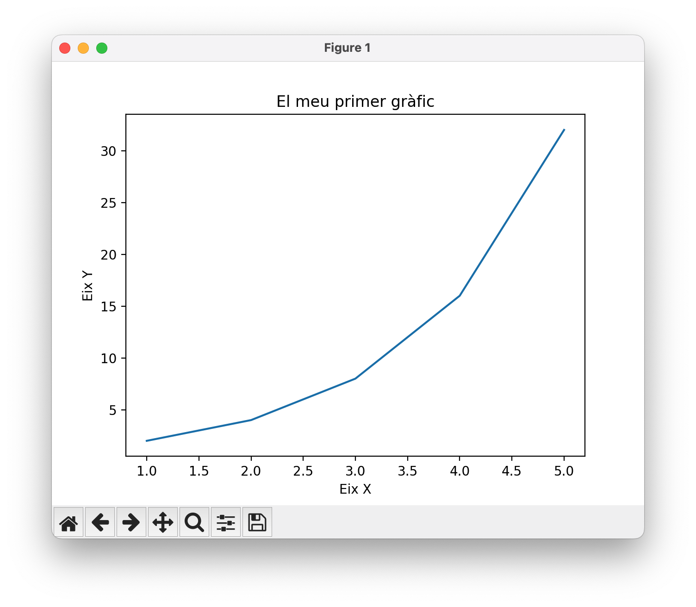

Les eines de la barra inferior permeten desar el gràfic en diversos formats (PNG, SVG, PDF, etc.), ampliar-lo, i moure's per la imatge.

El funcionament del programa és senzill:

-   Importa el mòdul `pyplot` de Matplotlib usant l'àlies `plt`, com és habitual.

-   Defineix les dades a representar en dues llistes: `x` i `y`.

-   Utilitza la funció `plt.plot(x, y)` per crear el gràfic de línies.

-   Afegeix etiquetes als eixos i un títol amb les funcions `plt.xlabel()`, `plt.ylabel()` i `plt.title()`.

-   Finalment, mostra el gràfic amb `plt.show()`.

## Desar gràfics

Si es vol desar el gràfic sense mostrar-lo, es pot utilitzar `plt.savefig("nom_fitxer.format")` en lloc (o a més) de `plt.show()`. A sota teniu el resultat desat en format SVG amb `plt.savefig("p1.svg")`:

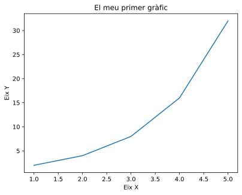

Les imatges en format SVG són escalables i ideals per incloure dins de publicacions d'alta qualitat (com aquesta! 😂). Altres formats comuns són PNG (imatge de mapa de bits) i PDF (document vectorial).

A més, el paràmetre `dpi` controla la resolució (punts per polzada), i `bbox_inches='tight'` elimina l'espai blanc innecessari al voltant del gràfic.

Si es vol desar el gràfic amb un fons fosc, es pot utilitzar la comanda `plt.style.use("dark_background")` abans de crear el gràfic. Aquí teniu el mateix gràfic desat amb fons fosc:

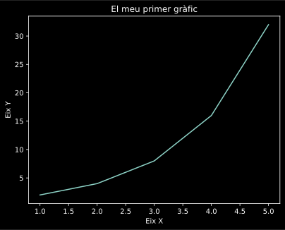

Si es vol desar el gràfic sense color de fons (transparent), es pot utilitzar el paràmetre `transparent=True` a `plt.savefig()`. Això és útil per superposar el gràfic sobre altres imatges o fons.

## Gràfics de línies

Els gràfics de línies són ideals per mostrar l'evolució de dades contínues. Amb `numpy` podem generar dades més suaus i crear múltiples sèries en un mateix gràfic. La funció `legend()` mostra la llegenda amb les etiquetes de cada línia, i `grid()` afegeix una graella per facilitar la lectura:

```python
import matplotlib.pyplot as plt
import numpy as np

x = np.linspace(0, 10, 100)
y = np.sin(x)

plt.plot(x, y, label='sin(x)')
plt.plot(x, np.cos(x), label='cos(x)')
plt.legend()
plt.grid()
plt.show()
```

Vet aquí el resultat:

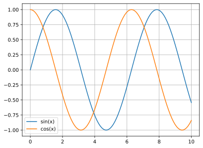

## Gràfics de punts

Els gràfics de dispersió (scatter plots) mostren la relació entre dues variables. Podem personalitzar cada punt amb colors i mides diferents. El paràmetre `c` controla el color de cada punt, `s` la mida, i `alpha` la transparència. La barra de colors (`colorbar`) mostra l'escala de colors utilitzada:

```python
x = np.random.rand(50)
y = np.random.rand(50)
colors = np.random.rand(50)
sizes = 1000 * np.random.rand(50)

plt.scatter(x, y, c=colors, s=sizes, alpha=0.5)
plt.colorbar()
plt.show()
```

El gràfic resultant és el següent:

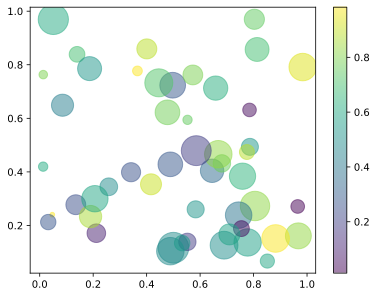

Noteu que, per brevetat, no hem importat `matplotlib.pyplot` i `numpy` en aquest fragment, però cal fer-ho abans d'executar el codi.

## Histogrames

Els histogrames mostren la distribució de freqüències d'un conjunt de dades. El paràmetre `bins` determina el nombre de barres (intervals) en què es divideixen les dades. L'opció `edgecolor` afegeix un contorn a cada barra per millorar la visualització:

```python
dades = np.random.randn(1000)

plt.hist(dades, bins=30, edgecolor='black')
plt.xlabel('Valor')
plt.ylabel('Freqüència')
plt.title('Histograma')
plt.show()
```

El resultat és aquest histograma:

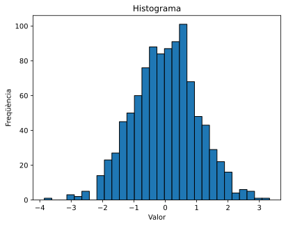

## Gràfics de barres

Els gràfics de barres són perfectes per comparar valors entre categories. Cada barra representa una categoria i la seva alçada indica el valor corresponent:

```python
categories = ['A', 'B', 'C', 'D']
valors = [23, 45, 56, 78]

plt.bar(categories, valors, color='skyblue')
plt.xlabel('Categoria')
plt.ylabel('Valor')
plt.show()
```

El gràfic de barres resultant és aquest:

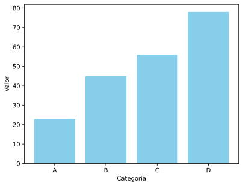

## Gràfics de sectors

Els gràfics circulars (pie charts) mostren proporcions d'un tot. El paràmetre `explode` permet separar un sector de la resta per destacar-lo. L'opció `autopct` mostra els percentatges, i `startangle` permet rotar el gràfic:

```python
etiquetes = ['Python', 'Java', 'JavaScript', 'C++']
mides = [35, 25, 20, 20]
colors = ['gold', 'lightblue', 'lightgreen', 'coral']
explode = (0.1, 0, 0, 0)

plt.pie(mides, explode=explode, labels=etiquetes, colors=colors,
        autopct='%1.1f%%', shadow=True, startangle=90)
plt.axis('equal')
plt.show()
```

El gràfic de sectors resultant és aquest:

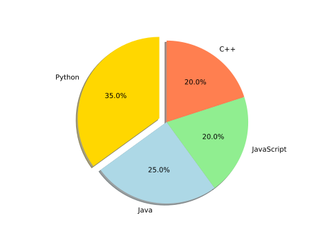

## Gràfics de caixes

Els gràfics de caixes (box plots) mostren la distribució estadística de les dades, incloent la mediana, quartils i valors atípics. Són útils per comparar distribucions entre diferents grups:

```python
dades = [np.random.normal(0, std, 100) for std in range(1, 4)]

plt.boxplot(dades, tick_labels=['Grup 1', 'Grup 2', 'Grup 3'])
plt.ylabel('Valors')
plt.show()
```

L'exemple genera aquest gràfic de caixes:

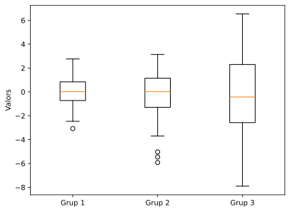

## Mapes de calor

Els mapes de calor (heatmaps) representen dades matricials amb colors, on cada valor es tradueix en una intensitat de color. El paràmetre `cmap` especifica l'esquema de colors (com 'viridis', 'hot', 'cool'), i `aspect` controla la relació d'aspecte de les cel·les:

```python
dades = np.random.rand(10, 10)

plt.imshow(dades, cmap='viridis', aspect='auto')
plt.colorbar()
plt.title('Mapa de calor')
plt.show()
```

El mapa de calor resultant és aquest:

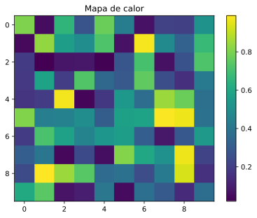

## Gràfics de violí

Els gràfics de violí (violin plots) combinen box plots amb estimacions de densitat, mostrant la distribució completa de les dades. Les opcions `showmeans` i `showmedians` afegeixen marques per a la mitjana i la mediana:

```python
dades = [np.random.normal(0, std, 100) for std in range(1, 5)]

plt.violinplot(dades, showmeans=True, showmedians=True)
plt.xlabel('Grups')
plt.ylabel('Valors')
plt.show()
```

El gràfic de violí resultant és aquest:

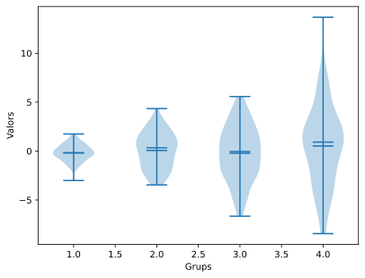

## Múltiples subgràfics

La funció `subplot(files, columnes, posició)` permet crear diversos gràfics en una mateixa figura. `tight_layout()` ajusta automàticament l'espaiat entre subgràfics per evitar solapaments:

```python
x = np.linspace(0, 10, 100)

plt.figure(figsize=(10, 4))

plt.subplot(1, 2, 1)
plt.plot(x, np.sin(x))
plt.title('sin(x)')

plt.subplot(1, 2, 2)
plt.plot(x, np.cos(x))
plt.title('cos(x)')

plt.tight_layout()
plt.show()
```

El resultat és aquesta figura que conté els dos subgràfics:

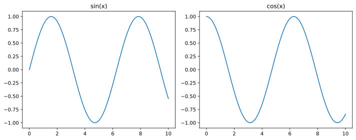

## Colors i estils de línia

Matplotlib permet personalitzar l'aparença de les línies amb codis curts. Per exemple, `'r-'` és una línia vermella sòlida, `'b--'` és una línia blava discontínua, i `'g:'` és una línia verda de punts. El paràmetre `linewidth` controla el gruix de la línia:

```python
x = np.linspace(0, 10, 100)

plt.plot(x, x, 'r-', label='línia vermella')
plt.plot(x, x**1.5, 'b--', label='línia blava discontínua')
plt.plot(x, x**2, 'g:', linewidth=3, label='línia verda de punts')
plt.legend()
plt.show()
```

Aquí podem veure les diferents línies amb els seus estils:

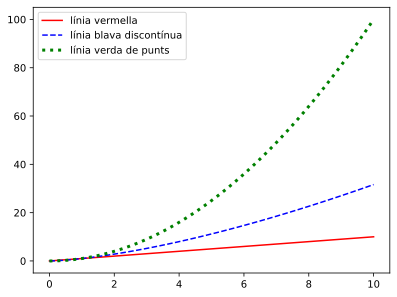

## Límits dels eixos

Amb `xlim()` i `ylim()` podem controlar el rang visible dels eixos per enfocar-nos en una regió específica del gràfic:

```python
x = np.linspace(0, 10, 100)
y = np.sin(x)

plt.plot(x, y)
plt.xlim(2, 8)
plt.ylim(-0.5, 0.5)
plt.show()
```

## Estils predefinits

Matplotlib inclou diversos estils predefinits que canvien l'aparença global dels gràfics (colors, fonts, graelles, etc.). Alguns estils populars són `'seaborn-v0_8-darkgrid'`, `'ggplot'`, `'fivethirtyeight'`:

```python
plt.style.use('seaborn-v0_8-darkgrid')

x = np.linspace(0, 10, 100)
plt.plot(x, np.sin(x))
plt.show()
```

El gràfic amb l'estil aplicat és aquest:

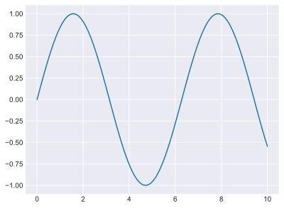

## Gràfics 3D

Per crear gràfics tridimensionals necessitem el mòdul `mpl_toolkits.mplot3d`. `meshgrid()` crea una graella de coordenades 2D, i `plot_surface()` dibuixa una superfície 3D. El paràmetre `cmap` determina l'esquema de colors de la superfície:

```python
import matplotlib.pyplot as plt
import numpy as np
from mpl_toolkits.mplot3d import Axes3D

fig = plt.figure()
ax = fig.add_subplot(111, projection='3d')

x = np.linspace(-5, 5, 100)
y = np.linspace(-5, 5, 100)
X, Y = np.meshgrid(x, y)
Z = np.sin(np.sqrt(X**2 + Y**2))

ax.plot_surface(X, Y, Z, cmap='coolwarm')
ax.set_xlabel('X')
ax.set_ylabel('Y')
ax.set_zlabel('Z')
plt.show()
```

Mireu qué bonica és aquesta superfície 3D:

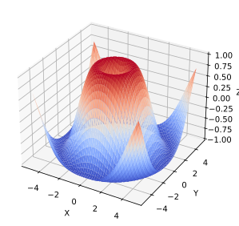

## Anotacions i text

Les anotacions permeten afegir explicacions als gràfics. `annotate()` crea una anotació amb una fletxa que apunta a un punt específic. El paràmetre `xy` indica el punt assenyalat, `xytext` la posició del text, i `arrowprops` defineix l'estil de la fletxa. `text()` simplement col·loca text en una posició:

```python
x = np.linspace(0, 10, 100)
y = np.sin(x)

plt.plot(x, y)
plt.annotate('Màxim', xy=(np.pi/2, 1), xytext=(2, 1.3),
             arrowprops=dict(arrowstyle='->', color='red'))
plt.text(8, -0.5, 'y = sin(x)', fontsize=12, style='italic')
plt.show()
```

Fàcil, oi?

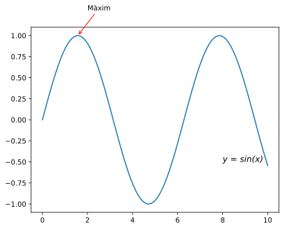

## Gràfics de contorn

Els gràfics de contorn mostren corbes de nivell d'una funció de dues variables. `contour()` dibuixa les línies de contorn, mentre que `contourf()` omple l'espai entre línies amb colors. El paràmetre `levels` controla quantes línies de contorn es dibuixen:

```python
x = np.linspace(-3, 3, 100)
y = np.linspace(-3, 3, 100)
X, Y = np.meshgrid(x, y)
Z = np.sin(X) * np.cos(Y)

plt.contour(X, Y, Z, levels=10, cmap='RdBu')
plt.colorbar()
plt.contourf(X, Y, Z, levels=10, cmap='RdBu', alpha=0.3)
plt.show()
```

El gràfic de contorn resultant és aquest:

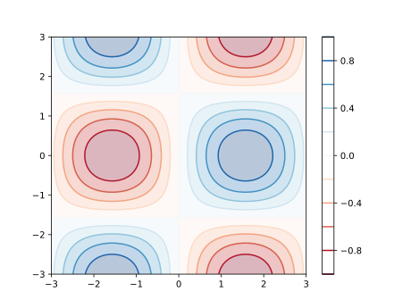

## Escales logarítmiques

Les escales logarítmiques són útils quan les dades cobreixen diversos ordres de magnitud. `loglog()` aplica escala logarítmica a ambdós eixos. També existeixen `semilogx()` i `semilogy()` per aplicar escala logarítmica només a un eix:

```python
x = np.linspace(0.1, 100, 1000)
y = x**2

plt.loglog(x, y)
plt.xlabel('x (escala log)')
plt.ylabel('y (escala log)')
plt.grid(True, which='both')
plt.show()
```

## Animacions

Matplotlib permet crear animacions actualitzant els gràfics al llarg del temps. `FuncAnimation()` crida repetidament una funció que actualitza les dades. El paràmetre `frames` indica el nombre d'iteracions, `interval` el temps entre fotogrames en mil·lisegons, i `blit=True` optimitza el rendiment:

```python
import matplotlib.pyplot as plt
import matplotlib.animation as animation
import numpy as np

fig, ax = plt.subplots()
x = np.linspace(0, 2*np.pi, 100)
line, = ax.plot(x, np.sin(x))

def animate(i):
    line.set_ydata(np.sin(x + i/10))
    return line,

ani = animation.FuncAnimation(fig, animate, frames=100, interval=50, blit=True)
plt.show()
```

Per desar l'animació com un fitxer de vídeo, podem utilitzar el mètode `save()` de l'objecte `FuncAnimation`, especificant el nom del fitxer i el format desitjat (com ara MP4 o GIF):

```python
ani.save('animacio.gif', writer='ffmpeg', dpi=150)
```

Aquí teniu l'animació que mostra una ona sinusoidal en moviment:

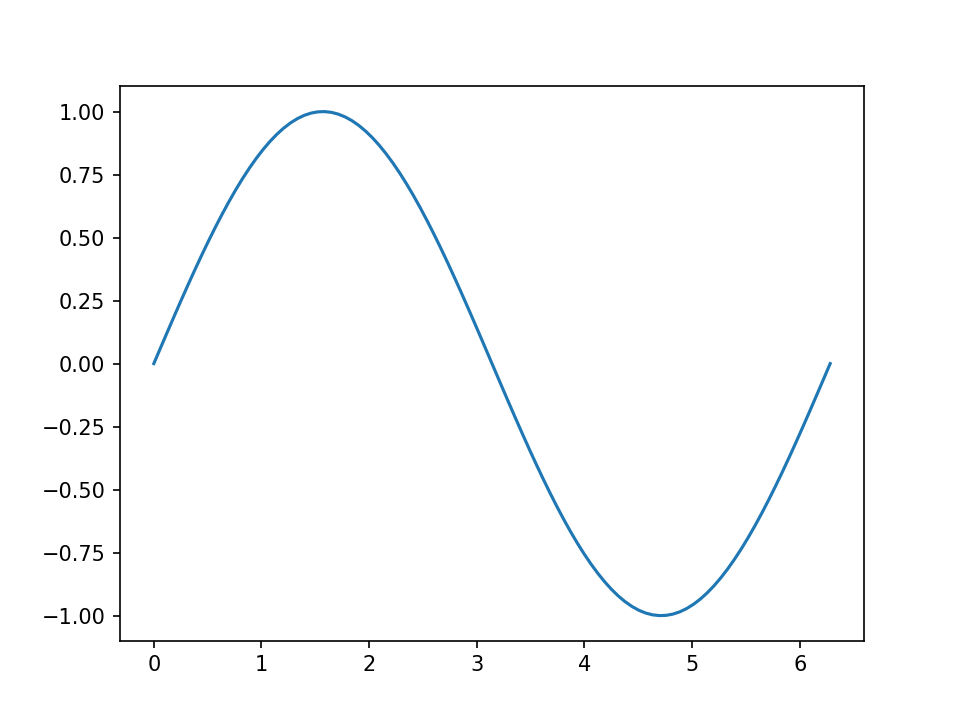

## Gràfics interactius amb esdeveniments

Podem fer que els gràfics responguin a accions de l'usuari connectant funcions als esdeveniments. `mpl_connect()` vincula esdeveniments (com clics del ratolí) a funcions personalitzades. L'objecte `event` conté informació sobre l'esdeveniment, incloent les coordenades del clic:

```python
fig, ax = plt.subplots()
x = np.linspace(0, 10, 100)
line, = ax.plot(x, np.sin(x))

def onclick(event):
    if event.xdata and event.ydata:
        print(f'Has clicat a ({event.xdata:.2f}, {event.ydata:.2f})')

fig.canvas.mpl_connect('button_press_event', onclick)
plt.show()
```

## Exemple complet

Aquest exemple integra moltes tècniques: múltiples línies amb diferents estils, àrea ombrejada entre línies amb `fill_between()`, línies de referència amb `axhline()` i `axvline()`, personalització de fonts, i una graella semitransparent:

```python
x = np.linspace(0, 2*np.pi, 100)
y1 = np.sin(x)
y2 = np.cos(x)

plt.figure(figsize=(10, 6))
plt.plot(x, y1, 'b-', linewidth=2, label='sin(x)')
plt.plot(x, y2, 'r--', linewidth=2, label='cos(x)')
plt.fill_between(x, y1, y2, alpha=0.3)

plt.xlabel('x (radians)', fontsize=12)
plt.ylabel('y', fontsize=12)
plt.title('Funcions trigonomètriques', fontsize=14, fontweight='bold')
plt.legend(loc='upper right')
plt.grid(True, alpha=0.3)
plt.axhline(y=0, color='k', linewidth=0.5)
plt.axvline(x=0, color='k', linewidth=0.5)

plt.tight_layout()
plt.show()
```

El gràfic resultant és aquest:

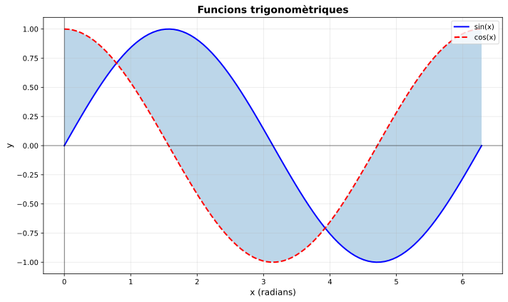

<Autors autors="jpetit"/>
