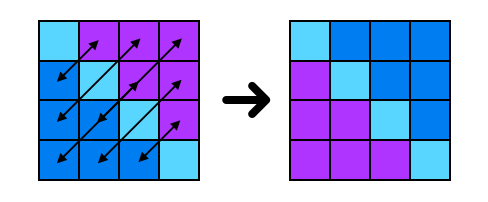

# Aplicació: Operacions matemàtiques sobre matrius


Aquesta lliçó presenta alguns exemples d'operacions matemàtiques sobre matrius. En particular, es considera aquestes operacions:

- Sumar matrius
- Trobar la suma per files més gran
- Transposar una matriu quadrada
- Comprovar si una matriu quadrada és simètrica
- Producte de matrius


## Tipus de dades

Al llarg d'aquesta lliçó suposarem que ja tenim definits els tipus següents:

```python
from typing import TypeAlias

Fila: TypeAlias = list[float]
Matriu: TypeAlias = list[Fila]
```

Totes les matrius d'aquesta secció seran de nombres reals. Per simplicitat, també entendrem que les matrius amb les que treballarem tenen com a mínim una fila (encara que sigui buida), ja que si no no té sentit parlar de columnes i les crides del tipus `len(matriu[0])` provocarien un error.


## Suma de matrius


Una de les operacions més bàsiques que es poden fer entre matrius és sumar-les. Com sabreu, per poder sumar dues matrius cal que aquestes tinguin les mateixes dimensions, i la suma es realitza element a element. Suposarem que les matrius que entrem tenen les dimensions correctes.

Així, aquesta és una possible implementació per a una funció que, donades dues matrius retorna, la seva suma:

```python
def suma(A: Matriu, B: Matriu) -> Matriu:
    """
    Retorna la suma de A i B.
    Prec: A i B són dues matrius m ⨉ n, amb m > 0.
    """

    m = len(A)       # nombre de files
    n = len(A[0])    # nombre de columnes

    return [[A[i][j] + B[i][j] for j in range(n)] for i in range(m)]
```

Aquí s'ha expressat el resultat amb llistes per comprensió aniuades.


## Trobar la suma per files més gran


Considerem que cal calcular el màxim de les sumes de les files d'una matriu. Per exemple, per la matriu del costat cal retornar 5.

 Aquesta és una primera implementació utilitzant les operacions bàsiques d'accés a les matrius:

```python
def maxima_suma_fila(M: Matriu) -> float:
    """Retorna el màxim de les sumes de les files d'una matriu no buida M."""

    m = len(A)       # nombre de files
    n = len(A[0])    # nombre de columnes

    for i in range(m):
        # sumar els elements de la fila actual
        suma_act = 0
        for j in range(n):
            suma_act += M[i][j]
        # si es supera el màxim o és la 1a fila, actualitzem
        if i == 0 or suma_act > suma_max:
            suma_max = suma_act
    return suma_max
```

Aquí, per calcular la suma de certs elements donats usem una variable auxiliar `suma_act` inicialment nul·la a la que anem afegint els valors que volem sumar. Per altra banda, per trobar un màxim, creem una altra variable que en tot moment guarda l'element més gran que s'ha trobat fins ara i es va comparant amb els següents.

Ara bé, l'ús de les funcions predefinides `max` i `sum` i les llistes per comprensió ens permeten escriure una segona implementació equivalent molt més concisament:

```python
def maxima_suma_fila(M: Matriu) -> float:
    """Retorna el màxim de les sumes de les files d'una matriu no buida M."""

    return max([sum(fila) for fila in M])
```


## Transposar una matriu quadrada



Considerem ara el problema de transposar una matriu quadrada.

En aquest cas, els elements que voldrem intercanviar són el d'índex `[i][j]` amb el d'índex `[j][i]` on `n` és el nombre de files i columnes. En aquest cas, cal tenir en compte que els elements de la diagonal no cal tocar-los i que només cal visitar una de les dues meitats separades per la diagonal, ja que en cas contrari recuperaríem la matriu inicial perquè faríem cada intercanvi dos cops. L'acció corresponent quedaria així:

```python
def transposar(M: Matriu) -> None:
    """Transposa la matriu quadrada M."""

    n = len(M)
    for i in range(n):  #  per cada índex fila
        for j in range(i + 1, n):  # per cada columna per sota de la diagonal
            M[i][j], M[j][i] = M[j][i], M[i][j]
```

Fixeu-vos que, en aquest cas, hem fet una acció que transposa la matriu que se li passa com a paràmetre. També es podria escriure una funció que, donada una matriu, retornés un altra matriu que és la transposta de la primera:


```python
def transposta(M: Matriu) -> Matriu:
    """Retorna la transposta de la matriu quadrada M."""

    n = len(M)
    return [[M[j][i] for j in range(n)] for i in range(n)]
```


**Exercici:** Feu una funció que transposi matrius rectangulars.


## Comprovar si una matriu quadrada és simètrica


Ara volem comprovar si una matriu quadrada és simètrica o no.

Aquest exemple és semblant a l'anterior, amb la diferència que en aquest cas no s'han d'intercanviar els elements, sinó que s'han de comparar. La matriu serà simètrica si i només si cada parella d'elements simètrics són iguals.

Ens quedarà doncs la funció següent que realitza una cerca d'elements simètrics diferents:

```python
def es_simetrica(M: Matriu) -> bool:
    """Indica si la matriu quadrada M és o no simètrica."""

    n = len(M)
    for i in range(n):
        for j in range(i + 1):
            if M[i][j] != M[j][i]:
                return False
    return True
```

El bucle de les `i` recorre cada índex fila, i el bucle de les `j` recorre cada elements d'aquella fila a la dreta de la diagonal. Cada parella d'elements simètrics es compara (com a molt) un cop. Els elements de la diagonal no es miren. Així s'eviten fer comparacions redundants.


## Producte de matrius


En matemàtiques, donades dues matrius $A$ i $B$, el primer que necessitem per definir el producte $AB$ és que la matriu $A$ tingui exactament el mateix nombre de columnes que el nombre de files de la matriu $B$. En aquest cas, si $A$ és una matriu $m \times n$ i $B$ una matriu $n \times p$, el seu producte serà una matriu $C$ de mida $m \times p$ tal que el seu element $c_{ij}$ (element que es troba a la fila $i$ i a la columna $j$ de $C$) es calcula com

$$
c\_{ij} = \sum\_{k=1}^n a\_{ik}b\_{kj}.
$$

Per començar, concentrem-nos al producte de matrius quadrades: suposem que $A$ i $B$ són matrius $n\times n$.

Reproduïm ara el procediment anterior amb llenguatge informàtic: Per recórrer la matriu resultat necessitarem dos bucles, i per calcular cadascun dels seus elements haurem de fer un altre bucle per sumar dels elements corresponents. El codi resultant seria aquest:

```python
def producte(A: Matriu, B: Matriu) -> Matriu:
    """Retorna el producte de A i B, sabent que les dues són quadrades."""

    n = len(A)
    C: Matriu = [[0.0 for j in range(n)] for i in range(n)]  # matriu de n ⨉ n zeros
    for i in range(n):
        for j in range(n):
            for k in range(n):
                C[i][j] += A[i][k] * B[k][j]
    return C
```

Que també podem expressar a través de llistes de comprensió i fent ús de `sum`.

```python
def producte(A: Matriu, B: Matriu) -> Matriu:
    """Retorna el producte de A i B, sabent que les dues són quadrades."""

    n = len(A)
    return [
        [
            sum([A[i][k] * B[k][j] for k in range(n)])
            for j in range(n)
        ]
        for i in range(n)
    ]
```

El cas general quan $A$ és de mida $m\times n$ i $B$ de mida $n\times p$ (i, per tant, el resultat de mida $m\times p$) és ara fàcil d'adaptar:

```python
def producte(A: Matriu, B: Matriu) -> Matriu:
    """
    Retorna el producte de A i B:
    Prec: A i B  tenen mides compatibles per ser multiplicades.
    """

    m = len(A)
    n = len(B)
    p = len(B[0])
    return [
        [
            sum([A[i][k] * B[k][j] for k in range(n)])
            for j in range(p)
        ]
        for i in range(m)
    ]
```


<Autors autors="jpetit rafah"/>
