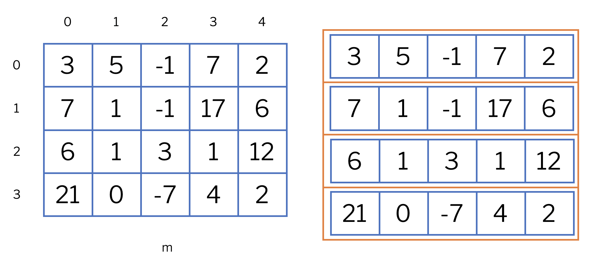

# Matrius


Aquesta lliçó presenta les matrius, una estructura de dades semblant a les llistes però amb més d'una dimensió. De fet, les matrius en Python no són altra cosa que llistes de llistes. Com les llistes, les matrius tenen moltes aplicacions en matemàtiques, però també poden representar molts altres conceptes en informàtica, com ara taulers, mapes, patrons...


## Introducció

Una matriu és una estructura de dades que permet guardar diverses dades d'un mateix tipus, distribuïdes en diverses files i diverses columnes. La informació desada a cascuna de les posicions d'una matriu és del mateix tipus. L'ús de matrius és de gran utilitat per resoldre problemes de molts tipus: Les matrius permeten representar fàcilment taulers de jocs, mapes, taules, patrons...

<center>

</center>


En Python, una matriu es representa com una llista de llistes. Per convenció, la llista "exterior" representa les files de la matriu i les llistes "interiors" representen els valors a cada fila. Per exemple, aquest tros de codi declara una matriu
`m` de mida 4✕5 i l'inicialitza amb certs valors.

```python
m = [
    [ 3,  5, -1,  7,  2],
    [ 7,  1, -1, 17,  6],
    [ 6,  1,  3,  1, 12],
    [21,  0, -7,  4,  2]
]
```

La figura següent ho il·lustra: A l'esquerra apareix la matriu com un tot; a la dreta, descomposta en 4 llistes de llistes de 5 elements.

<center>

</center>

Per accedir a un element a la `i`-èsima fila i a la `j`-èsima columna, cal indexar la matriu dos cops: `m[i][j]`.  Això no és nou: `m[i]` accedeix a l'índex `i` de la llista `m`. Com que `m[i]` és també una llista, `m[i][j]` en selecciona l'índex `j`.

Per exemple, `m[2][3]` val `1` a la matriu anterior. De fet, `m[2]` és una fila que val `[6,  1,  3,  1, 12]`. Obtenir la llista corresponent a la columna `j` d'una matriu no és una operació directa en Python, però es podria fer amb `[fila[j] for fila in  m]`.


## Tipus de les matrius

Recordeu que, les matrius són llistes de llistes. Per tant si el tipus dels elements dins la matriu és `T`, el tipus de la matriu és


```python
list[list[T]]
```

Per exemple, en moltes aplicacions matemàtiques, el tipus de les matrius seria `list[list[float]]`. 


## Creació de matrius

Per crear una matriu, ho farem de la mateixa manera que creem una llista, però en aquest cas el tipus d'element d'aquesta llista serà un altre cop una llista, aquesta ja del tipus de dades desitjat. Les maneres d'inicialitzar una matriu són exactament les mateixes que les d'una llista, tenint en compte que una matriu no és més que una llista de llistes. 

La manera més senzilla de fer-ho és per extensió:

```python
m = [
    [ 3,  5, -1,  7,  2],
    [ 7,  1, -1, 17,  6],
    [ 6,  1,  3,  1, 12],
    [21,  0, -7,  4,  2]
]
```

Per simetria, Python permet posar una coma després del darrer element d'una llista:

```python
m = [
    [ 3,  5, -1,  7,  2],
    [ 7,  1, -1, 17,  6],
    [ 6,  1,  3,  1, 12],
    [21,  0, -7,  4,  2],
]
```

Les llistes per comprensió també solen ser una bona manera de crear matrius. En aquest cas, ens calen llistes de comprensió que contenen llistes de comprensió. Aquest codi crea una matriu d'`m` ⨉ `n` zeros:

```python
[[0 for j in range(n)] for i in range(m)]
```

Com que les variables de control `i` i `j` no s'usen, és convenient usar variables anònimes al seu lloc: 

```python
[[0 for _ in range(n)] for _ in range(m)]
```

Evidentment, algunes vegades va bé usar les variables de control. Per exemple, per crear una matriu on cada element és un parell que conté la seva posició:

```python
[[(i, j) for j in range(n)] for i in range(m)]
```

!!! Explicar perills del aliasing


## Matrius de més dimensions


Igual que per fer matrius bidimensionals hem fet que una llista contingui altres llistes, podem fer que aquests llistes continguin alhora més llistes, i així indefinidament. Per exemple, podem crear una matriu tridimensional d'`m ✕ n ✕ r` zeros amb el codi següent:

```python
[[[0.0 for k in range(r)] for j in range(n)] for i in range(m)]
```

Per exemple, aquesta construcció ens pot servir per guardar dades sobre punts en l'espai. No obstant, no és molt habitual el seu ús als primers programes, així que no entrarem en més detalls.


## Declaracions de tipus amb `TypeAlias`

Com haureu vist, el tipus de les matrius pot arribar a ser una mica feixuc i complicat de llegir a causa dels aniuaments. És per això que sovint es donen noms alternatius en aquests tipus utilitzant `TypeAlias` del mòdul `typing`.

La manera d'introduir un nom de tipus és `nom: TypeAlias = tipus` on `tipus` és un tipus de dades existent (per exemple, `int`, `str` o `list[int]`) i `nom` és un identificador nou. El propòsit d'aquesta instrucció és crear un nou tipus anomenat `nom` que substitueix a `tipus`.

Per exemple,

```python
from tying import TypeAlias

Temperatures: TypeAlias = list[float]
```

introdueix un nou tipus anomenat `Temperatures` que és equivalent
a `list[float]`. A partir d'aquesta declaració, es poden declarar noves variables i paràmetres utilitzant aquest nou nom de tipus:

```python
def temperatura_mitjana(temperatures: Temperatures) -> float: 
    ...
```

Podeu perfectament pensar que el sistema substitueix totes les ocurrències de `Temperatures` per  `list[float]` i tindreu raó. Però pels lectors humans, proporcionar bons noms als tipus facilita la comprensió del codi, els programes esdevenen més llegibles. I, a llarg termini, també els fa més fàcils de millorar.

Si ara, a més, volem tenir un registre de totes les temperatures al llarg d'un any, necessitarem una llista de 365 llistes de 24 temperatures. Per tant, podríem definir els tipus següents i crear una matriu com segueix:

```python
Temperatures: TypeAlias  = list[float]
Registre: TypeAlias = list[Temperatures]

registre: Registre = [[0.0 for h in range(24)] for d in range(365)]
```


## Mides de les matrius

Un darrer comentari: recordeu que `len` aplicat a una llista retorna el seu nombre d'elements. Com que les matrius són llistes de llistes, la funció `len` indica el nombre de files que hi ha, no pas el nombre total d'elements. Si es vol trobar el nombre de columnes, es pot mirar el `len` de la primera fila (si existeix). Aquest exemple ho il·lustra amb una matriu 4⨉5:

```python
>>> mat = [
    [ 3,  5, -1,  7,  2],
    [ 7,  1, -1, 17,  6],
    [ 6,  1,  3,  1, 12],
    [21,  0, -7,  4,  2],
]
>>> len(mat)
4
>>> len(mat[0])
5
>>> len(mat) * len(mat[0])
20
```


<Autors autors="jpetit"/> 

